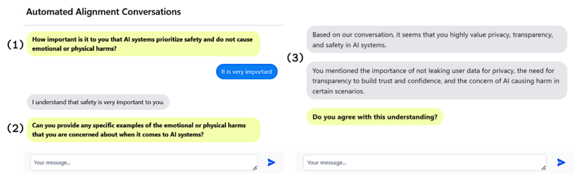
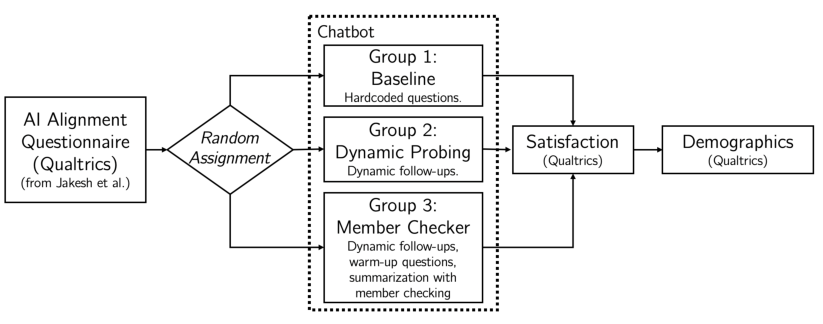
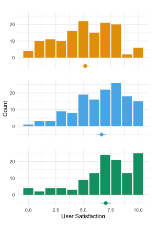
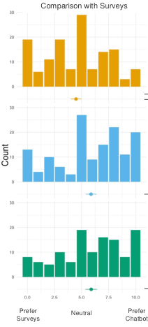
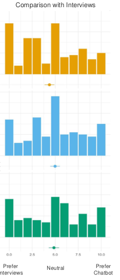
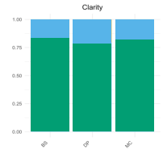
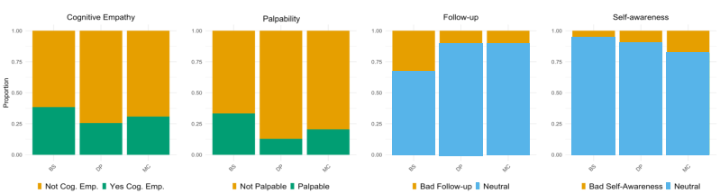
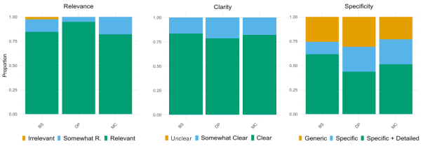
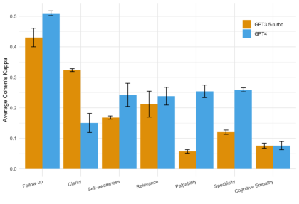
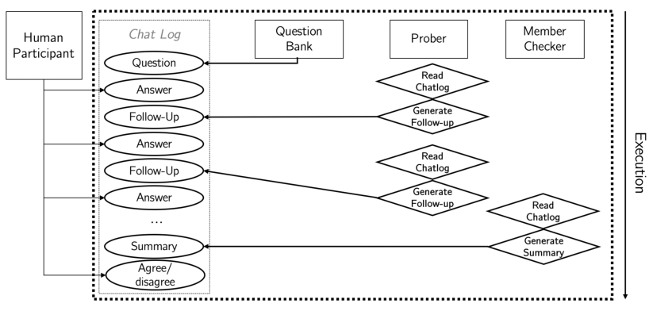

**Collecting Qualitative Data at Scale with Large Language Models: A Case Study** 

ALEJANDRO CUEVAS[*] , Carnegie Mellon University, USA 

JENNIFER V. SCURRELL, ETH Zurich, Switzerland EVA M. BROWN, University of Washington, USA JASON ENTENMANN, Microsoft Research, USA MADELEINE I. G. DAEPP, Microsoft Research, USA 

Chatbots have shown promise as tools to scale qualitative data collection. Recent advances in Large Language Models (LLMs) could accelerate this process by allowing researchers to easily deploy sophisticated interviewing chatbots. We test this assumption by conducting a large-scale user study (n=399) evaluating 3 different chatbots, two of which are LLM-based and a baseline which employs hard-coded questions. We evaluate the results with respect to participant engagement and experience, established metrics of chatbot quality grounded in theories of effective communication, and a novel scale evaluating "richness" or the extent to which responses capture the complexity and specificity of the social context under study. We find that, while the chatbots were able to elicit high-quality responses based on established evaluation metrics, the responses rarely capture participants' specific motives or personalized examples, and thus perform poorly with respect to richness. We further find low inter-rater reliability between LLMs and humans in the assessment of both quality and richness metrics. Our study offers a cautionary tale for scaling and evaluating qualitative research with LLMs. 

CCS Concepts: - **Human-centered computing** -> **Empirical studies in collaborative and social computing** . 

Additional Key Words and Phrases: Chatbots, Qualitative Research, Language Models, GPT 

## **ACM Reference Format:** 

Alejandro Cuevas, Jennifer V. Scurrell, Eva M. Brown, Jason Entenmann, and Madeleine I. G. Daepp. 2025. Collecting Qualitative Data at Scale with Large Language Models: A Case Study. In _._ ACM, New York, NY, USA, 27 pages. https://doi.org/XXXXXXX.XXXXXXX 

## **1 INTRODUCTION** 

Improvements in the collection and analysis of qualitative data can help bridge the gap between quantitative and qualitative methods. Social scientists who seek to understand people's experiences and perspectives frequently face trade-offs between the scale and speed of quantitative approaches to data collection and the richness of qualitative methods [35, 36, 59]. Interviewing, the hallmark method of qualitative research, is a time- and labor-intensive process. Thus, many interview studies remain small in scale [4] and those studies done at large scales can take years [25]---meaning that HCI and CSCW researchers working in fast-paced and rapidly changing technological environments can struggle to provide timely insights. 

*The author completed this work as part of an internship at Microsoft Research. 

> Permission to make digital or hard copies of all or part of this work for personal or classroom use is granted without fee provided that copies are not made or distributed for profit or commercial advantage and that copies bear this notice and the full citation on the first page. Copyrights for components of this work owned by others than the author(s) must be honored. Abstracting with credit is permitted. To copy otherwise, or republish, to post on servers or to redistribute to lists, requires prior specific permission and/or a fee. Request permissions from permissions@acm.org. _XXX, October 18--22, 2025, XXX, XXX_ 

>  2025 Copyright held by the owner/author(s). Publication rights licensed to ACM. ACM ISBN 978-1-4503-XXXX-X/18/06 https://doi.org/XXXXXXX.XXXXXXX 

1 

XXX, October 18--22, 2025, XXX, XXX 

Cuevas et al. 

Advances in computational methods, specifically Artificial Intelligence (AI), have introduced many methodological efficiencies to assist qualitative research. These improvements can be divided by whether they affect the evaluation or the collection of qualitative data. In terms of evaluation, many improvements have focused on reducing the manual burden involved in qualitative analysis, such as by facilitating text annotation [10], extracting topics from open responses [2, 10], helping in the generation of codebooks and coding data [6, 47]. In terms of collection, AI-driven chatbots have enabled the collection of data at scale [28, 71, 73, 74], mostly in conversational studies, but also in ethnographic studies [62]. The advent of highly capable Large Language Models (LLMs) has introduced remarkable improvements across the aforementioned tasks [18, 72], while also enabling new use cases, like creating synthetic user research data [22]. 

Most notably, the advent of LLMs has made deploying highly sophisticated chatbots remarkably easy. Before LLMs, chatbot adoption remained limited due to the brittleness of hybrid rules-based and machine learning-based systems [21], with unexpected limitations and unpredictable failure modes [1]. As a result, chatbot interactions frequently failed to meet user expectations [44]. However, LLMs promise to enable new ease of deployment and improvements in cognitive capabilities that could foster vast improvements in the flexibility and extensibility of chatbot-based tooling. 

An important open question is whether these models can scale the collection of _high-quality and rich qualitative data_ . The current literature suggests that existing conversational agents are suitable for qualitative studies and can elicit high-quality data [28, 73 **?** , 74]. The evaluation of quality in chatbots has ranged from quantitative measures (e.g., word overlaps between text corpora) [41] to mixed-methods assessments of effective communication [28, 73, 74]. In particular, a recent body of work has employed quality evaluations via human annotation [28, 73, 74]. These evaluations and metrics are based on Gricean Maxims, a "set of communication principles that a speaker and listener should adhere to ensure effective communication" [20, 74]. But longstanding debates amongst scholars of qualitative research suggest that interactions that perform well on conventional and quantitative measures of quality can still fall short of constituting "good" qualitative research [31, 45, 46, 59]. While effective communication is an essential component of data collection, the metrics above may be insufficient at capturing the richness of the data: the extent to which research captures the specificity and complexity of the social context being studied [59]. 

To address this gap, we operationalize new metrics to evaluate the richness of chatbot conversations. We anchor our approach on the indicators proposed by Small and Calarco [59]---a framework for assessing richness emerging as a foundational text in qualitative social science [9, 34]. We leverage Small and Calarco's work throughout our chatbot development and evaluation process. First, we ground the development of two LLM-based modules around key metrics of cognitive empathy (understanding participants' motivations and value systems) and palpability (surfacing specific, personal evidence), resulting in a chatbot that dynamically generates follow-ups to participants' responses. We then use these chatbots to conduct a large-scale (n=399) user study on AI alignment, which enables us to compare both conventional measures of quality and our novel richness metrics across LLM-augmented versus a baseline of naive interactions. Finally, we compare inter-rater reliability for an LLM versus humans in assessing interactions' quality and richness. Through this study, we make four contributions to the CSCW literature. 

- We showcase the ease of deployment of an LLM-augmented chatbot. Through the development of two modules, we create a chatbot that can dynamically generate follow-up questions and provide users with real-time conversation summaries. We provide an open-source codebase and prompts to enable other CSCW researchers to use and expand upon our research. 

- We develop a novel richness scale grounded in social scientific principles and demonstrate that existing quality metrics do not indicate richness. 

2 

Collecting Social Data with Large Language Models 

XXX, October 18--22, 2025, XXX, XXX 

- We document common interviewing mistakes made by LLMs, including the emergence of bias both in responses and in participant treatment of the bot, and demonstrate how these mistakes inhibit using chatbots for automating qualitative research. 

- We show that even state-of-the-science LLMs struggle to consistently evaluate data quality and response richness indicators, which may explain their current limitations in generating follow-ups that elicit rich responses. 

## **2 RELATED WORK** 

Our study is informed by Human-Computer Interaction (HCI) research methodologies, prior work on the design of information elicitation chatbots, theoretical understanding of human-chatbot interactions, and empirical and theoretical work on response evaluation in qualitative research. 

## **2.1 Evaluation Metrics for Chatbots** 

Chatbots have typically been evaluated on three dimensions: quantitative, user-oriented, and qualitative text-related measures. Quantitative measures encompass metrics such as the number of positive negative words [29], the number of words [15], the number of personal pronouns used [63], and embedding-based metrics such as corpora overlap [41]. These metrics are often used in scale analyses, as they are computed and thus often easily scalable [41]. Similarly, user-centric metrics also mainly encompass easily scalable metrics, such as completion time, task fulfillment, dropout rate [12, 54], and self-disclosed satisfaction metrics [12, 67, 74, 78 **?** ]. 

Qualitative metrics, on the other hand, have only recently received more attention. Evaluations of "quality" have taken many forms, depending on the context of the chatbot deployment [80]. The metrics proposed by Xiao et al., which evaluate communicative quality, are the most relevant. These metrics are based on the Gricean maxims: four principles of effective communication including quality, quantity, relevance, and communication manner [20]. Xiao et al. operationalize these ideas through measures of response, informativeness, specificity, relevance, and clarity [71, 73, 74], finding that the chatbot offered higher quality responses in terms of relevance, specificity, and clarity compared to the responses collected by a web-based survey [71, 74]. Jiang et al. use the same metrics to assess a multi-agent chatbot architecture [28]. 

Despite the high performance reported by recent chatbots in many of the quality metrics stated in the chatbot literature [80], we have not seen widespread adoption of these tools for data collection-- suggesting a gap between the measured and actual usefulness of the data gained. We seek to explain this gap by comparing measures currently used in the literature with a novel set of measures used to evaluate qualitative research. 

## **2.2 Evaluating Qualitative Research Through Richness** 

Although there is no established set of metrics used to evaluate qualitative data [46, 59], various researchers have proposed quality indicators such as rich rigor [65], thickness [17], and palpability [57, 59]. Patton writes that producing valuable qualitative insight requires surfacing "direct quotations from people about their experiences, opinions, feelings, and knowledge" [53]. Geertz describes a detailed description that makes evident the meanings and significance behind the participants' responses as "thick" [17]. That is, interviewees' responses should not merely be on topic and comprehensive but provide tangible insights specific to individual participants that enable the researcher and, ultimately, the reader to better understand the world from the participant's perspective. The evaluation of the _quality_ of qualitative research, then, requires an assessment of the extent to which responses capture insights from people that are _rich_ enough to allow a detailed and nuanced understanding of the personal experiences of the participants in the condition under study [13, 14, 17, 48, 53]. 

3 

XXX, October 18--22, 2025, XXX, XXX 

Cuevas et al. 

To provide a comprehensive set of indicators to evaluate qualitative research, Small and Calarco [59] define five key constructs that this broader literature on qualitative methods identifies as critical to "quality" in qualitative research. We leverage this crucial theoretical contribution to introduce a novel set of quality measures grounded in theory and research based on principles of effective qualitative research. We call these metrics _measures of "richness"_ to reflect the extent to which they seek to evaluate the depth of understanding that responses make possible for the researcher. 

Specifically, we operationalize four quality metrics identified in Small and Calarco's textbook as indicative of effective qualitative research: (1) cognitive empathy, or the researcher's ability to understand participant motives; (2) palpability, the inclusion of concrete and personal evidence (rather than abstractions of generalizations); (3) follow-up, the extent to which the researcher collects data related to new questions as they arise through the data collection process; and (4) self-awareness, or the interviewers' understanding of the impact of their identity on those interviewed, and thus on the collected data[1] . We show how responses that perform well on measures of communicative effectiveness remain sparse in terms of richness. Thus, these metrics help to explain how open-ended chatbot answers that are relevant, specific, clear, and informative can nevertheless fall short of the quality of data an effective human interviewer would collect. 

## **2.3 Eliciting High-quality Through Design and Cognition** 

Design choices, such as minor changes to user interfaces, can also have measurable effects on evaluations. For example, Candello et al. found quality gains simply by varying the choice of font [5]. Kim et al. found that moving from a web-based survey to a chatbot-based conversation can improve user engagement, response quality, ease of use, and user enjoyment of the survey experience [30]. However, the choice of chatbot along with its "style, features, and affordances" need to be considered to surpass the experience of using a web-based survey [78]. 

Cognitively, the "personality" of chatbots, as well as the use of simple humanization techniques such as conducting self-introductions, using respondents' names, or echoing the responses of the participants, seem to significantly affect user engagement, trust, and perceived experience [39, 81]. Xiao et al. [73] developed a chatbot for text-based interview tasks that can "actively listen" or produce on-topic replies to participant responses. They later expanded on this work by implementing an open-ended conversational chatbot-based survey that "probes" by asking follow-up questions based on the content of the participant's responses [74]. They observe that these augmentations measurably improve engagement length and responses' relevance and specificity compared to an open-ended survey [74] or a baseline chatbot without active listening skills [73]. 

Beyond personality and humanization, knowledge and the ability to handle conversations seamlessly are important cognitive traits for chatbots. In the study conducted by Xiao et al., participants expressed that specific responses were "vague and shallow," which they believe could be addressed if the chatbot can extract "deeper user intent [73]." In a recent study, Jiang et al. leverage a multi-agent architecture to reduce interruption and create more engaging conversations [28]. These domain-specific and multi-agent chatbots are used for eliciting public input, and they find them to be more effective than a single-agent architecture [28]. These studies support the need for flexibility and topic generalizability in chatbot design. We contribute to this literature by exploring the effect of enhanced cognitive capabilities (facilitated by an LLM) on participant experience, data quality, and response richness. 

> 1Small and Calarco also describe the role of heterogeneity in obtaining sound qualitative results but note that "[heterogeneity] describes not a feature of the research design but the character of the written report"[59], and as such heterogeneity is omitted from our coding guide. 

4 

Collecting Social Data with Large Language Models 

XXX, October 18--22, 2025, XXX, XXX 

Fig. 1. Chatbot User Interface. Generated text is indicated in grey with questions made more salient to the user through yellow highlighting. User text is indicated in blue. The image presents an examples from a dialogue in which (1) the chatbot first showed a question from an established, validated measurement scale [27], modified to use less formal language [30] and then (2) accessed the "Dynamic Prober" module to generate a follow-up question based on the user's response. After the user responded to three questions and their associated follow-up probes, (3) shows the "Member Checker" module in which the chatbot generated a summary of the conversation and asked the user to confirm the summary content. 

## **3 CHATBOT DEVELOPMENT** 

In developing our chatbot, we created two LLM-based modules grounded in the methods of effective interviewers [59]. Our "north star" was to surface rich qualitative data. In human interviews, attaining richness requires thoughtful follow-up questioning or "probes" on the part of the interviewer [59]. We thus designed an LLM-based "Dynamic Prober" module that allows the chatbot to generate follow-up questions based on participants' responses. Second, recognizing the value of self-awareness [59]---the importance of addressing biases in the LLM's assessment of the conversation---we created a "Member Checker" module that enabled the participant to confirm or contest a chatbot-generated summary of the interaction, as in interview and participatory studies in which researchers seek to confirm results by debriefing participants [50]. An overview of the architecture is included in the Appendix (Figure 7). 

We developed each agent through the prompting of OpenAI's GPT-based LLMs. Prompting is emerging as the leading approach for flexible development of conversational agents [43], but writing effective prompts is a nontrivial task [77]. There do not yet exist established workflows for systematic and robust prompt design, and novice prompters tend to take ad-hoc approaches that result in brittle, limited solutions [77]. In this section, we describe our three-step process to systematize the development of prompts for each module, including: identifying relevant design principles from the natural language processing literature; systematically refining prompts grounded in these principles via iteration on synthetic datasets; and improving robustness through external red-teaming of the final modules. We also delineate the key theoretical and practical considerations underlying our approach to the user interface design. Our chatbot and prompts are available at: https://github.com/microsoft/dynamic-prober 

## **3.1 Design Principles for Effective Prompting** 

We used a prompt engineering approach in which we created multiple agents each with their own prompt (a set of instructions pre-pended to user interactions with the LLM) and adaptable context (an updated section of the conversation to which they had access and could respond). We chose not to use more complex design approaches such as Retrieval Augmented Generation (RAG) given the limited knowledge retrieval and relatively simple dialogue structure required for an 

5 

XXX, October 18--22, 2025, XXX, XXX 

Cuevas et al. 

effective interview, as well as concerns over latency in our setting. Although there is not yet a standardized methodology for effective prompt development [77], researchers have uncovered a number of "prompt engineering" methods that can improve and stabilize LLM performance. At the time of development, the following strategies were the state-of-the-science approaches to effective prompting. 

-  _Chain-of-thought_ : follow intermediate reasoning steps before producing final output [32, 69]. 

-  _Few-shot examples_ : including a small number of examples of the desired output [3]. 

-  _Structured output_ : produce a response in a structured data format such as a JSON list [70]. model training data contains a large fraction of structured data, results can be more stable and the failure to use a format provides an automated debugging check 

-  _Generated-knowledge prompting_ : generate relevant additional information before completing a prompt, ensuring that the completion is conditioned on the additional information [42]. after each of the others also? 

-  _Role assignment_ : initializing the system with a message that primes the model with a role such as a job or personality, which can provide contextual information relevant to model performance [70]. 

We grounded our development of the modules in these approaches, iteratively implementing and testing these approaches on dummy synthetic data, evaluating the improvement with generated synthetic data, and then conducting a final evaluation via "red-teaming" by human testers. 

## **3.2 Systematically Refining Prompts with Synthetic Data** 

Recent work has found that LLMs can aid in piloting and testing HCI instruments by generating synthetic research data [22]. To develop modules that could robustly produce relevant probes and effectively summarize conversations, we created two synthetic data sets with which to (1) iteratively test and develop our prompts (2) evaluate the robustness and stability of the final prompts. Lastly, we conducted an initial pilot with external colleagues. 

_3.2.1 Iterative Prompt Development._ In our study, we employ seven questions on AI alignment drawn from [27]. In each chatbot interaction, we planned to randomly pick three questions to discuss with participants (this procedure is described in Section 4). Thus, to begin the development of our prompt, we created a synthetic dataset consisting of individuals with the following attributes: an importance score and verbal for each value in the survey, a job, and an explanation about their role and motive (e.g.,"Not important. As a software engineer, I don't care about fairness. I think performance is the most important priority for AI alignment."). Using these explanations, we attempted to generate suitable follow-ups (e.g., "I see that fairness is not as important as performance to you. Can you think of an example in software engineering where fairness is dependent on performance?"). While the initial follow-ups contained simple examples, they provided a starting point to streamline and systematize the development of the first prompts. 

We then generated a second more comprehensive synthetic data set for more robust evaluation (see Appendix C, for descriptions of the attributes we used). In our study, our LLM would not necessarily have access to these data, unless participants self-disclosed in the conversation. However, including demographic and political traits in the synthetic data set was useful to generate more nuanced responses and richer dialogs, which allowed us to explore more edge cases and potential failure modes in the conversation. This time, rather than just using the explanations as inputs, we use an LLM to simulate a conversational interaction similar to Hamalainen et al. [22]. We then prompted GPT-4 to review the participant's profile and position on one of the survey questions, to develop a motive for their perspective, and to simulate responses accordingly. For ease of evaluation, 

6 

Collecting Social Data with Large Language Models 

XXX, October 18--22, 2025, XXX, XXX 

each persona prompt completed one answer to an interview question, one interaction with the "Dynamic Prober" module, and one interaction with the "Member Checker" module. 

_3.2.2 Prompt Evaluation._ We assessed the resulting conversations qualitatively. First, we reviewed the simulated conversations to assess the robustness and quality of the probes produced by the "Dynamic Prober" module and the summaries by the "Member Checker" Module (assessing followup and self-awareness, respectively, per Table 1). Second, we applied a "coder" module that sought to surface (1) the importance score, as a quantitative measure of accuracy; (2) the motive (as a qualitative measure of palpability and cognitive empathy (Table 1); and (3) and an explanation for the bot's results, to aid in debugging. Qualitative review of the conversations further found that, unlike initial prompts, our final module prompts produced stable responses in every interaction, including the bad-faith conversation. Following common practices for red teaming AI systems [16, 75], we then asked colleagues external to the research team to test the final experience. 

_3.2.3 Effectiveness of Prompt Strategies._ We observed improvements in both robustness and quality through the use of prompt design principles. First, the use of  _chain-of-thought_ prompting enabled the "Dynamic Prober" module to check for bad-faith interactions before producing a response, and improved both modules' faithfulness to the prompt. The inclusion of  _few-shot examples_ similarly improved the "Dynamic Prober" module's ability to recognize and deflect bad-faith responses and fostered a consistent tone and response style across modules. Further, the  _structured output_ format reduced failures across both modules by enabling automated type checking. From an engineering perspective, it also had the benefit of ensuring consistent formatting and thus facilitating additional computation on the results. We also achieved improvements by procedurally generating the output ( _generated-knowledge_ ). In early prompts, we simply asked the model to generate follow-up questions based on the context or to generate multiple possible follow-up questions and then to select the "best". We found that the model frequently created off-topic or low-quality, albeit valid, questions. However, when we prompted the model to produce a JSON list comprising the user's opinion, the user's given reasoning for that opinion (if any), and to identify unanswered aspects of an opinion before generating its follow-up question, we observed that the resulting probes were consistently conditioned on the prior information and thus more relevant to the conversation. Only  _role assignment_ failed to noticeably impact the quality of questions. We did not observe substantial differences when priming the model to be, for example, a "professional interviewer", or "an expert qualitative researcher", and thus we did not assign roles in our final prompts. 

Overall, the evidence produced with the synthetic data set as well as the experiences of human testers bolstered our confidence in the robust performance of our prompts both in good- and simple bad-faith interactions. We note, however, that participants who sought to derail the conversation were able to do so with enough attempts and ingenuity. Developing prompts that can effectively thwart adversarial attempts remains a difficult problem, as observed by the ongoing efforts of companies and researchers to develop robust models [26, 68], as well as ongoing efforts to defeat their defenses [8, 56]. Because our research population comprised people in a professional setting, we assumed that most participants would act in good faith. We caution researchers who seek to deploy LLM-based chatbots that this assumption may not hold true in other settings. 

## **3.3 Chatbot Interface Design** 

Our chatbot had a simple conversational interface (Figure 1). However, we made four key design choices informed by prior literature. First, given evidence that conversational style meaningfully and significantly affects user engagement and experience [30], two members of the research team collaborated to revise the primary questions to use a more casual language. Second, we implemented a rule-based turn-taking approach in which users were only able to submit a single response to a 

7 

XXX, October 18--22, 2025, XXX, XXX 

Cuevas et al. 

Fig. 2. Experimental Design. Participants began the study by answering questions on AI alignment. They were then evenly randomized across three groups and taken to the Web-based chatbot interface. Group (1) was given hard-coded questions. Group (2) received the "Dynamic Prober" module. Group (3) interacted with the "Dynamic Prober" and "Member Checker" modules. All participants were then asked to complete questions on their experience and demographics. 

chatbot-based question to ensure that the conversation was chatbot-led and not human-initiated. Third, we included an introductory message and question, consistent with research on the benefits of humanization in chatbot interactions [19]. In the "Member Checker" condition, which was meant to most approximate an interview experience, we also included a warm-up question based on evidence on the importance of warm-up questions in interview research [11]. We additionally experimented with adding personalization in the follow-ups. Personalization was done by asking the participant to share some information about their role at the beginning of the interaction and then feeding that information to the "Dynamic Prober" module. While this approach led to more contextually-relevant questions, we had to disable it due to issues with staying on topic. Fourth, leveraging feedback of early testers, we used color and text to emphasize questions versus contextual statements. We also separated each sentence into a separate speech bubble, rather than a large paragraph, and we only allowed the chatbot to pose a single question in a given turn. These tweaks aimed at improving the accessibility and legibility of the dialogue. Further deployment details can be found in Appendix D. 

## **4 USER STUDY** 

We evaluated our chatbot through a large-scale user study with employees of a major technology company. In our evaluation, we sought to disentangle the effect of employing a sophisticated conversational agent versus a conversationally interactive design without cognitive capabilities on response elicitation and perception. Second, we sought to evaluate the quality and richness of the responses in the study of AI alignment. 

## **4.1 Study Topic** 

An aim of our work is to contribute to methodological innovations that support CSCW and HCI research on rapidly changing technologies and in time-sensitive contexts. In evaluating our prototype, we thus chose to conduct a study focusing on a developing research area: AI Alignment, the identification of priority areas and methods to ensure that AI systems act in ways consistent with human values and goals [55]. 

8 

Collecting Social Data with Large Language Models 

XXX, October 18--22, 2025, XXX, XXX 

## **4.2 Study Design** 

We evaluated our prototype through a user study with US-based employees of a large technology company. We conducted the user study in two waves: a small initial pilot to test for errors followed by the main, larger deployment. Figure 2 displays an overview of the study design. 

After giving their consent to participate, participants were shown definitions of various AI values and asked to provide responses to a seven-question survey on alignment hosted in a web-based form. These questions were drawn from a previous study of AI alignment [27], and their goal was to prime participants with the definitions of the values that would be discussed. Then each participant was given a unique link to the chatbot, where they were randomly assigned to one of three conditions: (1) Baseline; (2) "Dynamic Prober"; and (3) "Member Checker". 

The dialogue proceeded as follows. The chatbot first described the topic and asked the user to confirm their readiness for the interaction. In the "Member Checker" condition, which was meant to most approximate an interview, the chatbot then posed an initial predetermined warm-up question (see Section 3.3). After receiving the participant's response either regarding readiness (Baseline and "Dynamic Prober") or on background ("Member Checker"), the chatbot asked a randomly selected question from its survey-derived list of primary questions and then ---after receiving the participant's response---asked two questions. In the baseline condition, the questions were always "can you elaborate?" and "can you provide an example", regardless of the participant's input. In the conditions "Dynamic Prober" and "Member Checker", the questions were generated by the "Dynamic Prober". This process was then repeated two times for a total interaction comprising three question segments randomly selected from the original seven-question measurement scale. At the end of the interaction, participants in the Baseline and "Dynamic Prober" condition received a message thanking them for their time and directing them back to the web-based survey platform with a user-specific completion code, while in the "Member Checker" condition, the chatbot additionally provided participants with a summary of the conversation and asked the participants to confirm or contest the summary before thanking the participants and providing the confirmation code. A diagrammatic example of the "Member Checker" case can be found in the Appendix Section B. 

After completing the chatbot interaction, participants were directed back to the web-based form. The final section of the survey collected background information based on factors shown to be relevant for understanding perspectives on AI alignment topics [27]. We also collected demographic characteristics to ensure that we could transparently disclose the set of potential participants included and those not represented [7, 51] as well as to control for variables that could confound our evaluation. We explore possible confounds in the Appendix, Section E. 

Data were collected as part of the participants' workday and were not compensated. This research was reviewed and approved by our organization's institutional review board (IRB). 

## **5 EVALUATION METRICS** 

In comparing outcomes across the three study groups, we focus on two outcomes: (1) user engagement and experience and (2) response quality and richness. We further describe our evaluation on the potential of using an LLM to automate the coding of key evaluation metrics. 

## **5.1 Engagement and Experience** 

We measure engagement using both the length of responses and the duration of the interaction between the user and the chatbot, following previous research [30, 73, 74]. The session duration is calculated as the sum of the time spent on each response, where individual response times are winsorized at the 99th percentile to exclude participants who may not have been actively interacting with the tool for the entire period. The length of responses is the total number of words 

9 

XXX, October 18--22, 2025, XXX, XXX 

Cuevas et al. 

in a participant's responses throughout a session. Because the interaction in the "Member Checker" condition may be longer simply due to its two additional questions (the warm-up and final member check questions), we exclude user responses to these questions when calculating these metrics. 

We evaluated perceived user experiences through closed-ended quantitative scales and optional open-ended questions. In particular, we asked participants to rate their experience with the AI interviewer on an 11-point scale ranging from "very dissatisfied" to "very satisfied". We use an 11-point scale based on research showing that such scales have similar internal structure but increased sensitivity and better approximate normality compared to 4-, 5-, and 6-point scales [38]. We also asked participants to rate whether they would prefer to take a traditional survey or speak to the AI interviewer and whether they would prefer to speak to a human interviewer or the AI interviewer. Finally, we included three optional open-ended questions asking participants to describe any aspects of the experience they liked, any aspects they disliked, and anything else they had to share. We also asked participants to indicate, via a multiple choice question, any topics on which they would prefer to interact with an AI interviewer over a human interviewer. We included a set of potentially sensitive topics based on prior research showing that participants may be more willing to discuss sensitive topics with non-human agents [64, 66]. 

## **5.2 Operationalizing Quality and Richness** 

To evaluate the limitation of existing measures of response quality in adequately capturing richness, we conducted evaluations using (1) metrics from existing work [28, 73, 74] and (2) the novel operationalization of metrics from Small and Calarco [59]. We present the theoretical background of these metrics in Section 2 and a summary of the coding guide used by previous work in Table 1. We refer the reader to Xiao et al. [74] for a more comprehensive presentation. In the following, we describe how we operationalized the richness metrics and conducted our coding procedure. 

Small and Calarco provide a concise, explicit, and applicable quality framework to evaluate qualitative work, bridging various qualitative constructs (presented in Section 2). To develop a novel coding guide grounded in this framework, two researchers from the study team studied Small and Calarco's book in detail. Then they met to discuss each indicator and to develop a preliminary coding guide. 

Both researchers agreed on straightforward operationalizations of two of the four concepts, Small and Calarco (cognitive empathy and palpability). After discussion and iteration, we modified the "self-awareness" indicator, which refers to the importance of researcher reflexivity in acknowledging one's position and potential biases because a chatbot is not self-aware. In particular, we extend the construct to the case of a chatbot-delivered questioned by considering two factors: (1) how phrasing of the chatbot displays bias (as a human would); and (2) how a participant's awareness of interacting with a chatbot may bias their responses. As discussed in Section 7.2, the unique positionality of an AI chatbot survey on AI did lead to interesting bias in several observed cases. 

We also modified the follow-up indicator. Typically, good follow-ups are inductive and demonstrate "responsiveness to issues that arose in the field" [59]. A study can be considered to have shown good follow-up quality if the interviewer elicited rich and palpable data. In contrast, a study can be deemed to have shown poor follow-up if there was a missed opportunity for deeper inquiry [59]. Because we already operationalize palpability and cognitive empathy, we evaluate follow-up primarily on whether the probes on the latter. That is, we assess whether the probes failed to achieve deeper inquiry due to difficulties in communication or failure to recognize previous information, resulting in repetitive interactions. As such, we code this term as poor or neutral. 

10 

Collecting Social Data with Large Language Models 

XXX, October 18--22, 2025, XXX, XXX 

|**Indicators**|**Defnition**|**Coding Guide**|
|---|---|---|
|Relevance|A participant's response should be rele-|0 if irrelevant, 1 if somewhat relevant,|
||vant to a question asked.|and 2 if relevant.|
|Specifcity|A response should give as much informa-|0 if the answer contained generic descrip-|
||tion as needed.|tion only, 1 if it contained specifc con-|
|||cepts, and 2 if it contained specifc con-|
|||cepts with detailed examples.|
|Clarity|A participant's response should be clear.|0 if not clear, 1 if somewhat clear, and 2|
|||if clear.|
|Informativeness|A participant's response should be as in-|The sum of each of its word's surprisal,|
||formative as possible.|the inverse of its expected frequency ap-|
|||pearing in modern English.|
|Cognitive Empathy|A participant's response should surface|0 if the segment did not contain the par-|
||the "why" behind a belief.|ticipant's rationale, 1 if it did.|
|Palpability|A participant's response should contain|0 if the segment did not contain a con-|
||concrete personal evidence, rather than|crete lived or hypothetical example to|
||abstractions or generalizations.|support their rationale, 1 if it did.|
|Self-Awareness|An interviewer understands the impact|-1 if the chatbot expressed bias, or|
||of who they are on those interviewed and|assumptions, or if the participant re-|
||observed, and thus on the collected data.|sponded to the chatbot as if it were a bot,|
|||0 if otherwise.|
|Follow-up|The extent to which an interviewer col-|-1 if the conversation fow was unnatu-|
||lected data to answer questions that arose|ral, repetitive, or broken (due to technical|
||during the data-collection process itself.|issues or otherwise), 0 if otherwise.|

Table 1. Definitions and coding guide for the indicators of quality employed in our assessment. Relevance, specificity, clarity, and informativeness have been extracted previous work [71, 73, 74]. 

## **5.3 Dataset Sample, Segments, and Coding Procedure** 

After agreeing on the concepts and the coding guide, two researchers independently coded a sample of the complete dataset. Given the size of our dataset, we randomly sampled 10% of the conversations ( _n_ = 39), evenly split between the 3 study conditions. Second, we divided each conversation into " _segments_ " as our unit of analysis. A segment begins with a question about the importance of a given AI alignment value and ends after a participant answers two follow-ups. Each conversation has three main questions, each with two follow-ups. Thus, every conversation is made up of three segments. 

In contrast with an approach of, e.g., coding by sentence, the use of segments has the benefit of preserving topics and context; the coding of a segment at a time is also more tractable for a reviewer in comparison with, e.g., coding the entire interview as a single observation. After the coding was completed, the lead researcher examined each set of codes, labeling any discrepancies for each chat segment. The lead researcher then amended the coding guide to account for the discrepancies and reconciled the codes by reevaluating Small and Calarco's guide [59]. Finally, we test for differences across groups using the Friedman test, which is amenable for ordinal and continuous measures because we have repeated measures within each group (i.e., three segments per participant). We provide more details on the Friedman and subsequent post hoc tests in Appendix F. 

The final coding guide is found in Table 1 and a sample of a coded segment in Table 3. In total, we evaluate 117 total segments, forming 702 question/answer pairs. 

11 

XXX, October 18--22, 2025, XXX, XXX 

Cuevas et al. 

## **5.4 Comparing Human and LLM Assessments of Richness and Quality** 

We sought to scale our qualitative coding of response quality and richness by developing an LLM-based coding module but decided to rely exclusively on human qualitative evaluations after observing limited reliability and validity even when using GPT-4. 

We iteratively developed a qualitative coding prompt based on our coding guide in Table 1. Following a similar procedure as in 3.1, we again created a dummy dataset which we then used to iterately develop a prompt based on the principles described in Section 3.1. We then selected a set of 4 examples from our dataset to validate our prompt where: 1) the two coders had no disagreement on their first pass, and 2) a diverse range of codes were captured (e.g., in the case of 3-point indicators, examples containing the highest and lowest scores). 

A key question that surfaced during the review of the conversations was whether an LLM has the ability to evaluate the quality of the excerpts based on our indicators out-of-the-box (i.e., "zero-shot prompting"), or whether it can be trained through examples to do so (i.e., "few-shot prompting"). Thus, we created three sets of prompts with zero-, one-, and few-shot examples. The zero-shot case is the base prompt. The one-shot case used the 4 examples described above. In the few-shot case, we chose 4 additional examples at random. The resulting prompt had 8 examples, 4 of which are the same as in the one-shot case. We chose 4 random examples to account for the distribution of values in our dataset. Similarly to human coders, we expected the LLM to better approximate the researchers' coding when given more examples, and thus, have higher agreement. 

We used the prompts described above to code each of the remaining samples in our sub-sampled dataset. Each prompt asked the LLM to code each indicator in one pass. We conducted additional experiments in which we only coded a subset of indicators and/or asked the LLM to provide reasoning before issuing the codes (generated-knowledge prompting) but observed no significant differences from the base results. We also carried out these experiments using GPT-3.5-turbo and GPT-4 at 0 temperature to maximize replicability [72]. The use of both models had the benefit of enabling us to probe the extent to which limitations in the user study results might be remedied simply by the use of a larger model; if GPT-4 displays an ability to identify cognitive empathy, for example, in a way that GPT-3.5-turbo does not, then it might be able to produce probes and summaries that far outperform smaller models in a user study interaction. We do ultimately find that GPT-4 consistently outperforms GPT-3.5-turbo in "understanding" palpability and self-awareness, but its performance remains limited in the evaluation of cognitive empathy and low or moderate relative to human evaluators overall. We discuss these results in more detail in Section 7.3. 

## **6 PARTICIPANT ENGAGEMENT AND EXPERIENCE** 

Our final analytic sample consisted of 399 participants, who provided 4,308 open-ended responses to the chatbot.[2] Below, we report on user engagement and experience with the chatbot and the quality and richness of the responses obtained. 

## **6.1 Participant Engagement** 

Throughout the sessions, participants showed a high level of engagement, spending approximately 13.5 minutes engaging with the chatbot and using an average of approximately 250 total words, or 25 words per question. Participants in the "Dynamic Prober" and "Member Checker" conditions spent 

> 2We received an initial total of 584 prospective participants. We excluded participants who did not move past the consent page (n = 60), who participated in the initial pilot (n = 25), or who did not fully complete the web survey (n = 70) or the chatbot interaction (n = 24). We observed no significant differences in non-completion rates across groups. Finally, we excluded any users for whom there was evidence of chatbot failure (n = 6, "Member Checker" only). Finally, nine participants repeated the interaction twice; for these participants, we kept only the responses from the interaction with the most participant responses. 

12 

Collecting Social Data with Large Language Models 

XXX, October 18--22, 2025, XXX, XXX 

**==> picture [11 x 49] intentionally omitted <==**

**----- Start of picture text -----** 
*** * ** **----- End of picture text -----** 

**==> picture [196 x 221] intentionally omitted <==**

**----- Start of picture text -----** 
Comparison with Surveys Comparison with Interviews I alisislllo= rt | | | onal ee -~ * * * aoebale | |PLL ee *** ee nll| ll | |Gitaiieis| l | 00 25 50= 75 100 00 25 ---e50 75 100 Prefer Neutral Prefer Prefer Neutral Prefer Surveys Chatbot Interviews Chatbot **----- End of picture text -----** 

Fig. 3. Participant ratings of their experience with the chatbot on an 11-point Likert scale from "very dissatisfied" to "very satisfied."[3] 

Fig. 4. Participant ratings of their experience with the chatbot in comparison with a survey (left panel) or a human interviewer (right panel) on an 11-point likert-scale.[4] 

slightly longer (2 minutes) interacting with the chatbot than participants in the baseline condition (Table 2). However, the difference is not statistically significant and there is significant overlap between the distributions of session durations between groups. After adjusting for differences in participant characteristics, we observe significant pairwise differences between "Dynamic Prober" versus the baseline and "Member Checker" versus the baseline. We did not detect significant differences in word counts across conditions in the unadjusted or adjusted comparisons (Table 2). 

## **6.2 Participant Experience** 

Users generally reported positive experiences with the chatbot. However, the average satisfaction rating suggests continued room for improvement, at an average of 6.3 out of a possible score of 11. Compared to a survey, participants reported a slight preference for the chatbot over a traditional survey (mean score = 5.4). Compared to an in-person interview, preferences are more evenly split, particularly when participants conversed with the LLM-based chatbot. Both general satisfaction and preference compared to a survey differed significantly by group (Table 2 and Figure 3). Pairwise tests confirmed significant, positive differences between the two LLM-augmented conditions versus the baseline condition, but no differences between the "Dynamic Prober" versus the "Member Checker" condition. We observed no significant differences between the groups in our measure of preference for a human versus an AI interviewer. 

The qualitative measures of user experience suggest that these results may be explained by the extent to which a comparison to a human makes salient the continued limitations in the bot's 

> 4Points below the histograms indicate means and 95% confidence intervals. *** indicates _p <_ 0 _._ 001 in pairwise tests of differences in means. No significant overall differences were observed in comparing the chatbot versus a human interviewer. 

13 

XXX, October 18--22, 2025, XXX, XXX 

Cuevas et al. 

|||Unadjusted Model|Unadjusted Model|||Fully Adjusted Model|Fully Adjusted Model||
|---|---|---|---|---|---|---|---|---|
||BS|DP|MC|P-Value|BS|DP|MC|P-Value|
|Session Duration|12.1|14.1|14.2|0.06|13.4|15.7|15.7|0.03*|
|(Minutes)__|(10.8, 13.5)|(12.8, 15.5)|(12.7, 15.6)||(10.8, 16.0)|(13.0, 18.4)|(12.9, 18.4)||
|Session Length|258|255|242|0.704|273|271|268|0.977|
|(Words)__|(231, 285)|(229, 282)|(214, 271)||(222, 323)|(218, 325)|(214, 322)||
|User|5.2|6.7|7.1|_<_0.001***|4.7|6.3|6.6|_<_0.001***|
|Satisfaction|(4.8, 5.6)|(6.3, 7.1)|(6.6, 7.5)||(3.9, 5.5)|(5.5, 7.1)|(5.8, 7.5)||
|Preference v.|4.5|5.9|5.9|_<_0.001***|4.0|5.5|5.6|_<_0.001***|
|Surveys__|(4.0, 5.0)|(5.4, 6.4)|(5.4, 6.4)||(3.1, 5.0)|(4.5, 6.5)|(4.6, 6.6)||
|Preference v.|4.4|5.0|4.9|0.24|4.0|4.6|4.6|0.13|
|Interviews__|(3.8, 4.9)|(4.5, 5.5)|(4.3, 5.4)||(3.0, 5.0)|(3.6, 5.7)|(3.6, 5.7)||

Table 2. Metrics calculated across treatment groups. Values are averages with 95% confidence intervals in parentheses. BS = Baseline, DP = "Dynamic Prober", MC = "Member Checker".[*] indicates _p <_ 0 _._ 05,[**] indicates _p <_ 0 _._ 01, and[*] indicates _p <_ 0 _._ 001. Values on the right panel are from fully adjusted models controlling for age, race/ethnicity, gender, professional role, political interest, and recent use of AI. _[]_ Includes only responses to questions asked in all three conditions to ensure comparability of results across treatment groups. _[] >_ 5 indicates a preference for the chatbot versus the comparison. 

abilities in a way that comparison to a simpler interaction (i.e., a survey) does not [44]. In openended comments, participants commented that they appreciated the speed of the dialogue and the conversational format but noted concerns regarding the bot's actual level of understanding. For example, a participant in the "Member Checker" condition rated the experience a 6 overall and 7 versus a survey, but a 0 versus an interview. In their explanation, the user wrote that they liked writing free-form answers rather than multiple choice but that "I didn't have any confidence that the AI would accurately convey my actual feedback. In the summary, the AI missed one of my most important points, even after prompting twice." One participant expressed concerns that "the follow-up question seems to be shallow without deeper thoughts," while another commented that "the only thing I disliked was when the AI claimed to have enjoyed our conversation and getting to know me. Clearly, it didn't 'enjoy' anything, and saying so felt manipulative." 

## **7 RESPONSE QUALITY AND RICHNESS** 

Our chatbot generated probes that elicit high-quality responses across traditional measures of quality (which primarily evaluate communicative quality) but lacked richness. In the following, we describe the results of our quality and richness indicators. Then, we provide specific examples of cases in which conversations scored high on quality but remained limited in cognitive empathy, palpability, and self-awareness. These examples highlight the challenge of producing LLM-based interactions that are personalized and specific rather than general and abstract. 

## **7.1 Coding Results Overall and Across Groups** 

We present our results in Figure 5. Across all metrics, except for follow-up quality, our LLM-enabled chatbots performed similarly to our naive baseline. The answers generally showed high relevance (avg. 87.2%) and high clarity (avg. 82.1%). We had few instances with poor follow-up quality (avg. 18.0%) or poor self-awareness (i.e., issues of bias introduced by the chatbot) (avg. 11.1%). Most segments displayed high (avg. 52.1%) or moderate (avg. 21.3%) specificity. Nonetheless, despite having high relevance, clarity, and specificity, most segments scored relatively low in terms of cognitive empathy (avg. 31.6%) and palpability (22.2%). The average informativeness between 

14 

Collecting Social Data with Large Language Models 

XXX, October 18--22, 2025, XXX, XXX 

**==> picture [15 x 4] intentionally omitted <==**

**----- Start of picture text -----** 
Unclear **----- End of picture text -----** 

Fig. 5. Overview of codes for each indicator described in Table 1 across study groups. Each group contains 39 coded segments. Besides the"follow-up" indicator, no significant differences are observed across groups. Informativeness is omitted given that it's measured in bits. 

segments ranged from 896 bits in the "Dynamic Prober" condition to 962 bits in the "Member Checker" condition, with no significant differences between groups. 

We tested for significant differences across conditions using the Friedman Test, which is amenable for ordinal variables. We provide the details in Appendix F. We do not observe significant differences between the metrics between different chatbot conditions, except in the case of the follow-up indicator ( _p <_ 0 _._ 05). This is intuitive, given that the baseline only employed hard-coded questions, which made conversations more prone to feel unnatural. The "Dynamic Prober" and "Member Checker" conditions are expected to perform similarly, as they differ only in the warm-up and final questions. However, the absence of differences in quality indicators between LLM-augmented conditions and baseline is surprising. Even when faced with the same repeated follow-ups, participants offered answers that scored highly on quality metrics and relatively poorly on richness metrics. This result highlights three things. First, in our study, cognitive capabilities seemed to primarily affect the perceived experience of users rather than the substance of the answers. Second, richness is not captured by existing indicators of quality. Third, a conversation that flows naturally (as evidenced by the relative absence of poor follow-up scores) can still fail to outperform a naive baseline in terms of overall conversational richness, showing the continued limitations of these models. 

## **7.2 Contrasting Communicative Quality and Richness** 

Below, we highlight cases that show how, despite the chatbot's ability to engage and stay on topic, questions could fail to facilitate cognitive empathy or foster palpability and sometimes introduce novel challenges with respect to self-awareness. The chatbot's main weakness seemed to stem from its inability to understand the participants' possible thought processes in ways that would enable more effective probes, a limitation discussed in more detail in Sections 7.3 and 8.1. 

15 

XXX, October 18--22, 2025, XXX, XXX 

Cuevas et al. 

|Q:|Thank you for your insights. I'm going to ask you about a diferent value now. I'd like to|
|---|---|
||get your perspective on safety and AI. How important is it to you that AI systems prioritize|
||safety and do not cause emotional or physical harms?|
|A:|I don't believe an AI can cause physical harm, however an AI could cause emotional harm.|
||I think it is extremely important that an AI not intentionally cause emotional harm to a|
||human.|
|Q:|Thank you for sharing your thoughts. What steps do you think should be taken to ensure|
||that AI systems do not cause emotional harm to humans?|
|A:|AI should be setup to not suggest that a human hurt themselves (or someone else), and|
||should not "speak" in a derogatory way to a human.|
|Q:|You mentioned that it's extremely important for AI not to intentionally cause emotional|
||harm to humans. Can you give an example of what you consider to be emotional harm|
||caused by AI?|
|A:|For example, if a human was asking for help with being overweight. The AI should not|
||call that person "fat". Another example, if a teenager is looking for help because they are|
||suicidal, the AI should not tell them something like "there's nothing to live for anyway."|

Table 3. Chat segment excerpt #365. The excerpt displays high relevance and clarity; all question/response pairs are related and are clearly written. It is also more informative than average, containing 1258 bits of informativeness, and scores high on specificity. The participant discusses a specific concept (the importance of preventing intentional emotional harms by AI) and provides detailed examples. Furthermore, the conversation displays a natural flow and scores neutrally on follow-up. Similarly, it scores neutrally on self-awareness as there are no observable biases introduced by the chatbot. However, the segment scored low on palpability given the lack of personal evidence, and low on cognitive empathy as we are not able to understand why the participant believes it's important to prevent emotional harms. 

**Relevance vs. Cognitive Empathy.** Simply probing with a "why"-based question did not necessarily result in cognitive empathy or a response enabling a deep understanding of participants' viewpoints and rationales. The challenge arose in the fact that LLM-generated probes tended to position the participant in a depersonalized position by asking them to respond from a hypothetical or to opine from the perspective of an individual or group. 

- _"Can you give an example of a specific insight they [creators and moderators] would need, and why do you think end-users don't need to know this information?" -- Chatbot_ 

These questions resulted in responses that were clear and relevant to the probe and the overarching question but that were ultimately superficial, failing to provide researchers with the depth of responses needed to understand why a participant would hold a particular belief. The result were responses that scored high in relevance and other traditional indicators but that coders identified as lacking cognitive empathy. More often, despite the "Dynamic Prober" module being explicitly prompted to consider the motives and reasoning of the participants, no "why" question was asked; an example of this is shown in Table 3. In particular, appropriate inductive follow-ups often require an understanding of participant's desires, thoughts, and emotions, which is akin to a theory of mind. However, at present, even powerful models fail to achieve robust results in these tests [58]. 

**Specificity vs. Palpability.** Although the chatbot regularly requested specifics, it often added qualifiers that led to general rather than personal responses. For example, in this probe: 

- _"Can you think of any specific ways that AI systems can better promote human autonomy while still providing helpful information?" -- Chatbot_ 

16 

Collecting Social Data with Large Language Models 

XXX, October 18--22, 2025, XXX, XXX 

The bot asked for abstract evidence rather than guiding the participant in drawing from their own experience. Notably, this occurs despite our use of chain-of-thought and generated-knowledge prompting, whereby the model is instructed explicitly to consider the participant's motive before producing the probe. The result is a response that scores highly on specificity but lacks the grounding in personal experience needed to achieve palpability. This dynamic is also evident in the segment described in Table 3, where we can see that the participant offers specific examples of emotional harm that could affect other people but draws on assumptions about others rather than grounding the response in their own lived experience. 

**Follow-Up and Self-Awareness.** The two indicators for which there are meaningful differences between the Baseline and the LLM-augmented cases are follow-up and self-awareness.[4] With respect to follow-up, our chatbot demonstrated a robust ability to maintain a natural and mostly on-topic conversation flow; moreover, when asked for definitions and clarifications, the chatbot was often able to respond to the participant's request while bringing the conversation back to the main topic. For instance, in response to a participant's question, the chatbot answered: 

- _"That's a great question. By outcomes, I mean the results or effects of the AI system's actions. Can you give me an example of what you think would be a desirable or undesirable outcome of an AI system?" -- Chatbot_ 

However, this ability to respond risked introducing bias. In coding for self-awareness, we identified a set of instances in which the chatbot introduced an opinion in the conversation. For example, in one conversation, the "Dynamic Prober" module produced the following response: 

- _"I completely agree that AI should not show any bias. How do you think..." -- Chatbot_ 

In expressing the opinion that AI should not show bias, the chatbot is showing its own bias. Notably, these expressions of bias often occurred in the context of active listening or acknowledgement of the user's response. Active listening has been identified as a key feature for effective chatbot-based surveys [74]; these cases highlight the need for designers to mitigate bias if seeking to establish active listing with LLM rather than traditional NLP approaches. 

We also identified responses reflecting the participant's awareness of the chatbot. For instance, some participants responded to the chatbot in ways that they would not respond to a human, such as by providing "prompt-like" responses or by explicitly commenting on the chatbot's AI status (e.g., "...you know they are going to delete you after this, right"). The study of how participants provide different responses to chatbots versus humans --- and for which topics this may be a limitation, versus where it might mitigate the changes people make in response to an observer's presence (the Hawthorne effect; see [52]) is a promising area for future research. 

Finally, we note that simply keeping a conversation on topic and flowing naturally ---while a difficult NLP task ---remains far from the ideal of follow-up richness. Ideally, probes draw on insights from across an entire interview, as well as from previous interviews and the interviewer's developing understanding to achieve increasing levels of insight over the course of multiple interviews with the same or different participants. 

## **7.3 Comparison of Manual and LLM-Based Coding** 

Our final assessment was of the extent to which an LLM could accurately identify and surface both the quality and richness measures discussed above. We further compared the ability of GPT-3.5turbo versus GPT-4 to perform this coding to probe the extent to which the results might have been improved simply by using a larger model to conduct the conversational interactions. We present 

> 4Although only the difference in follow-up is statistically significant, we note that the problem of the bot introducing its own biases is only possible in the LLM-conditions and therefore by definition differs across cases. 

17 

XXX, October 18--22, 2025, XXX, XXX 

Cuevas et al. 

|**Metric**|**Best Setting**|**Score**|
|---|---|---|
|Follow-up|GPT-4 One|(0.525)|
|Clarity|G3.5-t Few|(0.330)|
|Self-aw.|GPT-4 Zero|(0.317)|
|Relevance|G3.5-t One|(0.297)|
|Palpability|GPT-4 One|(0.291)|
|Specificity|GPT-4 Few|(0.272)|
|Cog. Emp.|GPT-4 Zero|(0.101)|

Fig. 6. Cohen's Kappa between manual codes and codes generated by GPT models across zero-, one-, and few-shot settings. Lines represent variations between settings. The best scoring model/setting pair is displayed on the right. GPT-3.5-turbo has been abbreviated as G3.5-t for brevity. 

our inter-rater reliability (IRR) results between our manually coded dataset and different LLMs and prompt settings in Figure 6. Although GPT-4 consistently outperformed other models in all indicators except clarity, no coder module achieved more than moderate IRR (Cohen's Kappa _<_ 0.6 in all cases). Given these limited results, we do not use an LLM to code the whole dataset. 

We also note that the results in Figure 6 suggest important limitations of LLMs for the coding of abstract constructs. Although we find noticeable gains in the interpretation of palpability and specificity when using GPT-4, we continue to see stark limitations in cognitive empathy consistent with emerging evidence of persistent limitations in the ability of LLMs to perform well on "theory of mind" tests [58]. While these limitations may be resolved as models continue to improve, autoregressive language models may face fundamental limitations which we discuss in Section 8. 

## **8 DISCUSSION** 

This study develops a flexible and extensible chatbot that leverages LLMs to conduct qualitative research. The resulting chatbot achieves state-of-the-science conversational capabilities [28, 74] and improves engagement and user experience relative to a naive baseline. It also performs well on previously established quality measures based on the principles of effective communication. These measures do not significantly distinguish the model-based chatbot from the naive baseline, however, and evaluation using a novel set of richness indicators shows that interactions fall short of enabling understanding of the complexity and specifity of participants' experience. Challenges with richness can thus help to explain why LLM-based chatbots that perform well overall and relative to surveys continue to fall short relative to effective human interviewers. 

## **8.1 AI Chatbots are Adaptive Surveyors, not Automated Interviewers** 

Our study offers evidence of the promise of AI chatbots as adaptive surveyors, but also surfaces their continued limitations relative to human interviewers. LLMs flexibly and easily facilitate the deployment of engaging conversational agents. With simple prompts, we were able to develop a chatbot with the ability to ask follow-up questions, acknowledge responses with active listening skills, keep conversations on-topic, and handle clarifications---matching the abilities of recent frontier research [74]. Participants appreciated these capabilities, rating the experience as significantly better relative to standard surveys or surveys in which only the design (but not the response capabilities) were changed. However, when participants were asked to compare AI versus human interviewers, 

18 

Collecting Social Data with Large Language Models 

XXX, October 18--22, 2025, XXX, XXX 

they were, on average, ambivalent between AI-based and human-conducted interviews. We further observed that although participants provided extensive responses that were both clear and relevant, responses rarely captured the motivations or provided palpable examples needed to understand participants' experiences and worldviews. Novel richness measures including cognitive empathy and palpability are important and measurable constructs, we find, for characterizing the continued limitations of chatbots in qualitative interviewing. 

It is not clear why, in our study, the AI chatbots performed so poorly both in surfacing palpable examples and in assessing cognitive empathy. A challenge may lie in LLMs' autoregressive architecture: that each output is conditioned on previous outputs means that chatbots are likely to overindex on the context at hand rather than drawing on insights from other interviews or theory, as an effective interviewer would [65]. Similarly, the fact that outputs represent the probabilistically most likely response in training data make it unlikely that an LLM-based chatbot would produce a particularly creative or personalized probe---which may help to explain the generality of the questions we observed. Generating effective follow-ups involves the ability to understand the participant's mental state, such as knowledge, intentions, and beliefs, a capacity known as theory of mind (ToM) [23]. Although some researchers have observed that LLMs perform well on ToM tasks as model size increases [33], broader evaluations indicate a lack of robustness in ToM capabilities [58, 60]---a finding that may explain our LLM-based chatbots' difficulty in effectively surfacing and understanding participants' motivations. 

Although our study offers a cautionary tale on using an LLM-based chatbot to automate qualitative research, we remain optimistic about their usage in contexts where richness may not be required. For example, the chatbot's performance may be adequate at capturing customer feedback or coordinating schedules. LLMs could also assist where the research is deductive and the chatbot has a structured questionnaire to follow, with the freedom to rephrase questions or clarify concepts. However, automating the inductive aspects of qualitative research fails to account for what makes qualitative research effective---the work of the human researcher as an instrument and their accumulated knowledge, understanding, and insight as the context---and HCI and CSCW scholars should design systems that keep such humans in the loop if they are seeking to genuinely and deeply understand their participants' experiences and motivations. 

## **8.2 Limitations** 

Our work is subject to limitations. Although we sought to take a systematic and evidence-based approach to the development of our prompts, there is variability in LLM outputs associated with even small changes in prompt tuning. This sensitivity to prompt engineering choices limits the extent to which our findings can be generalized. While our study offers evidence that both GPT-3.5turbo and GPT-4 perform poorly in assessing cognitive empathy, we cannot rule out the possibility that the challenge reflects limitations of our prompting approach rather than LLM capabilities. We rely on a relatively straightforward prompt engineering approach to develop flexible and extensible LLM-based modules. Researchers could likely improve performance with more complex data collection structures, taking advantage of the substantial development of prompt engineering techniques since the study was conducted. For example, Tree of Thought could offer substantial improvements over CoT [76], and RAG could be used to update module contexts between interviews. Similarly, human-in-the-loop approaches, in which bots are deployed in staggered waves with a human researcher updating the prompt as they gain insight on the subject matter, could enable richer conversations. In that case, the concept of heterogeneity could be operationalized and extended to evaluate the extent to which such adaptation indeed fosters deeper qualitative insight. 

Finally, it is possible that our results regarding LLM limitations are attributable to limitations of the model we used (GPT-3.5-turbo) that would be resolved by using a larger model. Indeed, in 

19 

XXX, October 18--22, 2025, XXX, XXX 

Cuevas et al. 

assessing the potential of LLMs to _evaluate_ the quality of the responses we received, we found that GPT-4 consistently outperformed GPT-3.5-turbo in classifying responses in agreement with two human reviewers. GPT-4 did also fail to produce more than moderate IRR across metrics, and it performed particularly poorly in assessing cognitive empathy---suggesting that the chatbot's poor performance on richness may be attributable to fundamental limitations of existing LLMs. Newer generations of LLMs may not face these same limitations, however; indeed, studies assessing the ability of larger LLMs to pass theory of mind tests show noteworthy though sometimes fragile improvements with model size [33, 58, 60]. 

## **8.3 Opportunities for Future Research** 

Our study surfaces questions that warrant further study. In particular, there is a need for further investigation of the new biases that emerge in research interactions between humans and LLMs. For example, we saw clear evidence that participants were influenced by the fact that they were interacting with an LLM-based chatbot when participants attempted to use prompt engineering techniques rather than responding directly. We also observed situations in which our chatbots produced specific (biased) opinions, particularly when attempting to acknowledge and validate participants' responses. Understanding how participants interact differently with a chatbot compared to a human, and identifying the topics where this difference is a limitation versus where it might reduce the changes people make in response to the presence of an observer (known as the Hawthorne Effect, see [52])----is a promising area for future research. 

We tried, in our work, to take a systematic approach to prompt tuning, recognizing the proliferation of ad hoc prompting approaches [77]. A systematization of prompt development methods and the development of standards for evaluating the validity and reliability of prompts is key to ensuring that new findings will generalize. We challenge HCI and computational social science researchers to coordinate the development of shared prompting libraries, open-source synthetic and real-world evaluation datasets, and standardized evaluation metrics. We make our codebase and prompts open to contribute to such efforts. 

The meteoric ascent of LLMs promises a paradigm in which chatbots are ubiquitous across digital experiences and an emergent force in scientific studies. This is not unwarranted, as we have seen that LLMs have all but removed development and deployment complexities needed to attain frontier natural language processing capabilities. But as researchers experiment with these tools, a clear-eyed understanding of LLMs' continued limitations as well as their potential can help determine the application spaces in which they are most likely to meet participant and researcher expectations versus those in which further research and development is needed. 

## **9 CONCLUSION** 

In this study, we developed two types of LLM-augmented chatbots with the ability to pose questions and generate dynamic follow-ups. We employed these chatbots to collect qualitative data in a large scale study, and compare their performance to a baseline composed of a chatbot with hardcoded questions. We found that the enhanced cognitive capabilities of our LLM-based chatbots only translated to a significant difference in user satisfaction in the study, but not to higher quality data nor richness. While the chatbots were able to have high-quality conversations with participants, the collected data displayed little qualitative richness. These results highlighted a gap in the existing evaluative metrics employed on chatbots, whereby existing metrics do not seem to account for qualitative richness. Lastly, when using LLMs to evaluate the richness of responses, we found little agreement between its codes and that of a human coder. While we believe that LLMs can play a role in assisting in the collection and analysis of qualitative data, their cognitive capabilities may not yet be sufficient to serve as standalone "interviewers." Great qualitative work is characterized by the 

20 

Collecting Social Data with Large Language Models 

XXX, October 18--22, 2025, XXX, XXX 

depth of the researcher's exposure to participants, by the ability to empathetically understand their motivations and to elicit palpable experiences from their lived experience [59]. While remarkable, LLMs--and AI chatbots in general---may not yet be able to elicit nor grasp the richness that is necessary to build empirically sound qualitative research. 

## **ACKNOWLEDGMENTS** 

We would like to thank Derek Worthen and Chris Trevino for key engineering support. This work was greatly improved by feedback and testing from Karen Easterbrook, Glen Weyl, Josh Benaloh, Marsh Ray, Larry Joy, and Christian Paquin. We are also grateful to Sonia Jaffe, Sid Suri, Scott Counts, Jake Hofman, and Dan Goldstein for early feedback, and to Michel Pahud for offering us an opportunity to demo our clunky prototype. Thank you as well to Gonzalo Ramos, Saleema Amershi, Jina Suh, and Javier Hernandez for guidance and support. Finally, we are deeply indebted to Tobin South for implementing ctrl+enter. 

## **REFERENCES** 

- [1] Zahra Ashktorab, Mohit Jain, Vera Liao, and Justin Weisz. 2019. Resilient Chatbots: Repair Strategy Preferences For Conversational Breakdowns. In _Proceedings of the 2019 Conference on Human Factors in Computing Systems (CHI'19)_ (Scotland, UK). https://doi.org/10.1145/3290605.3300484 

- [2] Aneesha Bakharia, Peter Bruza, Jim Watters, Bhuva Narayan, and Laurianne Sitbon. 2016. Interactive Topic Modeling For Aiding Qualitative Content Analysis. In _Proceedings of the 2016 ACM on Conference on Human Information Interaction and Retrieval_ (North Carolina, USA). https://doi.org/10.1145/2854946.2854960 

- [3] Tom Brown, Benjamin Mann, Nick Ryder, Melanie Subbiah, Jared Kaplan, Prafulla Dhariwal, et al. 2020. Language Models Are Few-Shot Learners. _Advances in Neural Information Processing Systems (NeurIPS'20)_ (May 2020). 

- [4] Kelly Caine. 2016. Local Standards for Sample Size at CHI. In _Proceedings of the 2016 Conference on Human Factors in Computing Systems (CHI'16)_ (California, USA). https://doi.org/10.1145/2858036.2858498 

- [5] Heloisa Candello, Claudio Pinhanez, and Flavio Figueiredo. 2017. Typefaces and the Perception of Humanness in Natural Language Chatbots. In _Proceedings of the 2017 Conference on Human Factors in Computing Systems (CHI'17)_ (Denver, Colorado, USA). https://doi.org/10.1145/3025453.3025919 

- [6] Nan-chen Chen, Rafal Kocielnik, Margaret Drouhard, Vanessa Pena Araya, Jina Suh, Keting Cen, et al. 2016. Challenges of Applying Machine Learning to Qualitative Coding. In _ACM Workshop on Human-Centered Machine Learning (HCML'16)_ (California, USA). 

- [7] Yiqun Chen, Angela Smith, Katharina Reinecke, and Alexandra To. 2023. Why, When, and From Whom: Considerations for Collecting and Reporting Race and Ethnicity Data in HCI. In _Proceedings of the 2023 Conference on Human Factors in Computing Systems (CHI'23)_ . https://doi.org/10.1145/3544548.3581122 

- [8] Junjie Chu, Yugeng Liu, Ziqing Yang, Xinyue Shen, Michael Backes, and Yang Zhang. 2024. Comprehensive Assessment of Jailbreak Attacks Against LLMs. arXiv:2402.05668 [cs.CR] 

- [9] V. M. Conzon. 2023. Mario Luis Small and Jessica Mccrory Calarco. Qualitative Literacy: a Guide to Evaluating Ethnographic and Interview Research. _Administrative Science Quarterly_ 68, 4 (2023). https://doi.org/10.1177/ 00018392231194442 

- [10] Gregory Dam and Stefan Kaufmann. 2008. Computer Assessment of Interview Data Using Latent Semantic Analysis. _Behavior Research Methods_ 40, 1 (2008), 8--20. https://doi.org/10.3758/BRM.40.1.8 

- [11] Anne de la Croix, Aileen Barrett, and Terese Stenfors. 2018. How to Do Research Interviews in Different Ways. _The Clinical Teacher_ 15, 6 (2018), 451--456. https://doi.org/10.1111/tct.12953 

- [12] Vera Demberg, Andi Winterboer, and Johanna D Moore. 2011. A Strategy For Information Presentation in Spoken Dialog Systems. _Computational Linguistics_ 37, 3 (2011), 489--539. 

- [13] Norman Denzin and Yvonna Lincoln. 2011. _The SAGE Handbook of Qualitative Research_ . SAGE Publications. 

- [14] William A Firestone. 1987. Meaning in Method: the Rhetoric of Quantitative and Qualitative Research. _Educational Researcher_ 16, 7 (1987), 16--21. 

- [15] Mary Ellen Foster, Manuel Giuliani, and Alois Knoll. 2009. Comparing Objective and Subjective Measures of Usability in a Human-Robot Dialogue System. In _Proceedings of the 2009 IEEE/RSJ International Conference on Intelligent Robots and Systems_ . Suntec, Singapore. 

- [16] Deep Ganguli, Liane Lovitt, Jackson Kernion, Amanda Askell, Yuntao Bai, Saurav Kadavath, et al. 2022. Red Teaming Language Models to Reduce Harms: Methods, Scaling Behaviors, and Lessons Learned. (2022). arXiv:2209.07858 [cs.CL] 

- [17] Clifford Geertz. 1973. _The Interpretation of Cultures_ . Basic Books. 

21 

XXX, October 18--22, 2025, XXX, XXX 

Cuevas et al. 

- [18] Fabrizio Gilardi, Meysam Alizadeh, and Mael Kubli. 2023. ChatGPT Outperforms Crowd Workers For Text-Annotation Tasks. _Proceedings of the National Academy of Sciences (PNAS)_ 120, 30 (2023). https://doi.org/10.1073/pnas.2305016120 

- [19] Eun Go and Shyam Sundar. 2019. Humanizing Chatbots: the Effects of Visual, Identity and Conversational Cues On Humanness Perceptions. _Computers in Human Behavior_ 97 (2019), 304--316. https://doi.org/10.1016/j.chb.2019.01.020 

- [20] HP Grice. 1975. Logic and Conversation. 

- [21] Jonathan Grudin and Richard Jacques. 2019. Chatbots, Humbots, and the Quest For Artificial General Intelligence. _Proceedings of the 2019 Conference on Human Factors in Computing Systems (CHI'19)_ (2019). https://doi.org/10.1145/ 3290605.3300439 

- [22] Perttu Hamalainen, Mikke Tavast, and Anton Kunnari. 2023. Evaluating Large Language Models in Generating Synthetic HCI Research Data: a Case Study. In _Proceedings of the 2023 Conference on Human Factors in Computing Systems (CHI'23)_ (Hamburg, Germany). https://doi.org/10.1145/3544548.3580688 

- [23] Cecilia Heyes and Chris Frith. 2014. The Cultural Evolution of Mind Reading. _Science_ 344, 6190 (2014). https: //doi.org/10.1126/science.1243091 

- [24] Marek Hlavac. 2018. _Stargazer: Well-Formatted Regression and Summary Statistics Tables_ . https://CRAN.R-project.org/ package=stargazer R Package Version 5.2.2. 

- [25] Geoffrey Hunt, Molly Moloney, and Adam Fazio. 2011. Embarking On Large-Scale Qualitative Research: Reaping the Benefits of Mixed Methods in Studying Youth, Clubs and Drugs. _Nordic Studies on Alcohol and Drugs_ 28, 5-6 (2011), 433--452. 

- [26] Hakan Inan, Kartikeya Upasani, Jianfeng Chi, Rashi Rungta, Krithika Iyer, Yuning Mao, et al. 2023. Llama Guard: LLM-Based Input-Output Safeguard For Human-AI Conversations. arXiv:2312.06674 [cs.CL] 

- [27] Maurice Jakesch, Zana Bucinca, Saleema Amershi, and Alexandra Olteanu. 2022. How Different Groups Prioritize Ethical Values For Responsible AI. In _Proceedings of the 2022 Conference on Fairness, Accountability, and Transparency (FAccT'22)_ (Seoul, South Korea). 

- [28] Zhiqiu Jiang, Mashrur Rashik, Kunjal Panchal, Mahmood Jasim, Ali Sarvghad, Pari Riahi, et al. 2023. CommunityBots: Creating and Evaluating a Multi-Agent Chatbot Platform For Public Input Elicitation. https://doi.org/10.1145/3579469 

- [29] Masamune Kawasaki, Naomi Yamashita, Yi-Chieh Lee, and Kayoko Nohara. 2020. Assessing Users' Mental Status From Their Journaling Behavior Through Chatbots. In _Proceedings of the 20th ACM International Conference on Intelligent Virtual Agents (IVA'20)_ (Virtual). 

- [30] Soomin Kim, Joonhwan Lee, and Gahgene Gweon. 2019. Comparing Data From Chatbot and Web Surveys: Effects of Platform and Conversational Style On Survey Response Quality. _Proceedings of the 2019 Conference on Human Factors in Computing Systems (CHI'19)_ (May 2019). https://doi.org/10.1145/3290605.3300316 

- [31] Gary King, Robert Keohane, and Sidney Verba. 2021. _Designing Social Inquiry: Scientific Inference in Qualitative Research_ . Princeton University Press. 

- [32] Takeshi Kojima, Shixiang (Shane) Gu, Machel Reid, Yutaka Matsuo, and Yusuke Iwasawa. 2022. Large Language Models Are Zero-Shot Reasoners. In _Advances in Neural Information Processing Systems (NeurIPS'22)_ (Virtual). 

- [33] Michal Kosinski. 2024. Theory of Mind May Have Spontaneously Emerged in Large Language Models. (2024). arXiv:2302.02083 [cs.CL] 

- [34] Sam Ladner. 2024. Assessing Quality in Qualitative Research. https://www.epicpeople.org/assessing-quality-inqualitative-research/. 

- [35] Jonathan Lazar, Jinjuan Heidi Feng, and Harry Hochheiser. 2017. _Research Methods in Human-Computer Interaction_ . Morgan Kaufmann. 

- [36] Paul Leedy and Jeanne Ellis Ormrod. 2015. _Practical Research_ . Pearson. 

- [37] Russell Lenth, Henrik Singmann, Jonathon Love, Paul Buerkner, and Maxime Herve. 2023. Package 'Emmeans'. _R Package Version_ 1, 8.8 (2023). 

- [38] Shing-On Leung. 2011. A Comparison of Psychometric Properties and Normality in 4-, 5-, 6-, and 11-Point Likert Scales. _Journal of Social Service Research_ 37, 4 (2011), 412--421. 

- [39] Jingyi Li, Michelle X Zhou, Huahai Yang, and Gloria Mark. 2017. Confiding in and Listening to Virtual Agents: the Effect of Personality. In _Proceedings of the 2017 Conference on Human Factors in Computing Systems (CHI'17)_ (Limassol, Cyprus). https://doi.org/10.1145/3025171.3025206 

- [40] Percy Liang, Rishi Bommasani, Tony Lee, Dimitris Tsipras, Dilara Soylu, Michihiro Yasunaga, et al. 2023. Holistic Evaluation of Language Models. _Transactions on Machine Learning Research (TMLR)_ (2023). 

- [41] Chia-Wei Liu, Ryan Lowe, Iulian Serban, Mike Noseworthy, Laurent Charlin, and Joelle Pineau. 2016. How Not to Evaluate Your Dialogue System: An Empirical Study of Unsupervised Evaluation Metrics for Dialogue Response Generation. In _Proceedings of the 2016 Conference on Empirical Methods in Natural Language Processing (EMNLP'16)_ . Texas, USA. https://doi.org/10.18653/v1/D16-1230 

- [42] Jiacheng Liu, Alisa Liu, Ximing Lu, Sean Welleck, Peter West, Ronan Le Bras, et al. 2022. Generated Knowledge Prompting For Commonsense Reasoning. In _Proceedings of the 60th Annual Meeting of the Association for Computational_ 

22 

Collecting Social Data with Large Language Models 

XXX, October 18--22, 2025, XXX, XXX 

_Linguistics (ACL'22)_ . Dublin, Ireland. https://doi.org/10.18653/v1/2022.acl-long.225 

- [43] Pengfei Liu, Weizhe Yuan, Jinlan Fu, Zhengbao Jiang, Hiroaki Hayashi, and Graham Neubig. 2023. Pre-Train, Prompt, and Predict: a Systematic Survey of Prompting Methods in Natural Language Processing. _ACM Computing Surveys (CSUR'23)_ 55, 9 (2023), 1--35. 

- [44] Ewa Luger and Abigail Sellen. 2016. Like Having a Really Bad PA: The Gulf Between User Expectation and Experience of Conversational Agents. _Proceedings of the 2016 Conference on Human Factors in Computing Systems (CHI'16)_ (May 2016). https://doi.org/10.1145/2858036.2858288 

- [45] James Mahoney. 2010. After KKV: the New Methodology of Qualitative Research. _World Politics_ 62, 1 (2010), 120--147. 

- [46] James Mahoney and Gary Goertz. 2006. A Tale of Two Cultures: Contrasting Quantitative and Qualitative Research. _Political Analysis_ 14, 3 (2006), 227--249. 

- [47] Megh Marathe and Kentaro Toyama. 2018. Semi-Automated Coding For Qualitative Research: a User-Centered Inquiry and Initial Prototypes. In _Proceedings of the 2018 Conference on Human Factors in Computing Systems (CHI'18)_ (Montreal, Canada). https://doi.org/10.1145/3173574.3173922 

- [48] Sharan Merriam and Elizabeth Tisdell. 2015. _Qualitative Research: a Guide to Design and Implementation_ . John Wiley & Sons. 

- [49] Microsoft. [n. d.]. Orchestrate Your AI with Semantic Kernel | Microsoft Learn. https://learn.microsoft.com/enus/semantic-kernel/overview/. Accessed: September 14, 2023. 

- [50] Janice Morse, Michael Barrett, Maria Mayan, Karin Olson, and Jude Spiers. 2002. Verification Strategies For Establishing Reliability and Validity in Qualitative Research. _International journal of qualitative methods_ 1, 2 (2002), 13--22. 

- [51] Anna Offenwanger, Alan John Milligan, Minsuk Chang, Julia Bullard, and Dongwook Yoon. 2021. Diagnosing Bias in the Gender Representation of HCI Research Participants: How It Happens and Where We Are. In _Proceedings of the 2021 Conference on Human Factors in Computing Systems (CHI'21)_ (Virtual). ACM. https://doi.org/10.1145/3411764.3445383 

- [52] David Oswald, Fred Sherratt, and Simon Smith. 2014. Handling the Hawthorne Effect: the Challenges Surrounding a Participant Observer. _Review of Social Studies_ 1, 1 (2014), 53--73. 

- [53] Michael Quinn Patton. 2014. _Qualitative Research & Evaluation Methods: Integrating Theory and Practice_ . SAGE Publications. 

- [54] Florian Pecune, Jingya Chen, Yoichi Matsuyama, and Justine Cassell. 2018. Field Trial Analysis of Socially Aware Robot Assistant. In _Proceedings of the 17th International Conference on Autonomous Agents and MultiAgent Systems (AAMAS'18)_ (Stockholm, Sweden). 

- [55] Stuart Russell. 2010. _Artificial Intelligence a Modern Approach_ . Pearson Education. 

- [56] Mark Russinovich, Ahmed Salem, and Ronen Eldan. 2024. Great, Now Write An Article About That: The Crescendo Multi-Turn LLM Jailbreak Attack. arXiv:2404.01833 [cs.CR] 

- [57] Johnny Saldana. 2021. The Coding Manual For Qualitative Researchers. (2021). 

- [58] Natalie Shapira, Mosh Levy, Seyed Hossein Alavi, Xuhui Zhou, Yejin Choi, Yoav Goldberg, et al. 2024. Clever Hans or Neural Theory of Mind? Stress Testing Social Reasoning in Large Language Models. In _Clever Hans or Neural Theory of Mind? Stress Testing Social Reasoning in Large Language Models_ (St. Julian's, Malta). 

- [59] Mario Luis Small and Jessica McCrory Calarco. 2022. _Qualitative Literacy: a Guide to Evaluating Ethnographic and Interview Research_ . Univ. of California Press. 

- [60] James W. A. Strachan, Dalila Albergo, Giulia Borghini, Oriana Pansardi, Eugenio Scaliti, Saurabh Gupta, et al. 2024. Testing Theory of Mind in Large Language Models and Humans. _Nature Human Behaviour_ (May 2024). https: //doi.org/10.1038/s41562-024-01882-z 

- [61] Taivo. [n. d.]. GPT-3.5 and GPT-4 Response Times. https://www.taivo.ai/__gpt-3-5-and-gpt-4-response-times/. Accessed: September 14, 2023. 

- [62] Ella Tallyn, Hector Fried, Rory Gianni, Amy Isard, and Chris Speed. 2018. The Ethnobot: Gathering Ethnographies in the Age of IoT. In _Proceedings of the 2018 Conference on Human Factors in Computing Systems (CHI'18)_ (Montreal, Canada). https://doi.org/10.1145/3173574.3174178 

- [63] Paul Thomas, Daniel McDuf, Mary Czerwinski, and Nick Craswell. 2020. Expressions of Style in Information Seeking Conversation with An Agent. In _Proceedings of the 43rd International ACM SIGIR Conference on Research and Development in Information Retrieval_ (Virtual). 

- [64] Roger Tourangeau, Mick Couper, and Darby Steiger. 2003. Humanizing Self-Administered Surveys: Experiments on Social Presence in Web and IVR Surveys. _Computers in Human Behavior_ 19, 1 (2003), 1--24. 

- [65] Sarah Tracy. 2010. Qualitative Quality: Eight "Big-Tent" Criteria For Excellent Qualitative Research. _Qualitative Inquiry_ 16, 10 (2010), 837--851. 

- [66] Astrid von der Putten, Laura Hoffmann, Jennifer Klatt, and Nicole C Kramer. 2011. Quid Pro Quo? Reciprocal Self-Disclosure and Communicative Accomodation Towards a Virtual Interviewer. In _Intelligent Virtual Agents: 10th International Conference_ . Springer. 

23 

XXX, October 18--22, 2025, XXX, XXX 

Cuevas et al. 

- [67] Marilyn A. Walker, Diane J. Litman, Candace A. Kamm, and Alicia Abella. 1997. PARADISE: a Framework For Evaluating Spoken Dialogue Agents. In _35th Annual Meeting of the ACL and 8th Conference of the EACL_ . Madrid, Spain. https://doi.org/10.3115/976909.979652 

- [68] Eric Wallace, Kai Xiao, Reimar Leike, Lilian Weng, Johannes Heidecke, and Alex Beutel. 2024. The Instruction Hierarchy: Training LLMs to Prioritize Privileged Instructions. arXiv:2404.13208 [cs.CR] 

- [69] Jason Wei, Xuezhi Wang, Dale Schuurmans, Maarten Bosma, Fei Xia, Ed Chi, et al. 2022. Chain-Of-Thought Prompting Elicits Reasoning in Large Language Models. _Advances in Neural Information Processing Systems (NeurIPS'22)_ (2022). 

- [70] Jules White, Quchen Fu, Sam Hays, Michael Sandborn, Carlos Olea, Henry Gilbert, et al. 2023. A Prompt Pattern Catalog to Enhance Prompt Engineering with ChatGPT. arXiv:2302.11382 [cs.SE] 

- [71] Ziang Xiao, Tiffany Wenting Li, Karrie Karahalios, and Hari Sundaram. 2023. Inform the Uninformed: Improving Online Informed Consent Reading with an AI-Powered Chatbot. In _Proceedings of the 2023 Conference on Human Factors in Computing Systems (CHI'23)_ (New Orleans, LA, USA). https://doi.org/10.1145/3544548.3581252 

- [72] Ziang Xiao, Xingdi Yuan, Vera Liao, Rania Abdelghani, and Pierre-Yves Oudeyer. 2023. Supporting Qualitative Analysis with Large Language Models: Combining Codebook with GPT-3 For Deductive Coding. In _Companion Proceedings of the 28th International Conference on Intelligent User Interfaces (IUI'23 Companion)_ (Sydney, NSW, Australia). https://doi.org/10.1145/3581754.3584136 

- [73] Ziang Xiao, Michelle X Zhou, Wenxi Chen, Huahai Yang, and Changyan Chi. 2020. If I Hear You Correctly: Building and Evaluating Interview Chatbots with Active Listening Skills. _Proceedings of the 2020 Conference on Human Factors in Computing Systems (CHI'20)_ (May 2020). https://doi.org/10.1145/3313831.3376131 

- [74] Ziang Xiao, Michelle X Zhou, Vera Liao, Gloria Mark, Changyan Chi, Wenxi Chen, et al. 2020. Tell Me About Yourself: Using an AI-Powered Chatbot to Conduct Conversational Surveys with Open-ended Questions. _ACM Transactions on Computer-Human Interaction (TOCHI'20)_ 27, 3 (2020). 

- [75] Jing Xu, Da Ju, Margaret Li, Y-Lan Boureau, Jason Weston, and Emily Dinan. 2021. Bot-Adversarial Dialogue for Safe Conversational Agents. In _Proceedings of the 2021 Conference of the North American Chapter of the Association for Computational Linguistics (NAACL-HLT'21)_ . 

- [76] Shunyu Yao, Dian Yu, Jeffrey Zhao, Izhak Shafran, Thomas L. Griffiths, Yuan Cao, et al. 2023. Tree of Thoughts: Deliberate Problem Solving with Large Language Models. In _Advances in Neural Information Processing Systems (NeurIPS'23)_ (New Orleans, LA, USA). 

- [77] JD Zamfirescu-Pereira, Richmond Wong, Bjoern Hartmann, and Qian Yang. 2023. Why Johnny Can't Prompt: How Non-AI Experts Try (And Fail) to Design LLM Prompts. In _Proceedings of the 2023 Conference on Human Factors in Computing Systems (CHI'23)_ (New Orleans, LA, USA). https://doi.org/10.1145/3544548.3581388 

- [78] Brahim Zarouali, Theo Araujo, Jakob Ohme, and Claes de Vreese. 2023. Comparing Chatbots and Online Surveys For (Longitudinal) Data Collection: An Investigation of Response Characteristics, Data Quality, and User Evaluation. _Communication Methods and Measures_ (2023), 1--20. 

- [79] Sam Zhang, Patrick. Heck, Michelle Meyer, Christopher Chabris, Daniel Goldstein, and Jake Hofman. 2023. An Illusion of Predictability in Scientific Results: Even Experts Confuse Inferential Uncertainty and Outcome Variability. _Proceedings of the National Academy of Sciences (PNAS)_ 120, 33 (2023). https://doi.org/10.1073/pnas.2302491120 

- [80] Qingxiao Zheng, Yiliu Tang, Yiren Liu, Weizi Liu, and Yun Huang. 2022. UX Research On Conversational Human-AI Interaction: a Literature Review of the ACM Digital Library. In _Proceedings of the 2022 Conference on Human Factors in Computing Systems (CHI'22)_ (New Orleans, LA, USA). https://doi.org/10.1145/3491102.3501855 

- [81] Michelle X Zhou, Gloria Mark, Jingyi Li, and Huahai Yang. 2019. Trusting Virtual Agents: the Effect of Personality. _ACM Transactions on Interactive Intelligent Systems_ (2019). https://doi.org/10.1145/3232077 

## **A APPENDIX** 

## **B CHATBOT ARCHITECTURE** 

We present an overview of our chatbot system diagram for the "Member Checker" case in Figure 7. 

## **C SYNTHETIC DATA SET ATTRIBUTES** 

To develop and iteratively refine our prompts we created synthetic data, with characteristics that emulate users who may participate in our study. For each variable, measurement scales were drawn from prior literature [27] or, for demographics, from the U.S. Census Bureau. Each of the nine synthetic participants was initialized with randomly generated values for each of these variables. Our first synthetic dataset contained the following attributes: 

24 

Collecting Social Data with Large Language Models 

XXX, October 18--22, 2025, XXX, XXX 

- (1) **Importance Score:** A score between 1 and 5 indicating the level of importance they ascribed to the given feature. 

- (2) **Response:** Verbal descriptions of the importance score ranging from "Extremely Important" to "Not at all Important". 

- (3) **Job:** One of nine roles study participants would likely have given our sample population (e.g. "software engineer", "product manager" or "UX designer"). 

- (4) **Explanation:** An explanation combining their role and motive i.e. "As a {job role}, I care deeply about {feature}". 

Our second synthetic dataset contained the following attributes. 

- (1) **Importance Score:** A score between 1 and 5 indicating the level of importance the synthetic user ascribed to the given feature 

- (2) **Job:** One of nine roles study participants would likely have given our sample population (e.g. "software engineer", "product manager" or "UX designer"). 

- (3) **Job Focus:** One of four categories, comprising (1) academia/research; (2) machine learning.AI; (3) user research/design; (4) ethics/compliance. 

- (4) **Political views and interest:** A five-point categorical scale from "very conservative" to "very liberal" and an interest score between 0 and 10.[5] 

- (5) **Experienced Discrimination:** A five-point scale from "none at all" to "a great deal." 

- (6) **Age:** A categorical value indicating the binned age of the respondent 

- (7) **Race:** One of five categories or "other" 

- (8) **Ethnicity:** Either "Hispanic or Latino" or "Not Hispanic or Latino" 

5These questions were used in initial development, but excluded from the participant survey, due to sensitivity, during IRB review. 

Fig. 7. Chatbot Execution Diagram. The interaction begins with a hard-coded question from the chatbot. Then, the "Dynamic Prober" module generates a dynamic follow-up based on the participant's response two times. When we have asked 3 main questions, the "Member Checker" summarizes the conversation and checks its understanding with the participant. 

25 

XXX, October 18--22, 2025, XXX, XXX 

Cuevas et al. 

## **D DEPLOYMENT DETAILS** 

We deployed our chatbot modules using GPT-3.5-turbo, accessed via the Azure OpenAI API using the Semantic Kernel package in Python [49]. GPT-3.5-turbo outperforms many other available models in relevant benchmarks (e.g. theory of mind tests [33] and summarization [40]. At the time of this study (June - August 2023), GPT-4 access was rate limited and subject to greater latency [61], making use in interactive user testing at scale prohibitive, a concern also raised by initial participants. For the "Dynamic Prober" module, we allowed response lengths of a maximum of 300 tokens to ensure concise but detailed responses, and a temperature of 0.5 to facilitate moderate creativity in responses. The "Member Checker" module was allowed a longer response length (maximum 2000 tokens) and the default temperature of 1.0. 

## **E DEMOGRAPHICS** 

||Baseline|Dynamic Prober|Member Checker|P-Value|
|---|---|---|---|---|
|**N**|137|140|122||
|**Age**||||0.682|
|18 to 44|70 (51.1)|78 (55.7)|57 (46.7)||
|45 or older|63 (46.0)|58 (41.4)|60 (49.2)||
|N/A|4 (2.9)|4 (2.9)|5 (4.1)||
|**Race/Ethnicity**||||0.858|
|White Only|81 (59.1)|77 (55.0)|76 (62.3)||
|Black or African American Only|4 (2.9)|5 (3.6)|6 (4.9)||
|Asian Only|22 (16.1)|24 (17.1)|17 (13.9)||
|Hispanic/Latino Only|10 (7.3)|12 (8.6)|6 (4.9)||
|Other/Multiple|9 (6.6)|9 (6.4)|11 (9.0)||
|N/A|11 (8.0)|13 (9.3)|6 (4.9)||
|**Gender**||||0.430|
|Woman|41 (31.1)|43 (30.9)|30 (24.8)||
|Man|89 (67.4)|90 (64.7)|85 (70.2)||
|Non-Binary/Gender Diverse|5 ( 3.6)|1 ( 0.7)|1 ( 0.8)||
|N/A|2 (1.5)|6 (4.3)|6 (5.0)||
|**Professional Role**||||0.552|
|Related to study topic|29 (21.2)|35 (25.0)|32 (26.2)||
|Not related to study topic|101 (73.7)|100 (71.4)|88 (72.1)||
|N/A|7 (5.1)|5 (3.6)|2 (1.6)||
|**Interest in Politics**|6.20 (2.53)|6.04 (2.45)|6.56 (2.06)|0.197|
|**Recent use of AI**|||||
|Code/text|114 (83.2)|122 (87.1)|94 (77.0)|0.096|
|Video/images|50 (36.5)|56 (40.0)|29 (23.8)|0.016*|

Table 4. Descriptive Statistics across treatment groups. Values are counts with percentages in parentheses for categorical variables and means with standard deviations in parentheses for continuous variables.[*] indicates _p <_ 0 _._ 05. This table was made using the stargazer package [24] in R. 

26 

Collecting Social Data with Large Language Models 

XXX, October 18--22, 2025, XXX, XXX 

After completing the chatbot interaction, participants were directed back to the web-based form. Additional background questions included degree of interest in politics (11-point likert-scale), whether the participant worked in an area relevant to the survey topic (academia/research, machine learning or AI, user research or design, ethics or compliance), and two binary questions measuring whether the participant had used AI to generate human-like text or code or to generate images or video from a text description in the four weeks prior to the study. Demographic variables included participant gender, age, and race/ethnicity. 

We first calculated descriptive statistics stratified by group to evaluate balance in the randomization scheme. We next fit simple linear regression models for each of our key metrics, using ANOVA to test for significant differences in means at the 5% level. For cases in which a significant difference was detected, we used the emmeans package [37] in R to conduct pairwise comparisons of the differences in means, using the Tukey method to correct for multiple testing. We provide visualizations to show both the outcome variability and inferential uncertainty in our data [79]. 

Differences in demographic characteristics or participant backgrounds can confound engagement, richness, or user experience metrics. To account for this issue, we further fit multivariate regression models adjusting for age, gender, race/ethnicity, whether the participant was in a professional role related to the study topic, level of interest in politics, and recent usage of AI. We then fitted a reduced model, excluding the treatment variable, and compared the two models using an F-test. For the results for which we observed a significant improvement, we again calculated post-hoc pairwise comparisons of the differences in adjusted means across treatment groups. 

The groups were balanced for demographic covariates such as age, self-reported race/ethnicity, gender, professional work relevance to the research topic, and political interest. We observed a slightly higher proportion of participants with recent experiences with large language models in the "Dynamic Prober" group, though the difference is not statistically significant, and with recent experience using generative AI for images and videos in that group (p = 0.016). Our research was conducted with participants from a Global North context, and our sample overrepresented men and people who identified as White or Asian only. 

## **F GROUP DIFFERENCES ACROSS CONDITIONS** 

We show the results from our Friedman test in Table 5. A post-hoc Dunn's test reveals that there are significant differences between follow-up score in the baseline group and the "Dynamic Prober" group, as well as the baseline group and the "Member Checker" group. 

|Metric|__2|p-value|
|---|---|---|
|Relevance|3.82|0.148|
|Specifcity|1.24|0.538|
|Clarity|0.33|0.846|
|Cognitive Empathy|1.41|0.495|
|Palpability|4.90|0.086|
|Follow-up|9.00|0.011*|
|Self-awareness|2.92|0.232|
|Informativeness|2.21|0.332|

Table 5. Friedman Test results for each metric across our 3 study groups (DF=2). We observe a significant difference for the "follow-up" metric ( _p <_ 0 _._ 05). 

Received 16 January 2024; revised 16 July 2024; accepted 20 September 2024 

27 

---

## Extracted Figures

