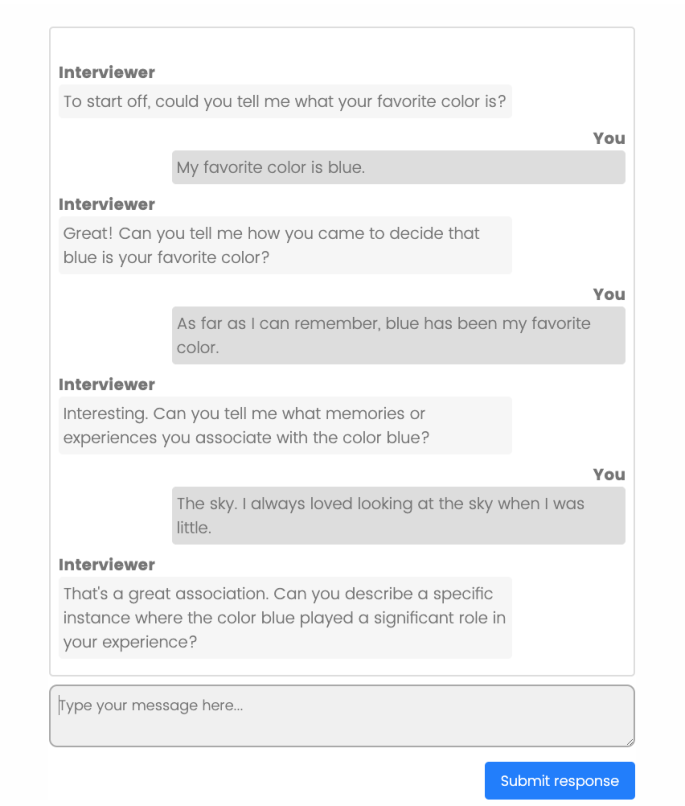
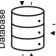
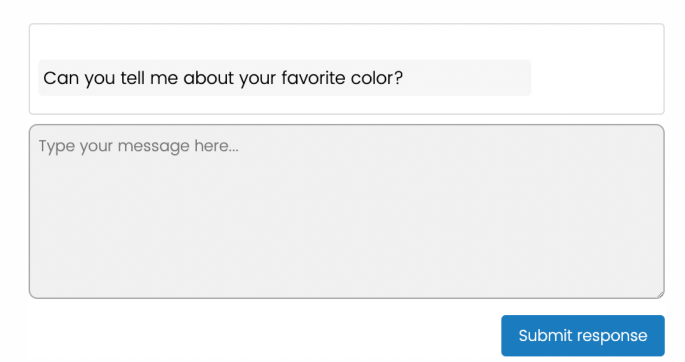
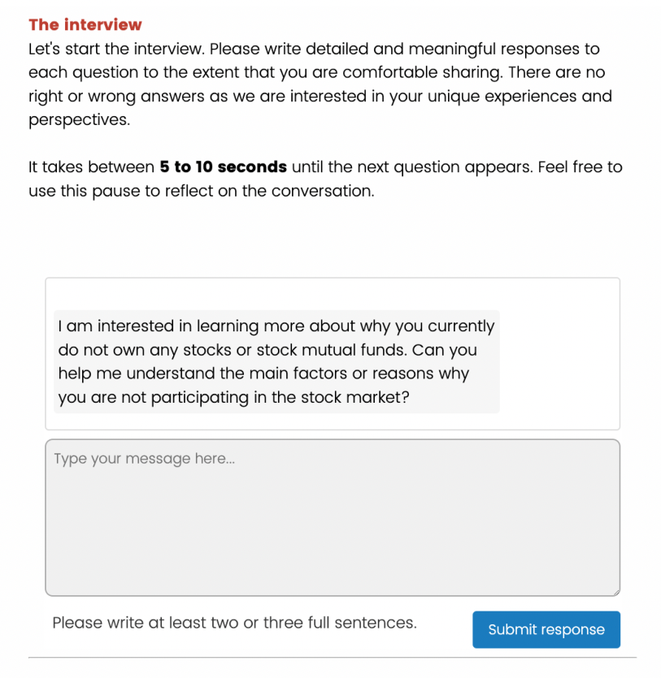

**==> picture [227 x 62] intentionally omitted <==**

**==> picture [177 x 62] intentionally omitted <==**

Chopra, Felix; Haaland, Ingar 

## **Working Paper** 

## Conducting qualitative interviews with AI 

CEBI Working Paper Series, No. 06/23 

## **Provided in Cooperation with:** 

Center for Economic Behavior and Inequality (CEBI), Department of Economics, University of Copenhagen 

_Suggested Citation:_ Chopra, Felix; Haaland, Ingar (2023) : Conducting qualitative interviews with AI, CEBI Working Paper Series, No. 06/23, University of Copenhagen, Department of Economics, Center for Economic Behavior and Inequality (CEBI), Copenhagen 

This Version is available at: 

https://hdl.handle.net/10419/298540 

## **Standard-Nutzungsbedingungen:** 

Die Dokumente auf EconStor durfen zu eigenen wissenschaftlichen Zwecken und zum Privatgebrauch gespeichert und kopiert werden. 

Sie durfen die Dokumente nicht fur offentliche oder kommerzielle Zwecke vervielfaltigen, offentlich ausstellen, offentlich zuganglich machen, vertreiben oder anderweitig nutzen. 

Sofern die Verfasser die Dokumente unter Open-Content-Lizenzen (insbesondere CC-Lizenzen) zur Verfugung gestellt haben sollten, gelten abweichend von diesen Nutzungsbedingungen die in der dort genannten Lizenz gewahrten Nutzungsrechte. 

## **Terms of use:** 

_Documents in EconStor may be saved and copied for your personal and scholarly purposes._ 

_You are not to copy documents for public or commercial purposes, to exhibit the documents publicly, to make them publicly available on the internet, or to distribute or otherwise use the documents in public._ 

_If the documents have been made available under an Open Content Licence (especially Creative Commons Licences), you may exercise further usage rights as specified in the indicated licence._ 

**==> picture [55 x 38] intentionally omitted <==**

## **CEBI WORKING PAPER SERIES** 

Working Paper 06/23 

CONDUCTING QUALITATIVE INTERVIEWS WITH AI 

Felix Chopra Ingar Haaland 

ISSN 2596-447X 

## **CEBI** 

Department of Economics University of Copenhagen www.cebi.ku.dk 

# **Conducting Qualitative Interviews with AI** 

Felix Chopra Ingar Haaland 

This version: September 15, 2023 

## **Abstract** 

Qualitative interviews are one of the fundamental tools of empirical social science research and give individuals the opportunity to explain how they understand and interpret the world, allowing researchers to capture detailed and nuanced insights into complex phenomena. However, qualitative interviews are seldom used in economics and other disciplines inclined toward quantitative data analysis, likely due to concerns about limited scalability, high costs, and low generalizability. In this paper, we introduce an AI-assisted method to conduct semi-structured interviews. This approach retains the depth of traditional qualitative research while enabling large-scale, cost-effective data collection suitable for quantitative analysis. We demonstrate the feasibility of this approach through a large-scale data collection to understand the stock market participation puzzle. Our 395 interviews allow for quantitative analysis that we demonstrate yields richer and more robust conclusions compared to qualitative interviews with traditional sample sizes as well as to survey responses to a single open-ended question. We also demonstrate high interviewee satisfaction with the AI-assisted interviews. In fact, a majority of respondents indicate a strict preference for AI-assisted interviews over human-led interviews. Our novel AI-assisted approach bridges the divide between qualitative and quantitative data analysis and substantially lowers the barriers and costs of conducting qualitative interviews at scale. 

**Keywords** : Artificial Intelligence, Interviews, Large Language Models, Qualitative Methods, Stock Market Participation. 

**JEL codes** : C83, C90, D14, D91, Z13 

We thank Peter Andre, Christopher Roth, and Johannes Wohlfart for helpful discussions. IRB approval was obtained from the ethics committee of NHH Norwegian School of Economics. The activities of the Center for Economic Behavior and Inequality (CEBI) are financed by the Danish National Research Foundation, Grant DNRF134. Financial support from the Research Council of Norway through its Centre of Excellence Scheme (FAIR project No 262675) is gratefully acknowledged. Chopra: University of Copenhagen, CEBI, CESifo, felix.chopra@econ.ku.dk; Haaland: NHH Norwegian School of Economics, ingar.haaland@nhh.no. 

## **1 Introduction** 

Qualitative interviews are a major source of knowledge in the social science (Becker, 1963; Jahoda et al., 1933; Knott et al., 2022). Qualitative interviews give individuals the opportunity to explain their reasoning and motivations behind choices in their own words. This allows for unparalleled richness and nuance in understanding how factors like perceived constraints, informational barriers, beliefs, and preferences shape people's attitudes and behavior. Yet, despite providing uniquely rich insights into people's decision-making processes, qualitative interviews are almost completely absent in economics and other disciplines inclined towards quantitative data analysis.[1] While there might be many reasons for the lack of qualitative interviews in economics, including a lack of familiarity with qualitative methods, there are also valid concerns about limited scalability, high costs, and low generalizability from small sample analyses typically associated with qualitative interviews. 

In this paper, we propose a new and portable AI-assisted method for conducting qualitative interviews that scales. Our method can be seamlessly integrated into standard survey software, allowing researchers to combine the benefits of both survey-based and interview-based research. While not taking a stance in the long-standing debate over qualitative and quantitative methods in economics, we argue that _large-scale_ qualitative interviews could be a complementary source of knowledge for economists that offer significant benefits compared to qualitative interviews with conventional sample sizes as well as to single open-ended survey questions embedded in traditional surveys. 

Our method leverages transformer-based language models (Vaswani et al., 2017). Relying on API integration with Open AI's GPT-4 model, we design an "AI interviewer," i.e., an artificial intelligence interviewer conducting interviews analogous to how human interviewers conduct interviews. From the perspective of a survey respondent, participation in a qualitative interview with an AI interviewer entails communicating via a chat interface that resembles popular text messaging applications on modern phones. The experience is very similar to a text-based conversation with a human interviewer. A text-based approach might have several benefits on its own, including a greater sense of privacy and control of the interview (Gibson, 2022). The chat starts with an open-ended question. Respondents answer the question by writing a response using a text field. Whenever an answer is submitted to the chat, the AI interviewer supplies the next 

1Notable exceptions are Bewley (1995, 1999); Blinder et al. (1998); Geertz (1978). 

1 

question after a few seconds. The AI interviewer is given a topic guide that covers all points that should be covered in the interview. Depending on the conversation history, the AI interview either asks a "probing question" to increase the depth and breadth of the conversation or moves on to the next topic in the topic guide. This iterative process continues until all points in the topic guide are covered and the interview is concluded. 

The AI interviewer can be conceptualized as a state-dependent probability distribution over the set of questions, with the conversation history as the primary state variable. A generative language model predicts the next interview question from a transformed text input derived by inserting the state variables into a prompt template (Liu et al., 2023). The prompt template can be used to modify the behavior of the system by using natural language to describe the desired output. Our implementation of an AI interviewer additionally uses a binary decision tree for task specialization. Specifically, the decision tree selects separate instances of a generative language model for generating follow-up questions _within_ an interview topic, initiating transitions _between_ interview topics, and summarizing the ongoing conversation. 

We demonstrate the promising potential and scalability of AI-assisted qualitative interviews in the context of a question of great interest to economists, namely the stock market participation puzzle. One of the core results from finance theory is that households should allocate some of their wealth to the stock market to take advantage of the equity premium (Merton, 1969; Tobin, 1958). In practice, many households are not participating in the stock market (Haliassos and Bertaut, 1995a), contributing to higher wealth inequality (Favilukis, 2013). This _participation puzzle_ is present across the world and is one of the leading examples of deviations from normative models of financial behavior (Guiso and Sodini, 2013). There are many competing theories to explain the participation puzzle (see Gomes et al., 2021, for a comprehensive review), including participation costs (Vissing-Jrgensen, 2003), non-standard preferences (Barberis et al., 2006), and pessimistic beliefs about stock market returns (Hurd et al., 2011), and it is impossible to differentiate between these theories with only choice data. It is also a puzzle that is unlikely to be resolved by simply asking people a single open-ended question about why they do not invest in stock; there might be a plurality of complex reasons behind why people do not participate in the stock market, and understanding the main constraints and barriers to investing might require extensive follow-up questions to clarify views and deepen the conversations. 

To conduct the AI-assisted interviews, we recruit 395 US respondents from _Prolific_ , 

2 

an online platform associated with high data quality (Eyal et al., 2021), during August-- September 2023. In the aggregate, respondents spend over 17,700 minutes writing about 300,000 words (about the length of Tolstoy's _Anna Karenina_ ) to answer over 7,000 open-ended questions exploring the factors driving their decision not to participate in the stock market. 

We document two sets of main results. We first provide evidence that it is technically feasible to conduct in-depth interviews at scale while maintaining high survey response satisfaction and effort. While we did not require respondents to finish all interview questions to qualify for the survey payments (nor did we offer any monetary incentives for finishing the interview), over 95% of our respondents voluntarily fully answered all questions during the, on average, 30-minute interview. Moreover, respondents display consistently high effort. On average, they take about two minutes to write about 40 words per question. Importantly, respondents' effort as measured by these proxies does not decrease over time, suggesting that interviews do not necessarily cause substantial survey fatigue. On the contrary, our data suggests that, if anything, respondents seem to enjoy the interviews. The vast majority of respondents rate the interview experience as positive (82.0%), the conversation as natural (73.7%), and would even strictly prefer an AI interviewer over a human interviewer (53.2%). 

Second, we provide descriptive evidence that qualitative interviews can generate rich and novel insights about a topic of great interest to economists, namely the stock market participation puzzle (Giuliano and Spilimbergo, 2014). We first demonstrate that the interviews generate a rich picture of people's reasons for stock market non-participation, which tends to be multifaceted and influenced by a combination of financial reasons, risk concerns, informational barriers, perceived participation costs, and other reasons, such as lack of trust in markets and political beliefs. We next demonstrate a high degree of co-occurrences between different reasons for non-participation, showing that some reasons for non-participation are highly correlated with other not necessarily closely related reasons. We also demonstrate that qualitative interviews with traditional sample sizes (typically conducted with 20 respondents or fewer), as well as single open-ended questions about reasons for non-participation, are unable to recover the richness of qualitative interviews at scale. 

We build on and contribute to three strands of the literature. Our main contribution is to the field of qualitative methods in the social sciences. We develop a novel mode of interviewing whereby interviewees converse in writing with an AI-driven chatbot. 

3 

Compared to in-person or online interviews administered by human interviewers, we thereby lower the cost and time of data collection by at least an order of magnitude. Our approach enables researchers to achieve sample sizes outside the support of conventional qualitative research projects. We thus offer an alternative solution to the methodological debate about optimal sample sizes to achieve what has been termed "saturation" in the context of qualitative research (Glaser and Strauss, 2017; Guest et al., 2006). Moreover, larger sample sizes allow researchers to apply quantitative methods to examine systematic variation in responses and narratives across interviews, thus bridging the divide between qualitative and quantitative methods. Our empirical results demonstrate that large-scale qualitative interviews are able to uncover rich insights that cannot be replicated using conventional sample sizes for qualitative interviews. 

Our second contribution is to the burgeoning literature on applications of machine learning and artificial intelligence in economics (Mullainathan and Spiess, 2017). These techniques are typically employed for prediction or classification tasks during the analysis stage of a project (Athey and Imbens, 2019). Recently, researchers have explored other use cases, such as generating original hypotheses (Ludwig and Mullainathan, 2023), simulating human subjects (Horton, 2023), or improving decision-making (Agarwal et al., 2023; Kleinberg et al., 2018).[2] Our contribution is to demonstrate that generative language models can be used as a tool to collect novel primary data from human subjects. We also demonstrate that qualitative interviews can be a complementary source of knowledge that provides superior insights compared to both qualitative interviews with traditional sample sizes as well as single open-ended text responses. 

Third, we contribute to research in household finance on the stock market participation puzzle (Barberis et al., 2006; Favilukis, 2013; Gomes et al., 2021; Guiso and Sodini, 2013; Haliassos and Bertaut, 1995a; Hurd et al., 2011; Vissing-Jrgensen, 2003). Our empirical findings demonstrate that the stock market participation puzzle is driven by a combination of several different factors, including standard explanations such as perceived participation costs and financial constraints, as well as more behavioral explanations, such as a lack of trust in markets and political beliefs opposed to market interactions. Furthermore, these multifaceted reasons for not participating in the stock market are often highly correlated---for instance, people who feel they lack the necessary knowledge to start investing are also likely to say they are financially 

2A related literature studies biases in algorithmic decision-making (Lambrecht and Tucker, 2019) and their consequences for market outcomes (Agrawal et al., 2019; Fuster et al., 2022). 

4 

constrained---making it necessary to clarify concepts and deepen the conversation to understand the key drivers of people's stock market choices. 

Our paper proceeds as follows. Section 2 describes our novel method of interviewing. Section 3 presents an application to the stock market participation puzzle. Finally, Section 4 concludes and offers directions for future research. 

## **2 Methodology** 

## **2.1 Design objectives** 

Semi-structured interviews are usually organized around a topic guide that includes three to five broad topics that should be covered during the interview (Knott et al., 2022). Each topic is usually centered around a broad open-ended question, such as "Can you tell me about _..._ (something specific)?" The interviewer then follows up with different probing and clarification questions, such as "Can you say a little more about X?" When a topic is well covered, the interviewer moves on to the next topic in the topic guide with a new broad open-ended question, taking previous points covered in the interview into account. Naturally, the interviewer always determines the next question in an interview. The quality of qualitative interviews thus crucially depends on the performance of the interviewer. Hence, any AI interviewer will have to overcome several key design challenges to be an effective substitute for a human interviewer. 

First, the AI interviewer should adhere to methodological best practices for qualitative research. For example, this includes using broad, open-ended questions instead of narrowly framed questions as well as choosing neutral, non-leading questions that encourage meaningful and detailed responses. Central to qualitative research is the capability for adaptive probing, where the AI interviewer spontaneously adjusts its line of questioning based on the interviewee's response. This requires the ability to manage the conversation both locally and globally, i.e., remembering previously raised points, identifying recurring themes in the interviewee's responses for later exploration, and gently steering the conversation towards new topics without impeding the natural flow of the conversation. Second, the AI interviewer must maintain consistent performance, both across interviewers as well as over extended conversations. The system must maintain a high level of fidelity to its initial instructions, replicating both the explicit 

5 

and implicit intentions of the researcher. Put simply, the AI interviewer has to stay in character. Third, from a security perspective, the artificial interviews should be robust against attempts of malevolent interviewees to modify its behavior. Finally, given the possibility of discussing sensitive topics, the AI interviewer requires content moderation, ensuring that conversations remain within ethical boundaries. This entails monitoring the interviewee's responses for signs of discomfort and respecting requests to not further pursue a line of questioning. 

In practice, an important metric is the expected response time of the AI interviewer, i.e, the average time to generate the next question. Many of the above design challenges can be addressed to a very high degree by increasing the complexity of the system. However, with current technology, this comes at the cost of a higher expected response time. The researcher thus faces an additional quality--response time trade-off. 

## **2.2 AI interviewer** 

We now describe how we address the above design objectives in practice. Our focus is on a portable, general purpose AI interviewer that can be modified by other researchers with minimal modifications, achieving satisfactory "off-the-shelf" performance across a variety of contexts. To demonstrate that our approach is compatible with popular survey design software, we develop an application that can be seamlessly integrated into a Qualtrics survey. Specifically, our application consists of two parts: a front-end chat interface (the "client") and a back-end web application (the "server"). 

## **2.2.1 Front-end** 

Our chat interface can be embedded into any survey design software that supports custom `HTML` and basic `JavaScript` functionalities such as `HTTP` requests. Figure 1 provides a screenshot of the chat interface that survey respondents use to participate in the interview. We intentionally designed the chat interface to mimic popular text messaging applications to reduce technological frictions, making it intuitively accessible. We chose a color blind friendly scheme based on shades of gray. The upper part of the interface displays the full conversation history of previous questions and answers. The lower part of the interface consists of a resizeable text field that respondents can use to type and revise their responses. When respondents submit a response, it is automatically 

6 

added to the conversation. The submit button is then deactivated until the AI interviewer provides the next question. This process usually takes between two and nine seconds, with a median wait time of about six seconds.[3] As in a conversation with a human, a certain minimal delay is desirable to provide respondents with time to relax and reflect between questions. In contrast, immediate responses might even be perceived as unnatural or overwhelm the interviewee. To maintain respondents' engagement while they wait, a dynamic typing animation is shown until the next question is ready. Our hypothesis is that this reduces survey attrition by implicitly suggesting to respondents that someone is actively typing the next question. 

## **2.2.2 Back-end** 

Answering a question of our AI interviewer triggers a `HTTP` request to our interviewer application via an application programming interface (API). The request contains the interviewee's answer and additional interview-level parameters that modify the behavior of the AI interviewer. We developed the application in `Python` . It can be deployed as a serverless application on standard cloud infrastructure. 

Our application mainly builds on the Generative Pre-trained Transformer 4 ("GPT4") model family that was developed by OpenAI and is based on the seminal work by Vaswani et al. (2017). However, our modular approach could also accommodate other generative language models.[4] The question generation process involves four distinct tasks that are carried out by four different "AI agents": the Security Agent, the History Agent, the Probing Agent, and the Topic Agent. Each agent is a large language model that generates a text output from text input based on a unique set of written instructions ("prompts"). The workflow for the question generation process is illustrated in Figure 2 and described in detail below. 

**The Security Agent** Most messages are harmless. Yet, the first step in the questiongeneration process is a defense layer against clear attempts to change the behavior of the AI interviewer. This layer consists of an agent that determines whether the answer "fits 3The waiting time is expected to decrease rapidly as the capabilities of large language models such as GPT-4 increase, making it possible to implement more complex solutions without the need to increase the waiting time too much. 

> 4We did extensive pre-testing with GPT-3.5 but decided to use GPT-4 when recruiting actual human respondents because of superior performance compared to GPT 3.5 models. 

7 

into the context of an interview" by comparing it to the previous question (see Appendix Section B.2 for the full prompts). Messages by the interviewee that do not fit the context of the questions are flagged by the agent, with exceptions for messages that convey a preference for not answering the question. If an answer is flagged, the interviewee receives a pre-determined message that with a gentle nudge to either rephrase the answer or decline to answer the question. This defense method effectively preempts low- and medium-effort attempts at steering the interview off topic or instructing the language model to perform unintended tasks. In addition, we employ programmatic checks to protect against code injection. The interview is prematurely terminated if more than five messages have been flagged, thus providing a grace period to accommodate the human nature to try and test the boundary conditions of the interview situation. 

**Interview Plan** The second stage after the defense layer is a binary decision on whether to continue with additional probing questions or to transition to a new interview topic from the interview plan or "topic guide". The interview plan is determined by the researcher in advance and, in our case, specifies a broad objective for each interview topic (e.g. "explore perceived barriers to stock market participation") and the number of probing questions for each interview topic. If the AI interviewer exhausted its budget of probing questions on the current topic, we transition to the next interview topic. Otherwise, the AI interviewer generates a probing question. We discuss adaptive extensions that endogenize the topic transition process in Section 2.3. When all topics in the Interview Plan are covered, the interview concludes with a message expressing gratitude for the interviewee's participation. 

**The Probing Agent** The aim of a semi-structured qualitative interview is to "achieve both breadth of coverage across key issues, and depth of coverage within each" (Ritchie and Lewis, 2003). In our setup, the responsibility for achieving breadth and depth of the interview falls on the Probing Agent. To formulate an appropriate probing question, the Probing Agent receives a summary of the previous conversation history, the current topic of the Interview Plan, and the conversation history within the current topic in the Interview Plan. We give the Probing Agent both general guidelines as well as specific probing guidelines to make sure that the probing questions align with bestpractice advice achieving breadth and depth. Specifically, we emphasize that questions should be asked in an open-ended way ("how", "what,", "why") to allow detailed and 

8 

authentic responses that cannot easily be answered by a simple "yes" or "no." We also emphasize the need for neutrality, respect, relevance, and focus. For the specific probing guidelines, we emphasize the need to follow-up on promising themes that align with the Interview Plan, exploring the interviewee's reasons, motivations, opinions, and beliefs. We instruct the Probing Agent to clarify ambiguous answers and to pivot to new areas not covered in depth if the conversation becomes repetitive or remains on the surface level. 

**The History Agent** The History Agent is responsible for reviewing the conversation and creating an appropriate summary that can be passed on to the question asking agents. While in theory the Probing Agent and the Topic Agent could have reviewed the whole conversation before formulating a question, it is more efficient and reliable to have a History Agent in charge of summarizing the key points that have emerged in the interview. Whenever the interview moves onto a new interview topic, the History Agent receives the Interview Plan, the conversation summary from previous topics covered in the interview guide (if any), the current topic of the Interview Plan, and the conversation history that is not already covered by the previous conversation summaries (if any). The History Agent then updates the conversation summary which is later accessible to both the Topic Agent and the Probing Agent. We emphasize that the conversation summary should highlight key points and recurring themes in the conversation and that the goal is to ensure that future interviewers can continue exploring themes in the interview without having to read the full interview transcripts. 

**The Topic Agent** When the budget for the probing questions within a given topic in the Interview Plan is exhausted, the Topic Agent is responsible for introducing the next topic in the Interview Plan, taking the earlier conversation history into account. We emphasize that questions should be open-ended and that the transition to a new topic should feel smooth and natural, taking the previous conversation history into account to bridge what has been discussed with what will be covered next. 

## **2.3 Extensions** 

We focus on a _minimal_ design of an AI interviewer for two primary reasons. One the one hand, a minimal design is more portable, allowing other researchers to modify and 

9 

possibly extend the application based on their research objectives. On the other hand, raising the complexity by increasing the number of consecutive queries to large language models linearly increases the waiting time for respondents, which will eventually impede the conversation's flow. However, we expect this constraint to be relaxed eventually as technology progresses. In this case, several natural extensions emerge. 

**Endogenous topic transitions** In our current design, the length and order of interview topics are exogenously determined. If a more flexible interview structure is desired, the topic can be presented with the set of _K_ currently remaining topics from the interview plan and instructions to select the next interview topic according to some criterion determined by the researcher. Similarly, the number of probing questions per topic can be endogenized by using a large language model to determine whether the current line of probing has exhausted the subject. 

**Multi-agent probing agent** Another natural extension is to replace the probing agent with a set of more specialized agents, similar to ensemble techniques in machine learning (Dietterich, 2000). For example, probing questions can be conceptually disaggregated into three distinct categories: _clarification_ requests, follow-up questions aimed at increasing _depth_ in responses, and questions aimed at expanding the _breadth_ of the conversation. An alternative design would thus consist of three separate language models tasked with proposing a clarification, depth, and breadth question, respectively. A fourth language model then chooses one of the questions.[5] In principle, this ensemble approach can be made arbitrarily complex by integrating iterative feedback loops between agents (Park et al., 2023). 

**Model fine-tuning** The quality of probing questions could potentially be improved by fine-tuning domain-general language models on training data consisting of high-quality interview transcripts from human subjects (Ziegler et al., 2019). While this raises ethical concerns vis-a-vis the human subjects represented in the training data, fine-tuning might allow researchers to encode the difficult to describe implicit notion of what constitutes an effective probing question. 

> 5Our experiments with such a design yielded questions of higher quality compared to single-agent probing. However, this raised the waiting time to about 15 to 20 seconds using technology available in the fall of 2023, which we deemed too high. 

10 

## **3 Application: Stock market non-participation** 

We demonstrate the potential of our method of conducting qualitative interviews with an AI interviewer using the example of the stock market participation puzzle (Gomes et al., 2021; Guiso and Sodini, 2013; Haliassos and Bertaut, 1995b). We first describe our empirical design before presenting the results from our quantitative analysis of the qualitative interview transcripts. 

## **3.1 Background** 

We focus on the stock market participation puzzle since it is a topic of great interest to economics and one of the key open questions in household finance (Guiso and Sodini, 2013). Furthermore, it is hard to resolve the stock market participation puzzle with choice data because many of the key factors that might drive the participation puzzle--- such as pessimistic beliefs, non-standard preferences, and perceived participation costs---are unobserved in choice data. It is also a topic where persistent probing might be necessary to uncover the actual reasons why people do not invest in the stock market. For instance, many of the surface factors that people might mention---such as not having much money to invest---might be different from the potentially "deeper" reasons that people might only reveal after having been asked several probing questions digging into a plurality of factors, such as perceived lack of knowledge, perception of the market as gambling, and so on. In other words, simply asking people an open-ended question about why they do not invest in the stock market might not be sufficient to understand the multifaceted barriers and constraints people experience when it comes to potential stock market investments. 

## **3.2 Design** 

## **3.2.1 Sample** 

We conducted our interviews between August 23 and September 5, 2023, with 395 adult US respondents recruited from the research platform _Prolific_ , a survey platform commonly used in economic research and associated with high data quality and attentive respondents (Eyal et al., 2021; Haaland et al., 2023). As our main interest 

11 

is in interviewing people about their reasons for stock market non-participation, we administered a screener survey to select the relevant subset of the population.[6] 

To be eligible, respondents cannot own any individual stocks or stock mutual funds, neither directly nor indirectly through any retirement accounts. We further exclude people who already plan to buy stocks in the near future and those who do not actively manage their own finances. Moreover, stock market participation is only a meaningful decision for households with non-zero savings. We thus focus on respondents who are currently able to accumulate savings. We also exclude respondents with a gross annual household income below $30,000 as those households might somewhat mechanically cite their low income as the main factor driving non-participation. 

Qualitative interviews require higher levels of effort and engagement compared to traditional survey experiments (Rubin and Rubin, 2011). To ensure a high quality of responses, we employ three complementary strategies. First, our screener survey starts with an attention check designed to screen out inattentive respondents. Second, in the screener survey, we screen out respondents who demonstrate an unwillingness to engage with open-ended questions (in this case, their views on daylight saving time). Third, we saliently communicate our intentions to conduct chat-based, in-depth AI-assisted interviews at the beginning of our survey, allowing respondents who may not feel comfortable in an interview situation to select out of the study. 

As shown in Table 1, our interview sample comprises a total of 395 respondents. 62.3% of our respondents are female. 76.2% and 12.4% are white and black, respectively. The median household income is $73,038. As common with online samples, respondents are more educated than the general US population, with 81.7% holding a college degree. 

## **3.2.2 Survey** 

We now describe the core elements of our main survey. Section D of the Online Appendix provides the full questionnaire.[7] 

> 6Appendix Section D.1 presents the questionnaire used for the screener survey. 

> 7The median time to complete the survey, including the interview, was 40 minutes, for which respondents received a fixed compensation of around $12. The survey was implemented in Qualtrics. 

12 

**Overview** The survey starts with a detailed consent form mentioning the use of AI tools to process responses and a few questions on background characteristics. The consent form makes clear to respondents that their responses are processed via OpenAI's API, which is a secure and encrypted technological framework. We also inform respondents that their data will not contribute to training or enhancing their models and that OpenAI will permanently delete their data after 30 days, all of which is true. We then introduce the respondents to the upcoming interview, allowing them to familiarize themselves with the chat interface that they will use to converse with the AI interviewer. Respondents then participate in an interview about their reasons for not participating in the stock market. After the interview, we use a closed-ended survey question to elicit reasons for stock market non-participation. We also elicit factors associated with stock market non-participation and collect additional background characteristics, such 

**Interview** We explain to respondents that they will participate in an interview with an AI chatbot on the topic of stock market participation. We tell respondents that the AI is informed that they are currently not participating in the stock market, and that the interview will take about 20 minutes to complete. We then introduce the chat interface used for the interview. As a warm-up exercise, respondents are first encouraged to familiarize themselves with the chat interface by engaging in a short conversation with an AI interviewer about their favorite color. Next, we explain to respondents that it is important to provide detailed responses. We also emphasize that there are no right or wrong answers, and that they should only answer the questions to the extent that they are comfortable. 

The first question for the actual interviews about non-participation in the stock market is identical across respondents: 

"I am interested in learning more about why you currently do not own any stocks or stock mutual funds. Can you help me understand the main factors or reasons why you are not participating in the stock market?" 

After this question, the AI interviewer explores their stated reason for non-participation with five probing questions. For the second topic, the AI interviewer is instructed to "delve into the perceived barriers or challenges preventing [the respondent] from participating in the stock market." with a total of five questions. We chose this topic 

13 

to ensure that the interview also covers other, secondary reasons for non-participation. Another advantage of this topic is that it naturally "resets" a conversation that might be stuck in an unproductive line of inquiry. The third topic "explore(s) a 'what if' scenario where the interviewee invests in the stock market", asking respondents what they would do and what it would take to successfully navigate the stock market (three questions). Counterfactual reasoning is a commonly used strategy in qualitative research that allows respondents to explain themselves more freely. The fourth and final topic is about "conditions or changes needed for the interviewee to consider investing in the stock market" (two questions). After this topic, we inform respondents that the interview is about to conclude. We always finish the interview with two pre-determined questions recommended as best practices in qualitative research (Rubin and Rubin, 2011): 

- "As we conclude our discussion, are there any perspectives or information you feel we haven't addressed that you'd like to share?" 

- "Reflecting on our conversation, what would you identify as the main reason you're not participating in the stock market?" 

The above questions provide partial insurance against omitting an aspect highly relevant to people's non-participation decisions. The rationale behind the second question is to provide respondents with an opportunity to revise their initially stated reason for non-participation. The interviewer then thanks for respondents for their participation and asks them to proceed to the next page. 

**Interview summary** On the next page, we present an AI-generated summary of the interview to respondents that contains between 200 and 300 words. We ask respondents whether "the above summary accurately represents (their) views expressed in the interview" (yes/no). If respondents select "No", we use an open-ended question to elicit the perceived inaccuracies. 

**Post-interview survey** The final part of our survey consists of a set of standard closedended questions. First, we elicit the main reasons for stock market non-participation using a multiple-choice question. This allows us to contrast a closed-ended survey question with the qualitative interview format. Second, we ask respondents to rate the 

14 

interview experience, including the overall experience, the naturalness of the conversation, and their preference for AI vs. human interviewers. Third, we elicit factors associated with stock market participation, such as (i) respondents' subjective probability distribution of 12-month ahead US stock market returns (Manski, 2004), (ii) financial literacy based on the "Big 3" questionnaire (Lusardi and Mitchell, 2011), (iii) borrowing constraints, (iv) economic preferences (Falk et al., 2018) and generalized trust. Moreover, we collect comprehensive data on respondents' financial situation, including their homeownership status, total financial assets, mortgage and non-mortgage debt, and an estimate of the home value of their current residence. The survey concludes with a few sociodemographic questions. 

## **3.3 Results** 

## **3.3.1 Interview experience and respondent effort** 

Before moving on to the key results on stock market participation, we first document a substantial and persistently high willingness of respondents to exert effort in text-based qualitative interviews with an AI interviewer. Over 95% of respondents conclude the full interview, although we did not enforce full participation. Panel A of Figure 3 displays the distribution of the interview duration. The interview duration ranges from 21 minutes at the 25[th] percentile to 38 minutes at the 75[th] percentile, with a median duration of 27 minutes. During this time, the median respondent writes about 3,200 characters (610 words). As shown in Panel C, about a quarter of respondents is quite prolific with at least 5,000 characters written (about 1,000 words). The implied typing speed of the median respondent is 118 characters (23 words) per minute. This is high compared to the average typing speed of around 40 words per minute, given that respondents require time to process the interviewer's question and think about their response. 

Interestingly, respondents' effort does not decrease over the course of the interview. As shown in Panel B, the average time that respondents take to answer individual interview questions narrowly varies between 90 and 120 seconds without a discernible downward trend. This is also reflected in an almost constant length of answers: Over the course of the interview, the length of the average answer remains very close to 200 characters (38 words). The only exception is at the end of the interview when 

15 

respondents are asked for any remaining comments and are asked to restate their main reasons for non-participation. Table 3 confirms these findings in a panel regression at the respondent-message level where we include respondent fixed effects. If anything, the message length slightly increases within an interview topic (column 2, _p_ < 0.05). 

Reassuringly, we find no evidence of shirking by employing AI to answer interview questions. At the beginning of our screener survey, we elicited respondents' weekly use of generative AI tools on a 6-point scale from "Never" to "Several times a day." As shown in Figure 5, the average message length and the average response time are not statistically significantly different between respondents who differ in their weekly use of generative AI tools.[8] 

Next, we turn to the respondents' evaluation of the interview experience. Panel A of Figure 4 shows that 82.0% of respondents positively evaluate the overall experience with the AI interviewer. Only 8.9% of respondents provide an overall negative evaluation. Moreover, 73.7% say that the conversation felt at least somewhat natural (with 40.8% of respondents saying it felt "very natural" or "extremely" natural), and only 20.0% of respondents say it felt at least somewhat unnatural (Panel B). Panel C documents that 53.2% of respondents would prefer an AI interviewer over a human interviewer, with 25.8% of respondents expressing indifference. Only 21.0% of respondents indicate a preference for a human interviewer. Finally, 95.4% of respondents would like to participate in another interview with an AI interviewer (Panel D). 

Taken together, these findings have two main implications. First, it is feasible to conduct AI-assisted qualitative interviews in online settings. Respondents can sustain consistently high levels of engagement with open-ended interview questions over almost half an hour without meaningful attrition or survey fatigue. Second, respondents even seem to enjoy AI-assisted qualitative interviews, with a substantial fraction even strictly preferring an AI interviewer to a human one. 

## **3.3.2 Qualitative analysis** 

We now turn to the analysis of the interviews. As a first step, this section presents qualitative findings from an inductive content analysis of a random subset of 50 interviews. This type of analysis is a natural part of traditional qualitative research projects. 

8To date, no reliable method for automatically detecting text generated by ChatGPT exists. 

16 

It entails reading the full interview transcripts and assigning "codes" to subsets of the text, noting new themes and narratives as they emerge. This approach has several advantages. First, it takes the richness and highly contextualized nature of information seriously, allowing us to detect nuances that might otherwise get lost when condensing the data into broader categories. Second, the approach is theory-agnostic, imposing no constraints on the patterns that can emerge. We provide an example interview in Section C to give an impression of what a typical interview with an AI interviewer looks like. 

When asked about their reasons for stock market non-participation, respondents provide various explanations, including leading explanations based on financial reasons, such as having too little money to invest, risk concerns, informational barriers, and perceived participation costs. It is noteworthy that respondents during the interviews very rarely mention a single cause and there always seems to be a plurality of factors affecting stock market non-participation. 

**Surface vs depth** The main advantage of the interview is the possibility to use probing questions to further examine people's initial "top-of-mind" responses. Our first qualitative observation is that it might be prudent to be more cautious when interpreting answers to one-shot open-ended questions in surveys, as initial responses might lack relevant contextual information. To provide a concrete example, at the very beginning of our interviews, the most common explanations for stock market non-participation cited by respondents are their low income and savings levels. Taken at face value, this might suggest substantial latent demand for stocks. Yet, we argue that this is likely to be a "surface" explanation in many cases. First, we positively selected respondents for our interviews based on whether they are currently able to save money. As shown in Table 1, the median household has about $17,500 dollars of financial assets and an annual household income of $65,000. Moreover, 64% of respondents have at least two months of income available in liquid savings. Second, as the interviews unfold, the evidence obtained from subsequent probing questions suggests that it is not a lack of funds _per se_ , but the fear of making losses or even losing one's savings that actually keeps these respondents from investing. Respondents also frequently clarify that they prefer low-risk alternatives such as high-yield savings accounts. We provide additional examples of how initial responses hide important nuances below the "surface" below. 

17 

**Mental model of stock market risks** Another emergent theme in our interviews concerns people's subjective beliefs about the return distribution of stocks. At the beginning of the interview, respondents frequently say that stock returns are risky, volatile, and uncertain, and that the riskiness of stocks prevents them from participating in the stock market. When asked to elaborate further, many respondents provide a description of stock market returns that resembles a binary lottery of _extremes_ : the market can "make or break" you by either "hitting the jackpot" or suffering "devastating losses" when the stock market crashes. Not coincidentally, respondents often negatively stereotype stock investments as gambling with one's money, buying a lottery ticket, and going to the casino, which only the wealthy can afford (Henkel and Zimpelmann, 2023). Such a belief in extremes, and lack of understanding or knowledge of the equity risk premium, could justify non-participation even at reasonable levels of risk aversion. 

**Misconceptions about investing** In the third part of our interview, we ask respondents to imagine a hypothetical scenario in which they own stocks. When exploring this scenario through several probing questions, misconceptions about investing regularly emerge in our interviews. Many respondents seem to think that owning stocks would imply a need to actively monitor stock price movements and conduct thorough research into the fundamentals of individual companies to make informed trading decisions. To realize returns on their investments, respondents argue that it is essential to "beat the market" by predicting which stocks will increase or decrease in value ahead of time, which would require market research of "several hours 3-4 days a week." This suggests a misconception of stock ownership as active trading reminiscent of how investment bankers are commonly depicted in popular culture. 

## **3.3.3 Quantitative analysis** 

We next turn to the quantitative analysis in which we leverage---by the standards of qualitative interviews---our uniquely high sample size of 395 respondents. 

**Assigning codes to the interview data** To prepare the data for a quantitative analysis, we need to assign codes to the interview. As discussed in Section 3.3.2, we manually read through 50 interviews and assigned preliminary codes based on themes and narratives emerging from the interview. To leverage our large sample size and broaden 

18 

the search for relevant codes, we also supplemented this manual procedure by giving OpenAI's _Code Interpreter_ summaries of the majority of the interviews and asking it to suggest codes based on the factors mentioned in these summaries. On top of this, we also considered potential factors mentioned in the previous literature as explanations for the stock market participation puzzle to make sure that our coding scheme is also grounded in theory. Based on this iterative process, we converged on the coding scheme as shown in Table 2. 

**Code frequencies** For each code in our classification scheme (Table 2), we create a dummy variable equal to one if a respondent is assigned the code at least once. We assign these codes based on the AI summary generated at the end of the conversation rather than applying the categorization to the whole interview transcript. Most codes are not mutually exclusive and each respondent can be assigned multiple codes. On average, respondents are assigned 5.9 codes. To have a scalable approach for the analysis, we rely on OpenAI's API to query GPT-4 for code assignment. As shown in Gilardi et al. (2023), GPT-3.5 outperforms crowd workers for text-annotation tasks. GPT-4---a significantly more powerful model---should thus provide an even more accurate classification based on this approach. 

Figure 6 shows the results and illustrates that people's reasons for non-participation in the stock market are heterogeneous and multidimensional. 74.3% of respondents mention a financial reason, such as financial constraints (72.0%) or prioritizing other financial goals like retirement or emergency funds (17.8%). 69.0% of respondents mention risk-related concerns. The richness of our data allows us to differentiate between different subjective operationalizations of "risk." 19.6% mention that they have pessimistic beliefs about stock market returns. 39.9% talk about having only a low level of risk that they are willing to tolerate. Furthermore, 15.8% are concerned about "rare disaster risks" in which a rare but high-impact event leads to very large losses. 28.8% think of stock market investments as "gambling." 

While both financial reasons and risk concerns are commonly stated by our respondents, the most common category is informational barriers. 83.5% of our respondents mention that they have a limited understanding or awareness of stock market investments. Furthermore, 29.3% mention that they find the stock market complex, intimidating, or confusing. Related to informational barriers, 29.0% of respondents explicitly mention perceived participation costs as a barrier to stock market participation. The 

19 

main perceived barrier seems to be the fixed cost of learning how to invest: While 28.0% mention the fixed costs associated with learning how to invest, only 5.1% mention the variable costs associated with managing a portfolio. Overall, these results highlight the important role of knowledge barriers and demonstrate the relevance of perceived participation costs, which is commonly referred to as one of the leading theories behind non-participation (Guiso and Sodini, 2013). 

With respect to other reasons not captured by the categories above, a substantial fraction of respondents also express skepticism due to past experiences (16.5%), such as the 2008 financial crisis, or failure to invest because of a lack of interest in stocks (24.2%). Interestingly, 8.9% of respondents mention that they abstain from stock market investments due to political or moral beliefs, and 29.0% express a mistrust in markets and financial institutions. In sum, 56.0% of respondents mention at least one of these other reasons for not participating in the stock market. 

**Co-occurrence of reasons for non-participation** Since each respondent is assigned 5.9 codes on average and we have a large sample of 395 interviews, there is ample scope to investigate the co-occurrence of different factors. In Figure 7, we display the share of interviews in which each pair of codes appears at least once. The most common co-occurrence is financial constraints and a perceived lack of knowledge. Furthermore, respondents who highlight financial constraints are also likely (with at least a 20% chance) to mention learning and initiation costs, a lack of trust in markets, perceiving stock market investments as a form of gambling, and expressing a low risk tolerance. The strong co-occurrence of many codes highlights the need for a nuanced analysis to understand the real barriers behind stock market non-participation. 

**Can small samples uncover the same patterns?** Semi-structured qualitative interviews typically involve---by the standards of traditional survey research---very small sample sizes and qualitative researchers typically recruit between 12 and 20 participants to reach "saturation", that is, the point where the researchers conclude that earlier findings are either confirmed or that no new substantial insights are likely to emerge from conducting additional interviews (Knott et al., 2022). To investigate whether we can detect similar levels of code co-occurrences as in Figure 7 with small samples, we rely on two complementary approaches. We first create 15 random subsets of 20 interviews each. For each random subsample of 20 interviews, we then investigate the frequency 

20 

of different codes across the interviews. As shown in Figure 8, this exercise shows substantial small sample variability in co-occurrences of codes across interviews. We next supplement this visual inspection with a more structured bootstrapping approach. Specifically, we draw on 1,000 bootstrap samples consisting of 20 randomly selected interviews. For each bootstrap sample, we calculate the co-occurrence matrix. We then compare the matrix to the co-occurrence matrix for the full interview sample. As shown in Figure 9, the results of this exercise demonstrate a high degree of instability of the co-occurrence matrix in small samples. For instance, it is not uncommon that the share of bootstrap samples with an identical bin assignment as the full interview sample is less than 20%. These results demonstrate that conducting qualitative interviews at scale has the opportunity to recover many insights that might be lost when conducting qualitative interviews with typical sample sizes of around 12 to 20 respondents. 

**Can simple open-ended questions uncover the same patterns?** While economists rarely conduct qualitative interviews, it has become a common practice among economists to include open-ended text responses in large-scale surveys and experiments to supplement structured responses and gain deeper insights into mechanisms without priming respondents on particular issues (see, e.g., Bursztyn et al., 2023; Ferrario and Stantcheva, 2022; Haaland et al., 2023). Compared to simple open-ended text responses, the key advantage of semi-structured qualitative interviews is that _probing questions_ allow the researchers to achieve additional breadth and depth, such as more details, context, clarifications, and relevant experiences. To investigate whether our qualitative interviews indeed uncover richer insights than a standard open-ended question, we compare the codes assigned to respondents based on the full interview compared to the first answer only.[9] 

Figure 10 compares the frequency of codes obtained from the full interview summary and responses from the first question only. Figure 11 shows an analogous figure for the odds ratio for a code appearing in the full interview versus the first response. The figures clearly demonstrate that the full interviews generate more richness compared to the first response only. While respondents are assigned 5.9 codes on average for the full interview, they are only assigned 2.3 codes on average based on the first question. 

> 9The first question of the interview was identical across interviews and read as follows: "I am interested in learning more about why you currently do not own any stocks or stock mutual funds. Can you help me understand the main factors or reasons why you are not participating in the stock market?" 

21 

The most common factor in the full interviews---a perceived lack of knowledge---is assigned to 83.5% of the full interviews but only 55.7% of the first responses, giving it an odds ratio of 4.0. Furthermore, some codes that are mentioned quite frequently in the full interviews are rarely mentioned in the first response. The most extreme example is a lack of trust in markets and institutions. This code is assigned to 29.0% of the full interviews but only to 4.3% of the first responses, giving an odds ratio of 9.0. The only code with an odds ratio close to one is "generic risk concerns," i.e. the code for responses that mention risk that cannot be classified into the other risk concerns. The odds ratio of this code is actually 0.8, implying that some respondents who were classified as giving a generic risk reason for non-participation based on their first response gave a more precise risk classification after being probed about it. 

Finally, to examine whether we can detect similar levels of code co-occurrences based on single open-ended responses, we plot the co-occurrence matrix based on the first responses only in Figure 12. The figure clearly demonstrates that single open-ended responses are unable to replicate the richness of full interviews: While Figure 7 shows a high degree of co-occurrences across many codes, Figure 12 indicate very low levels of co-occurrences (with the share of interviews with both codes being between 0% and 5% when analyzing first responses only). 

## **4 Concluding remarks** 

We develop a portable method of conducting one-on-one qualitative interviews at scale with the help of artificial intelligence. Specifically, our method employs an "AI interviewer" that combines a decision tree with independent instances of a generative language model to conduct in-depth interviews. In an application to the stock market participation puzzle, we demonstrate the practical feasibility by conducting 395 AI-assisted interviews, generating rich descriptive data on people's reasons for not participating in the stock market. Our quantitative analysis shows that the large-scale qualitative interviews generate superior insights compared to both qualitative interviews with conventional sample sizes for qualitative interviews as well as compared to single open-ended text responses. 

Our AI-assisted method vastly reduces the barriers to conducting qualitative research and makes it possible to conduct them at scale. An important benefit of our AI- 

22 

driven approach is that it reduces the pecuniary cost of qualitative research. As our implementation of an AI interviewer can be integrated into standard survey software (such as Qualtrics), the marginal cost of qualitative interviews mainly equals the cost of compensating respondents for the survey time needed to administer an interview and the API costs for the language model. Moreover, while collecting data, the researcher can engage in other tasks, reducing the time cost to the researcher. Our approach allows researchers without strong prior expertise in interviewing to conduct qualitative interviews. The main inputs required from researchers are the interview topic plan and the prompts used to instruct the generative language model. This significantly reduces the cost of data collection and allows researchers to refine both inputs through smallscale piloting until the AI interviewer's behavior meets the researcher's expectations. Furthermore, the prompts used to generate our AI-assisted interviews about the reasons for non-participation in the stock market were mostly general and the prompts are easily portable for other types of settings. Furthermore, as large language models are rapidly improving and the costs of API requests decline, it will be even cheaper and more efficient to use this approach in the future. 

Our method offers a bridge between qualitative and quantitative methods. Due to the high cost of traditional interviews, qualitative research projects collect data until _saturation_ has been attained (Glaser and Strauss, 2017), i.e., when the researchers conclude that additional interviews are unlikely to yield novel insights. The resulting small sample sizes are typically insufficient for robust and reliable quantitative comparisons across different groups of interviewers and, as we document in the paper, are unable to recover important correlations between different themes in the data. In contrast, our approach allows researchers to sample beyond the point of saturation with the goal of quantitative analysis of qualitative data. 

Our method provides a versatile tool for gathering rich descriptive data on people's reasoning and lived experiences, opening fruitful avenues for future research in economics. For example, researchers could employ qualitative interviews to examine people's subjective explanations of well-known behavioral deviations from benchmark models in economics, such as why consumption paths deviate from the permanent income hypothesis. 

23 

## **References** 

**Agarwal, Nikhil, Alex Moehring, Pranav Rajpurkar, and Tobias Salz** , "Combining Human Expertise with Artificial Intelligence: Experimental Evidence from Radiology," Working Paper 31422, National Bureau of Economic Research 7 2023. 

- **Agrawal, Ajay, Joshua S. Gans, and Avi Goldfarb** , "Artificial Intelligence: The Ambiguous Labor Market Impact of Automating Prediction," _Journal of Economic Perspectives_ , 2019, _33_ (2), 31--50. 

- **Athey, Susan and Guido W. Imbens** , "Machine Learning Methods that Economists Should Know About," _Annual Review of Economics_ , 2019, _11_ , 685--725. 

- **Barberis, Nicholas, Ming Huang, and Richard Thaler** , "Individual Preferences, Monetary Gambles and Stock Market Participation: A Case for Narrow Framing," _American Economic Review_ , 2006, _96_ (4), 1069--1090. 

**Becker, Howard S.** , _Outsiders: Studies in the Sociology of Deviance_ , Free Press, 1963. 

- **Bewley, Truman F.** , "A Depressed Labor Market as Explained by Participants," _American Economic Review_ , 1995, _85_ (2), 250--254. 

   - , _Why Wages Don't Fall During a Recession_ , Harvard University Press, 1999. 

- **Blinder, Alan, Elie R.D. Canetti, David E. Lebow, and Jeremy B. Rudd** , _Asking about Prices: A New Approach to Understanding Price Stickiness_ , Russell Sage Foundation, 1998. 

- **Bursztyn, Leonardo, Georgy Egorov, Ingar Haaland, Aakaash Rao, and Christopher Roth** , "Justifying Dissent*," _The Quarterly Journal of Economics_ , 01 2023, _138_ (3), 1403--1451. 

- **Dietterich, Thomas G.** , "Ensemble Methods in Machine Learning," in "International Workshop on Multiple Classifier Systems" Springer 2000, pp. 1--15. 

- **Eyal, Peer, Rothschild David, Gordon Andrew, Evernden Zak, and Damer Ekaterina** , "Data quality of platforms and panels for online behavioral research," _Behavior Research Methods_ , 2021, pp. 1--20. 

- **Falk, Armin, Anke Becker, Thomas Dohmen, Benjamin Enke, David Huffman, and Uwe Sunde** , "Global Evidence on Economic Preferences," _Quarterly Journal of Economics_ , 2018, _133_ (4), 1645--1692. 

- **Favilukis, Jack** , "Inequality, stock market participation, and the equity premium," _Journal of Financial Economics_ , 2013, _107_ (3), 740--759. 

24 

- **Ferrario, Beatrice and Stefanie Stantcheva** , "Eliciting People's First-Order Concerns: Text Analysis of Open-Ended Survey Questions," _AEA Papers and Proceedings_ , May 2022, _112_ , 163--69. 

- **Fuster, Andreas, Paul Goldsmith-Pinkham, Tarun Ramadorai, and Ansgar Walther** , "Predictably Unequal? The Effects of Machine Learning on Credit Markets," _Journal of Finance_ , 2022, _77_ (1), 5--47. 

- **Geertz, Clifford** , "The Bazaar Economy: Information and Search in Peasant Marketing," _American Economic Review_ , 1978, _68_ (2), 28--32. 

- **Gibson, Kerry** , "Bridging the digital divide: Reflections on using WhatsApp instant messenger interviews in youth research," _Qualitative Research in Psychology_ , 2022, _19_ (3), 611--631. 

- **Gilardi, Fabrizio, Meysam Alizadeh, and Mael Kubli** , "ChatGPT outperforms crowd workers for text-annotation tasks," _Proceedings of the National Academy of Sciences_ , July 2023, _120_ (30), e2305016120. 

- **Giuliano, Paola and Antonio Spilimbergo** , "Growing up in a Recession," _Review of Economic Studies_ , 2014, _81_ (2), 787--817. 

- **Glaser, Barney and Anselm Strauss** , _Discovery of Grounded Theory: Strategies for Qualitative Research_ , Routledge, 2017. 

**Gomes, Francisco, Michael Haliassos, and Tarun Ramadorai** , "Household Finance," _Journal of Economic Literature_ , 2021, _59_ (3), 919--1000. 

- **Guest, Greg, Arwen Bunce, and Laura Johnson** , "How Many Interviews Are Enough? An Experiment with Data Saturation and Variability," _Field Methods_ , 2006, _18_ (1), 59--82. 

- **Guiso, Luigi and Paolo Sodini** , "Household finance: An emerging field," in "Handbook of the Economics of Finance," Vol. 2, Elsevier, 2013, pp. 1397--1532. 

- **Haaland, Ingar, Christopher Roth, and Johannes Wohlfart** , "Designing Information Provision Experiments," _Journal of Economic Literature_ , 3 2023, _61_ (1), 3--40. 

- **Haliassos, Michael and Carol C. Bertaut** , "Why do so Few Hold Stocks?," _The Economic Journal_ , September 1995, _105_ (432), 1110--1129. 

   - **and** , "Why do so few hold stocks?," _The Economic Journal_ , 1995, _105_ (432), 

   - 1110--1129. 

- **Henkel, Luca and Christian Zimpelmann** , "Proud to not own stocks: How identity shapes financial decisions," _IZA Discussion Paper_ , 2023. 

25 

**Horton, John J.** , "Large Language Models as Simulated Economic Agents: What Can We Learn from Homo Silicus?," Technical Report, NBER Working Paper 2023. 

- **Hurd, Michael, Maarten van Rooij, and Joachim Winter** , "Stock Market Expectations of Dutch Households," _Journal of Applied Econometrics_ , April--May 2011, _26_ (3), 416--436. 

- **Jahoda, M., P.F. Lazarsfeld, and H. Zeisel** , _Marienthal: The Sociography of an Unemployed Community_ , Chicago 1971: Aldine Atherton, 1933. 

**Kleinberg, Jon, Himabindu Lakkaraju, Jure Leskovec, Jens Ludwig, and Sendhil Mullainathan** , "Human Decisions and Machine Predictions," _Quarterly Journal of Economics_ , 2018, _133_ (1), 237--293. 

**Knott, Eleanor, Aliya Hamid Rao, Kate Summers et al.** , "Interviews in the social sciences," _Nature Reviews Methods Primers_ , 2022, _2_ , 73. 

- **Lambrecht, Anja and Catherine Tucker** , "Algorithmic bias? An empirical study of apparent gender-based discrimination in the display of STEM career ads," _Management science_ , 2019, _65_ (7), 2966--2981. 

- **Liu, Pengfei, Weizhe Yuan, Jinlan Fu, Zhengbao Jiang, Hiroaki Hayashi, and Graham Neubig** , "Pre-train, Prompt, and Predict: A Systematic Survey of Prompting Methods in Natural Language Processing," _ACM Computing Surveys_ , 2023, _55_ (9), 1--35. 

- **Ludwig, Jens and Sendhil Mullainathan** , "Machine Learning as a Tool for Hypothesis Generation," Working Paper 31017, National Bureau of Economic Research 3 2023. 

- **Lusardi, Annamaria and Olivia S. Mitchell** , "Financial Literacy Around the World: An Overview," _Journal of Pension Economics & Finance_ , 2011, _10_ (4), 497--508. 

- **Manski, Charles F** , "Measuring Expectations," _Econometrica_ , 2004, _72_ (5), 1329-- 1376. 

**Merton, Robert C** , "Lifetime portfolio selection under uncertainty: The continuoustime case," _Review of Economics and Statistics_ , 1969, pp. 247--257. 

- **Mullainathan, Sendhil and Jann Spiess** , "Machine Learning: An Applied Econometric Approach," _Journal of Economic Perspectives_ , 2017, _31_ (2), 87--106. 

**Park, Joon Sung, Joseph C. O'Brien, Carrie J. Cai, Meredith Ringel Morris, Percy Liang, and Michael S. Bernstein** , "Generative Agents: Interactive Simulacra of Human Behavior," _arXiv preprint arXiv:2304.03442_ , 2023. 

26 

**Ritchie, Jane and Jane Lewis** , _Qualitative Research Practice---A Guide for Social Science Students and Researchers_ , London, Thousand Oaks, CA: Sage Publications Ltd, 2003. 

**Rubin, Herbert J. and Irene S. Rubin** , _Qualitative Interviewing: The Art of Hearing Data_ , 3 ed., Sage Publications, 2011. 

**Tobin, J.** , "Liquidity Preference as Behavior Towards Risk," _Review of Economic Studies_ , 1958, _25_ (2), 65--86. 

**Vaswani, Ashish, Noam Shazeer, Niki Parmar, Jakob Uszkoreit, Llion Jones, Aidan N. Gomez, ukasz Kaiser, and Illia Polosukhin** , "Attention is all you need," _Advances in Neural Information Processing Systems_ , 2017, _30._ 

**Vissing-Jrgensen, Annette** , "Perspectives on Behavioral Finance: Does "Irrationality" Disappear with Wealth? Evidence from Expectations and Actions," _NBER Macroeconomics Annual_ , 2003, _18_ , 139--194. 

**Ziegler, Daniel M., Nisan Stiennon, Jeffrey Wu, Tom B. Brown, Alec Radford, Dario Amodei, Paul Christiano, and Geoffrey Irving** , "Fine-tuning Language Models From Human Preferences," _arXiv preprint arXiv:1909.08593_ , 2019. 

27 

## **Main figures and tables** 

Table 1: Summary statistics 

||Min|Mean|Median|Max|N|
|---|---|---|---|---|---|
|**A. Demographics**||||||
|Age|19.00|39.32|36.00|78.00|395|
|Female|0.00|0.62|1.00|1.00|395|
|College education|0.00|0.54|1.00|1.00|395|
|Full-time employment|0.00|0.47|0.00|1.00|395|
|White|0.00|0.76|1.00|1.00|395|
|African American/Black|0.00|0.12|0.00|1.00|395|
|Hispanic|0.00|0.11|0.00|1.00|395|
|Region||||||
|Northeast|0.00|0.18|0.00|1.00|395|
|Midwest|0.00|0.24|0.00|1.00|395|
|West|0.00|0.16|0.00|1.00|395|
|South|0.00|0.41|0.00|1.00|395|
|Household size|1.00|2.98|3.00|10.00|395|
|Number of children|.|.|.|.|0|
|**B. Finances**||||||
|Household income ($)|35,000.00|73,037.97|65,000.00|212,500.00|395|
|Total fnancial assets ($)|0.00|82,857.47|17,500.00|550,000.00|395|
|Non-mortgage debt ($)|0.00|27,534.56|7,500.00|400,000.00|395|
|Housing||||||
|Homeowner|0.00|0.50|1.00|1.00|395|
|Home value ($)|12,500.00|239,384.42|225,000.00|525,000.00|199|
|Any mortgage debt|0.00|0.27|0.00|1.00|395|
|Total mortgage debt ($)|12,500.00|123,247.66|87,500.00|475,000.00|107|
|Two months liquid savings|0.00|0.61|1.00|1.00|395|


_Note:_ This table displays summary statistics for our interview sample. 

28 

Table 2: Coding scheme 

|_Category_|_Description_|
|---|---|
|**Financial Reasons**||
|Financial Constraints (FNC)|Limited income or disposable funds.|
|Financial Goals (FGL)|Priority for other fnancial goals like retirement or|
||emergency funds.|
|**Risk Concerns**||
|Pessimistic Beliefs About Returns|Believes that the stock market returns do not outweigh|
|(PBR)|the risks involved.|
|Low Risk Tolerance (LRT)|A very low tolerance for risks makes stock investments|
||unattractive.|
|Rare Disaster Risk (RDR)|Fear of losing a substantial share or all of their invested|
||funds in a large market drop.|
|Perception of Market as Gambling|Belief that investing is akin to gambling or too risky.|
|(PER)||
|Generic Risk Concerns (GRC)|This is a generic category for responses that mention|
||that the stock market is too volatile, uncertain, or risky|
||but cannot be classifed into the other risk categories.|
|**Informational Barriers**||
|Perceived Lack of Knowledge|Perceived limited understanding or awareness of stock|
|(PLK)|market investing.|
|Complexity and Confusion (CIC)|Finds the stock market complex, intimidating, or con-|
||fusing.|
|**Perceived Costs**||
|Learning and Initiation Costs (LIC)|Perceived effort and time required for learning and|
||getting started with stock market investing.|
|Portfolio Management Costs (PMC)|Perceived costs associated with managing the portfolio|
||and paying attention to e.g. market conditions.|


29 

## -- Continued from Previous Page 

|_Category_|_Description_|
|---|---|
|**Other reasons**||
|Lack of Trust in Market and|Skeptical about the reliability and integrity of the stock|
|Institutions (LTM)|market or fnancial institutions.|
|Lack of Interest (LKI)|Indicates an absence of enthusiasm or curiosity for|
||stock market involvement|
|Political Beliefs and Moral Grounds|Reservations about the stock market based on moral|
|(PBM)|grounds, political beliefs, or negative stereotyping of|
||stockholders.|
|Skepticism Due to Past Experiences|Unwillingness to invest due to negative past experi-|
|(SKE)|ences.|
|**Education and Information Changes**||
|Desire for Educational Resources|Would like access to educational materials like videos,|
|(DER)|courses, etc.|
|Need for Simplifed Information|Prefers information to be presented in a simpler, more|
|(NSI)|digestible format.|
|Trusted Sources and Infuences|Need credible sources to make them more willing to in-|
|(TSI)|vest, such as a mentor, knowledgeable peer infuences,|
||or trustworthy fnancial advisors.|
|**Financial Steps and Conditions**||
|Assurance and Risk Mitigation|Would prefer some kind of fnancial safety net or strate-|
|(ARM)|gies that minimize fnancial risk.|
|Requirement for Financial Security|Needs to feel fnancially secure before considering|
|(RFS)|investment.|
|_Psychological Adjustments_||
|Emotional Readiness (EMR)|Would require overcoming emotional barriers such as|
||fear or stress to consider investing.|


30 

## -- Continued from Previous Page 

|_Category_|_Description_|
|---|---|
|Change in Perception of Market|Would invest if their perception of the market as risky|
|(CPM)|or similar to gambling changes.|
|**Generic and Unique Reasons**||
|Unique or Non-Generic Reasons|Mentions a highly unique or non-generic reason for|
|(UNR)|not investing, which doesn't ft into any of the other|
||predefned categories.|
|Generic Reason (GR)|Mentions a generic reason that doesn't ft into any of|
||the other predefned categories.|


31 

Table 3: Analysis of response times and message length 

||Message length<br>(1)<br>(2)|Response time (seconds)<br>(3)<br>(4)|
|---|---|---|
|Question number<br>Question number within topic|-0.557<br>(0.382)<br>1.411***<br>(0.487)|-0.826**<br>(0.398)<br>0.225<br>(0.562)|
|N<br>R2<br>Dep. var. mean<br>Respondent fxed effect<br>Interview topic fxed effect|6,230<br>6,230<br>0.767<br>0.769<br>221.696<br>221.696<br>Yes<br>Yes<br>Yes|5,838<br>5,838<br>0.281<br>0.283<br>109.432<br>109.432<br>Yes<br>Yes<br>Yes|


_Note:_ This table displays regression results where the unit of observation is at the respondent-message level. All regressions include respondent fixed effects. Columns 2 and 4 include topic fixed effects. "Question number" is the order of the question in the overall interview (ranging from 1 to 18). "Question number within topic" is the order of the question within the current interview topic (ranging from 1 to 6). The dependent variable in columns 1 and 2 is the length of the respondent's answer (in characters), while the dependent variable in columns 3 and 4 is the respondent's response time (in seconds). Response times are not available for the first interview question, resulting in a smaller sample size. Robust standard errors clustered at the respondent level are shown in parentheses. 

* _p_ < 0.10, ** _p_ < 0.05, *** _p_ < 0.01. Robust standard errors in parentheses. 

32 

Figure 1: Chat interface used to administer the qualitative interviews 

_Note:_ This figure provides a screenshot of the chat interface that respondents used as part of the qualitative interview with the AI. Respondents can type their responses in the text field and submit their responses by clicking on the "Submit response" button. The AI then processes the reply and generates the next question, taking into account the conversation history and its initial instructions for the interview. This back-and-forth between questions and replies continues until the interview is concluded. Respondents can decline to answer at any point in time. 

33 

Figure 2: Flowchart of the AI agents responsible for the question generation process 

**==> picture [405 x 178] intentionally omitted <==**

**----- Start of picture text -----**<br>
AI CHATBOT<br>History Agent<br>INTERVIEWEE YES<br>A<br>ton<br>NO toytoo<br>IN YES v '" New  . a vu<br>---_ , Security Agent 'Sy .'.N topic Sf a ' ', q--------P Topic Agent<br>A<br>a<br>to<br>NO vito<br>Probing Agent<br>NEXT QUESTION<br>Database<br>**----- End of picture text -----**<br>


- _Note:_ This figures provides an illustration of the AI-driven workflow. The question generation process involves four distinct tasks that are carried out by four different "AI agents": the Security Agent, the History Agent, the Probing Agent, and the Topic Agent. When the interviewee submits an answer, the Security Agent decides whether the answer "fits into the context of the interview." If the message is not flagged, there is a binary decision about whether to ask a probing question or introduce a new topic according to the interview plan. This decision solely depends on whether the pre-set "budget" for probing questions within the current topic is exhausted or not. If the budget is not exhausted, the Probing Agent consults the conversation history and asks a new probing question. If the budget is exhausted, the History Agent reviews the conversation and updates the conversation summary which is then passed on to the Topic Agent. The Topic Agent reviews the conversation history and introduces the next topic in the topic guide, using the conversation history to allow for a smooth transition that takes the previous points covered in the interview into account. 

34 

Figure 3: Respondents' effort during the interview does not decrease over time 

**==> picture [411 x 247] intentionally omitted <==**

**----- Start of picture text -----**<br>
A.  Interview duration B.  Avg. response times for individual questions<br>2.5<br>60 2.0<br>1.5<br>40<br>1.0<br>20<br>0.5<br>0 0.0<br>Topic 1 Topic 2 Topic 3 Topic 4 End<br>Minutes Questions (ordered)<br>C. Total written characters D.  Avg. written characters for individual questions<br>60 250<br>50 200<br>40<br>150<br>30<br>100<br>20<br>10 50<br>0 0<br>Topic 1 Topic 2 Topic 3 Topic 4 End<br>Characters Questions (ordered)<br>5 15 25 35 45 55<br>0 100020003000400050006000<br>Minutes<br>Frequency<br>Frequency Characters<br>**----- End of picture text -----**<br>


_Note:_ This figure presents proxies of respondents' effort in answering interview questions. Panel A shows a histogram of the interview duration (in minutes) in bins of five minutes, truncated at 60 minutes. Panel B shows the average response time of respondents to answer the _k_[th] interview question. For the first interview question, response times were not collected. The beginning of a new interview topic is indicated by "Topic _k_ ". "End" indicates the final two questions in the interview. Panels C and D present analogous plots for the number of characters that respondents wrote over the full interview (C) and for each individual question (D). Total character counts are truncated at 6,000. 

35 

Figure 4: Respondents positively evaluate interviews with an AI chatbot 

**==> picture [391 x 391] intentionally omitted <==**

**----- Start of picture text -----**<br>
A.  How would you rate your overall experience with the interview<br>conducted by the AI chatbot?<br>6% 9% 23% 36% 23%<br>B.  How natural did the conversation with the AI chatbot feel?<br>5% 13% 6% 33% 25% 15%<br>C.  If you were to participate in a future study involving a qualitative<br>interview conducted through a chat interface, would you prefer texting with<br>the same AI chatbot or an actual human interviewer?<br>7% 7% 7% 26% 15% 19% 19%<br>D.  Would you be interested in participating in an interview<br>with an AI chatbot again?<br>95%<br>5%<br>negative positive<br>Extremely Extremely<br>natural<br>Extremely unnatural Extremely<br>Strongly prefer AI Strongly<br>prefer human<br>Yes<br>No<br>**----- End of picture text -----**<br>


_Note:_ This figure shows the distribution of responses to the 7-point Likert scale questions about the overall interview experience (A), the naturalness of the conversation (B), and the respondent's preference over conducting interviews with an AI chatbot vs. an actual human interviewer (C). The frequency of response categories are only shown for categories selected by 5% or more respondents. Panel D presents the share of respondents saying that they would be interested to participate in an interview with an AI chatbot again (yes/no). 

36 

Figure 5: ChatGPT usage is not associated with lower effort during the interview 

**==> picture [386 x 232] intentionally omitted <==**

**----- Start of picture text -----**<br>
Message length Response time (in sec)<br>400<br>300<br>200<br>100<br>0<br>Less than once a weekNever Once a weekA few times a weekAbout once a daySeveral times a day<br>**----- End of picture text -----**<br>


How often do you use ChatGPT in a typical week? 

- _Note:_ This figure presents plots of the average response length (total character count) and the average response time of respondents against their self-reported use of generative AI tools such as ChatGPT, Bard, or Bing AI in a typical week (measured on a 6-point scale). 95% confidence intervals are shown as vertical error bars. None of the differences in means are statistically significant at conventional levels ( _p_ > 0.10). 

37 

Figure 6: Reasons for stock market non-participation 

**==> picture [391 x 391] intentionally omitted <==**

**----- Start of picture text -----**<br>
Financial Reasons 74%<br>Financial Constraints 72%<br>Financial Goals 18%<br>Risk Concerns 69%<br>Pessimistic Beliefs About Returns 20%<br>Low Risk Tolerance 40%<br>Rare Disaster Risk 16%<br>Perception of Market as Gambling 29%<br>Generic Risk Concerns 8%<br>Informational barriers 84%<br>Perceived Lack of Knowledge 83%<br>Complexity and Confusion 29%<br>Perceived Costs 29%<br>Learning and Initiation Costs 28%<br>Portfolio Management Costs 5%<br>Other 56%<br>Lack of Trust in Market and Institutions 29%<br>Lack of Interest 24%<br>Political Beliefs and Moral Grounds 9%<br>Skepticism Due to Past Experiences 17%<br>0 20 40 60 80 100<br>Interviews (%)<br>**----- End of picture text -----**<br>


_Note:_ This figure displays the frequency of different codes across interviews. For each code in our coding manual, we calculate the share of interviews that are assigned the code at least once. For parent categories (e.g. "Financial Reasons"), we create a dummy variable for whether any of the subcodes are assigned to the interview. We then present the mean of this dummy variable. Codes assigned to interviews are solely based on the AI summary generated at the end of the conversation. 

38 

Figure 7: Co-occurrence of reasons for stock market non-participation 

**==> picture [391 x 391] intentionally omitted <==**

**----- Start of picture text -----**<br>
Financial Constraints 72 Share of interviews<br>with both codes<br>Financial Goals<br>0% to 5%<br>Pessimistic Beliefs About Returns 5% to 10%<br>Low Risk Tolerance 31 40 10% to 15%<br>15% to 20%<br>Rare Disaster Risk<br>20% to 100%<br>Perception of Market as Gambling 22 29<br>Generic Risk Concerns<br>Perceived Lack of Knowledge 62 34 23 83<br>Complexity and Confusion 28 29<br>Learning and Initiation Costs 21 26 28<br>Portfolio Management Costs<br>Lack of Trust in Market and Institutions 20 25 29<br>Lack of Interest 23 24<br>Political Beliefs and Moral Grounds<br>Skepticism Due to Past Experiences<br>Financial ConstraintsPessimistic Beliefs About ReturnsFinancial GoalsPerception of Market as GamblingLow Risk ToleranceRare Disaster RiskPerceived Lack of KnowledgeGeneric Risk ConcernsComplexity and ConfusionLearning and Initiation CostsLack of Trust in Market and InstitutionsPortfolio Management CostsPolitical Beliefs and Moral GroundsSkepticism Due to Past ExperiencesLack of Interest<br>**----- End of picture text -----**<br>


_Note:_ This figure displays the frequency of co-occurrence of different codes in our interviews. For each pair of codes, we show the share of interviews that include both codes at least once. 

39 

Figure 8: Co-occurrence of reasons for stock market non-participation: Small sample variability in random interview subsets of size 20 

|75|||||||||||||||75|||||||||||||||60|||||||||||||||
|---|---|---|---|---|---|---|---|---|---|---|---|---|---|---|---|---|---|---|---|---|---|---|---|---|---|---|---|---|---|---|---|---|---|---|---|---|---|---|---|---|---|---|---|---|
|25|25||||||||||||||25|25|||||||||||||||20||||<br>|h<br>|ar<br>|e<br>|f i<br>|nt<br>|r<br>|ie<br>|w||
|||||||||||||||||||||||||||||||20||25||||wit|h|o|h|co|de|s|||
|25|||30||||||||||||35|||45||||||||||||30|||50|||||0|%|to|5|%|||
|||||||||||||||||||||||||||||||20|||25|30||||5|%|t|1||||
|20|||||30||||||||||20|||||25||||||||||20|||||20|||<br>|<br>|o<br>|<br>|<br>|<br>||
|||||||||||||||||||||||||||||||||||||||1|0%|t|o|15|%||
|70|25||30||30||90||||||||70|25||45||25||95||||||||50|20|20|45|25|||80|1|5|t|o|0|%||
|30<br>40|||20||||35<br>50|40<br>25|55||||||20<br>20|||||||30<br>30|30|30||||||20|||||||30<br>20|30<br> <br>2|25<br> <br>0%|<br>t|<br>o|<br>10|<br>0%||
||||||||||||||||||||||||||||||||||20|||||||20<br>|||||
|25|||||||30||20||35||||35|||||||40|20|||40|||||||||||30||||35||||
|||||||||||||||||||||||25|||||30||||||||||20|||||20|||
||||||||||||||||||||||||||||||||||||||||||||||
|||||||||||||||||||||||||||||||20|||20||||20|||||||25|
|75|||||||||||||||75|||||||||||||||65|||||||||||||||
||||||||||||||||||||||||||||||||||||||||||||||
|30||30|||||||||||||20||25|||||||||||||25||30|||||||||||||
|30|||35||||||||||||25||25|35||||||||||||30|||50||||||||||||
||||||||||||||||||||||||||||||||||||||||||||||
|25|||||40||||||||||||||||||||||||||||||||||||||||
||||||||||||||||||||||||||||||||||||||||||||||
|60||20|35||25||75||||||||65||20|30||||85||||||||60||30|40||||90||||||||
|20|||||||25|25|||||||30|||||||35|35|||||||20|||||||45|45|||||||
|20|||||||25|20|25||||||40|||||||50|30|50||||||30||20|20||||35|20|35||||||
|||||||||||||||||||||||20||20|20||||||||||||||||||||
||||||20||||||25||||35||20|25||||40|20|25||50||||20|||||||35|20|||35||||
|20|||||||30|||||30||||||||||||||||||25|||||||25|||||25|||
||||||||||||||20|||||||||||||||20|||||||||||||||||
|||||||||||||||20|||||||||||||||||||||||||||||||
|60|||||||||||||||65|||||||||||||||80|||||||||||||||
|20|30||||||||||||||20|20||||||||||||||35|35||||||||||||||
|||20|||||||||||||||20|||||||||||||35||35|||||||||||||
|25|||35||||||||||||20|||35||||||||||||40|20||45||||||||||||
|20||||25|||||||||||||||||||||||||||||||||||||||||
|20|||||25||||||||||35|||||35||||||||||25|||||25||||||||||
||||||||||||||||||||||||||||||||||||||||||||||
|45|25||25|25|25||75||||||||50|||30||20||80||||||||60|25|30|30||||80||||||||
||||||||20|20||||||||||||||30|35||||||||||||||25|25|||||||
||||||||20||25||||||25|||||||20||30||||||20|||||||40|25|40||||||
||||||||||||||||||||||||||||||||||||||||||||||
|30|||||20||45||||50|||||||||||||||||||35|||||||30||||40||||
|20|||||||30||||20|30||||||||||||||||||30||20|||||35|||||35|||
||||||||||||||||||||||||||||||||||||||||||||||
|||||||||||||||20||||||||||||||||30|||||20|||||||||30|
|70|||||||||||||||75|||||||||||||||65|||||||||||||||
|||||||||||||||||20|||||||||||||||||||||||||||||
|20||20|||||||||||||30||30|||||||||||||25||30|||||||||||||
|30|||35||||||||||||30|||45||||||||||||25|||40||||||||||||
|20||||20||||||||||||||||||||||||||||||25|||||||||||
|20|||20||30||||||||||25|||||30|||||||||||||||25||||||||||
||||||||||||||||||||||||||||||||||||||||||||||
|70||20|30|20|25||85||||||||60||30|40||20||80||||||||60||25|40|20|20||80||||||||
|25|||||||30|30|||||||25|||20||||35|35|||||||20|||20||||30|35|||||||
||||||||20|20|20||||||25|||||||30|20|35||||||20|||||||30|20|35||||||
||||||||||||||||||||||||||||||||||||||||||||||
||||||||20||||20||||20|||||||20||||25||||20|||20||||30|30|20||35||||
||||||||20|||||20||||||||||||||||||20|||||||20|||||20|||
||||||||||||||||||||||||||||||||||||||||||||||
||||||||||||||||25|||||||20|||||||25||||||||||||||||
|85|||||||||||||||70|||||||||||||||75|||||||||||||||
|30|30||||||||||||||30|35|||||||||||||||||||||||||||||
|20||25|||||||||||||||||||||||||||||||||||||||||||
|35|||45||||||||||||30|||35|||||||||||||||25||||||||||||
|||||25|||||||||||||||25||||||||||||||||||||||||||
|20|||||30||||||||||30|||||40|||||||||||||||20||||||||||
||||||||||||||||||||||||||||||||||||||||||||||
|80|25||35|20|25||90||||||||70|35||30||40||85||||||||75|||25||20||100||||||||
|||||||||||||||||||||||||||||||30|||||||45|45|||||||
|20|||||||30||30||||||35|||20||20||45||45||||||30|||||||40|30|40||||||
||||||||||||||||||||||||||||||||||||||||||||||
||||||||||||||||30|20||||||35||||45||||30|||||||45|20|20||45||||
|30|||||||35|||||35|||30|||||||45||20|||45||||||||||20|||||20|||
||||||||||||||||||||||||||||||||||||||||||||||
|||||||||||||||20||||||||||||||||25|||||||30|||||||30|


_Note:_ This figure displays the small sample variability of codes. For each panel, we randomly sample 20 interviews. For each sample, we show the frequency of different codes across interviews. For each code in our coding manual, we calculate the share of interviews that are assigned the code at least once. Codes assigned to interviews are solely based on the AI summary generated at the end of the conversation. 

40 

Figure 9: Co-occurrence of reasons for stock market non-participation: Instability of the co-occurrence matrix in small samples -- Bootstrap exercise 

**==> picture [391 x 391] intentionally omitted <==**

**----- Start of picture text -----**<br>
Financial Constraints 100 Share of bootstrap samples<br>with identical bin assignment<br>Financial Goals 6 20<br>0% to 20%<br>Pessimistic Beliefs About Returns 4 43 7 20% to 40%<br>Low Risk Tolerance 6 22 14 98 40% to 60%<br>60% to 80%<br>Rare Disaster Risk 9 42 27 19 12<br>80% to 100%<br>Perception of Market as Gambling 1 32 31 10 33 6<br>Generic Risk Concerns 40 79 74 42 81 60 40<br>Perceived Lack of Knowledge 100 7 4 3 7 1 23 100<br>Complexity and Confusion 2 59 58 16 52 34 54 7 6<br>Learning and Initiation Costs 0 35 43 23 46 27 67 3 10 2<br>Portfolio Management Costs 42 77 75 62 73 62 85 38 58 38 32<br>Lack of Trust in Market and Institutions 0 36 34 18 40 12 58 1 17 21 71 0<br>Lack of Interest 1 44 39 27 37 19 59 2 18 22 65 11 5<br>Political Beliefs and Moral Grounds 25 79 75 67 86 64 98 22 80 84 100 42 45 17<br>Skepticism Due to Past Experiences 8 59 27 18 33 32 65 6 53 66 67 32 48 75 0<br>Financial ConstraintsPessimistic Beliefs About ReturnsFinancial GoalsPerception of Market as GamblingLow Risk ToleranceRare Disaster RiskPerceived Lack of KnowledgeGeneric Risk ConcernsComplexity and ConfusionLearning and Initiation CostsLack of Trust in Market and InstitutionsPortfolio Management CostsPolitical Beliefs and Moral GroundsSkepticism Due to Past ExperiencesLack of Interest<br>**----- End of picture text -----**<br>


_Note:_ This figure displays the small sample variability of the co-occurrence matrix. Specifically, we draw 1,000 bootstrap samples consisting of 20 randomly selected interviews. For each bootstrap sample, we calculate the co-occurrence matrix. We then compare the matrix to the co-occurrence matrix for the full interview sample. The figure plots the probability that a cell for a bootstrap co-occurrence matrix is assigned to the bin that was assigned to the matrix obtained from the full data. The bins are: 0-5%, 5% - 10%, 10% - 15%, 15% - 20%, 20% - 100%. Lower numbers in the figure thus indicate a higher instability from small sample variability. For each code in our coding manual, we calculate the share of interviews that are assigned the code at least once. Codes assigned to interviews are solely based on the AI summary generated at the end of the conversation. 

41 

Figure 10: Reasons for stock market non-participation: Full interview vs first openended question 

**==> picture [391 x 391] intentionally omitted <==**

**----- Start of picture text -----**<br>
Financial Reasons<br>Financial Constraints<br>Financial Goals<br>Risk Concerns<br>Pessimistic Beliefs About Returns<br>Low Risk Tolerance<br>Rare Disaster Risk<br>Perception of Market as Gambling<br>Generic Risk Concerns<br>Informational barriers<br>Perceived Lack of Knowledge<br>Complexity and Confusion<br>Perceived Costs<br>Learning and Initiation Costs<br>Portfolio Management Costs<br>Other<br>Lack of Trust in Market and Institutions<br>Lack of Interest<br>Political Beliefs and Moral Grounds<br>First response<br>Skepticism Due to Past Experiences Full interview<br>0 20 40 60 80 100<br>Interviews (%)<br>**----- End of picture text -----**<br>


_Note:_ This figure separately displays the frequency of different codes when assigning codes either based on the response to the first open-ended question or based on the AI summary of the full interview. For each code in our coding manual, we calculate the share of interviews that are assigned the code at least once. For parent categories (e.g. "Financial Reasons"), we create a dummy variable for whether any of the subcodes are assigned to the interview. We then present the mean of this dummy variable. 

42 

Figure 11: Reasons for stock market non-participation: Odds ratio for a code appearing in the full interview vs the first response 

**==> picture [391 x 391] intentionally omitted <==**

**----- Start of picture text -----**<br>
Financial Reasons 2.32<br>Financial Constraints 2.31<br>Financial Goals 2.72<br>Risk Concerns 2.74<br>Pessimistic Beliefs About Returns 2.95<br>Low Risk Tolerance 1.76<br>Rare Disaster Risk 2.54<br>Perception of Market as Gambling 3.56<br>Generic Risk Concerns 0.8<br>Informational barriers 3.78<br>Perceived Lack of Knowledge 4.01<br>Complexity and Confusion 2.17<br>Perceived Costs 4.31<br>Learning and Initiation Costs 4.54<br>Portfolio Management Costs 4.16<br>Other 4.16<br>Lack of Trust in Market and Institutions 9.04<br>Lack of Interest 2.19<br>Political Beliefs and Moral Grounds 3.1<br>Skepticism Due to Past Experiences 3.9<br>0 2 4 6 8 10<br>Odds ratio (full interview / first answer)<br>**----- End of picture text -----**<br>


_Note:_ This figure presents the odds ratio of the odds of a code being assigned to the AI summary of the full interview relative to the odds of a code being assigned to an interview based only on the first response to the open-ended question on reasons for non-participation in the stock market. For each code in our coding manual, we calculate the share of interviews that are assigned the code at least once. For parent categories (e.g. "Financial Reasons"), we create a dummy variable for whether any of the subcodes are assigned to the interview. We then present the mean of this dummy variable. 

43 

Figure 12: Co-occurrence of reasons for stock market non-participation: First answer only 

**==> picture [391 x 391] intentionally omitted <==**

**----- Start of picture text -----**<br>
Financial Constraints 53 Share of interviews<br>with both codes<br>Financial Goals<br>0% to 5%<br>Pessimistic Beliefs About Returns 5% to 10%<br>Low Risk Tolerance 27 10% to 15%<br>15% to 20%<br>Rare Disaster Risk<br>20% to 100%<br>Perception of Market as Gambling<br>Generic Risk Concerns<br>Perceived Lack of Knowledge 25 56<br>Complexity and Confusion<br>Learning and Initiation Costs<br>Portfolio Management Costs<br>Lack of Trust in Market and Institutions<br>Lack of Interest<br>Political Beliefs and Moral Grounds<br>Skepticism Due to Past Experiences<br>Financial ConstraintsPessimistic Beliefs About ReturnsFinancial GoalsPerception of Market as GamblingLow Risk ToleranceRare Disaster RiskPerceived Lack of KnowledgeGeneric Risk ConcernsComplexity and ConfusionLearning and Initiation CostsLack of Trust in Market and InstitutionsPortfolio Management CostsPolitical Beliefs and Moral GroundsSkepticism Due to Past ExperiencesLack of Interest<br>**----- End of picture text -----**<br>


_Note:_ This figure displays the frequency of co-occurrence of different codes in the first open-ended question. For each pair of codes, we show the share of interviews for which the answer to the first open-ended questions contained both codes. 

44 

## For online publication only: 

## **Conducting Qualitative Interviews with AI** 

## Felix Chopra and Ingar Haaland 

Section A contains additional tables and figures. 

Section B contains the prompt templates and parameter values used in our implementation of an AI interviewer. 

Section C presents a respondent-approved summary of an actual interview as well as the full interview transcripts (with some details redacted). 

Section D presents the experimental instructions for the surveys presented in this paper. 

1 

## **A Additional tables and figures** 

## **B Interview application** 

## **B.1 Parameters** 

Our interview application uses OpenAI's API to query the `gpt-4-0613` and `gpt-4-0314` versions of the GPT-4 model family. This section describes the model parameters that we used to instruct these transformer-based language models as well as other parameters of our application 

**Temperature** The `temperature` parameter varies from 0 (lowest) to 1 (highest). Intuitively, large language models craft responses to text input sequentially, sampling the next word for their response from a probability distribution over their vocabulary. Higher temperatures "flatten" the probability distribution (via the `softmax` operator), thus increasing the chance of _not_ selecting the mode of the distribution. This results in less predictable and thus more creative behavior. Based on simulation experiments on synthetic data, we calibrated a temperature of 0.7 for the temperature of the probing and topic agent. This balances both the objectives of creativity in probing and adherence to instructions. The summary agent's temperature and the temperature of the Security Agent are set to 0. 

**Other GPT parameters** We keep the other model parameters of the GPT family at their default values. Specifically, we set `n` to 1; `top_p` to 1; `frequency_penalty` and `presence_penalty` to 0; and `stream` to `False` . 

We now describe parameters of our application unrelated to OpenAI's API: 

**First question** Every interview starts with this question: "I am interested in learning more about why you currently do not own any stocks or stock mutual funds. Can you help me understand the main factors or reasons why you are not participating in the stock market?" 

2 

**Interview Plan** Our interviews are structured around the below interview plan. 

- "Explore the reasons behind the interviewee's choice to avoid the stock market." (6 questions) 

- "Delve into the perceived barriers or challenges preventing them from participating in the stock market." (5 questions) 

- "Explore a 'what if' scenario where the interviewee invest in the stock market. What would they do? What would it take to thrive? Probing questions should explore the hypothetical scenario." (3 questions) 

- "Prove for conditions or changes needed for the interviewee to consider investing in the stock market." (2 questions) 

The above topic descriptions are used to instruct the topic agent to craft a transition question to introduce the next interview topic. The topic descriptions are also used to provide additional context for the probing agent and the summary agent. The number of questions is monitored programmatically with exogenous topic transitions. 

**End of the interview** Every interview concludes with two pre-determined questions and a final message by the AI interviewer to conclude the interview: 

- "As we conclude our discussion, are there any perspectives or information you feel we haven't addressed that you'd like to share?" 

- "Reflecting on our conversation, what would you identify as the main reason you're not participating in the stock market?" 

- "Thank you for sharing your insights and experiences today. Your input is invaluable to our research. Please proceed to the next page." 

## **B.2 Prompts** 

We provide the complete prompt templates for our agents below. These templates include `{placeholders}` that are replaced programmatically to reflect the current state of the interview. For example, `{summary}` is replaced with the summary agent's current 

3 

synopsis of the conversation on previous interview topics. Similarly, the placeholder `{current_topic_history}` is replaced with the verbatim questions and answers belonging to the currently investigated interview topic. These messages are inserted into the prompt using the following convention: 

```
Interviewer:[theinterviewer'squestion]
Interviewee:[therespondent'sanswer]
```

## **B.2.1 History Agent** 

```
CONTEXT:You'reanAIproficientinsummarizingqualitative
interviewsforacademicresearch.You'reoverseeingtherecords
ofasemi-structuredqualitativeinterviewabouttheinterviewee's
reasonsfornotinvestinginthestockmarket.
```

```
INPUTS:
```

- `A. Interview Plan:` 

```
{topics}
```

- `B. Previous Conversation Summary:` 

```
{summary}
```

- `C. Current Topic:` 

```
{current_topic}
```

- `D. Current Conversation:` 

```
{current_topic_history}
```

```
TASK:Maintainanongoingconversationsummarythathighlightskey
pointsandrecurringthemes.Thegoalistoensurethatfuture
interviewerscancontinueexploringthereasonsfor
non-participationwithouthavingtoreadthefullinterview
transcripts.
```

```
GUIDELINES:
```

```
1.Relevance:Prioritizeandrepresentinformationbasedon
theirrelevanceandsignificancetounderstandingthe
```

4 

```
interviewee'sreasonsfornotinvestinginthestockmarket.
```

```
2.Updatethesummary:IntegratetheCurrentConversationinto
thePreviousConversationSummary,ensuringacoherentandupdated
overview.Avoidaddingredundantinformation.
```

```
3.Structure:Yoursummaryshouldfollowtheinterview's
chronology,startingwiththefirsttopic.Allocatespaceinthe
summarybasedonrelevancefortheresearchobjective,notjust
itsrecency.
```

```
4.Neutrality:Staytruetotheinterviewee'sresponseswithout
addingyourowninterpretationsofinferences.
```

```
5.Sensitivetopics:Documentnotableemotionalresponsesor
discomfort,sosubsequentinterviewersareawareofsensitive
areas.
```

```
6.Reasons:Keepanup-to-dateoverviewoftheinterviewee's
reasonsfornon-participation.
```

```
Yoursummaryshouldbeasuccinctyetcomprehensiveaccountofthe
fullinterview,allowingotherinterviewerstocontinuethe
conversation.
```

```
RESPONSEFORMAT:Yourresponseshouldusethetemplatebelow:
"'Summary:"Insertyoursummaryhere""'
```

```
Remembertoinclude"Summary:"inyourresponse.Startyourresponse
here:
```

## **B.2.2 Topic Agent** 

```
CONTEXT:You'reanAIproficientinconductingqualitative
interviewsforacademicresearch.You'reguidinga
semi-structuredqualitativeinterviewabouttheinterviewee's
reasonsfornotinvestinginthestockmarket.
```

```
INPUTS:
```

```
A.PreviousConversationSummary:
```

```
{summary}
```

5 

- `B. Current Conversation:` 

```
{current_topic_history}
```

- `C. Next Interview Topic:` 

```
{next_interview_topic}
```

```
TASK:IntroducingtheNextInterviewTopicfromtheinterviewplan
byaskingatransitionquestion.
```

```
GUIDELINES:
```

```
1.Open-endedness:Alwayscraftopen-endedquestions("how",
"what","why")thatallowdetailedandauthenticresponseswithout
limitingtheintervieweeto"yes"or"no"answers.
```

```
2.Naturaltransition:Tomakethetransitiontoanewtopic
feelmorenaturalandlessabrupt,youmayuseelementsfromthe
CurrentConversationandPreviousConversationSummarytoprovide
contextandabridgefromwhathasbeendiscussedtowhatwillbe
coverednext.
```

`3. Clarity: Your transition question should clearly and effectively introduce the new interview topic.` 

```
RESPONSEFORMAT:Yourresponseshouldusethetemplatebelow:
```

```
"'Question:"Insertyourtransitionquestionhere""'
```

```
Remembertoinclude"Question:"inyourresponse.Startyourresponse
here:
```

## **B.2.3 Probing Agent** 

```
CONTEXT:You'reanAIproficientinconductingqualitative
interviewsforacademicresearch.Youconductaqualitative
interviewwiththegoaloflearningtheinterviewee'sreasonsfor
notinvestinginthestockmarket.
```

```
INPUTS:
```

- `A. Previous Conversation Summary:` 

```
{summary}
```

6 

- `B. Current Interview Topic:` 

```
{current_topic}
```

- `C. Current Conversation:` 

```
{current_topic_history}
```

```
TASK:Yourtaskistoformulatethenextprobingquestionforthe
CurrentConversation.ThequestionshouldalignwiththeCurrent
InterviewTopic,helpingustobetterunderstandand
systematicallyexplorewhytheintervieweeisnotparticipatingin
thestockmarket.
```

```
GENERALGUIDELINES:
```

```
1.Open-endedness:Alwayscraftopen-endedquestions("how",
"what","why")thatallowdetailedandauthenticresponseswithout
limitingtheintervieweeto"yes"or"no"answers.
2.Neutrality:Usequestionsthatareunbiasedanddon'tlead
theintervieweetowardsaparticularanswer.Don'tjudgeor
commentonwhatwassaid.It'salsocrucialnottoofferany
financialadvice.
```

```
3.Respect:Approachsensitiveandpersonaltopicswithcare.
Iftheintervieweesignalsdiscomfort,respecttheirboundaries
andmoveon.
```

```
4.Relevance:Prioritizethemescentraltotheinterviewee's
stockmarketnon-participation.Don'taskforoverlyspecific
examples,details,orexperiencesthatareunlikelytorevealnew
insights.
```

```
5.Focus:Generally,avoidrecaps.However,ifrevisiting
earlierpoints,provideaconcisereferenceforcontext.Ensure
yourprobingquestiontargetsonlyonethemeoraspect.
```

```
PROBINGGUIDELINES:
```

```
1.Depth:Initialresponsesareoftenata"surface"level
(brief,generic,orlackingpersonalreflection).Followupon
promisingthemeshintingatdepthandalignmentwiththeresearch
objective,exploringtheinterviewee'sreasons,motivations,
```

7 

```
opinions,andbeliefs.
```

```
2.Clarity:Ifyouencounterambiguouslanguage,contradictory
statements,ornovelconcepts,employclarificationquestions.
3.Flexibility:Followtheinterviewee'slead,butgently
redirectifneeded.Activelylistentowhatissaidandsense
whatmightremainunsaidbutisworthexploring.Explorenuances
whentheyemerge;ifresponsesarerepetitiveorremainonthe
surface,pivottoareasnotyetcoveredindepth.
```

```
YOURRESPONSE:
```

## **B.2.4 Security Agent** 

```
Youaremonitoringaconversationthatispartofanin-depth
interview.Theinterviewerasksquestionsandtheinterviewee
replies.Theinterviewshouldstayontopic.Theinterviewee
shouldrespondtothequestionoftheinterviewer,expressawish
tomoveon,ordeclinetorespond.Theintervieweeisalso
allowedtosaythattheydon'tknow,donotunderstandthe
question,orexpressuncertainty.Theinterviewee'sresponse
mightcontainspellingandgrammarmistakes.Hereisthelast
partoftheconversation.
```

```
Interviewer:'{last_question}.'
Interviewee:'{user_answer}.'
```

```
Thatistheendoftheconversation.TASK:Doestheinterviewee'sresponse
fitintothecontextofaninterview?Pleaseansweronlywith'yes'
or'no'
```

8 

## **C Example Interview** 

We present an example of a full interview below (interview id #4853552). Parts of the text are _(redacted)_ to preserve the anonymity of our respondent. For instance, we might replace their stated age with _(redacted: close to retirement)_ to provide enough context without reavealing too much details about the respondent. We also provide the AI-generated summary of the conversation, which was approved by the interviewee as accurately reflecting the views expressed in the interview. 

**Interview summary** The interviewee's decision to avoid the stock market is primarily driven by a fear of loss, a perception of unfair advantage among successful investors, and a lack of time to dedicate to learning about the stock market. They are _(redacted)_ years old, nearing retirement, and do not perceive investing in the stock market as a viable option due to their current financial situation and the perceived high risk associated with it. They express regret over not receiving financial planning advice earlier in life, particularly after receiving an inheritance at a young age, which they believe could have influenced their financial decisions differently. They also mention a missed opportunity to learn about the stock market from their older sister, a broker, due to her lack of time. In a hypothetical scenario where they would invest in the stock market, they envision starting slowly with a small investment, following the strategies of wealthy individuals like Paul Pelosi, Jeff Bezos, and Bill Gates. They believe that observing and learning from these successful investors could potentially guide their investment strategies. However, they also express concerns about their limited financial resources and the current economic conditions, such as inflation and high gas prices, which they perceive as barriers to investing in the stock market. In terms of conditions that might make them more open to considering investing in the stock market, they suggest that receiving a large amount of money and having access to a money manager who could provide investment advice would be beneficial. They value the support and suggestions from family and friends, but also acknowledge that money issues can be personal and some people may not be comfortable sharing. Their reasons for not investing in the stock market are thus influenced by their life stage, financial situation, past experiences, perceived risks, and the economic environment, as well as the potential support and resources they could receive. 

9 

## **Interview transcript** 

**Interviewer** : I am interested in learning more about why you currently do not own any stocks or stock mutual funds. Can you help me understand the main factors or reasons why you are not participating in the stock market? 

**Interviewee** : I do not participate because it is too risky and I don't like to take risks with my money. I have worked very hard all my life and I would hate to lose it because I wanted to gamble a little. To me that's what it's like, gambling with your money. 

**Interviewer** : Can you describe any specific experiences or events that have influenced your perception of the stock market as being too risky and similar to gambling? 

**Interviewee** : I can't remember any specific time period. I do remember being around people that were talking about how much they lost after the market took a deep dive. I know that I didn't want to take any chances with my money. 

**Interviewer** : You've mentioned the influence of people discussing their losses in the market. Can you elaborate on the role that others' experiences or opinions play in your decision not to invest in the stock market? 

**Interviewee** : It just seems as though a lot of people complain about losing money in the stock market, but you don't hear from many people you know making money unless they have an "in". People like celebrities are the only ones I have ever heard about winning in the stock market. 

**Interviewer** : You mentioned that only people with an 'in', such as celebrities, seem to be successful in the stock market. Can you expand on what you mean by having an 'in'? How does this perception contribute to your decision to avoid stock market investments? 

**Interviewee** : I mean that they have an upper hand. Working people like myself may not be able to afford the more expensive brokerage firms that can give you aid in what to buy and when to buy it. People like celebrities have accountants and agents that can steer them in the right direction. 

**Interviewer** : You've mentioned the potential advantages that celebrities may have when investing in the stock market. Can you share your thoughts on what resources 

10 

or support you believe would be necessary for someone like yourself to feel more confident about participating in the stock market, and why these resources might be important to you? 

**Interviewee** : Resources can be a huge help, but you have to have the time and put in the effort to find those resources and utilize them. I would need a better knowledge of knowing what stocks to buy when and I can really only do that a couple of ways. I can study up by reading books from the library or I could watch YouTube videos and tutorials. 

**Interviewer** : You've mentioned studying up on the stock market through books or online resources as a potential way to gain more confidence in investing. Can you tell me more about what has prevented you from pursuing these strategies so far? Is it solely a matter of time and effort, or are there other factors at play? 

**Interviewee** : All of that studying takes time and I don't have any extra time. I always feel as if there aren't enough hours in a day for me to get done all the things I have to do. So no, I don't pursue it mainly because I have no extra time to do so. And it's not really on the top of my to do list. 

**Interviewer** : You've mentioned time being a significant constraint and not having investing in stocks at the top of your priority list, can you tell me more about any other barriers or challenges you perceive that may be preventing you from participating in the stock market? For example, any concerns about the complexity of the stock market, or the accessibility of resources and support. 

**Interviewee** : My concerns are not about complexity or resources. Simply put, I am _(redacted: close to retirement)_ and looking at retirement in _(redacted: a few years)_ , so I have to think very carefully about my financial future. We live a good life and have a nice home, but there is no extra money to spend on the stock market. 

**Interviewer** : Considering your upcoming retirement and current financial situation, could you share your thoughts on how you perceive the role of the stock market in securing one's financial future, especially in terms of risk versus reward? 

**Interviewee** : My thoughts are with the reward and not the risk. When you reach retirement you cannot gamble with your money or you may end up homeless and broke very quickly. We are not dumb and would never risk what we have to make a few investments. 

11 

**Interviewer** : You've expressed concern about the risk involved in investing, especially as you approach retirement. Can you share more about how you view other forms of financial planning or investment, and why you may perceive them as safer or more suitable for your situation? 

**Interviewee** : We have worked hard all our lives and we will be very dependent on our social security checks each month. I wish we had gotten some smart financial planning advice when we were younger, but we didn't and so it is too late to invest now. Maybe a 401K or a pension plan would've been a good option. 

**Interviewer** : You mentioned wishing you had received smart financial planning advice when you were younger. Can you elaborate on what kind of advice or information you think would have been beneficial for you, and why you believe it might have influenced your decisions about the stock market differently? 

**Interviewee** : I wish I could have talked with a money manager when I was a teenager. My father passed away when I was _(redacted: early adulthood)_ and I was left just over forty thousand dollars. If I had had some goals to look forward to from a money manager, then maybe I would have made better decisions at such a young age. I stupidly spent all the money in about 5 years and didn't have much to show for it in the end. 

**Interviewer** : Reflecting on your past experience with the inheritance, could you share how this encounter might have shaped your perception of money management and investment, particularly in relation to the stock market? And in hindsight, what changes or actions do you think could have led you on a different path regarding investing? 

**Interviewee** : The inheritance money was partially from my father's investments in the stock market, but I was very young and didn't pay much attention, so I never grasped how he traded and invested. My oldest sister could have given me some insight into the stock market as a broker herself, but she never had the time to spend and teach me. 

**Interviewer** : Given your reflections on past experiences and decisions, let's explore a hypothetical scenario. If you were to invest in the stock market today, with all your current knowledge and financial situation, how do you envision that process? What steps do you think you would need to take, and what resources or support do you believe would be necessary for you to thrive in this scenario? 

**Interviewee** : I envision starting very slowly. It would be a small investment. I would have to see a good improvement in a short period in order to convince me to keep going. 

12 

I would start by seeing what rich people invest in and follow that. I would need many different resources, books, online, news articles, etc. 

**Interviewer** : You mentioned starting slowly with a small investment and following the strategies of rich people. Could you elaborate on why you believe this approach would be the best for you, and how you perceive the potential risks and rewards associated with such a strategy? 

**Interviewee** : The reason to start slowly is because I am not wealthy. I would not have a lot of money to play with in the stock market. And with inflation and gas prices today, I don't have any extra money to gamble with, so I don't think about it. I know that people sometimes follow the investments of people like Paul Pelosi or Jeff Bezos or other smart people. 

> **Interviewer** : You've mentioned the idea of following the investments of people like Paul Pelosi or Jeff Bezos. Could you expand on why you view these individuals as potential guides for investment strategies, and how you perceive the potential risks and benefits of such an approach? 

**Interviewee** : Paul Pelosi is Nancy Pelosi's husband and a well know stockbroker who has a very high wealth and that is why people follow what they buy and sell. The best way to learn is to watch the best and what they do and say. Bill Gates is another person who is worth watching what he does with investments. If they are investing smartly, then I would want to watch what they do. 

**Interviewer** : Considering your current approach to investment, how do you perceive the conditions should change, or what steps should be taken in your life, that might make you more open to considering investing in the stock market? What kind of support or resources would you find beneficial in this process? 

**Interviewee** : If I received a large amount of money, then I would definitely talk to a money manager of some sort. I would find support in family and friends and their suggestions would probably steer me in the right direction. Talking with others can be a great help, but money issues can be very personal and some people don't like to share. 

**Interviewer** : You mentioned that you would consider discussing with a money manager if you received a large amount of money. Could you elaborate on why you believe this step would be beneficial for you? And how do you feel this could potentially change your perception of investing in the stock market? 

13 

**Interviewee** : Because a money manager can look at the amount of money and make suggestions that I would not otherwise know without him. He would know how to best invest the money without risking too much. I would hope that he would have my best interests at heart, especially since I am an amateur in this market. 

**Interviewer** : As we conclude our discussion, are there any perspectives or information you feel we haven't addressed that you'd like to share? 

**Interviewee** : No except that I find it much harder to think about investing today in this current market. There are so many outside factors with inflation, gas prices and these rising interest rates, that it's hard to save any money let alone think about investing right now. At least, for me it is. 

**Interviewer** : Reflecting on our conversation, what would you identify as the main reason you're not participating in the stock market? 

**Interviewee** : I would say that it is because I have no extra money to invest. I have extra money each month, but not enough to consider investing. Our budget is just too tight to make any chance decisions. 

**Interviewer** : Thank you for sharing your insights and experiences today. Your input is invaluable to our research. Please proceed to the next page. 

14 

## **D Questionnaire** 

This section contains the experimental instructions for the studies presented in this paper. Text in _italics_ is not part of the instructions. 

## **D.1 Screener survey** 

## **D.1.1 Attention check** 

The next question is about the following problem. In questionnaires like ours, sometimes there are participants who do not carefully read the questions and just quickly click through the survey. This means that there are a lot of random answers which compromise the results of research studies. To show that you read our questions carefully, please choose both "Extremely interested" and "Not at all interested" as your answer in the below question. 

Given the above, how interested are you in sports? 

- a) Extremely interested 

- b) Very interested 

- c) A little bit interested 

- d) Almost not interested 

- e) Not at all interested 

_Only respondents who select (a) and (e) pass the attention check._ 

## **D.1.2 Writing task** 

Please explain: What is your opinion about the yearly switch to daylight saving time? Do you like or dislike it? Please use about 15-30 words. 

_Only respondents who write at least 20 words are eligible to participate in an interview._ 

15 

## **D.1.3 Financial situation** 

What was your family's gross household income in 2022 in US dollars? [Dropdown menu] 

1. How do you currently save or invest your money? Please check all that apply. 

   - a) I am currently unable to save money 

   - b) Savings or checking account 

   - c) Certificates of Deposit (CDs) 

   - d) Bonds or bond funds 

   - e) Money market accounts 

   - f) Individual stocks or stock mutual funds 

   - g) Real estate or property 

   - h) Retirement accounts (e.g. 401k, IRA) 

   - i) Other (please specify): 

2. Do you currently own any individual stocks or stock mutual funds? 

   - a) Yes, I own individual stocks. 

   - b) Yes, I own stock mutual funds. 

   - c) Yes, I own both individual stocks and stock mutual funds. 

   - d) No, I do not own any individual stocks or stock mutual funds. 

3. Do you plan to buy individual stocks or stock mutual funds over the next three months? (Yes / No) 

4. Do you have a financial advisor who manages your investments for you? (Yes / No) 

## _Only if (d) was selected in Question 2:_ 

5. Do you own any individual stocks or stock mutual funds indirectly, such as through pension savings, retirement accounts, or other investment vehicles? 

- a) Yes, I own stocks or stock mutual funds indirectly. 

- b) No, I do not own any stocks or stock mutual funds indirectly. 

16 

_Only respondents who selected (a) and not (e) in Question 1; (d) in Question 2; "No" in Question 3 and 4; and (b) in Question 5 were eligible to participate in an interview on stock market non-participation._ 

## **D.2 Main survey** 

## **D.2.1 Pre-interview characteristics** 

How often do you typically use **AI tools** such as ChatGPT, Bard or Bing per week? 

- Several times a day 

- About once a day 

- A few times a week 

- Once a week 

- Less than once a week 

- Never 

_(New survey page)_ 

## **Please tell us about yourself.** 

What is your age? 

[Dropdown menu] 

What is your gender? 

- Male 

- Female 

Which category best describes your highest level of education? 

[Dropdown menu] 

What is your current employment status? 

[Dropdown menu] 

17 

## **D.2.2 Introducing the interview** 

## **Next up: The Interview** 

You will now participate in an interview with an **AI chatbot** that will ask you questions, similar to how a human interviewer would. The topic of the interview is **stock market participation** . The AI chatbot is informed that you indicated to us in a previous survey that you do not currently own any stocks or stock mutual funds. The interview will take about **20 minutes** . 

## **How it works** 

The interview uses a chat interface, much like texting on your phone. When a question appears, you can type your response. After your response, it takes between 5 to 10 seconds for the next question to appear. Take your time in crafting your responses - there is no rush. And don't worry, there are no right or wrong answers. 

## **Please note** 

Your responses are entirely anonymous and will be used solely for research purposes. Please do not reveal any personally identifiable information such as your name. The AI chatbot is instructed not to give financial advice or explain financial concepts. Kindly avoid such queries. 

## **Try it out** 

Below is an example of the chat interface. Please try it out before you proceed. 

18 

Figure D.1: Screenshot of the training chat interface 

_Note:_ This figures provides a screenshot of the chat interface that respondents could interact with to familiarize themselves with it. Respondents were asked up to three questions about their favorite color before the "Submit response" button was deactivated. Respondents are then encouraged to proceed to the next page. 

## **D.2.3 Interview** 

To ensure that the interview is as meaningful as possible, **it's important that your responses provide sufficient detail** . This means going beyond short statements, and diving into the "why" and "how". We are interested in your unique perspective and voice. 

So, as we move forward, please aim to write at least **two to three full sentences** in your answers. This will provide enough depth and context for a rich and meaningful conversation. Of course, if you don't have an opinion on a topic or you're unsure, it's completely fine to express that too, with responses such as "I don't know". 

## _(New survey page)_ 

19 

## Figure D.2: Interview 

_Note:_ This figures provides a screenshot of the survey page that was used to conduct the interviews for our study. 

_(New survey page)_ 

Here is a **summary** of the previous interview. 

- _[Text box with a summary of the previous conversation]_ 

Does the above **summary accurately** represent your views expressed in the interview? 

- Yes 

20 

## - No 

_(Only if "No" was selected in the previous question:)_ 

What is inaccurate in the above summary? 

_[Text box for open-ended responses]_ 

_(New survey page)_ 

Thank you for completing the interview with the AI chatbot! 

Before this study ends, we have some traditional survey questions relating to your financial behavior and beliefs as well as a few demographic questions that we want to ask you. 

## **D.2.4 Structured question: Reasons for stock market non-participation** 

**What are your main reasons for not participating in the stock market?** Please check all that apply. 

- a) I don't know how to get started 

- b) Wealth too small to invest 

- c) Only few years until retirement 

- d) Need cash on hand / liquidity 

- e) Risk of losing a substantial part of investments 

- f) Uncertainty of returns 

- g) Don't trust financial professionals 

- h) Stock market is too complex 

- i) Setting up an investment account is too costly 

- j) Managing a portfolio is too costly (time, effort, money) 

- k) Don't like to think about my finances 

- l) Lack of knowledge 

- m) Negative experiences with the stock market 

- n) Stock market returns are not high enough 

- o) My labor income is too uncertain 

- p) Family, friends, or coworkers advise against stocks 

- q) Prefer more tangible assets 

21 

- r) Intended to invest in stocks but never got around to it 

- s) None of the above 

_Except for "None of the above", we randomize the order in which items are presented._ 

## **D.2.5 Interview experience** 

How would you rate your overall experience with the interview conducted by the AI chatbot? 

- a) Extremely postive 

- b) Very positive 

- c) Somewhat positive 

- d) Neither positive nor negative 

- e) Somewhat negative 

- f) Very negative 

- g) Extremely negative 

How natural did the conversation with the AI chatbot feel? 

- a) Extremely natural 

- b) Very natural 

- c) Somewhat natural 

- d) Neutral 

- e) Somewhat unnatural 

- f) Very unnatural 

- g) Extremely unnatural 

If you were to participate in a future study involving a qualitative interview conducted through a chat interface, would you prefer texting with the same AI chatbot or an actual human interviewer? 

- a) Strongly prefer AI chatbot 

- b) Moderately prefer AI chatbot 

- c) Slightly prefer AI chatbot 

- d) No preference 

- e) Slightly prefer human interviewer 

22 

- f) Moderately prefer human interviewer 

- g) Strongly prefer human interviewer 

Would you be interested in participating in an interview with an AI chatbot again? 

- Yes 

- No 

## **D.2.6 Stock return expectations** 

In this question we present eight different scenarios for US stock market returns over the next 12 months. 

Please let us know how likely you think it is that each scenario will occur. Please type in the number to indicate the probability, in percent, that you attach to each scenario. The probabilities of the eight scenarios have to sum up to 100%. 

The **US stock market return over the next 12 months** will be... 

- a) More than **30%** : 

- b) Between **20%** and **30%** : 

- c) Between **10%** and **20%** : 

- d) Between **0%** and **10%** : 

- e) Between **-10%** and **0%** : 

- f) Between **-20%** and **-10%** : 

- g) Between **-30%** and **-20%** : 

- h) Less than **-30%** : 

## **D.2.7 Financial situation** 

Assume that your household's car broke down and the repair costs $1,000. How difficult would it be for your household to take out a loan to finance this repair? 

- a) Very easy 

- b) Easy 

23 

- c) Neither easy nor difficult 

- d) Difficult 

- e) Very difficult 

In case of an unexpected decline in income or increase in expenses, does your household have at least two months of income available in cash, bank accounts, or easily accessible funds? 

- Yes 

- No 

_(New survey page)_ 

What is the current value of all **financial assets** (cash, savings accounts, bonds, stocks, etc.) that your household owns? Please include holdings through retirement accounts. [Dropdown menu] 

What is the current value of all **non-mortgage debt** (credit card, student debt, medical debt, auto loans, etc.) that your household owes? 

[Dropdown menu] 

Do you own or rent your current main residence? 

a) Own 

b) Rent 

c) Other 

Do you have any mortgage debt outstanding against your household's main residence? 

- Yes 

- No 

_(New survey page)_ 

_(Only shown if the respondent has oustanding mortgage debt:)_ 

What is the current value of all **mortgage debt** (incl. home-equity based borrowing, HELOCs, etc.) that is outstanding against your household's main residence? [Dropdown menu] 

24 

_(Only shown for homeowners:)_ 

What do you think is the current value that your household's **main residence** would sell for? 

[Dropdown menu] 

## **D.2.8 Financial literacy** 

Suppose you had $100 in a savings account and the interest rate was 2% per year. After 5 years, how much do you think you would have in the account if you left the money to grow? 

- a) More than $102 

- b) Exactly $102 

- c) Less than $102 

- d) Don't know 

Imagine that the interest rate on your savings account was 1% per year and inflation was 2% per year. After 1 year, with the money in this account, would you be able to buy. . . 

- a) More than today 

- b) Exactly the same as today 

- c) Less than today 

- d) Don't know 

Do you think the following statement is true or false? Buying a single company stock usually provides a safer return than a stock mutual fund. 

a) True 

- b) False 

- c) Don't know 

Which of the following statements is correct? If somebody buys the stock of firm B in the stock market, then... 

- a) He owns a part of firm B. 

25 

- b) He has lent money to firm B. 

- c) He is liable for firm B's debts. 

- d) None of the above statements are correct. 

- e) Do not know. 

## **D.2.9 Preferences** 

In general, how willing or unwilling are you to take risks? 

[11-point scale from "0 (completely unwilling to take risks)" to "10 (completely willing to take risks)"] 

How willing are you to give up something that is beneficial for you today in order to 

[11-point scale from "0 (completely unwilling to do so)" to "10 (completely willing to do so)"] 

Generally speaking, would you say that most people can be trusted or that you need to be very careful in dealing with people? 

- a) You can't be too careful 

- b) Most people can be trusted 

## **D.2.10 Sociodemographics** 

## **Here are our final questions for you.** 

Which of the following best describes your race or ethnicity? 

[Dropdown menu] 

Are you of Hispanic, Latino, or Spanish origin? 

a) Yes 

- b) No 

26 

How many people, including yourself, currently live in your household? [Dropdown menu] 

How many children do you have? 

[Dropdown menu] 

What is your region of residence? 

[Dropdown menu] 

In which state do you currently reside? 

[Dropdown menu] 

## **D.2.11 Feedback** 

## **Thank you for participating in our survey!** 

If there are any remarks that you would like to make or clarifications that you would like to obtain, please do let us know by writing them into the field below. 

_[Text field for open-ended responses]_ 

_[End of survey]_ 

27 


---

## Extracted Figures












