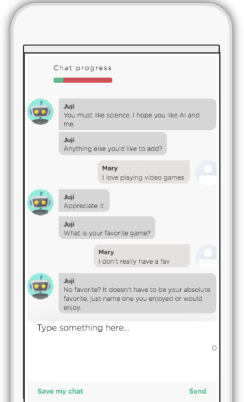
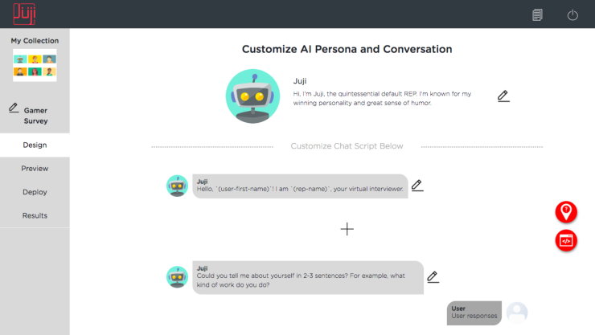
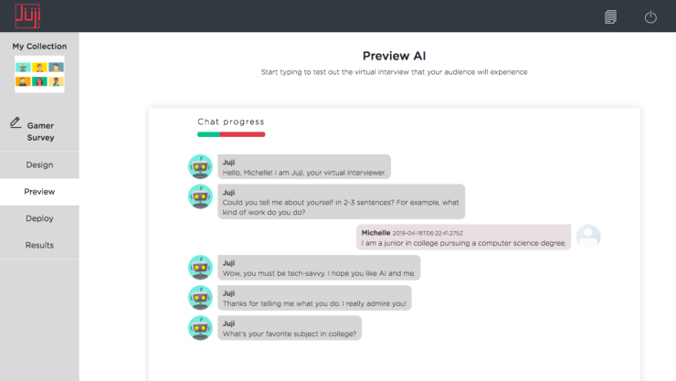

**1** 

**Tell Me About Yourself: Using an AI-Powered Chatbot to Conduct Conversational Surveys with Open-ended Questions** 

ZIANG XIAO, University of Illinois at Urbana-Champaign, USA 

MICHELLE X. ZHOU, Juji. Inc., USA Q. VERA LIAO, IBM Research AI, USA GLORIA MARK, University of California, Irvine, USA CHANGYAN CHI, Juji. Inc., USA WENXI CHEN, Juji. Inc., USA HUAHAI YANG, Juji. Inc., USA 

The rise of increasingly more powerful chatbots offers a new way to collect information through conversational surveys, where a chatbot asks open-ended questions, interprets a user's free-text responses, and probes answers whenever needed. To investigate the effectiveness and limitations of such a chatbot in conducting surveys, we conducted a field study involving about 600 participants. In this study with mostly open-ended questions, half of the participants took a typical online survey on Qualtrics and the other half interacted with an AI-powered chatbot to complete a conversational survey. Our detailed analysis of over 5200 free-text responses revealed that the chatbot drove a significantly higher level of participant engagement and elicited significantly better quality responses measured by Gricean Maxims in terms of their informativeness, relevance, specificity, and clarity. Based on our results, we discuss design implications for creating AI-powered chatbots to conduct effective surveys and beyond. 

CCS Concepts: - **Human-centered computing** -> **Human-Computer Interaction** ; - **Computing methodologies** -> **Intelligent agents** . 

Additional Key Words and Phrases: Conversational Agent; Chatbot; Survey; Open-ended Questions 

## **ACM Reference Format:** 

Ziang Xiao, Michelle X. Zhou, Q. Vera Liao, Gloria Mark, Changyan Chi, Wenxi Chen, and Huahai Yang. 2020. Tell Me About Yourself: Using an AI-Powered Chatbot to Conduct Conversational Surveys with Open-ended 

Authors' addresses: Ziang Xiao, University of Illinois at Urbana-Champaign, Urbana, IL, USA, zxiao5@illinois.edu; Michelle X. Zhou, Juji. Inc. San Jose, CA, USA, mzhou@acm.org; Q. Vera Liao, IBM Research AI, Yorktown Heights, NY, USA, vera.liao@ibm.com; Gloria Mark, University of California, Irvine, Irvine, CA, USA, gmark@uci.edu; Changyan Chi, Juji. Inc. San Jose, CA, USA, tchi@juji-inc.com; Wenxi Chen, Juji. Inc. San Jose, CA, USA, wchen@juji-inc.com; Huahai Yang, Juji. Inc. San Jose, CA, USA, hyang@juji-inc.com. 

Permission to make digital or hard copies of all or part of this work for personal or classroom use is granted without fee provided that copies are not made or distributed for profit or commercial advantage and that copies bear this notice and the full citation on the first page. Copyrights for components of this work owned by others than the author(s) must be honored. Abstracting with credit is permitted. To copy otherwise, or republish, to post on servers or to redistribute to lists, requires prior specific permission and/or a fee. Request permissions from permissions@acm.org. 

 2020 Copyright held by the owner/author(s). Publication rights licensed to ACM. 1073-0516/2020/1-ART1 $15.00 https://doi.org/10.1145/3381804 

ACM Trans. Comput.-Hum. Interact., Vol. 1, No. 1, Article 1. Publication date: January 2020. 

Xiao et al. 

1:2 

<!-- Start of picture text -->
--- VD)=- Julisoi sine sconce | po vat Nery BD- suSrecme = ut wary - Juli SGD No tavorite? it coesn't nave to be your absolute D> tevoriejust name one you enjoyed or would Type something here <!-- End of picture text -->

Fig. 1. A screenshot of a chatbot survey in our study. 

Questions. _ACM Trans. Comput.-Hum. Interact._ 1, 1, Article 1 (January 2020), 39 pages. https://doi.org/10.1145/ 3381804 

# **1 INTRODUCTION** 

In many domains, including HCI research [62], conducting surveys is a key method to collect data. With the widespread use of the internet, self-administered online surveys have replaced old-fashioned paper-and-pencil surveys and have become one of the most widely used methods to collect information from a target audience [27, 30]. Compared to paper-and-pencil surveys, online surveys offer several distinct advantages. First, an online survey is available 24x7 for a target audience to access and complete at their own pace. Second, it can reach a wide audience online regardless of their geographic locations. Third, online survey tools automatically tally survey results, which minimizes the effort and errors in processing the results. 

Due to the extensive use of online surveys, survey fatigue is now a challenge faced by anyone who wishes to collect data. Research indicates two typical types of survey fatigue [69]. One is _survey response fatigue_ . Since people are inundated with survey requests, they are unwilling to take any surveys [70]. The other is _survey-taking fatigue_ . Evidence shows that as a survey grows in length, participants spend less time on each question and the completion rate also drops significantly [8, 71]. For example, one of the biggest survey platforms, SurveyMonkey, shows that on average, 

ACM Trans. Comput.-Hum. Interact., Vol. 1, No. 1, Article 1. Publication date: January 2020. 

Using an AI-Powered Chatbot to Conduct Conversational Surveys 

1:3 

participants spend 5 minutes to complete a 10-question survey but 10 minutes to finish a 30-question survey1 . 

The problem is exacerbated with open-ended questions because of the extra time and effort required for formulating and typing responses to such questions [8, 17]. Open-ended questions are an important method to collect valuable data and are widely used in self-administered online surveys [62]. In particular, open-ended questions allow respondents to phrase their answers freely when the options of responses cannot be pre-defined or the pre-defined responses may introduce biases [17, 47]. Moreover, open-ended questions help collect deeper insights, such as the background and rationales behind the answers [17, 80]. However, open-ended questions often induce more cognitive burdens and survey-taking fatigue, and respondents are more likely to skip such questions or provide low-quality or even irrelevant answers [8, 17, 73]. Consequently, survey-taking fatigue adversely affects the quality and reliability of the data collected especially when open-ended questions are involved [17, 18, 64] 

To combat survey taking fatigue especially to motivate and guide survey participants to provide quality answers to open-ended questions, several approaches have been proposed. One set of proposals is to inject interactive features into an online static survey, such as providing response feedback [18] and probing responses [64], to improve response quality and encourage participant engagement. However, no existing survey platforms support such interactive features nor do they automatically motivate and guide survey participants to provide quality answers to open-ended questions during a survey. 

A lack of support of such interaction features on existing platforms may be due to two main reasons. First, it is difficult to automatically interpret participants' natural language responses to an open-ended question due to the diversity and complexity of such responses [17]. For example, when asked _"What do you think of the product"_ , participants' responses could be: _"N/A"_ , _"I don't know"_ , or _"Although I've heard of the product, I've never used it so I don't know what to say."_ Interpreting such highly diverse or complex free-text input requires sophisticated natural language processing algorithms, which is a non-trivial task [34]. Second, even if a system can interpret participants' freetext responses to open-ended questions, it is difficult to manage potentially complex interactions based on participant responses. Using the above example, a participant may be unwilling to answer the open-ended question and may even provide a gibberish response such as _"afasf asfasf afyiasfaf asf"_ [31]. In another example, a participant is willing to answer the question, but provides a very terse answer such as _"not bad"_ as opposed to detailed, rich information. Yet in another example, instead of answering the question, a participant asks a clarification question _"Which aspects of the product do you want me to comment on"_ . Handling all these situations or their compositions requires that a system not only understands a participant's input but also automatically handles diverse interaction situations, which is very challenging to implement [34]. 

On the other hand, the advent of chatbots with their increasingly more powerful conversational capabilities can offer an alternative approach to static online surveys. Specifically, an AI-powered chatbot can conduct a _conversational survey_ . As shown in Fig 1, in a conversational survey, a chatbot asks open-ended questions, probes answers, and handles social dialogues. 

Intuitively, a chatbot-powered conversational survey retains the advantages of online surveys and offers several additional benefits especially facilitating gathering participant responses to openended questions. First, a chatbot can frame survey questions in more personalized, conversational messages, which might help improve participant engagement and response quality [17, 36, 46]. 

> 1https://www.surveymonkey.com/curiosity/5-best-ways-to-get-survey-data/ 

ACM Trans. Comput.-Hum. Interact., Vol. 1, No. 1, Article 1. Publication date: January 2020. 

Xiao et al. 

1:4 

Second, the perceived anthropomorphic characteristics of a chatbot can potentially deliver humanlike social interactions that encourage survey participants to reveal personal insights [83]. Third, it is natural for a chatbot to interactively encourage information exchange in the course of a survey, such as providing response feedback and probing responses, which in turn helps reduce surveytaking fatigue and improve response quality. Moreover, it is the inherent functions of chatbots that interpret diverse user natural language input and handle complex conversations. As a result, chatbots can potentially serve as a moderator and proactively manage a survey process, such as dealing with "uncooperative" participants, clarifying the meaning of a question per a participant's request, and guiding a participant to provide richer and more authentic responses [50, 82]. 

Despite their benefits, chatbots bear several risks for their use in conducting surveys. First, a turn-by-turn chat requires participants to take extra time and effort to complete a survey. It is unclear whether people would be willing to take the time to chat and complete a survey, let alone providing quality responses. The risk is even higher for surveys with paid participants, who would not be rewarded for taking a longer survey. Second, current chatbots are far from perfect and their limited conversation capabilities may lead to user disappointment and frustration [34]. It is unknown whether the limited capabilities would deter participants from offering quality responses or completing a survey. Moreover, it is difficult for a chatbot to accurately interpret and properly respond to humans' diverse free-text input to open-ended questions [22]. Once participants realize that a chatbot cannot fully understand or assess their responses, it is unknown whether they would do mischief by intentionally feeding the chatbot with bogus responses, which would adversely affect the overall response quality. Finally, the use of a personified conversational system may lead to user behaviors that affect survey quality. For example, studies show that people have positivity bias when giving opinions to an agent [85], producing potentially biased survey results. 

To our knowledge, there have not been any in-depth studies examining the effectiveness and limitations of AI-powered chatbot surveys in contrast to typical online surveys. We, therefore, ask two research questions: 

- **RQ1:** How would user response quality differ, especially the quality of user free-text responses to open-ended questions in an AI-powered chatbot-driven survey vs. a traditional online survey? 

- **RQ2:** How would participant engagement differ in an AI-powered chatbot-driven survey vs. a traditional online survey? 

To answer the above research questions, we designed and conducted a field study that compared the use of an AI-powered chatbot versus a typical online survey with the focus on eliciting user answers to open-ended questions. As mentioned above, there are potential benefits and risks of using chatbots to conduct surveys, especially when involving open-ended questions. However, none of the benefits or risks have been examined. In this first study, we thus decided to focus on examining the _holistic_ effect of a chatbot instead of investigating the effect of separate chatbot features. 

Additionally, to ensure that our study is based on real-world survey practices and offers practical value, we collaborated with a global-leading market research firm that specializes in discovering customer insights for the game and entertainment industry. Per the firm's request, our field study was to learn how gamers think and feel about two newly released game trailers. The study involved about 600 gamers, half of whom took a chatbot survey and the other half filled out a typical online survey. Through detailed analyses of over 5000 collected responses, we addressed our two research 

ACM Trans. Comput.-Hum. Interact., Vol. 1, No. 1, Article 1. Publication date: January 2020. 

Using an AI-Powered Chatbot to Conduct Conversational Surveys 

1:5 

questions. We also discussed the design implications for creating effective chatbots to conduct engaging surveys and beyond. 

To the best of our knowledge, our work is the first that systematically compared the holistic effect of an AI-powered conversational survey with that of a typical online survey on response quality and participant engagement. As a result, our work reported here provides three unique contributions. 

- (1) **_An understanding of the holistic effect of AI-powered chatbots on users in surveys with open-ended questions._** Our findings revealed the practical value of AI-powered chatbot surveys especially in eliciting higher quality responses and increasing respondents' engagement. 

- (2) **_Design implications of AI-powered chatbots for survey success._** Our work discusses design considerations, such as enabling active listening and early intervention, for creating effective chatbots for conducting conversational surveys, especially facilitating the collection of quality survey responses and improving participant engagement. 

- (3) **_New opportunities of conducting AI-enabled, human-subject research_** . The demonstrated effectiveness of an AI-powered chatbot survey and the simplicity of creating such a chatbotdriven survey open up opportunities of employing AI-powered chatbots to aid in human-subject research, including AI-powered semi-structured interviews and chatbot-driven longitudinal field studies. 

# **2 RELATED WORK** 

Broadly, our work is related to research in six areas as detailed below. 

# **2.1 Conversational AI and Chatbots** 

Our work is related to a rich body of studies on the applications of conversational AI or chatbots. For example, past studies have examined chatbots as a personal assistant [51], intelligent tutor [32], customer service agent [2, 95], job interviewer [50], and worker's companion [93]. 

The HCI community has long been interested in the interaction benefits offered by conversational interfaces. The general consensus is that conversational interfaces offer several advantages over traditional WIMP (Windows, Icons, Menus, and Pointers) interfaces [14, 56]. First, conversational interfaces offer a natural and familiar way for users to express themselves, which in turn improves the usability of a system. Second, such interfaces are flexible and can accommodate diverse user requests without requiring users to follow a fixed path [86]. Third, such interfaces are often personified and their anthropomorphic features could help attract user attention and gain user trust [81]. 

Inspired by the potential advantages of conversational interfaces over WIMP-based user interfaces, our work investigates the use of conversational interfaces for conducting surveys. Differing from existing works on conversational interfaces, we are exploring a new application of conversational AI for conducting surveys, which has its own set of unique challenges. For example, survey participants would not be as motivated or cooperative as job candidates who interact with a conversational AI agent [22, 50]. Neither would survey participants be as tolerant or patient as a student or an employee who interacts with an AI companion [93, 94]. 

Furthermore, conversational interfaces are far from perfect due to technical difficulties in processing user natural language expressions and managing diverse and complex conversation situations [34, 86]. It is thus unknown how the shortcomings of conversational interfaces (e.g., failure to understand a user's input during a survey) might influence survey participants and survey results. Therefore, 

ACM Trans. Comput.-Hum. Interact., Vol. 1, No. 1, Article 1. Publication date: January 2020. 

Xiao et al. 

# 1:6 

we hope to investigate whether and how conversational interfaces might bring in practical values to traditional survey practices, which use WIMP-based interfaces to elicit information. As the first step, we compare the holistic effect of a chatbot survey with that of a traditional online survey on survey participants and survey results in a real-world setting. 

# **2.2 Conversational AI for Information Elicitation** 

Our work is directly relevant to the use of conversational AI for information elicitation. Researchers have built various AI agents to elicit information from a user through a one-on-one, text-based conversation, such as eliciting information from a job candidate [50] and gathering data from a study participant [83]. Information elicitation may serve various purposes. A common task is to elicit "parameters" for information retrieval or recommendation [72, 74, 87]. This kind of system often supports task-oriented conversations, such as helping a customer book a flight reservation, finding a desired restaurant, and scheduling an event [19, 37, 58]. The main goal of such systems is for an agent to gather required information (e.g., travel dates) to perform a task [13]. 

More recently, conversational AI has been explored as a means to elicit information for additional purposes beyond fulfilling a specific task. For example, there have been agents that elicit information for recommending products, movies, and jobs [43, 96], group decision support [79], psychotherapy [77, 93], and voting [28]. An emerging area is using conversational AI to conduct in-depth interviews [22, 50] or longitudinal studies in the real world [83, 93]. For example, Li et al. [50] deployed agents to interview a pool of real job candidates and compared the effect of two agent personalities on the candidates' behavior. Tallyn et al. [83] developed a chatbot to gather ethnographic data from participants in real-time. They showed that a simple chatbot with little language understanding capabilities was effective in capturing data from the participants. In a more recent study, Xiao et al. [94] used a chatbot to interview university students and gather their thoughts and feelings about teaming. 

Different from our investigation of using a chatbot as a general surveying tool, prior studies tended to focus on examining the feasibility and effectiveness of a chatbot for a specific information elicitation task. For example, Xiao et al. studied the use of a chatbot for eliciting student preferences and opinions about team building and investigated whether and how the elicited information predicted team performance [94]. Li et al. built a chatbot to elicit information from job candidates and examined the candidates' trusting behavior with the chatbot [50]. However, unlike our work, none of the existing studies compared the effectiveness of a chatbot in information elicitation with that of a traditional approach. In particular, we want to quantitatively measure the holistic effect of chatbots on user engagement and response quality compared to that of a traditional online survey. 

Although a typical online survey can elicit information through various question prompts, including open-ended questions, such a survey is not interactive or adaptive in nature. For example, in such a process, a survey participant cannot ask a clarification question, neither can the system probe a user response. On the other hand, chatbots can naturally employ a diverse set of conversation prompts to elicit information interactively, such as question prompts [96], follow-up probes [83], and topic-specific discussions [72, 74]. In addition, conversation prompts can be context sensitive. For example, Williams et al. employed both emotion-centric prompts _"how do you feel"_ and task-centric prompts _"what did you do"_ to elicit rich responses from users about work experience to improve workplace productivity [93]. 

However, existing work has not examined how a chatbot's often imperfect conversation capabilities would affect information elicitation involving open-ended questions, including user response 

ACM Trans. Comput.-Hum. Interact., Vol. 1, No. 1, Article 1. Publication date: January 2020. 

Using an AI-Powered Chatbot to Conduct Conversational Surveys 

1:7 

quality and satisfaction. A recent study showed that most chatbots can hardly understand user input and manage seemingly simple tasks such as scheduling a meeting [34]. This is because users' natural language expressions are highly diverse and challenging to interpret. Moreover, a seemingly simple conversation is often still complex and nonlinear (i.e., going back and forth with a user on a topic), which requires a chatbot to continously track and proactively manage a conversation context [34, 86]. Our study is thus set out to explore both the advantages and shortcomings of a chatbot in conducting surveys with open-ended questions and to compare its holistic effect against that of a traditional online survey to answer our two research questions. 

# **2.3 Conversational AI and Information Disclosure** 

In the context of information elicitation, studies show that conversational AI may enhance user engagement and encourage self-disclosure. Prior work has demonstrated that the exhibited social behaviors of agents are effective in improving user engagements in various social settings by a set of metrics, such as interaction duration, breadth, and depth of self-disclosure (e.g., discussing personal subjects), and a positive attitude toward the agent and interaction outcome [11, 79, 82]. 

On the other hand, user's positive attitude toward AI agents has raised concerns on user privacy protection and encouraged studies on investigating the effect of chatbots on user trust and privacy in the context of information elicitation. For example, a recent study showed that users trusted a customer service chatbot more if they were well-informed in the conversation where the information was stored [28]. Sannon et. al found that users were less likely to share personal sensitive information (e.g., financial or health stress) with a personified chatbot [76]. However, none of the existing studies compared survey participants' behaviors (e.g., self-disclosure and answer quality) influenced by a chatbot versus in a traditional online survey. We thus set out to gauge how conversational AI affects user engagement and the quality of survey results, hoping to discover new survey methods that may improve traditional online survey practices. 

# **2.4 Evaluating Conversational Interfaces** 

With the advent of conversational interfaces, evaluating the effectiveness of such interfaces is a continuously evolving research topic. Traditionally, the evaluation criteria have been divided into objective metrics on the system performance (e.g., user input interpretation accuracy and user task completion rate) and subjective metrics based on user feedback (e.g., user satisfaction) [59, 90]. Objective metrics are directly computed from logs of the interaction and can be based on task or domain coverage, error rate, number of interaction issues, accuracy or other metrics compared to "ground truth" [25, 53, 59]. Subjective metrics are often based on user opinions around certain aspects, such as satisfaction, and intelligibility, (e.g., [40]). There are also comprehensive methodologies that consider both subjective user satisfaction and objective performance metrics including task success, dialog efficiency (e.g., duration, total turns) and dialog quality (e.g., latency) [90]. 

In addition to examining user satisfaction and usability of conversational AI agents, HCI researchers have investigated how agent behavior impacts users' social perceptions, such as trust [16], rapport [10, 63], anthropomorphism, and likability [5]. Such user subjective feedback is often measured by questionnaires, i.e., Likert-scale ratings on self-reported statements. Additionally, automatic methods have been developed to predict user satisfaction based on users' behavioral signals, such as dialogue acts, words, and user actions [41, 51]. 

ACM Trans. Comput.-Hum. Interact., Vol. 1, No. 1, Article 1. Publication date: January 2020. 

Xiao et al. 

# 1:8 

Compared to the existing work, our study focuses on evaluating the outcomes of a conversational interface with a target goal-- collecting high-quality survey data and keeping the survey taker engaged. We, therefore, have proposed several content-based metrics to measure response quality and participant engagement. 

# **2.5 Conversational Interfaces vs. Graphical User Interfaces** 

Our work is also related to evaluating the effect of a conversational interface vs. that of a graphical user interface (GUI). A recent study by YouGov compared the use of a traditional GUI form with a Facebook Messenger Bot for conducting a survey2 . They found that the chatbot significantly improved response rate. More recently, researchers compared the response quality between a chatbot survey and a form-based survey in more depth [44]. They also found that the chatbot surveys produced more differentiated responses and the participants were less likely to satisfice. However, all the existing studies used only choice-based questions and have not examined how chatbot-driven surveys would impact user responses to open-ended questions, which has been one of the major challenges in typical online surveys [64]. 

In other task domains, researchers have explored how a conversational interface in lieu of a traditional GUI interface impact user behavior. One such area is conversational search [84, 87]. For example, Trippas et al. [87] show that verbal communications led to more complex user queries such as having multiple requests in one utterance, while the interactivity encouraged user collaborative behavior, such as actively requesting more specific information. 

Similar to this line of work, we compare the effect of using a conversational interface vs. a traditional GUI for conducting surveys. However, we focus on quantifying their effect on the quality of collected _free-text_ survey responses and user engagement, which has never been addressed before. 

# **2.6 Improving Survey Quality** 

Our work is related to survey research on improving survey quality. Researchers have put tremendous effort into improving sample validity and response quality. Heerwegh and Loosveldt [36] find that personalization can significantly increase web survey response rate by 4.4% while not necessarily leading to social desirability response bias. Behr et al. [7] have tested three probing variants and found that such probings lead to a higher number of meaningful answers in web surveys. In a field experiment with over 4000 participants, De Leeuw et al. [21] have shown that a polite probe can successfully reduce item non-response ("don't know") without sacrificing the reliability of the final answers. Conrad et al. [18] also show that interactive feedback can improve the quality of responses in web surveys. Additionally, Oudejans and Christian [64] propose to use explanations and probings to improve the quality of user responses to open-ended questions. 

On the one hand, our work is built on top of existing findings. For example, we learned that interactive features, such as response feedback and probings, help improve participation and response quality. On the other hand, our study is a natural extension of existing efforts. In particular, we explore the use of chatbots to offer various interactive features in a survey, hoping that such features would improve participant engagement and response quality. 

> 2https://www.ama.org/publications/eNewsletters/Marketing-News-Weekly/Pages/why-chatbots-are-the-future-ofmarket-research.Aspx 

ACM Trans. Comput.-Hum. Interact., Vol. 1, No. 1, Article 1. Publication date: January 2020. 

Using an AI-Powered Chatbot to Conduct Conversational Surveys 

1:9 

# **3 STUDY METHOD** 

To answer our two research questions, we designed and conducted a between-subjects field study that compared the outcomes of two survey methods, an AI-powered chatbot survey and a typical form-based survey, on the quality of collected information and participant engagement. 

# **3.1 Study Background** 

To ensure that our findings have ecological validity and practical value, we teamed up with a global leading market research firm that specializes in discovering customer insights for the entertainment industry, including game companies and movie studios. Per the request of the firm, we set up the field study to accomplish two goals. First, the firm wanted to gauge gamers' opinions of two video game trailers recently released at the Electronic Entertainment Expo (E3) 2018, the premier trade event for the video game industry. Second, they wanted to compare the effect of a chatbot survey with that of a typical online survey which they frequently use to collect such information. 

# **3.2 Study Platform** 

To compare the effect of a chatbot survey with that of a typical form-based survey, our study was set up on two platforms. 

**3.2.1 Qualtrics.** Qualtrics (qualtrics.com) is one of the most popular online survey platforms. Since our collaborator uses Qualtrics frequently for market research surveys, they set up the form-based survey used in this study on Qualtrics. In the Qualtrics survey, an open-ended question is presented with a text box where a participant enters his/her answer. Participants can view and answer only one question at a time and must submit their answers to a presented question before moving on to the next question. A web URL was generated to distribute the survey. 

**3.2.2 Juji Chatbot.** Juji (juji.io) offers an AI-powered chatbot platform where users can create and deploy their own customized chatbots for various tasks. For example, Juji was used to develop chatbots for interviewing job candidates [50] or interviewing college students for teaming purposes [94]. 

Specifically, a survey creator uses Juji's graphical user interface (GUI) to input a set of survey questions and the order of the questions to be asked. A chatbot is then automatically built with a set of default conversation capabilities as described below, such as handling a conversation around an open-ended question as well as managing several types of user digressions or side-talking dialogues. Fig 2 are screenshots of the Juji creator GUI with which a survey creator can design, preview, and deploy a chatbot to conduct a conversational survey. The survey creator can add, delete, and modify a survey question (Fig 2a). Juji supports several types of questions, including choice-based questions and open-ended questions. Just like using Qualtrics, the creator can preview a conversation with the created chatbot before deploying it (Fig 2b). Similar to a Qualtrics survey, the chatbot is also distributed via a URL. 

We chose to use Juji in our study for three reasons. First, the customization and deployment of a Juji chatbot is very similar to creating a survey on Qualtrics. This allows survey creators to easily design, test, and deploy their own conversational surveys, especially if such chatbot-driven surveys are shown to be valuable. Second, the Juji platform is publicly accessible, which allows our study to be easily replicated by others. Third, compared to simple chatbots with very limited conversational capabilities, the Juji chatbot is equipped with a rich set of conversational skills (Table 1). Since such 

ACM Trans. Comput.-Hum. Interact., Vol. 1, No. 1, Article 1. Publication date: January 2020. 

1:10 

<!-- Start of picture text -->
Xiao et al. <!-- End of picture text -->

<!-- Start of picture text -->
Hy collection Customize Al Persona and Conversation --- ams r Juli camer Sivey -_ Pew estoy NB So. usertesicaney tam ceoraney yur vital interviewer, P +4 Gp Bemrareoatmatnssinmasrrearseint 9 <!-- End of picture text -->

<!-- Start of picture text -->
(a) Juji's interface for editing questions Hy collection PreviewAl om. oor --- Deson en Preview 2 . . Results amalunierin ealege pursuing a comouier scence oeoree i (b) Juji's interface for previewing the chatbot <!-- End of picture text -->

Fig. 2. Juji's graphical user interface (GUI) for creating a chatbot survey. 

conversation capabilities are considered critical for effective human-agent interactions [13], we are interested in investigating how such an AI-powered chatbot would affect survey participants and ultimately the quality of their responses. 

Nonetheless, a recent chatbot study finds that it is still quite challenging to create capable chatbots for handling tasks like meeting scheduling [34]. It is unclear how well the Juji chatbot would perform in handling more complex tasks such as surveying users with open-ended questions, where user responses to such questions are much more diverse and complex to anticipate and handle than those in meeting scheduling [17, 22]. To minimize potential adverse effects that the 

ACM Trans. Comput.-Hum. Interact., Vol. 1, No. 1, Article 1. Publication date: January 2020. 

Using an AI-Powered Chatbot to Conduct Conversational Surveys 

1:11 

|**Technique**|**Synopsis**|**Example**|
|---|---|---|
|**Response** **Feedback**|Acknowledge a user's responses and provide positive feedback to encourage information disclosure|User:_"I am a student majoring in Computer_ _Science."_ Juji:_"Wow, you must love science. I hope you_ _like AI and me."_|
|**Response** **Prompting**|Ask for more information|Juji:_"I'd love to hear more. Go on..."_|
|**Response** **Probing**|Probe answers to elicit deeper information|User:_"I love to read books and cook."_ Juji:_"Why do you like to read?"_|
|**Social** **Acknowl-** **edgement**|Acknowledge a user's input to convey understanding and verbalize emotions.|User: _"You are so smart"_ Juji:_"Thanks, I'm glad you are happy with_ _me"_|
|**Handle** **Conversation** **Flow**|Handle a user's request for controlling an interview flow and encourage continuation.|User:_"Wait. Give me a second"_ Juji:_"Take your time. We'll continue when-_ _ever you are ready"_|
|**Handle User** **Excuses**|Handle a user's excuses not to answer a question and encourage continuation.|User: _"I don't know."_ Juji:_"No worries, just share what's on your_ _mind."_|
|**Handle User** **Questions**|Handle a user's question to encourage continuation.|User:_"Why are you repeating the question?"_ Juji:_"Why not? :) I am pretty sure this is for_ _your own good since I am a responsible A.I."_|

Table 1. Juji chatbot's key conversational skills. 

Juji chatbot might have on survey participants and survey results due to its limitations, in this study we decided to employ the Juji's _all_ available interaction features to maximize its conversation capabilities (Table 1). Accordingly, this study focused on investigating the holistic effect of the chatbot on survey participants and survey results, instead of the contribution of individual features, which could be examined in the future with more controlled studies. 

We hypothesize that the Juji chatbot's conversational capabilities would encourage participant engagement and improve the quality of their responses along several aspects. First, survey research shows that interactive feedback improves the quality of survey responses [6, 18, 44, 54]. Since the 

ACM Trans. Comput.-Hum. Interact., Vol. 1, No. 1, Article 1. Publication date: January 2020. 

Xiao et al. 

1:12 

Juji chatbot can interactively acknowledge user input including user free-text input during a survey, this ability may help elicit quality user responses. Below is a conversation excerpt between the Juji chatbot and a participant at the beginning of the survey. 

|Juji:|First, let me tell you a bit about myself. I'm an Artificial Intelligence (AI), and I am here to chat with you to learn your thoughts on new games.|
|---|---|
|Juji:|Now could you tell me about yourself in 2 to 3 sentences? I am curious to know what kind of game player you are.|
|User:|I'm an artist and designer. I put a lot of time and effort into my work. I am extremely driven and competitive, I have lots of goals in life as well.|
|Juji:|It's a great pleasure to meet someone who is creative. I am very impressed by whatyou do.|

As shown above, Juji's response may make the user feel heard and thus would be more willing to continue the conversation. However, in a conversational survey, open-ended questions may elicit arbitrarily complex or diverse user responses. Below are several example user responses to the same self-introduction question asked above by the Juji chatbot. 

_"I am an artist, I paint, draw, (and) sculpt. I Love to cook. my favorite food is pizza. I like playing video games. I wouldn't consider myself to be a hardcore gamer or anything. I love casino games."_ 

_"I am a 29 year old single mother that enjoys playing games with my child. It is something we both enjoy!"_ 

_"I am a young adult who plays video games in my spare time. I enjoy video games with compelling story lines that get me invested in characters."_ 

While the Juji chatbot has a built-in rich dialog library that can handle a wide range of user input, it may not always be able to interpret a user input and respond well. Our study thus is also intended to examine how such a capable but imperfect chatbot would interact with survey participants and influence survey results. 

On the one hand, studies show that participants may not always be cooperative during a survey, which may result in shallow, irrelevant, or even bogus responses [26, 62]. On the other hand, research shows that proper "interventions", such as interactive probing and nudging, could help improve response quality [7, 21, 64]. Juji chatbot's built-in conversational skills provide natural "interventions". For example, the Juji chatbot could detect certain gibberish and irrelevant user responses to an open-ended question. Below is a chat excerpt between the Juji chatbot and a participant: 

Juji: What do you think of the trailer you just watched? <mark>User: gasaf bafasfasf asfasfas gasfreasfasf afasfa</mark> <u>Juji:</u> Sorry, <u>you must speak a language I don't understand. Could you try English?</u> 

Some participants might dodge a question by responding with " _I don't know._ " or " _I don't want to answer._ " In such cases, the Juji chatbot also has a set of built-in conversation prompts to handle various user excuses or digressions. Below are two examples. 

ACM Trans. Comput.-Hum. Interact., Vol. 1, No. 1, Article 1. Publication date: January 2020. 

1:13 

Using an AI-Powered Chatbot to Conduct Conversational Surveys 

|Juji:|What do you think of the trailer you just watched?|
|---|---|
|User:|no opinion|
|Juji:|I'mprettysureyou have some valuable input. Please do share.|

|Juji:|What is your favorite game?|
|---|---|
|User:|I don't really have a favorite.|
|Juji:|It doesn't have to be your absolute favorite, just name one you enjoyed or|
||would enjoy.|

Instead of answering a question, a participant may even ask a chatbot the same question reciprocally. For example, when a participant is asked " _What do you think of the game trailer you just watched?_ ", the participant might respond: " _what do you think_ ". Again, the Juji chatbot has built-in conversation capabilities to handle various user questions, including answering a participant's reciprocal or clarification questions. 

To the best of our knowledge, no existing study has examined the use and effect of chatbots with rich conversational capabilities in the context of conducting surveys with dominantly open-ended questions. This is also why we chose the Juji chatbot: it has a rich set of conversation capabilities that can handle diverse and complex user free-text input, as well as manage diverse, nonlinear conversation situations [97]. Moreover, it can be easily customized by feeding it with different survey questions. Equally important, since Juji is a publicly available platform, it should be easy for other researchers and practitioners to replicate the study presented here to further validate and explore the values of such a chatbot in facilitating human-subject research. 

# **3.3 Survey Questions** 

Collaborating with the market research firm, we designed a survey that consisted of mostly openended questions with a few choice-based questions as described below. The survey contained three major parts. 

- _Warm up_ . Each survey started out with 3 open-ended questions. A participant was first asked to introduce him/herself in 2 to 3 sentences. S/he was then asked to talk about his/her favorite games, and what new games s/he is most looking forward to playing in the next three months. 

- _Game Trailer Assessment_ . Each participant was asked to watch two game trailers, one at a time. After watching a trailer, the participant was asked to describe his/her thoughts and feelings by answering a set of questions: 

- What is your immediate reaction to this trailer? 

- What do you like about it? 

- What do you not like about it? 

- How interested are you in purchasing the game you just saw in the trailer? Please rate your level of interest in purchasing the game on a scale of 1-5, 1 being no interest, and 5 being very interested. 

- Why did you give this score? 

- How has the trailer influenced your interest? 

- What would influence your buying decision the most? 

ACM Trans. Comput.-Hum. Interact., Vol. 1, No. 1, Article 1. Publication date: January 2020. 

Xiao et al. 

1:14 

In this part, all the questions were open-ended except the rating question. To avoid potential biases, the order of showing the two-game trailers was randomly decided for each participant. 

- _Additional Information_ . Each participant was also asked to provide additional information, such as what game platforms they use the most, where they look for information about games, and their basic demographics including gender, age, and level of education. 

Both the Juji chatbot and Qualtrics surveys used the same set of questions shown above in the same wording and order. To ensure consistency, in both conditions participants can take a survey on a desktop machine, a mobile device, or switch between the two. At the end of the chatbot survey, the chatbot also asked the participants for optional comments about their survey experience3 . 

# **3.4 Participants** 

Our collaborator---the market research firm---hired a panel company to recruit target participants for the study. The panel company is the world's second largest company that specializes in recruiting and managing survey participants for a number of industries. It maintains a large database of hundreds of millions of survey participants across all demographics around the world. In our study, the market research firm requested the target audience to be US video gamers who are 18 years or older and must play video games at least one hour per week. Based on these criteria, the panel company queried its database and found a large pool of candidates whose profiles matched the two criteria. The pool was randomly divided into two groups where the Qualtrics link was sent to one group and the chatbot link to another group. 

# **3.5 Measures** 

To answer our two research questions, we wanted to compare the quality of collected information (RQ1) and participants' engagement level (RQ2) between the use of the chatbot survey and the Qualtrics survey. The survey results were stored in two CSV files, respectively. Each CSV file contained only question-response pairs. The side talking in a chatbot survey was not in the CSV file. Instead, such information was captured in the chat transcripts. Each completed survey was also stamped with a start and finish time. Most of our analyses shown below were based on the content captured in the two CSV files. 

# **3.5.1 Assessing Information Quality.** 

Collecting quality information is often the most important goal that a survey is set out to achieve. Although our surveys contained both open-ended and choice-based questions, in this study we focused on assessing and comparing the quality of free-text responses to open-ended questions for three reasons. First, open-ended questions were intended to elicit richer and more in-depth input from the participants, which would enable our collaborator (the marketing research firm) to better understand gamers' thoughts and feelings and inform business decisions (e.g., product development and marketing messages). Second, eliciting quality responses to open-ended questions has been a major challenge in traditional online surveys because participants are often not motivated and unwilling to provide in-depth, quality input. [64]. In this study, we wish to investigate whether the Juji chatbot's conversational skills, such as probing and prompting, could help alleviate such a challenge. Third, it is difficult to determine let alone compare the quality of user responses to 

> 3Participants' additional comments were not counted when measuring _Response Length_ 

ACM Trans. Comput.-Hum. Interact., Vol. 1, No. 1, Article 1. Publication date: January 2020. 

Using an AI-Powered Chatbot to Conduct Conversational Surveys 

1:15 

choice-based questions, since it is hard to tell whether a participant has made a sensible or just a random choice to such a question during a survey. 

To the best of our knowledge, there is no effective tool that can assess the quality of free-text responses to open-ended questions _automatically_ . We thus had to manually assess the quality of each free-text user response collected in the surveys. To guide us to assess the quality of user responses systematically, we developed a set of content-based metrics based on Gricean Maxims [33]. The Gricean Maxims, proposed by H.P. Grice in 1975, are a set of communication principles to which both speaker and listener should adhere to ensure effective communication. Gricean Maxims are often considered "cooperative principles to guide effective communications" [24]. In the context of conducting surveys, a "cooperative" participant would obey all the maxims to produce quality responses. For example, a participant's relevant answer to an open-ended question complies with the Gricean relevance maxim, while a participant's clear response to a question satifies the Gricean clarity maxim. For our purpose, we use the maxims to guide us to define a set of metrics that quantitatively measure the quality of information communicated by survey participants. As shown in Table 2, we measure the quality of information---a user's response to an open-ended question from four aspects: _informativeness_ , _specificity_ , _relevance_ , and _clarity_ . 

Guided by these quality metrics, two researchers independently went through participants' free-text responses to open-ended questions and manually assessed the quality of each of the response by the three aspects (i.e., _relevance_ , _specificity_ , and _clarity_ ). More details about our coding protocol are presented in 3.5.3. 

_Informativeness._ By the Gricean Maxim of quantity, an effective communication should be informative. To measure the _informativeness_ of a text response, we computed the amount of information conveyed in the response by _bits_ (shannons) based on information theory [42]. More precisely, the informativeness of a text response is the sum of each of its word's _surprisal_ , the inverse of its expected frequency appearing in modern English (Formula 1). In other words, the more frequently a word (e.g., the common word "the") appears in modern English communications, the less information it conveys. 

To obtain an accurate estimate of a word's frequency in modern English, we averaged a word's frequencies in four text corpora, the British National Corpus [49], The Brown Corpus [39], Webtext [66], and the NPS Chat Corpus [29]. For each participant, we computed a total _informativeness_ based on his/her free-text responses to all open-ended questions. 

_Specificity._ Although our informativeness metric mentioned above computes the amount of information conveyed by a user's text response, it does not assess how specific the response is. Specific responses often provide sufficient details, which not only help information collectors better understand and utilize the responses, but also enable them to acquire more valuable, in-depth insights. For a given open-ended question, text responses could be very diverse, complex or even ambiguous. Since we could not find a reliable natural language processing tool to assess the specificity of diverse text responses to a given question automatically, we manually assessed the _specificity_ of each text response on three levels: 0 - generic description only, 1 - specific concepts, 2 - specific concepts with detailed examples. 

ACM Trans. Comput.-Hum. Interact., Vol. 1, No. 1, Article 1. Publication date: January 2020. 

Xiao et al. 

1:16 

|**Gricean** **Maxims**|**Definition**|**Our Quality** **Metrics**|**Definition**|
|---|---|---|---|
|**Quantity**|One should be as informative as possible|_Informativeness_  _Specificity_|A participant's response should be as in- formative as possible A response should give as much informa- tion as needed.|
|**Quality**|One should commu- nicate truthfully|A participant's  difficult to asses measure this asp of self-disclosur|response should be authentic. Since it is fi  s the truthfulness of a user input, we didn't ect directly. Our another measure, the level e might signal a level of authenticity.|
|**Relevance**|One should provide relevant information|_Relevance_|A participant's response should be relevant to a question asked|
|**Manner**|One should commu- nicate in a clear and orderly manner|_Clarity_|A participant's response should be clear|

Table 2. Gricean Maxims used to guide the development of information quality metrics. 

By our specificity metric, a response would obtain a level-0 specificity if it provides only a shallow or abstract description. For example, when asked " _What is your immediate reaction to this trailer?_ ", a typical shallow response with level-0 specificity was 

_"I love it, it looks interesting."_ 

In contrast, a response with level-1 specificity conveys more specific information, such as the following statement: 

_"I am interested in the game and I really like the graphic"_ . 

The most specific responses with a specificity score of 2 normally offer detailed descriptions. For example, one such response stated 

_"Completely blown away! It is unlike any game I have ever seen! There are so many different scenes, so many different characters who look different from each other, a lot of cool weapons and gadgets, so many different ways of fighting, so many different places you can go and it is so action-packed"_ 

_Relevance._ By the Gricean Maxim of relevance, a quality communication should be relevant to the communication context. In a survey context, a quality response should be relevant to the survey question asked. Not only do irrelevant responses provide no value, but they also burden the analysis 

ACM Trans. Comput.-Hum. Interact., Vol. 1, No. 1, Article 1. Publication date: January 2020. 

Using an AI-Powered Chatbot to Conduct Conversational Surveys 

1:17 

process. For a given open-ended question, text responses could be very diverse and complex. Similar to assessing the _specificity_ of a text response, we manually assessed the _relevance_ of each text response on three levels: 0 - Irrelevant, 1 - Somewhat Relevant, and 2 - Relevant. 

A response was considered irrelevant if it did not relate to the question asked at all. For example, a gibberish response like _"Yhhchxbxb"_ was considered irrelevant and received a relevance rating 0. Certain responses were considered partially relevant as they did not answer an asked question directly but still provided useful input. Here is an example response that was assigned a relevance score 1, when asked _"What do you like about it (the game trailer)?"_ , a participant responded: 

_"I don't like it. I don't purchase these types of games. But for people who enjoy these types, they might enjoy it."_ 

Responses that directly and clearly answered an asked question were considered relevant and assigned a relevance score 2. 

For each participant, a total relevance score was also computed by adding up the relevance scores of each response. 

_Clarity._ By the Gricean Maxim of clarity, an effective communication should be the _clarity_ of each text response by how easily the response could be understood by humans without ambiguity, regardless of its topical focus, on three levels: 0 - illegible text, 1 - incomplete sentences, 2-clearly articulated response. Again, given today's natural language processing capabilities, automatically and reliably scoring the _clarity_ of a text response is difficult. We decided to manually score the clarify of each text response. 

Gibberish or nonsense responses were marked with 0. We marked responses as partially legible with a score of 1 if they contained incomplete sentences or grammatical errors that impeded a reader's ability to interpret the responses. For example, when asked _"What is your immediate reaction to the trailer"_ , a response _"very good"_ was marked with a clarity score of 1. Responses obtained a clarity score of 2, if they were articulated with completed sentences with no serious grammatical issues. 

**3.5.2 Measuring Level of Engagement.** In a typical online survey setting, evidence shows that participants do not tolerate long surveys. As a survey grows in length, the time spent on each question dramatically decreases, and the completion rate also drops significantly. The tolerance for lengthier surveys is even lower for customer-related surveys like the one in our study. 

Because a chatbot survey is still a novelty but with flaws (e.g., unable to handle certain user input), we wanted to find out how it would impact participant engagement. In particular, we measured the level of _participant engagement_ from three aspects: _engagement duration_ , _response length_ , and _self-disclosure_ . 

_Engagement Duration. Engagement duration_ measures how long a participant takes to complete a survey. A longer engagement duration suggests that a participant more willingly stays engaged longer. This was especially true in our case since each participant was rewarded by completing a survey, and not how much time s/he took. For each participant, the engagement duration was automatically logged by each platform. 

_Response Length. Response length_ is the word count of each participant's free-text responses. Similar to engagement duration, the response length also signals participants' willingness to stay engaged if they are willing to write longer responses. 

ACM Trans. Comput.-Hum. Interact., Vol. 1, No. 1, Article 1. Publication date: January 2020. 

Xiao et al. 

1:18 

_Self-Disclosure._ Self-disclosure is often used as an indicator for measuring human-agent engagement, as reflected by the breadth and depth of topics exchanged in human-computer conversations [11, 79], based on the social penetration theory [3]. Self-disclosure is particularly important for survey research that aims to elicit personal thoughts and feelings. To measure _self-disclosure_ , we manually analyzed each participant's response to the self-introduction question, and manually counted the number of attributes or topics mentioned (e.g., age, gender, and hobbies). Below lists several example participant responses that were coded with varied level of self-disclosure. 

Participants who were most willing to disclose about themselves often offered detailed descriptions about themselves in their responses. For example, the following response mentions the participant's _age_ , _gender_ , _marital status_ , _favorite game type_ , _favorite game_ , _game playing history_ and even _living condition_ . 

_"I'm a 29 year old single guy living alone adn i love RPG I really like games like fortnite and call of duty...those have always been my most favorite games and I continue to like them into adult hood...i lose track of time playing them"_ 

In contrast, the response below said much less about the participant except the video game s/he plays. 

_"The only video games I play is mariokart."_ 

Since Gricean Maxims serve merely as theoretical guidelines for us to measure the quality of user free-text responses to open-ended questions, our current metrics are just one of many ways to _estimate_ the quality of user free-text responses. By no means are these metrics unique. Other similar metrics may be defined based on specific situations. For example, if a survey cares more about getting relevant responses than the specificity of the responses, different weights might be associated with each aspect to compute a weighted _response quality index_ (RQI). In general, Gricean Maxims can be used as a framework to guide the definition of computational metrics that measure communication quality. The framework allows researchers who are interested in measuring survey response quality to use a systematic method to do so. 

**3.5.3 Coding Protocol.** Many of the metrics mentioned above require human coding effort. Since we collected over 11,000 free-text responses to nineteen open-ended questions, manually coding each response on all the metrics would require tremendous effort4 . We thus worked with our collaborator---the market research firm to first identify the analysis requirements based on their business needs. Per the purpose of the study, they selected the top nine most important questions of which answers would help them derive the desired market insights. We manually analyzed a total of 5238 text responses to these nine questions and coded each response on its _relevance_ , _clarity_ , and _specificity_ . We manually assessed 582 participant responses to the self-introduction question and coded each response on its level of _self-disclosure_ . 

In general, we used a 3-step process to manually code the text responses. First, two human coders independently rated about 10% of randomly sampled responses of each selected question. Second, they reconciled differences and came up with a set of more consistent coding criteria. Third, they used the established coding criteria to code the rest of the responses independently. To avoid potential biases, the coders were blind to the source of responses. After all responses were coded, a Krippendorff's alpha was used to measure the inter-rater reliability of the coded results [45]. If 

> 4We did consider the use of Amazon Mechanical Turkers to help code the data. But we could not do so due to the confidentiality of the results. 

ACM Trans. Comput.-Hum. Interact., Vol. 1, No. 1, Article 1. Publication date: January 2020. 

1:19 

Using an AI-Powered Chatbot to Conduct Conversational Surveys 

<!-- Start of picture text -->
200 195 194 150 Gender 100 106 Female 87 Male 50 0 Chatbot Qualtrics Number of participants <!-- End of picture text -->

Fig. 3. Distribution of Participants by Gender. 

<!-- Start of picture text -->
37.2% Age Group 39% Age Group 18-34 18-34 62.8% 34+ 61% 34+ (a) Chatbot (b) Qualtrics <!-- End of picture text -->

Fig. 4. Age Distribution of Participants. 

the Krippendorff's alpha was above 0.8, indicating a high level of agreement between the coders, the coders then moved on to reconcile the remaining differences if there were any. Otherwise, the coders discussed the differences and re-iterated on the coding process. The Krippendorff's alpha ranged from 0.80 to 0.99 for each set of coding. 

# **4 RESULTS** 

We first provide an overview of our results followed by detailed analyses. 

# **4.1 Overview** 

We received a total of 582 completed surveys: 282 chatbot surveys and 300 Qualtrics surveys. As shown in Fig 3, among the 282 chatbot survey takers, 87 (30.85%) were female, and 195 (69.15%) were male; while 106 (35.33%) of 300 Qualtrics participants were female, and 194 (64.67%) were male. Fig 4 and Fig 5 show the distribution of participants by their age group and level of education. The participants' ages ranged from 18-50 years old, where the majority (61.86%) of them were between 18-34 years old. Among the 582 people who completed their survey, 50% received at least a college degree. The average self-reported weekly gaming time is 16.90 hours (SD = 13.50 hours). 

To measure survey success, two key metrics are often used: _response rate_ (Equation 2) and _completion rate_ (Equation 3) [75]. 

ACM Trans. Comput.-Hum. Interact., Vol. 1, No. 1, Article 1. Publication date: January 2020. 

Xiao et al. 

1:20 

<!-- Start of picture text -->
Education Education 49.3% 50.7% At least college degree 50.7% 49.3% At least college degree No college degree No college degree (a) Chatbot (b) Qualtrics Fig. 5. Distribution of Participants by Education Level. 100 91.2% 84.6% 75 Conditions 50 54% Chatbot Qualtrics 25 24.2% 0 Completion Rate Response Rate <!-- End of picture text -->

Fig. 6. The response rate and completion rate of the Chatbot survey and the Qualitrics survey 

Based on the data provided by the panel company, Fig 6 shows the _response rate_ and _completion rate_ for the chatbot and Qualtrics surveys, respectively. The _response rate_ of the chatbot group (84.6%) was lower than that of the Qualtrics group (91.2%). A Two Proportion Z-test shows that the difference is significant: z = 4.35, p < 0.01**. The difference may be due to participant's unfamiliarity to the conversational survey (see Sec 5.2.1 for further discussion). However, the _completion rate_ of the chatbot group (54%) was more than twice (2.2 times) the _completion rate_ of the Qualtrics group (24.2%). A Two Proportion Z-test shows that the difference is significant: z = -12.16, p < 0.01**. The higher completion rate suggests the better "stickiness" of the chatbot survey. 

Below we present the results to answer our two research questions. Since the goal of our study is to compare the outcomes of two survey methods, chatbot versus Qualtrics, on two sets of measures (response quality metrics and participant engagement metrics), we chose to run ANCOVA analyses. 

ACM Trans. Comput.-Hum. Interact., Vol. 1, No. 1, Article 1. Publication date: January 2020. 

1:21 

Using an AI-Powered Chatbot to Conduct Conversational Surveys 

|Outcome Measures|1|2|3|4|5|6|7|
|---|---|---|---|---|---|---|---|
|Response Quality||||||||
|1. Informativeness|--|||||||
|2. Relevance|0.36**|--||||||
|3. Clarity|0.45**|0.92**|--|||||
|4. Specificity|0.60**|0.75**|0.80**|--||||
|Participant Engagement||||||||
|5. Engagement Duration|0.06|0.04|0.02|0.03|--|||
|6. Response Length|0.84**|0.31**|0.41**|0.55**|0.10**|--||
|7. Self-Disclosure|0.11**|0.18**|0.19**|0.25**|0.03|0.13**|--|
|a N = 582.||||||||
|b *p < 0.05, ** p < 0.01. **|* p < 0.0|01||||||

Table 3. Correlations between dependent measures 

ANCOVA is a general linear model blending ANOVA and regression, which helps us examine the true effect of the survey method [1]. In each ANCOVA analysis shown below, the independent variable was the survey method used, and the dependent variable was a computed response quality metric or an engagement metric. Since research suggests that demographics influence people's behavior with new technology [61, 89], all analyses was controlled for participants' age, gender, education level and weekly gaming time. Each analysis was also controlled for by participants' weekly gaming time, as research shows that game playing experience impacts people's beliefs and attitude toward technology [15, 35]. Furthermore, the analyses involving _response quality_ , _response length_ , and _self-disclosure_ were also controlled for _engagement duration_ , since we wished to assess whether the chatbot led to improved information quality, response length, and self-disclosure even when controlled for the amount of time that participants spent on completing a survey. 

Before running ANCOVA analyses, we first examined the correlations among all our dependent variables (i.e., response quality and participant engagement metrics) to see how they may be related to each other (Table 3). It is interesting to note that most of the variables were correlated except _engagement duration_ , which did not significantly correlate with any other metrics except _response length_ . No interaction effects were found. Intuitively, this result seems sensible since most of the metrics were assessing the _content_ of participants' responses (e.g., _specificity_ and _self-disclosure_ ). This also implies that _engagement duration alone_ would not signal the quality of participant responses. 

Table 4 summarizes the ANCOVA analysis results for each measure, of which details will be discussed below. 

# **4.2 RQ1: How Would the Quality of Responses Differ?** 

As mentioned in Section 3, we have developed a set of metrics to measure the quality of a user response from four aspects in Table 2. Using the responses collected by the two survey methods, we compared their quality by each metric. 

**4.2.1 Informativeness.** By Formula 1, we computed an _informativeness_ score of each completed survey based on the participant responses given in that survey. Our results showed that on average the chatbot surveys collected 39% more information than the Qualtrics surveys. With the survey method as its independent variable and controlling for demographics (i.e., gender, age, and education 

ACM Trans. Comput.-Hum. Interact., Vol. 1, No. 1, Article 1. Publication date: January 2020. 

1:22 

Xiao et al. 

|Measures|Chatbo |t |Qualtri |cs |F|p|_eta_2 |
|---|---|---|---|---|---|---|---|
||M|SD|M|SD|||_p_|
|Responses Quality||||||||
|Informativeness (bits)|283.33|152.90|203.53|184.19|F(1, 576)=38.55|<0.01**|0.06|
|Relevance|15.72|4.16|14.05|5.55|F(1, 576)=17.63|<0.01**|0.03|
|ResponseQualityIndex|27.28|10.20|21.70|10.31|F(1,576)=48.72|<0.01**|0.08|
|Participant Engagement||||||||
|Engagement Duration (mins)|24.38|13.42|17.90|17.20|F(1, 576)=24.60|<0.01**|0.03|
|Response Length (words)|90.11|46.23|63.98|54.17|F(1, 576)=57.92|<0.01**|0.09|
|Self-Disclosure|5.16|2.26|3.57|2.45|F(1, 576)=34.82|<0.01**|0.06|

- a All results were controlled for participant's demographics, including gender, age, education level, and weekly gaming time. 

- b Results for Responses Quality (including Informativeness, Relevance, and Response Quality Index), Response Length and Self-Disclosure were additionally controlled for participant's Engagement Duration. 

- c Results for Engagement Duration have additional control for Response Length. 

Table 4. Results summary including ANCOVA analysis results on individual measures 

level), weekly game-playing time, and engagement duration, an ANCOVA analysis Table 4 showed that the chatbot surveys collected significantly richer information than the Qualtrics surveys, and the survey method was a significant factor contributing to such differences. In addition, among the control variables, the level of education, was the only factor shown to be significant, although there was no interaction effect between the survey method and the educational level. Specifically, participants with at least a college degree (M = 259.93 bits, SD = 166.14 bits) offered richer responses than those without a college degree (M = 224.46 bits, SD = 180.53 bits): F (1, 576) = 6.81, p < 0.01**, _etap_2= 0.01. There was no evidence suggesting the effect of age, gender, engagement duration, or game-playing time. 

**4.2.2 Relevance.** Next, we examined the _relevance_ of collected responses. As mentioned in Section 3.5, we manually assessed the _relevance_ of participants' free-text responses to a selected set of nine open-ended questions. For each completed survey, we created a _relevance index_ by combining all its responses' relevance scores additively. The results showed that on average the chatbot surveys collected 12% more relevant responses than the Qualtrics surveys did. 

With the survey method as the independent variable and controlling for demographics, gameplaying time, and engagement duration, an ANCOVA analysis Table 4 revealed that the survey method contributed to the differences in _relevance_ significantly. In other words, the participants who completed a chatbot survey provided more relevant responses than those who finished a Qualtrics survey. Also results showed that people who played more games per week tended to provide more relevant responses in a survey ( _beta_ = 0.04, p < 0.05*). This result suggests that enthusiastic gamers perhaps are more receptive to chatbots and more willing to offer quality information during their interaction with the chatbots. No interaction effects were found. 

To help us better understand the differences in response _relevance_ , we further examined the surveys with a _relevance index_ value of zero (0), which implied none of their responses was relevant. We found that 27 (9.00%) out of 300 completed Qualtrics surveys contained all gibberish (e.g., _"fdlfdbdffdh"_ or its variants) or bogus statements (e.g., _"Funding from a state Itsdhzxoy"_ given as a self-intro). 

ACM Trans. Comput.-Hum. Interact., Vol. 1, No. 1, Article 1. Publication date: January 2020. 

Using an AI-Powered Chatbot to Conduct Conversational Surveys 

1:23 

In contrast, only 7 (2.48%) out of 282 completed chatbot surveys contained completely irrelevant responses5 . A Two Proportion Z-test showed a significant difference in the proportion of gibberish responses between two conditions (z = 3.35, p < 0.01**). This also implies that participants were less likely to "cheat" when interacting with a chatbot in a survey. Due to inadequate data collected (see "Study Limitations" under Section 5), it is however unclear which chatbot behavior contributed to the result (e.g., probing, prompting, and social commenting). It might be the combination of the perceived anthropomorphic characteristics of the chatbot and the novelty factor. From the participants' own comments left at the end of a chatbot survey, it is the fact that most of the participants have not experienced a chatbot-driven conversational survey and they were not fully aware of the chatbot's capabilities yet. 

**4.2.3 Response Quality Index.** For each relevant response, we further examined its quality by two more metrics: _specificity_ and _clarity_ . To do so, we created an overall _response quality index (RQI)_ by aggregating the three quality metrics: 

By the above formula, we computed the _overall response quality_ of each completed survey. The results showed that on average the completed chatbot surveys produced 25.7% better quality responses than the Qualtrics surveys did. Using the _RQI_ as an independent variable and controlling for demographics, game-playing time, and engagement duration, an ANCOVA analysis again showed that the survey method was a significant factor that contributed to the quality differences. Not only did the participants who completed a chatbot survey offer more relevant responses, but their responses were also more specific and clearer than those collected by the Qualtrics surveys. 

In particular, the participants in the chatbot survey often offered more specific details per the chatbot's question. Here is an example response to the question _"what's your immediate reaction to the trailer"_ : 

_"amazing and very fluid. I like the pace of the game, the weapons, the soldiers gears as well as the setting or the terrains where the action take place."_ 

Even a short response in the chatbot survey contained specifics. Below is such a short response to the same question above: 

_"I like the scenery. It shows old, broken down building."_ 

In contrast, the responses collected by the Qualtrics surveys were more terse and abstract. Here are some example responses to the same question above 

_"It looks interesting."_ 

_"very good"_ 

By the response quality index ( _RQI_ ), participants with at least a college degree (M = 23.46, SD = 11.79) also provided higher quality responses than those without (M = 19.89, SD = 12.90) ; F(1, 576) 

> 5Although the Juji chatbot can detect certain gibberish, its gibberish detection was turned off for certain questions. For example, it was turned off for questions asking about one's favorite game or game platform. This is because many legit game names or game platforms might be considered gibberish as they don't exist in the generic natural language corpora used for Juji's gibberish detection algorithm. 

ACM Trans. Comput.-Hum. Interact., Vol. 1, No. 1, Article 1. Publication date: January 2020. 

Xiao et al. 

1:24 

= 14.31, p < 0.01**, _etap_2= 0.02. Intuitively, this result seems sensible since the level of education would influence one's knowledge and communication. 

# **4.3 RQ2: How Would a Chatbot Impact Participant Engagement?** 

To compare participant engagement exhibited in the two survey methods, we examined three measures: _engagement duration_ , _response length_ , and the level of _self-disclosure_ . 

**4.3.1 Engagement Duration.** For a completed survey, _engagement duration_ recorded how much time a participant took to finish the survey. Our result showed that participants took seven more minutes on average to complete a chatbot survey than finishing a Qualtrics survey. With the survey method as an independent variable and controlling for demographics, game-playing time and response length, an ANCOVA analysis showed that the duration differences were significant, and the survey method was the only significant factor contributing to such differences. 

Coupling with the survey completion rate (chatbot surveys 54% vs. Qualtrics 24%), the result implied that the participants were willingly engaged with the Juji chatbot longer. This is especially true considering that the participants were paid just for completing a survey not for the amount of time spent. 

**4.3.2 Response Length.** A longer engagement duration does not necessarily mean that a participant is willing to contribute more content. We thus measured _response length_ to estimate a participant's level of engagement by his/her willingness to make content contributions. We counted the number of words that participants contributed to each completed survey. On average, the participants contributed 30 more words in a chatbot survey than in a Qualtrics survey. Using _response length_ as an independent variable controlling for demographics, gaming time, and engagement duration, an ANCOVA analysis showed that such differences were significant and the survey method was the only significant factor contributing to the differences (Table 4). 

This result implies that the participants were also willing to contribute more content in a chatbot survey regardless of their demographics, game-playing time, and the time spent with a chatbot. 

**4.3.3 Self-disclosure.** Research shows that one's willingness to disclose him/herself in a humanto-human or human-to-machine interaction indicates one's level of engagement in the interaction [11, 12, 78]. In our study, since each participant was asked to introduce him/herself ( _"Could you describe yourself in 2-3 sentences"_ ), we examined how much information the participant disclosed about him/herself. Our coded results showed that on average the participants revealed 1.6 more types of information about themselves (e.g., age, occupation, pet, and game preferences) in a chatbot survey than in a Qualtrics survey. An ANCOVA analysis, controlled for demographics, game-playing time, and engagement duration, showed that such differences were significant and the survey method was the only significant factor contributing to such differences. 

We further examined the types of information disclosed by the participants. We found that 32.62% of the participants disclosed personal information (e.g., age, gender, and marital status) to the chatbot, while only 15.67% of the participants offered similar information in the Qualtrics survey. Specifically, the participants disclosed various types of detailed information about themselves in a chat, such as personal facts, daily activities, and personality. Below are three example responses from the chatbot surveys. 

ACM Trans. Comput.-Hum. Interact., Vol. 1, No. 1, Article 1. Publication date: January 2020. 

Using an AI-Powered Chatbot to Conduct Conversational Surveys 

1:25 

_"Well I am a student working towards my masters at the same time working part-time at Starbucks on campus. I study/work in the morning and game at night Spending 8 hours studying/working , 5 napping, and the rest gaming. Snacking through out the whole time but I try to get at least one hour every day of my game time exercising."_ 

_"I am 44 years old, married to my soulmate with a dog named Killer. I like to play guitar and make my own music. I enjoy computers and anything techie. I work part time and make money online doing different things."_ 

_"I am a chill laid back person. I like sports and music."_ 

In contrast, much fewer participants did so in their Qualtrics surveys. Their responses were mostly about the type of games they like. Below is an example. 

_"I like to play games like creating kingdoms and restaurants."_ 

Asking a participant to make a self-introduction was the very first question in the chatbot survey after the chatbot said hello and introduced itself6 . We thus conjecture that participants' willingness to self disclose could be attributed to a tendency of reciprocity, which was found to deepen users' self-disclosure in previous studies of human-agent interaction [12, 60]. 

**4.3.4 Participants' Feedback.** Quantitatively, our analyses show the significant differences in both response quality and participant engagement resulted from two types of surveys and in most cases the survey method is the only significant factor contributing to such differences. To better understand how the participants felt about their experience with the chatbot, we also examined their voluntary comments left at the end of each chatbot survey. 

Among the 282 participants who finished a chatbot survey, 70% (193 out of 2777 ) left optional comments at the end of their survey. 95% (183 out of 193) were positive, 2% (3 out 193) were negative, and the remainder were neutral8 . The positive comments roughly fell into four categories. Among the positive comments, 30% (54 out of 183 positive comments) indicated personal connections with the Juji chatbot, and 43% (79 out of 183) positive comments expressed how much the participants enjoyed the chat and found the survey entertaining. In addition, 22% (40 out of 183) praised that chatting with Juji was the best survey format that they had experienced, while the remaining 5% commented how smart the chatbot was. In short, based on their comments 67% of the participants enjoyed their engagement with the chatbot for one of the main reasons identified above. Below shows a list of example comments. 

One third of participants seemed to have made a personal connection with the chatbot. 

_"You are my new best friend Juji!"_ 

_"the whole time i was doing this survey it felt like i was talking to a friend and sharing the same common ground. i loved that i wish it didnt have to end"_ 

_"you were great, Juji ... i love you"_ 

43% of participants simply enjoyed their chat with Juji and had a good time. 

> 6The Juji chatbot has a default conversation opening that can be customized by a creator 

> 75 participants left gibberish comments and were discounted 

> 8The most of the neutral comments simply said _"thank you"_ 

ACM Trans. Comput.-Hum. Interact., Vol. 1, No. 1, Article 1. Publication date: January 2020. 

Xiao et al. 

1:26 

_"I have enjoyed our chat and hope you have a great 4th of July"_ 

_"I had an amazing time! Juji is AWESOME and darn charming!"_ 

_"very dynamic and very fluid conversation you have great quality thanks"_ 

Some thought the chatbot is super smart and cool. 

_"You're cool, bro"_ 

_"are u really a robot"_ 

About a quarter of participants considered the chatbot survey was fun and the best survey experience they ever had. 

_"This was the most fun I've had ever taking a survey, I absolutely loved it. Please do more in the future, it was a fresh experience!"_ 

_"This was one of the most entertaining surveys ive done. Great Job at making it not boring like others."_ 

_"I have been doing surveys for years now, and this by far is probably the best format that I have ever seen, this actually was a very good experience."_ 

_"i like this type of survey experience it makes it more personal and fun Thanks for chatting Juji"_ 

Among just a couple of negative comments, one was complaining about the reward s/he would receive for taking this survey. 

_"the gift sucked, thought it would be something gaming related or a small gift card"_ 

The other negative comment stated: 

_"I would prefer to not have an ai for a survey"_ 

# **4.4 Summary of Findings** 

As captured in part in Table 4, our study results revealed three key findings as summarized below. 

- **_The chatbot elicited significantly higher quality responses_** . The participants who completed a chatbot survey offered much more relevant, specific, and clear responses to _open-ended_ questions than their counterparts did in a Qualtrics survey. 

- **_The chatbot encouraged significantly more participant engagement_** . The participants were willingly spending more time with the Juji chatbot, writing longer responses, and disclosing more information about themselves in depth and scope. 

- **_The chatbot pleased a majority of participants_** . The participants' comments show that they enjoyed chatting with Juji and preferred taking this kind of conversational survey in the future. Even considering the novelty factor and the potential positivity tendency toward a humanized machine [85], these comments were still encouraging especially considering that the comments were from seasoned, paid survey takers and there was no additional reward for them to spend more time on a survey or leave optional comments. 

ACM Trans. Comput.-Hum. Interact., Vol. 1, No. 1, Article 1. Publication date: January 2020. 

Using an AI-Powered Chatbot to Conduct Conversational Surveys 

1:27 

# **5 DISCUSSION** 

Here we discuss the benefits and risks of chatbot-driven surveys, the limitations of our study, and design implications of creating effective chatbots for conducting surveys. 

# **5.1 Benefits and Risks of Chatbot Surveys** 

The main purpose of surveys is to elicit quality information from a target audience to inform decisions. One of the most effective ways to elicit quality information is through an engaging conversation [54]. However, having a conversation, especially one with a human interviewer, may be time-consuming or induce potential biases. In addition to the findings presented in Section 4, here we discuss additional benefits and risks of chatbot-driven conversational surveys. 

**5.1.1 Quality Responses without Positivity Bias.** From Section 4, our study results clearly indicate that conversational surveys draw out more relevant and richer user responses as well as foster better user engagement. This is one of the obvious benefits of using a chatbot for conducting surveys. However, existing research shows that in a human-computer conversation, users might give more positive responses because of their affections for humanized machines [85]. Any biased survey results, however, would prevent researchers from discovering the truth and hinder decision making. We thus examined whether our chatbot surveys caused any potential positivity biases in key responses that would impact business decisions. 

In our study, our collaborator cared very much about the "end results"---participants' answers to a Likert scale question for each game trailer on a scale of 1-5 _"How interested are you in purchasing the game you just saw in this trailer"_ . We compared the ratings in the chatbot surveys (Trailer 1: M = 3.76, SD = 1.62; Trailer 2: M = 3.75, SD = 1.63) and those in the Qualtrics surveys (Trailer 1: M = 3.73, SD = 1.47; Trailer 2: M = 3.75, SD = 1.49). Controlling for demographics, game-playing time, and engagement duration, an ANCOVA analysis showed that the rating differences were not significant: Trailer 1: F(576) = 3.62, p = 0.06, _etap_2= 0.01; Trailer 2: F(576) = 2.18, p = 0.14,_eta_ _p_2< 0.01. In other words, the use of a chatbot did not influence the participants to provide more positive ratings. Although the participants' ratings for the trailers did not seem to be influenced by their affections for the chatbot, it is unclear whether their overwhelmingly positive comments (Section 4) about their perception of or attitude toward the chatbot was biased. 

Nonetheless, our study reveals a key benefit of a chatbot survey: eliciting richer and deeper participant responses while not causing unwanted positivity biases. 

**5.1.2 Coping with Survey Fatigue.** On average the participants spent over 20 minutes with the Juji chatbot, which is considered extraordinarily long in an online survey context9 . Since our results show that the participants were willingly engaged with the chatbot longer and still very positive about their experience, another benefit of a chatbot survey seems to be in combating survey fatigue. To verify this benefit, we examined the participants' response quality overtime, since survey taking fatigue would negatively affect response quality. We did not observe any quality degradation over time with a survey that lasted for about 20 minutes. On the opposite, we found a question _"Why do you give this score?"_ appeared very late in the survey even elicited better (i.e., more relevant, specific, and clear) responses than most of the _what_ questions asked in the middle of the survey. This might be attributed to the question prompts used. Previous work shows that _why_ questions encourage people to think deeper and offer quality responses [67]. 

> 9https://www.surveymonkey.com/curiosity/5-best-ways-to-get-survey-data/ 

ACM Trans. Comput.-Hum. Interact., Vol. 1, No. 1, Article 1. Publication date: January 2020. 

Xiao et al. 

1:28 

Moreover, the interactive nature of the Juji chatbot appeared to help overcome survey-taking fatigue. Based on their comments, 42.2% (119 out of 282) of participants explicitly mentioned that they really enjoyed their chat with Juji and thought the experience "cool", "entertaining", and "amazing". Despite the potential novelty effect as discussed below, the participants explicitly mentioned that they liked their interaction with the Juji chatbot, which made the survey not boring like typical online surveys. Because of the interaction, certain participants even felt that they were talking to Juji the chatbot as if they were chatting with a "friend", "nice guy", or a "brother". It seems that such bonding encouraged the participants to stay engaged and alleviated the survey-taking fatigue often experienced in a traditional, static survey. 

**5.1.3 Texting with a Chatbot on Mobile Devices.** With the widespread use of mobile devices, more and more people take surveys on their mobile phones. Statistics provided by Survey Monkey showed that about 15% of people nowadays take surveys on their mobile devices10 . However, studies showed when using mobile devices, people's attention is limited and people are not willing to type long sentences which is critical to elicit high-quality responses especially to open-ended questions [4, 57, 92]. On the other hand, a Gallup poll11 shows that Americans under 50 use texting on their mobile phones as the dominant communication method. Thus, another benefit of using a chatbot survey seems to provide survey participants with a natural communication form that they are most familiar with. 

On the other hand, previous studies suggested the use of mobile devices may prevent people from entering quality answers to open-ended questions [4, 57, 92]. We thus investigated the relationships between the use of mobile devices and participants' behavior in our study. Since our collaborator did not collect participant's device information in the Qualtrics surveys, we had only the device information for the chatbot survey participants. Out of 282 chatbot survey takers, 95 (33.7%) of them used mobile devices, including cell phones and tablets. We analyzed the relationships between participant's device use (mobile vs. non-mobile) and various response quality metrics and participant engagement metrics (Section 3.5). For each metric, we constructed an ANCOVA analysis controlling for demographics, game-playing time, and engagement duration. We found no significant associations between the usage of mobile devices and the participant's response quality nor engagement. This is very encouraging, since our study results show no evidence that the use of mobile devices would adversely influence participants' behavior in a chatbot survey like ours. 

**5.1.4 Understanding User Characteristics.** One of the purposes of conducting surveys is to understand the characteristics of target participants [62]. Understanding participant characteristics has multiple benefits. For example, they can be used to help explain survey results. In addition, they can be used to effectively guide a conversation (e.g., persuading a user based on his/her personal characteristics [38, 68]). Unlike an ordinary chatbot, another unique feature of the Juji chatbot is its ability to analyze a user's text input on the fly and infer the user's characteristics [97]. In the current study, we explored this feature of the Juji chatbot preliminarily. Near the end of each chatbot survey, the chatbot analyzed a participant's text responses given in the survey and automatically inferred his/her key gamer characteristics. 

For example, one participant was told that she had the characteristics of a _"social gamer"_ , who is extroverted, friendly and enjoys playing games with friends. In contrast, another participant was informed that he possessed the characteristics of a _"complete gamer"_ , who is very driven to achieve all game milestones. To verify the accuracy of its inference, the chatbot also asked each 

> 10https://www.surveymonkey.com/curiosity/are-people-completing-surveys-on-mobile-devices/ 

> 11http://news.gallup.com/poll/179288/new-era-communication-americans.aspx 

ACM Trans. Comput.-Hum. Interact., Vol. 1, No. 1, Article 1. Publication date: January 2020. 

Using an AI-Powered Chatbot to Conduct Conversational Surveys 

1:29 

participate to rate the accuracy of their inferred gamer characteristics on a scale of 1-5, 1 being completely off and 5 being very accurate. The results showed that M = 4.55, SD = 0.65, which was very encouraging. 

To better explain the participants' ratings about their interest in purchasing a game, our collaborator wanted to know how participants' inferred gamer characteristics were related to their "interest to purchase" rating of the two respective game trailers. To do so, we performed a regression analysis on the inferred participants' gamer characteristics and their game purchase interest. Our results showed that "social gamers" preferred game 1---a shooting strategic game with many action elements, while " passionate gamers" favored the second game---an action-oriented strategic game with a compelling storyline. 

Although in this study our investigation of the relationships between participants' inferred characteristics and their purchase interest is very preliminary, our study suggests another benefit of chatbot-driven surveys. Specifically, a chatbot can potentially achieve a "two birds with one stone" outcome: eliciting information from survey participants and using the elicited information to infer participants' characteristics at the same time. This would reduce survey-taking time since separate surveys (e.g., gamer type survey) intended to understand participants' characteristics may no longer be needed. Moreover, the inferred participant characteristics would help gain deeper insights into the collected information. 

**5.1.5 Chatbot Addiction.** Numerous studies show that people may become addicted to powerful and omnipresent technologies. For example, research shows that the omnipresence of mobile phones has caused mobile phone use addiction [65]. Users' own characteristics, such as personality traits, could even predict addiction behavior [9]. Likewise, as chatbots' capabilities become more advanced and their uses become more ubiquitous, the bonding between humans and machines may grow stronger and potentially lead to certain unwanted effects, such as chatbot addiction. Compared to other technology addictions, chatbot addictions would be more likely to occur and harder to overcome due to the anthropomorphic and personal nature of human-chatbot interactions. It is thus important for chatbot designers and developers to be aware of potential usage behaviors including addiction behavior, and consider proper behavior detection and prevention mechanisms as part of the chatbot design. For example, research shows that certain user characteristics, such as extroversion and self-esteem, could predict problem uses of technology including technology addiction [9]. Chatbot designers and developers may borrow such findings to detect potential addiction behavior and deter users from overengaging with a chatbot. 

**5.1.6 User Privacy and Control.** Our study results reported in the last section along with other studies suggest that users are willing to disclose sensitive, personal information to a chatbot (e.g., [82]). In addition, a recent study found that a chatbot could gain a user's trust if it informs users that their data will be securely stored [28]. While gaining user trust helps a chatbot elicit authentic information in a survey context, these findings reveal potential risks of the malicious uses of chatbots. Such chatbots can manipulate users to gain their trust and steal their sensitive, personal information. Moreover, even benevolent chatbots might elicit unnecessary sensitive information since users tend to disclose more to a chatbot than to a human [55]. Those unnecessary self-disclosures may expose users to privacy leakage or identity theft risks if data breaches occur. 

Therefore, proper chatbot design and evaluation guidelines should be in place to allow a chatbot to accomplish its task while protecting user privacy. For example, in our study certain participants disclosed where they live and what kind of job they do when they were asked to introduce themselves. In such a case, the chatbot could be designed to warn the participants not to disclose personally 

ACM Trans. Comput.-Hum. Interact., Vol. 1, No. 1, Article 1. Publication date: January 2020. 

Xiao et al. 

1:30 

identifiable information. In addition, the chatbot could show a participant what information has been gathered and provide the participate the options to control the use of the information (e.g., obfuscating parts of the information as needed [91]). Not only do these privacy controls help guard user privacy, but they also improve user engagement and satisfaction [88]. However, such user controls may interfere with the collection of authentic information (e.g., authentic patient information for determining proper treatment) as certain parts of data might be obfuscated or removed. Therefore, future studies are needed to investigate how to reach a balanced design of chatbot-driven surveys that can protect user privacy while guard information validity. 

# **5.2 Study Limitations** 

Our current study has several limitations, including flaws in the study operations and scope of the results. 

**5.2.1 Study Controls.** Just like any field studies, our study was limited by practical constraints imposed by real-world operations. One constraint was that we had to use a panel company to find the qualified participants (over 18 years old, hard-core gamers) for the purpose of the study. We had no control over how the two target audience groups were selected, how recruiting messages were sent out, or how the reward was determined. For example, the initial recruiting messages sent to the two target groups were the same except one containing a link to Qualtrics and the other to the chatbot. During the first couple of days, such a message however caused a 30% abandon rate in the chatbot survey. Our log data indicated that a large number of participants abandoned the survey as soon as the chat screen appeared. Our guess was that they thought this was a regular survey per the recruiting message but the chat screen did not look like a typical online survey they were used to, which made them abandon the survey immediately. We thus asked the panel company to revise the recruiting message, which explicitly informed the participants that they would chat with an AI-based chatbot in this survey. The later revised message may adversely impact the response rate. The participants may choose not to take the survey because of their familiarity with the novel chatbot-driven survey. Although the revised message reduced the abandon rate dramatically, the overall completion rate given by the panel company (Equation 3) was affected by this incident. 

**5.2.2 Study Audience and Scope.** Since our study aimed at understanding gamers' thoughts and feelings about newly released game trailers, this gamer-focused study might limit the applications of our results to other populations. Although research shows that the newer generation grows up playing video games, gamers often form their own beliefs and perhaps are more open and receptive to new technologies such as chatbots [15]. As mentioned in Section 4, our analyses showed that game-playing time indeed contributed to the difference in response relevance. It is thus unclear whether our results would hold for non-gamer populations. Additionally, our study is on participants' opinions of game trailers of popular games, it is unclear whether our results would hold for other types of surveys, for example, employee engagement surveys or market research surveys for more "mundane" products (e.g., household products) or services (e.g., banking service). Although none of the analyses showed that participants' _age_ contributed to the differences in two survey methods, two-thirds (2/3) of the participants were between the age of 18-34 (Fig 4). Therefore, it is also unclear whether our results would hold for populations in other age groups. 

Additionally, our study focused on investigating the use of chatbots for collecting user free-text responses to open-ended questions. As mentioned in the Introduction, open-ended questions are an important way to elicit important user insights and are widely used in web-surveys [73]. However, 

ACM Trans. Comput.-Hum. Interact., Vol. 1, No. 1, Article 1. Publication date: January 2020. 

Using an AI-Powered Chatbot to Conduct Conversational Surveys 

1:31 

eliciting quality responses to open-ended questions is very challenging in a typical online survey since participants are often not motivated to provide detailed, rich input. Moreover, no existing survey platforms provide tools to facilitate the collection of user responses to open-ended questions. Therefore, our study focused on examining the use of an AI-powered chatbot and its effect on surveys with open-ended questions, hoping to find new ways to aid in such surveys. However, it is unknown how the use of an AI-powered chatbot would aid in surveys with choice-based questions. Although one recent study shows that a chatbot survey exhibited less satisficing behavior on choice-based questions [44], it is unclear whether such a chatbot handles any user digressions (e.g., a user does not give an answer by selecting a choice) as in our study. Further studies are definitely needed to examine the effectiveness of chatbots in eliciting information through all types of questions. 

**5.2.3 Novelty Effect.** In recent years, chatbots or intelligent agents have been widely adopted in our daily lives [20, 23]. In a business context, chatbots have also been used in a wide range of applications, from job interviewing [50] to serving as a workplace companion [93]. Nonetheless, it is still uncommon to use chatbots for conducting lengthy, conversational surveys that mainly consisted of open-ended questions as we did in our study. Furthermore, few chatbots used in a survey context [44, 83] have any conversation skills capable of handling diverse and complex user interactions as the Juji chatbot did. 

As the first study of its kind, our study setting was a novelty to the majority of the participants. In particular, two novelty factors presented in our study might have affected participant behavior and biased our study results: (1) the form of the conversational survey itself with mainly open-ended questions; and (2) the rich conversation skills of the Juji chatbot. Since we could not control for the novelty effect in our current study design, we do not know the contributions of the novelty factors. This is certainly one of the limitations of the study. 

While we are planning longitudinal studies to examine the influence of the novelty effect, here we briefly discuss the potential effect of the two novelty factors mentioned above. Just as any novel technology, the novelty effect may wear off as chatbots become a norm. In our case, as machinedriven conversational surveys become more common, the effect caused by the first novelty factor is most likely to wear off, similar to the fact that online surveys are now a norm in lieu of pencil and paper surveys. However, as chatbots' conversation capabilities become more powerful, the second novelty factor would continue influencing user behavior beyond their novelty. This is because chatbots' inherent interactive features, such as acknowledging, prompting, and probing, directly influence human-machine interactions [13]. 

In our view, the influence of chatbot technologies on user behavior would be similar to that of mobile technologies. Initially, user adoption of mobile devices might be attributed to the novelty of the technology. However, as the mobile technologies advance and can offer users a wide range of functions, their influence on user behavior is beyond their novelty. Analogously, as AI agents advance their capabilities, e.g., their better understanding of user responses and initiating more adaptive questioning (see "Going beyond surveys"), chatbots will greatly influence user behavior beyond their novelty. Just like mobile technologies, they may even induce unwanted effects (e.g., chatbot addiction, as discussed above). 

**5.2.4 Effect of Individual Chatbot Skills.** Our study was specifically designed to investigate the use of a chatbot _as a whole_ for conducting surveys and compare its outcomes (i.e., resulted survey quality and user engagement) with that of a traditional online survey. From analyzing the 

ACM Trans. Comput.-Hum. Interact., Vol. 1, No. 1, Article 1. Publication date: January 2020. 

Xiao et al. 

1:32 

chat transcripts, we observed that the Juji chatbot used a rich set of conversation skills to interact with a participant in a conversational survey, such as information prompting, answer probing, and handling side-talking (Table 1). 

Below is a chat transcript showing two of the features, prompting and probing. 

|Juji:|What is your favorite type of games?|
|---|---|
|User:|sports and adventure strategies|
|Juji:|Got it, I'm interested in hearing a bit more. Please? <Prompting>|
|User:|I love video games since I was a very fanatical child and I am currently following the latest trends|
|Juji:|Ok. Thanks.|
|Juji:|Why do you like it? <Probing>|
|User:|it's myfavoritepastime and latest technology|

In fact, from the 282 completed chat transcripts, on average, each participant was prompted by the chatbot 2.9 times for more information. The participants complied with the prompting request and offered more information 71% of the time. In addition to information prompting, the chatbot asked follow-up probing questions as shown above. By the transcripts, the chatbot asked at least one follow-up question to 173 out of 282 (61%) participants who completed a conversation survey. The participants answered a follow-up question 89% of the time. 

Moreover, the chatbot engaged the participants in side-conversations in 32 out of 282 (11%) conversations, such as answering the participants' questions or dealing with their unwillingness to provide answers. Below is a chat excerpt, which shows how the chatbot handled the side conversations and was persistent in getting an answer from the participant. 

|Juji:|What do you not like about it?|
|---|---|
|User:|Why are you repeating the question|
|Juji:|Why not? :) I am pretty sure this is for your own good since I am a responsible A.I. <Side Talking>|
|Juji:|Well, let's just get going.|
|Juji:|What do you not like about it?|
|User:|Woahyou understood that smart ai|

The participants' behavior observed in our study suggests that conducting a conversational survey is more than merely asking survey questions one by one especially when open-ended survey questions are involved. As shown in the chat transcripts, the chatbot's various conversation skills, such as the abilities to prompt for more information and probe answers whenever appropriate, contributed to the survey success. In addition, the chatbot's abilities to handle diverse conversation situations, such as user excuses, questions, and bogus responses, also contributed to the survey success. Intuitively, each of the chatbot conversation skill might have contributed to the survey success differently. 

However, the data collected in this study is inadequate to tease apart and quantify the contribution of prompting or any other chatbot interaction feature due to the highly adaptive chatbot behavior, which was intended to offer the best possible user experience in this study. For example, in the study, 

ACM Trans. Comput.-Hum. Interact., Vol. 1, No. 1, Article 1. Publication date: January 2020. 

Using an AI-Powered Chatbot to Conduct Conversational Surveys 

1:33 

the triggering of prompting depended on the nature of user input and the context (e.g., the type of question asked). For example, a participant who gave an irrelevant response such as gibberish input was prompted to provide a relevant answer, while a participant who gave a relevant but terse response was prompted to give more detailed, specific input. The question context also determined the triggering of chatbot's interaction features. For example, in the question _"what's your reaction to the trailer you just watched"_ , the chatbot would prompt a participant for more information if the participant's response is very short. In contrast, when asked _"what's your favorite game"_ , a participant's short response might be sufficient and would not trigger the chatbot prompting. 

In a conversation, different open-ended questions require different relevant answers. Additionally, to balance the amount of information elicited and the time required to complete a survey, the chatbot could not afford to prompt a participant for more information in every open-ended question. Moreover, the multiple interaction features of the chatbot often worked in combinations to nudge users to provide quality input. As shown in the chat transcript below, one user's input triggered a prompting, a probing, and another prompting. Since a chatbot's interaction features have both benefits and risks, rigorously quantifying the contribution of each chatbot conversation skill would be valuable. However, this would require additional, fully controlled experiments beyond the scope of the current study. 

|Juji:|What is your favorite type of games (e.g. first person shooter, multi-player, open world, strategy, sports/racing, battle royale, etc.)? Please give an example of such games.|
|---|---|
|User:|sports are my favorite|
|Juji:|Oh, go on... <Prompting>|
|User:|i like fighting and racing too|
|Juji:|Thanks. Why do you like it? <Probing>|
|User:|its fun to play|
|Juji:|Well, anything else? <Prompting>|
|User:|mario kart is one of myfavorites|

# **5.3 Design Implications** 

Here we present several design considerations for creating effective chatbots for conducting conversational surveys. 

**5.3.1 Active Listening.** Quantitatively, our results showed that the Juji chatbot elicited significantly higher quality responses and significantly more participant engagement. Qualitatively, over half of the participants (67.4%) expressed their highly positive experience with the chatbot. Our qualitative analysis of the chat transcripts also revealed that the chatbot's rich conversation skills play a critical role in the success of a conversational survey. These skills enable the chatbot to _actively listen_ to its users and make the users feel heard, which not only delighted the users, but also nudged the users to contribute more quality answers. Our findings are consistent with other study findings that active listening improves communication effectiveness in text-based communication [6] as well as in information elicitation [54]. In other words, adopting a chatbot with active listening skills helps achieve survey effectiveness. 

**5.3.2 Intervening Early.** In our initial analysis, we noticed that the quality of a participant's response to the first survey question (self-intro) seems a barometer of the quality of his/her overall 

ACM Trans. Comput.-Hum. Interact., Vol. 1, No. 1, Article 1. Publication date: January 2020. 

Xiao et al. 

1:34 

responses. For example, the participants who gave a gibberish response to the first question also gave gibberish responses to all other questions. We thus analyzed the correlation between the quality of the first responses to that of overall responses. We found a _significant_ correlation between the _relevance_ scores of participants' first responses and that of their overall responses: r = 0.78, N = 582, p<0.01**. Similarly, a significant correlation exists between the response quality index of the first responses and that of overall responses: r=0.70, N=582, p<0.01**. 

These results imply that if a participant diligently answers the first question, it is highly likely that s/he would do so for the entire survey. In this light, the first open-ended question could be used as an effective screener to assess a participant's willingness to do a survey. Since prior work shows that machine "intervention" could be effective (e.g., preventing fake answers in an interview [48]), a chatbot could even intervene if it detects a participant's unwillingness to answer the first question. Such early intervention benefits information collectors as well as participants since the participants can be reminded of their responsibilities and expectations. 

**5.3.3 Mixing Chatbot with Qualtrics.** Our collaborator, the market research firm, was satisfied with the study results and wishes to use a Juji-like chatbot in their future studies especially for eliciting qualitative responses. They, however, want to explore a hybrid use of a chatbot with a typical online survey where they can use a platform like Qualtrics to ask complex quantitative questions (e.g., Matrix rating) while leveraging a Juji-like chatbot for open-ended questions. We see two ways of integrating the two methods: embedding the chatbot into a Qualtrics survey or vice versa. On the one hand, it might be more effective to start with a chatbot and then move to a Qualtrics survey because of the chatbot's interactive features including its potential ability to intervene. On the other hand, it may be better to start with quantitative questions on Qualtrics and then transition to the chatbot, which would help battle survey taking fatigue. It would be interesting to study different hybrid models and their effect on survey results and participant experience. 

**5.3.4 Creating Empathetic and Responsible AI Agents Beyond Surveys.** From this study, we observed a chatbot's abilities to conduct surveys or structured interviews based on a set of pre-defined questions and the order of the questions. The conversation capabilities of the chatbot demonstrated in our study suggest the natural next step to advance its capabilities for wider applications. In particular, we see the opportunity to use a chatbot for replacing structured phone interviews. It is also possible to develop a chatbot for semi-structured interviewing. Starting with an interview guide, a chatbot will ask open-ended questions, interpret user answers, and _automatically_ come up with follow-up questions to drill down on interesting ideas that emerged in the conversation and uncover hidden insights. To achieve this goal, several key advances still need to be made, including automatically formulating critical questions based on a participant's response, as suggested by the Socratic questioning method [67]. 

Moreover, our results including participants' comments also indicate the possibility of creating a new generation of AI agents, which can deeply understand users (e.g., one user is open-minded and easy going while another is analytical and cautious) and proactively guide users based on the conversation and the unique characteristics of the users (e.g., customizing survey questions for analytical participants). Not only can such AI agents exhibit empathy during their interactions with users and gain user trust, but they can also be made responsible for their actions (e.g., guiding users to provide authentic information while guarding user privacy). 

In our study, although the average engagement duration was only 20 minutes, certain participants already felt a personal connection with the Juji chatbot. We envision that empathetic and responsible 

ACM Trans. Comput.-Hum. Interact., Vol. 1, No. 1, Article 1. Publication date: January 2020. 

Using an AI-Powered Chatbot to Conduct Conversational Surveys 

1:35 

agents can better bond with users and accomplish a wide range of tasks beyond conducting surveys. For example, they can serve as personal well-being coaches, career counselors, and personal caretakers. Such agents will also push the boundary of relational agents [11] and help achieve the goal of creating true human-machine symbiosis [52]. It would be exciting to investigate the uses of and effect of such AI agents on people's daily lives. 

# **6 CONCLUSIONS** 

We reported a field study that compared the outcomes of a chatbot-driven survey and that of a typical online survey. The study involved about 600 participants, half of them took a chatbot survey on Juji (juji.io) and the other half filled out a form-based online survey on Qualtrics (qualtrics.com). Compared to the form-based Qualtrics survey, the AI-powered chatbot survey was a conversational survey during which the chatbot provided interactive feedback to free-text responses, prompted for information, probed answers, and handled various social dialogues whenever appropriate. Through an in-depth analysis of over 5200 free-text responses collected from the study, our results showed that the participants who completed a chatbot survey provided significantly more relevant, specific, and clear free-text responses than their counterparts did in a Qualtrics survey. They were also more willing to spend time with the chatbot, provide longer responses, and disclose more information about themselves. 190 (67.4%) of the participants who engaged with the chatbot also expressed their positive experience and willingness to take surveys in a chat format. 

Given our study results and the simplicity of creating and deploying a chatbot survey like the one used in our study, our work suggests a new and promising method for conducting effective surveys especially for the purpose of collecting free-text responses to open-ended questions and overcoming survey taking fatigue. With the increasing use of chatbots, our results also present important design implications for creating and employing chatbots for survey success. In particular, chatbots should be equipped with active listening skills to guide participants in a conversational survey, which will elicit higher quality responses and deliver better engagement experience. Chatbots can also be used to deliver early interventions at the beginning of a survey, which would encourage quality responses and prevent cheating. Moreover, it is desirable to mix the use of a chatbot and a typical online survey to accommodate different survey goals and maximize survey success. 

# **ACKNOWLEDGMENTS** 

This work is in part supported by the Air Force Office of Scientific Research under FA9550-15-C0032. We would like to thank our collaborators, Alex Dillon and Michael Cai at Interpret, and all our participants in our study. We also want to thank our Associate Editor, Dr. Darren Gergle and all anonymous reviewers for their valuable feedback. 

# **REFERENCES** 

> [1] David A Aaker. 1976. Design And Analysis: A Researcher's Handbook. _JMR, Journal of Marketing Research (pre-1986)_ 13, 000003 (1976), 318. 

> [2] James F Allen, Donna K Byron, Myroslava Dzikovska, George Ferguson, Lucian Galescu, and Amanda Stent. 2001. Toward conversational human-computer interaction. _AI magazine_ 22, 4 (2001), 27. 

> [3] Irwin Altman and Dalmas A Taylor. 1973. _Social penetration: The development of interpersonal relationships._ Holt, Rinehart & Winston. 

> [4] Christopher Antoun, Mick P Couper, and Frederick G Conrad. 2017. Effects of mobile versus PC web on survey response quality: A crossover experiment in a probability web panel. _Public Opinion Quarterly_ 81, S1 (2017), 280--306. 

ACM Trans. Comput.-Hum. Interact., Vol. 1, No. 1, Article 1. Publication date: January 2020. 

Xiao et al. 

1:36 

- [5] Christoph Bartneck, Dana Kulic, Elizabeth Croft, and Susana Zoghbi. 2009. Measurement instruments for the anthropomorphism, animacy, likeability, perceived intelligence, and perceived safety of robots. _International journal of social robotics_ 1, 1 (2009), 71--81. 

- [6] C. Bauer, K. Figl, and R. Motschnig-Pitrik. 2010. Introducing 'Active Listening' to Instant Messaging and E-mail: Benefits and Limitations. 7, 2 (2010), 1--17. 

- [7] D. Behr, L. Kaczmirek, W. Bandilla, and M. Braun. 2012. Asking probing questions in web surveys. _Journal of Social Science Computer Review_ 30, 4 (2012), 487--498. 

- [8] Pazit Ben-Nun. 2008. Respondent fatigue. _Encyclopedia of survey research methods_ 2 (2008), 742--743. 

- [9] Adriana Bianchi and James G Phillips. 2005. Psychological predictors of problem mobile phone use. _CyberPsychology & Behavior_ 8, 1 (2005), 39--51. 

- [10] Timothy Bickmore and Justine Cassell. 2001. Relational agents: a model and implementation of building user trust. In _Proceedings of the SIGCHI conference on Human factors in computing systems_ . ACM, 396--403. 

- [11] Timothy Bickmore, Laura Pfeifer, and Daniel Schulman. 2011. Relational agents improve engagement and learning in science museum visitors. In _International Workshop on Intelligent Virtual Agents_ . Springer, 55--67. 

- [12] Timothy Bickmore, Daniel Schulman, and Langxuan Yin. 2010. Maintaining engagement in long-term interventions with relational agents. _Applied Artificial Intelligence_ 24, 6 (2010), 648--666. 

- [13] Dan Bohus and Alexander I Rudnicky. 2009. The RavenClaw dialog management framework: Architecture and systems. _Computer Speech & Language_ 23, 3 (2009), 332--361. 

- [14] Susan E Brennan. 1990. Conversation as direct manipulation: An iconoclastic view. (1990). 

- [15] Adam Carstens and John Beck. 2005. Get ready for the gamer generation. _TechTrends_ 49, 3 (2005), 22--25. 

- [16] Justine Cassell and Timothy Bickmore. 2000. External manifestations of trustworthiness in the interface. _Commun. ACM_ 43, 12 (2000), 50--56. 

- [17] Yukina Chen. 2017. _The Effects of Question Customization on the Quality of an Open-Ended Question_ . Nebraska Department of Education, Data, Research, and Evaluation. 

- [18] Frederick G Conrad, Mick P Couper, Roger Tourangeau, Mirta Galesic, and T Yan. 2005. Interactive feedback can improve the quality of responses in web surveys. In _Proc. Surv. Res. Meth. Sect. Am. Statist. Ass_ . 3835--3840. 

- [19] Justin Cranshaw, Emad Elwany, Todd Newman, Rafal Kocielnik, Bowen Yu, Sandeep Soni, Jaime Teevan, and Andres Monroy-Hernandez. 2017. Calendar. help: Designing a workflow-based scheduling agent with humans in the loop. In _Proceedings of the 2017 CHI Conference on Human Factors in Computing Systems_ . ACM, 2382--2393. 

- [20] Lei Cui, Shaohan Huang, Furu Wei, Chuanqi Tan, Chaoqun Duan, and Ming Zhou. 2017. Superagent: A customer service chatbot for e-commerce websites. _Proceedings of ACL 2017, System Demonstrations_ (2017), 97--102. 

- [21] E. de Leeuw, J. Hox, and A. Boev. 2015. Handling Do-Not-Know Answers: Exploring New Approaches in Online and Mixed-Mode Surveys. _Journal of Social Science Computer Review_ 34, 1 (2015), 116--132. 

- [22] David DeVault, Ron Artstein, Grace Benn, Teresa Dey, Ed Fast, Alesia Gainer, Kallirroi Georgila, Jon Gratch, Arno Hartholt, Margaux Lhommet, et al. 2014. SimSensei Kiosk: A virtual human interviewer for healthcare decision support. In _Proceedings of the 2014 international conference on Autonomous agents and multi-agent systems_ . International Foundation for Autonomous Agents and Multiagent Systems, 1061--1068. 

- [23] Jeff Dunn. 2016. We put Siri, Alexa, Google Assistant, and Cortana through a marathon of tests to see who's winning the virtual assistant race---here's what we found. Business Insider 2016 (7 November). 

- [24] Laila Dybkjaer, Niels Ole Bernsen, and Hans Dybkjaer. 1996. GRICE INCORPORATED: Cooperativity in Spoken Dialogue. In _COLING 1996 Volume 1: The 16th International Conference on Computational Linguistics_ . https://www. aclweb.org/anthology/C96-1056 

- [25] Laila Dybkjaer, Niels Ole Bernsen, and Wolfgang Minker. 2004. Evaluation and usability of multimodal spoken language dialogue systems. _Speech Communication_ 43, 1-2 (2004), 33--54. 

- [26] S. Egelman, E. Chi, and S. Dow. 2014. Crowdsourcing in HCI Research. In _Ways of Knowing in HCI_ , J. Olson and W. Kellogg (Eds.). Springer, 267--289. 

- [27] Joel R Evans and Anil Mathur. 2005. The value of online surveys. _Internet research_ 15, 2 (2005), 195--219. 

- [28] Asbjrn Flstad and Petter Bae Brandtzg. 2017. Chatbots and the new world of HCI. _interactions_ 24, 4 (2017), 38--42. 

- [29] Eric N Forsythand and Craig H Martell. 2007. Lexical and discourse analysis of online chat dialog. In _Semantic Computing, 2007. ICSC 2007. International Conference on_ . IEEE, 19--26. 

- [30] Ronald D Fricker and Matthias Schonlau. 2002. Advantages and disadvantages of Internet research surveys: Evidence from the literature. _Field methods_ 14, 4 (2002), 347--367. 

- [31] Ujwal Gadiraju, Ricardo Kawase, Stefan Dietze, and Gianluca Demartini. 2015. Understanding malicious behavior in crowdsourcing platforms: The case of online surveys. In _Proceedings of the 33rd Annual ACM Conference on Human Factors in Computing Systems_ . ACM, 1631--1640. 

- [32] Arthur C Graesser, Patrick Chipman, Brian C Haynes, and Andrew Olney. 2005. AutoTutor: An intelligent tutoring system with mixed-initiative dialogue. _IEEE Transactions on Education_ 48, 4 (2005), 612--618. 

ACM Trans. Comput.-Hum. Interact., Vol. 1, No. 1, Article 1. Publication date: January 2020. 

Using an AI-Powered Chatbot to Conduct Conversational Surveys 

1:37 

- [33] H Paul Grice. 1975. Logic and conversation. _1975_ (1975), 41--58. 

- [34] Jonathan Grudin and Richard Jacques. 2019. Chatbots, Humbots, and the Quest for Artificial General Intelligence. In _Proceedings of the 2019 CHI Conference on Human Factors in Computing Systems_ . ACM, 209. 

- [35] Elisabeth Hayes and Maryellen Ohrnberger. 2013. The gamer generation teaches school: The gaming practices and attitudes towards technology of pre-service teachers. _Journal of Technology and Teacher Education_ 21, 2 (2013), 154--177. 

- [36] Dirk Heerwegh and Geert Loosveldt. 2006. Personalizing e-mail contacts: Its influence on web survey response rate and social desirability response bias. _International Journal of Public Opinion Research_ 19, 2 (2006), 258--268. 

- [37] Charles T Hemphill, John J Godfrey, and George R Doddington. 1990. The ATIS spoken language systems pilot corpus. In _Speech and Natural Language: Proceedings of a Workshop Held at Hidden Valley, Pennsylvania, June 24-27, 1990_ . 

- [38] J. B. Hirsh, S. K. Kang, and G. V. Bodenhausen. 2012. Personalized persuasion: Tailoring persuasive appeals to recipients' personality traits. _Psychological Science_ 23, 6 (2012), 578--581. 

- [39] Knut Hofland and Stig Johansson. 1982. _Word frequencies in british and american english_ . Norwegian computing centre for the Humanities. 

- [40] Kate S Hone and Robert Graham. 2000. Towards a tool for the subjective assessment of speech system interfaces (SASSI). _Natural Language Engineering_ 6, 3-4 (2000), 287--303. 

- [41] Jiepu Jiang, Ahmed Hassan Awadallah, Rosie Jones, Umut Ozertem, Imed Zitouni, Ranjitha Gurunath Kulkarni, and Omar Zia Khan. 2015. Automatic online evaluation of intelligent assistants. In _Proceedings of the 24th International Conference on World Wide Web_ . International World Wide Web Conferences Steering Committee, 506--516. 

- [42] Douglas Samuel Jones. 1979. _Elementary information theory_ . Clarendon Press. 

- [43] Jie Kang, Kyle Condiff, Shuo Chang, Joseph A Konstan, Loren Terveen, and F Maxwell Harper. 2017. Understanding how people use natural language to ask for recommendations. In _Proceedings of the Eleventh ACM Conference on Recommender Systems_ . ACM, 229--237. 

- [44] Soomin Kim, Joonhwan Lee, and Gahgene Gweon. 2019. Comparing Data from Chatbot and Web Surveys: Effects of Platform and Conversational Style on Survey Response Quality. In _Proceedings of the 2019 CHI Conference on Human Factors in Computing Systems (CHI '19)_ . ACM, New York, NY, USA, 12. https://doi.org/10.1145/3290605.3300316 

- [45] Klaus Krippendorff. 2011. Computing Krippendorff's alpha-reliability. (2011). 

- [46] Jon A Krosnick. 1999. Survey research. _Annual review of psychology_ 50, 1 (1999), 537--567. 

- [47] Paul J Lavrakas. 2008. _Encyclopedia of survey research methods_ . Sage Publications. 

- [48] Stephanie J Law, Joshua Bourdage, and Thomas A O'Neill. 2016. To fake or not to fake: antecedents to interview faking, warning instructions, and its impact on applicant reactions. _Frontiers in psychology_ 7 (2016), 1771. 

- [49] Geoffrey Neil Leech. 1992. 100 million words of English: the British National Corpus (BNC). (1992). 

- [50] Jingyi Li, Michelle X Zhou, Huahai Yang, and Gloria Mark. 2017. Confiding in and listening to virtual agents: The effect of personality. In _Proceedings of the 22Nd International Conference on Intelligent User Interfaces_ . ACM, 275--286. 

- [51] Vera Q Liao, Muhammed Masud Hussain, Praveen Chandar, Matthew Davis, Marco Crasso, Dakuo Wang, Michael Muller, Sadat N Shami, and Werner Geyer. 2018. All Work and no Play? Conversations with a Question-and-Answer Chatbot in the Wild. In _Proceedings of the 2018 CHI Conference on Human Factors in Computing Systems (CHI'18). ACM, New York, NY, USA_ , Vol. 13. 

- [52] Joseph Carl Robnett Licklider. 1960. Man-computer symbiosis. _IRE transactions on human factors in electronics_ 1 (1960), 4--11. 

- [53] Chia-Wei Liu, Ryan Lowe, Iulian Serban, Mike Noseworthy, Laurent Charlin, and Joelle Pineau. 2016. How NOT To Evaluate Your Dialogue System: An Empirical Study of Unsupervised Evaluation Metrics for Dialogue Response Generation. In _Proceedings of the 2016 Conference on Empirical Methods in Natural Language Processing_ . 2122--2132. 

- [54] Stephen Louw, Richard Watson Todd, and P Jimarkon. 2011. Active listening in qualitative research interviews. In _Proceedings of the International Conference: Research in Applied Linguistics, April_ . 

- [55] Gale M Lucas, Jonathan Gratch, Aisha King, and Louis-Philippe Morency. 2014. It's only a computer: Virtual humans increase willingness to disclose. _Computers in Human Behavior_ 37 (2014), 94--100. 

- [56] Ewa Luger and Abigail Sellen. 2016. Like having a really bad PA: the gulf between user expectation and experience of conversational agents. In _Proceedings of the 2016 CHI Conference on Human Factors in Computing Systems_ . ACM, 5286--5297. 

- [57] Aigul Mavletova. 2013. Data quality in PC and mobile web surveys. _Social Science Computer Review_ 31, 6 (2013), 725--743. 

- [58] Scott McGlashan, Norman Fraser, Nigel Gilbert, Eric Bilange, Paul Heisterkamp, and Nick Youd. 1992. Dialogue management for telephone information systems. In _Proceedings of the third conference on Applied natural language processing_ . Association for Computational Linguistics, 245--246. 

- [59] Michael McTear, Zoraida Callejas, and David Griol. 2016. _The conversational interface: Talking to smart devices_ . Springer. 

- [60] Youngme Moon. 1998. _Intimate self-disclosure exhanges: Using computers to build reciprocal relationships with consumers_ . Division of Research, Harvard Business School. 

ACM Trans. Comput.-Hum. Interact., Vol. 1, No. 1, Article 1. Publication date: January 2020. 

Xiao et al. 

1:38 

- [61] Michael G Morris and Viswanath Venkatesh. 2000. Age differences in technology adoption decisions: Implications for a changing work force. _Personnel psychology_ 53, 2 (2000), 375--403. 

- [62] Hendrik Muller, Aaron Sedley, and Elizabeth Ferrall-Nunge. 2014. Survey research in HCI. In _Ways of Knowing in HCI_ . Springer, 229--266. 

- [63] David Novick and Ivan Gris. 2014. Building rapport between human and ECA: A pilot study. In _International Conference on Human-Computer Interaction_ . Springer, 472--480. 

- [64] Marije Oudejans and Leah Melani Christian. 2010. Using interactive features to motivate and probe responses to open-ended questions. _Social and behavioral research and the Internet_ (2010), 215--244. 

- [65] WK Park. 2005. Mobile phone addiction In Mobile Communications (pp. 253--272). 

- [66] Tero Parviainen. 2010. teropa/nlp. https://github.com/teropa/nlp/tree/master/resources/corpora/webtext 

- [67] Richard Paul and Linda Elder. 2006. _The thinker's guide to the art of Socratic questioning_ . Foundation for Critical Thinking Dillon Beach, CA. 

- [68] R. E. Petty, J. T. Cacioppo, and R. Goldman. 1981. Personal involvement as a determinant of argument-based persuasion. _Journal of personality and social psychology_ 41, 5 (1981), 847. 

- [69] Stephen R Porter. 2004. Overcoming survey research problems. (2004). 

- [70] Stephen R Porter. 2004. Raising response rates: What works? _New directions for institutional research_ 2004, 121 (2004), 5--21. 

- [71] Stephen R Porter, Michael E Whitcomb, and William H Weitzer. 2004. Multiple surveys of students and survey fatigue. _New directions for institutional research_ 2004, 121 (2004), 63--73. 

- [72] Filip Radlinski and Nick Craswell. 2017. A theoretical framework for conversational search. In _Proceedings of the 2017 Conference on Conference Human Information Interaction and Retrieval_ . ACM, 117--126. 

- [73] Ursa Reja, Katja Lozar Manfreda, Valentina Hlebec, and Vasja Vehovar. 2003. Open-ended vs. close-ended questions in web questionnaires. _Developments in applied statistics_ 19, 1 (2003), 159--177. 

- [74] Francesco Ricci, Lior Rokach, and Bracha Shapira. 2015. Recommender systems: introduction and challenges. In _Recommender systems handbook_ . Springer, 1--34. 

- [75] P. H. Rossi, J. D. Wright, and A. B. Anderson (Eds.). 2013. _Handbook of survey research_ . Academic Press. 

- [76] Shruti Sannon, Brett Stoll, Dominic DiFranzo, Malte Jung, and Natalya N Bazarova. 2018. How Personification and Interactivity Influence Stress-Related Disclosures to Conversational Agents. In _Companion of the 2018 ACM Conference on Computer Supported Cooperative Work and Social Computing_ . ACM, 285--288. 

- [77] Jessica Schroeder, Chelsey Wilkes, Kael Rowan, Arturo Toledo, Ann Paradiso, Mary Czerwinski, Gloria Mark, and Marsha M Linehan. 2018. Pocket Skills: A Conversational Mobile Web App To Support Dialectical Behavioral Therapy. In _Proceedings of the 2018 CHI Conference on Human Factors in Computing Systems_ . ACM, 398. 

- [78] Daniel Schulman and Timothy Bickmore. 2009. Persuading users through counseling dialogue with a conversational agent. In _Proceedings of the 4th international conference on persuasive technology_ . ACM, 25. 

- [79] Ameneh Shamekhi, Q Vera Liao, Dakuo Wang, Rachel KE Bellamy, and Thomas Erickson. 2018. Face Value? Exploring the Effects of Embodiment for a Group Facilitation Agent. In _Proceedings of the 2018 CHI Conference on Human Factors in Computing Systems_ . ACM, 391. 

- [80] Eleanor Singer and Mick P Couper. 2017. Some methodological uses of responses to open questions and other verbatim comments in quantitative surveys. _Methods, data, analyses: a journal for quantitative methods and survey methodology (mda)_ 11, 2 (2017), 115--134. 

- [81] Lee Sproull, Mani Subramani, Sara Kiesler, Janet H Walker, and Keith Waters. 1996. When the interface is a face. _Human-computer interaction_ 11, 2 (1996), 97--124. 

- [82] S Shyam Sundar and Jinyoung Kim. 2019. Machine Heuristic: When We Trust Computers More than Humans with Our Personal Information. In _Proceedings of the 2019 CHI Conference on Human Factors in Computing Systems_ . ACM, 538. 

- [83] Ella Tallyn, Hector Fried, Rory Gianni, Amy Isard, and Chris Speed. 2018. The Ethnobot: Gathering Ethnographies in the Age of IoT. In _Proceedings of the 2018 CHI Conference on Human Factors in Computing Systems_ . ACM, 604. 

- [84] Paul Thomas, Mary Czerwinski, Daniel McDuff, Nick Craswell, and Gloria Mark. 2018. Style and Alignment in Information-Seeking Conversation. In _Proceedings of the 2018 Conference on Human Information Interaction&Retrieval_ . ACM, 42--51. 

- [85] Andrea L Thomaz and Cynthia Breazeal. 2008. Teachable robots: Understanding human teaching behavior to build more effective robot learners. _Artificial Intelligence_ 172, 6-7 (2008), 716--737. 

- [86] David Traum. 2017. _Computational approaches to dialogue_ . New York. 

- [87] Johanne R Trippas, Damiano Spina, Lawrence Cavedon, Hideo Joho, and Mark Sanderson. 2018. Informing the Design of Spoken Conversational Search: Perspective Paper. In _Proceedings of the 2018 Conference on Human Information Interaction&Retrieval_ . ACM, 32--41. 

- [88] Kristen Vaccaro, Dylan Huang, Motahhare Eslami, Christian Sandvig, Kevin Hamilton, and Karrie Karahalios. 2018. The Illusion of Control: Placebo Effects of Control Settings. In _Proceedings of the 2018 CHI Conference on Human Factors_ 

ACM Trans. Comput.-Hum. Interact., Vol. 1, No. 1, Article 1. Publication date: January 2020. 

Using an AI-Powered Chatbot to Conduct Conversational Surveys 

1:39 

_in Computing Systems_ . ACM, 16. 

- [89] Viswanath Venkatesh, Michael G Morris, and Phillip L Ackerman. 2000. A longitudinal field investigation of gender differences in individual technology adoption decision-making processes. _Organizational behavior and human decision processes_ 83, 1 (2000), 33--60. 

- [90] Marilyn A Walker, Diane J Litman, Candace A Kamm, and Alicia Abella. 1997. PARADISE: A Framework for Evaluating Spoken Dialogue Agents. In _8th Conference of the European Chapter of the Association for Computational Linguistics_ . 

- [91] Yang Wang, Liang Gou, Anbang Xu, Michelle X Zhou, Huahai Yang, and Hernan Badenes. 2015. Veilme: An interactive visualization tool for privacy configuration of using personality traits. In _Proceedings of the 33rd Annual ACM Conference on Human Factors in Computing Systems_ . ACM, 817--826. 

- [92] Tom Wells, Justin T Bailey, and Michael W Link. 2014. Comparison of smartphone and online computer survey administration. _Social Science Computer Review_ 32, 2 (2014), 238--255. 

- [93] Alex C Williams, Harmanpreet Kaur, Gloria Mark, Anne Loomis Thompson, Shamsi T Iqbal, and Jaime Teevan. 2018. Supporting Workplace Detachment and Reattachment with Conversational Intelligence. In _Proceedings of the 2018 CHI Conference on Human Factors in Computing Systems_ . ACM, 88. 

- [94] Ziang Xiao, Michelle X. Zhou, and Wai-Tat Fu. 2019. Who Should Be My Teammates: Using a Conversational Agent to Understand Individuals and Help Teaming. In _Proceedings of the 24th International Conference on Intelligent User Interfaces (IUI '19)_ . ACM, New York, NY, USA, 437--447. https://doi.org/10.1145/3301275.3302264 

- [95] Anbang Xu, Zhe Liu, Yufan Guo, Vibha Sinha, and Rama Akkiraju. 2017. A new chatbot for customer service on social media. In _Proceedings of the 2017 CHI Conference on Human Factors in Computing Systems_ . ACM, 3506--3510. 

- [96] Yunfeng Zhang, Q Vera Liao, and Biplav Srivastava. 2018. Towards an Optimal Dialog Strategy for Information Retrieval Using Both Open-and Close-ended Questions. In _23rd International Conference on Intelligent User Interfaces_ . ACM, 365--369. 

- [97] Michelle X Zhou, Gloria Mark, Jingyi Li, and Huahai Yang. 2019. Trusting virtual agents: the effect of personality. _ACM Transactions on Interactive Intelligent Systems (TiiS)_ 9, 2-3 (2019), 1--36. 

ACM Trans. Comput.-Hum. Interact., Vol. 1, No. 1, Article 1. Publication date: January 2020. 

---

## Extracted Figures

