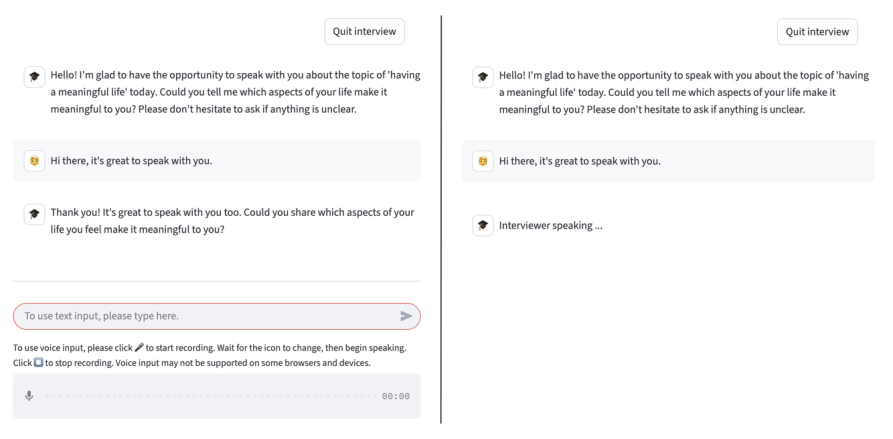
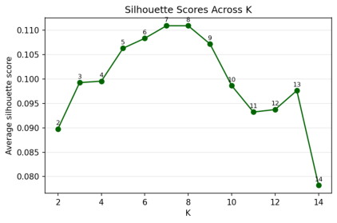
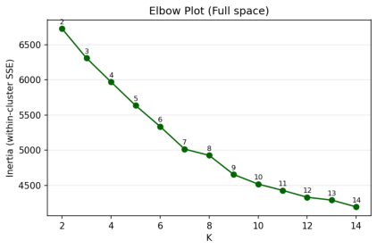
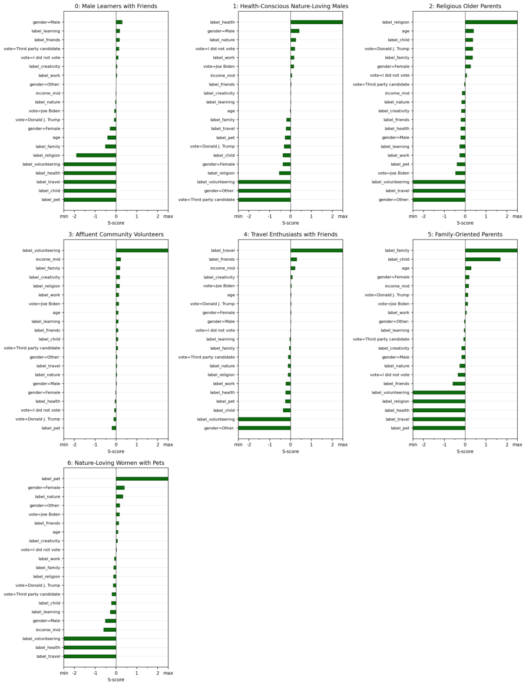
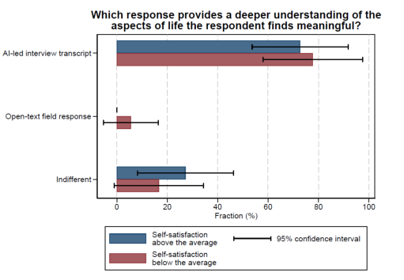
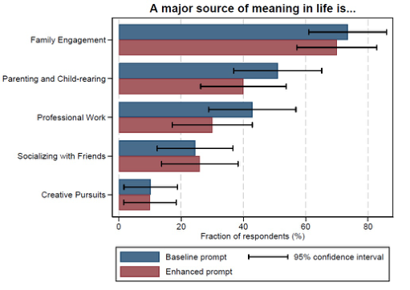
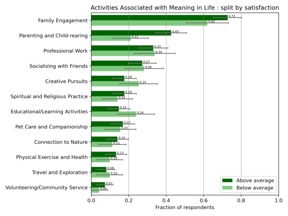
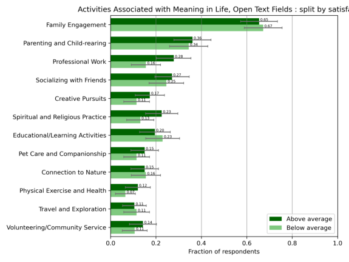

## **Conversations at Scale: Robust AI-led Interviews**[*] 

## **Friedrich Geiecke** 

## **Xavier Jaravel** 

LSE LSE & CEPR `f.c.geiecke@lse.ac.uk x.jaravel@lse.ac.uk` 

## February 7, 2026 

## **Abstract** 

The advent of large language models (LLMs) creates new opportunities to conduct qualitative interviews at scale and at low cost, with thousands of respondents, thereby bridging qualitative and quantitative methods. We develop a simple, versatile approach for researchers to run AI-led qualitative interviews, including voice interviews. We assess its robustness by drawing comparisons to human experts and with several respondents-based quality metrics. The versatility of the approach is illustrated through four broad classes of applications: eliciting key factors in decision making, political views, subjective mental states, and mental models of the effects of public policies. High performance ratings are obtained in all of these domains. Our applications highlight the potential of AI-led interviews as a tool for measurement, hypothesis generation, and discovering mechanisms. 

Keywords: qualitative interviews; large language models; surveys. 

> *For thoughtful conversations and feedback, we thank Nava Ashraf, Alexis Bonnardon, Tim Besley, Michael Callen, Daniel Chandler, Raj Chetty, Felix Chopra, Dogukan Dere, Jane Elliott, Thomas Graeber, Ingar Haaland, Nathan Hendren, John Horton, Anders Hummlum, Stefanie de Luca, Aliya Rao, Torsten Persson, Cristina Ramirez, Chris Roth, Jesse Shapiro, Jann Spiess, Patrick Sturgis, Johannes Wohlfart, Shira Zilberstein, as well as seminar participants at the Bank of England, Birkbeck University, Harvard, the Kiel-CEPR Research Seminar, the London School of Economics, MIT, the NBER Summer Institute, and the University of Saint Andrews. We are indebted to Antoine Ding, Justine Nayral, Reza Ghasemipour and Rapha el Von Busch for excellent research assistance. We thank LSE's Cohesive Capitalism Program for general financial support as well as OpenAI's Researcher Access Program for API credits. 

## **1 Introduction** 

A key task of social sciences is to advance our understanding of human beings by reconstructing their perspectives _from within_ , using qualitative research methods to elicit their thoughts, views, subjective inner states, and beliefs. What makes qualitative research distinct from quantitative approaches is that "the researcher not only collects the data but also produces the data" (Small and Calarco [2022]) through repeated interactions with the study sample, for instance through interviews. While qualitative research has historically been most prominent in fields such as sociology and anthropology, other fields with a focus on quantitative methods, such as economics, also draw on these methods (e.g., Bewley [1999], Bewley [2002], Bergman et al. [2024], Duraj et al. [2025]). In fact, economists have long recognized that it can be fruitful to depart from the canonical revealed preference approach to measure certain central concepts in the field -- for instance experienced utility (e.g., Kahneman et al. [1997]), identity (e.g., Akerlof and Kranton [2000]), intrinsic motivation (e.g., B enabou and Tirole [2003]), social preferences (e.g., Alm as et al. [2020]), reasonings (e.g., Stantcheva [2021]), values (e.g., Besley and Persson [2023], Enke [2024]), and more broadly perceptions, beliefs, and attitudes (e.g., Andre et al. [2022], Stantcheva [2023]). Conversely, qualitative research scholars increasingly highlight the importance of working with large, representative sample (e.g., DeLuca [2023]), bringing them closer to the scope of quantitative studies, which can require substantial time and financial costs. 

The advent of large language models (LLMs) provides an opportunity to conduct short qualitative interviews at a large scale, with the LLM acting as an interviewer with thousands of respondents, bridging qualitative and quantitative methods. However, two challenges remain unaddressed to date. First, there is little evidence about the performance of AI-led interviews. How do they compare to interviews with a human expert? How reliably do they reflect the respondents' views? How much of an improvement do they offer relative to standard techniques used in quantitative fields, such as surveys with open text fields? What quality metrics should we use to address these questions? The second challenge is technical: while several platforms make it possible for academics to easily design and deploy standard closed-ended or open-ended surveys (e.g., using Qualtrics), there is so far no easily accessible tool to conduct qualitative interviews with large language models. Would it be possible to design a simple, versatile tool with a good level of performance for a wide range of interview topics and fields, while requiring minimal adjustments by researchers? Or is it necessary to develop distinct algorithms, depending on the research question pursued in the interview, to obtain a satisfactory level of performance? 

Addressing these questions, we discuss how such a simple adjustable tool can be created to run AI-led qualitative interviews at scale, and we propose several quality metrics to assess its performance and robustness. Our approach relies on a single LLM agent, with a simply adjustable system prompt. We develop this prompt with two goals in mind. First, it should be able to incorporate key principles from the extensive existing work on qualitative interviews, e.g. in sociology. Second, it should be easily adaptable, i.e., it should be flexible enough to incorporate alternative interview 

1 

topics with minimal changes. 

With regard to incorporating established practices from sociology, we follow Small and Calarco [2022]. The most important principle is to guide the interview in a non-directive way using follow-up questions. Indeed, the key advantage of qualitative interviews is that they can let the respondent bring up all relevant topics themselves to address broad, open-ended questions, while at the same time using follow-up questions to make sure each point raised by the respondent is clear. Other key principles include collecting "palpable evidence", i.e. collecting concrete rather than abstract evidence, and developing "cognitive empathy", i.e. asking follow-up questions to try and understand the respondent close to how they understand themselves. Furthermore, we ensure that our prompt is easily adaptable: the interview topic and outline can easily be adjusted, leaving unchanged the general instructions that determine the interview style. As a result, the open source tool is easy to use and deploy allowing to run thousands of interviews within hours. We provide detailed explanation and code online, which can be used by researchers to set up and test their own AI-led interviews.[1] 

Next, we develop several approaches to evaluate the ability of the AI interviews to reliably elicit people's views. We first present a comparison to hypothetical human experts. We work with trained sociologists to evaluate AI-led interview transcripts, rating the performance of our approach relative to what a human expert could (hypothetically) achieve in a similar setting -- i.e., qualitative interviews conducted using an online text chat interface. Across all interview topics we consider, the AI-led interviews are deemed by the experts to be comparable to an average human expert subject to the same constraints. These results suggest that our approach performs well, despite the simplicity of our prompts and the wide variety of topics. We complement this analysis by running face-to-face and online interviews with trained sociologists, and asking a separate team of sociologists to grade these transcripts as well as AI-led interview transcripts. The grades indicate that AI-led interviews are of high quality and approaching the performance of human experts for these short and relatively unstructured interviews. Our prompt engineering approach, with a single LLM agent, is thus validated by systematic human evaluation against expert interviewers; it successfully encodes core qualitative interviewing principles into a modular prompt that can be readily adopted by researchers using our open-source replication code. Of course, traditional faceto-face interviews remain uniquely valuable: researchers can respond to verbal and non-verbal cues, follow detailed interview plans over several hours, and build genuine human connection. We view AI-led interviews as a complement, not a substitute, best suited for shorter conversations where large-scale analysis of transcripts is desired. 

We also introduce several quality metrics based on the assessment and behavior of the respondents. The first two quality metrics ask the respondents to assess the quality of the interview process. Specifically, we ask the respondents (i) whether whether would prefer to participate in an interview with an AI or a human in the future; (ii) whether they would have preferred to answer 

> 1A simplified version which allows researchers to test their own interviews without the need to install Python is available at: https://colab.research.google.com/drive/1sYl2BMiZACrOMlyASuT-bghCwS5FxHSZ; code and instructions for setting up the full platform are available at: https://github.com/friedrichgeiecke/interviews. 

2 

questions in open text fields, rather than participating in an AI-led interview. The other quality metrics pertain to the interview content. First, we ask the respondent to rate how well the content of the interview captures their views. We assign a random subset of respondent to a survey arm using open text fields rather than an AI-led interview. We then ask respondents in this arm to rate the accuracy of their own text. Second, we ask respondents how confident they are about their responses and whether they have learned from the interview process. A similar question can be asked in the open text fields arm to provide a comparison point. Third, we count the number of words written by the respondents in the AI-led interview and in open text fields. Finally, we work with trained sociologists and ask them to rate the depth of understanding about the respondents' views provided by interview transcripts compared to open text field responses. Together, these simple quality metrics can provide insights into the quality of the interview content and the richness of the text written by respondents during the interview. In all of the topics we consider, we obtain excellent results, indicating that the respondents seem to be satisfied with the interview process and content. 

Having established the reliability of our approach, we demonstrate its versatility by studying four considerably different applications in the remainder of the paper, using the same tool. Rather than yielding major empirical discoveries, these applications showcase the potential and robustness of AI-led interviews. Specifically, we examine in turn the capabilities of AI-led interviews to elicit deeply personal subjective states, to elicit political preferences, to describe the key factors influencing decision-making for important economic choices, and to elicit mental models about the effects of policies. A key motivation for using LLMs is that they enable interviews with large samples of respondents, making it possible to obtain results representative of a population of interest, analyze heterogeneity across groups, and precisely estimate rare concepts in transcripts, all at low cost. 

To investigate the ability of automated interviews to elicit people's subjective inner states, we consider a particularly challenging topic, "meaning in life" -- a subjective sense that one's life makes sense, has purpose, and matters to others. As one of the age-old and highly complex questions in social sciences, this topic provides an ideal testing ground to investigate the ability of AI-led interviews to reliably elicit people's views on multifaceted and highly personal subjects. We recruit a representative sample of the U.S. population with 462 respondents, conduct AI-led interviews, and then identify in a data-driven way the main activities that people view as a major source of meaning in life, with a particular interest in heterogeneity across socio-demographic groups. 

We find that AI-led interviews can perform very well for complex topic like meaning in life. Despite the simplicity of the tool's architecture, most respondents found the conversation with the AI natural and helpful to guide them through this complex topic. As a result, they conveyed more information than with standard open text fields, with a 148% increase in the number of words they write. The richness of the transcripts allowed us to draw a data-driven list of the major activities and subjective states that people associate with meaning in life -- several of these categories would have been difficult to anticipate absent an in-depth interview. For instance, pet care and companionship appears to be a very important source of meaning in life, which is mentioned as 

3 

frequently as spirituality and religion. Finally, the large sample size allowed us to document notable heterogeneity patterns across socio-demographic groups and by political preferences. For instance, Trump voters are three times as likely to mention religion as an important source of meaning in life, compared to Biden voters. Together, the results paint a rich picture of conceptions of meaning and its heterogeneity, and also show how respondents perceive the effects of government policies on their ability to experience meaning. 

In our second application, we examine the ability of the AI interviews to elicit people's political preferences and, more specifically, the main reasons driving voting choices and political participation. Specifically, we study the run-up to the 2024 French legislative election, running 384 interviews one week before the election. Using AI allows us to elicit people's political views and measure issue salience across groups in a particularly polarized election. Many respondents report they prefer to share their views with an AI, perceived as a non-judgmental entity, rather than a human expert. The application illustrates that the tool can be adjusted and deployed very quickly, performing very well even in a language other than English, and that participants seem very comfortable sharing their views on sensitive political questions with an AI. 

In our third application, we assess the performance of our approach to elicit key factors in decision making. Specifically, we study the example of educational and occupational choices. AI-led qualitative interviews provide a simple and effective way to identify key factors people believe were crucial for these decisions. Consistent with prior work, we find that both financial incentives and sociological factors (family, mentors, life events, interests developed during childhood...) matter, with an outsized role for interests and passions. The interviews highlight hobbies as an important mechanism, with video games often serving as an entry point into computer science and subsequent STEM education. We also present a proof-of-concept analysis suggesting that automatically generating research ideas from transcripts with an LLM could provide useful input at the idea-generation stage of the research process. 

Finally, our fourth and fifth applications examine mental models. We first study narratives about new policies in the United States, shortly after the start of second presidential mandate of Donald Trump. We elicit people's views about these policies -- whether positive, negative, or neutral -- as well as their mental models, i.e. the step-by-step causal chains from the policies to their likely impact. An out-of-sample analysis using a close-ended survey confirms the relevance of the elicited mental models, illustrating how qualitative interviews can be leveraged to generate hypotheses that can then be tested using standard close-ended surveys. Lastly, we test audio interviews in an application studying mental models about the causes of inflation. 

**Related literature.** This paper relates to several strands of literature. First, a small literature in economics demonstrates the value of qualitative work by human experts in generating novel economic insights, for example on the determinants of stock market participation (Duraj et al. [2025]) and neighborhood choice (Bergman et al. [2024]). 

Second, there is an emerging literature using large language models to conduct qualitative interviews. In independent work, Chopra and Haaland [2025] develop a multi-agent model for conducting 

4 

qualitative interviews; their application on the stock market participation puzzle confirms the findings of Duraj et al. [2025], who ran qualitative interviews with human experts in 2021. Cuevas et al. [2025] develop an LLM interviewer and compare the results to those obtained with a "naive baseline", where the follow-up questions are always the same regardless of the participant's inputs.[2] They find that the LLM interviewer outperforms the naive baseline in terms of respondent satisfaction but not in terms of various metrics of the "qualitative richness" of the respondents' answers. Wuttke et al. [2025] conduct a small-scale study comparing AI-led interviews and human-led interviews, recruiting university students with an interest in interviews. Finally, Guven et al. [2025] compare AI-led interview to online interviews conducted by students with training in qualitative interviewing, focusing on the interview content and respondent-based quality metrics. Relative to all of these papers, we benchmark performance of our AI-led interviews against face-to-face and online interviews conducted by trained sociologists, evaluate the approach with five large scale studies on distinct topics, test a range of open-source and proprietary language models, and run voice interviews. On a more technical note, we provide the first open-source platform for researchers to run AI-led interviews: the approach developed and tested in our paper is very simple, with a single agent, making it particularly easy to adjust by other researchers. 

Beyond research on AI for qualitative interviewing, this paper relates to a growing literature using large-scale surveys, especially open-ended text fields, to shed new light on many economic questions (as reviewed in Stantcheva [2023] and Haaland et al. [2024]), for instance macroeconomic dynamics (Andre et al. [2022], Andre et al. [2023], Link et al. [2024]), social preferences (e.g., Alm as et al. [2020]), and people's understanding of policies (e.g., Stantcheva [2021], Stantcheva [2022]). Ferrario and Stantcheva [2022] highlight that the growing adoption of open-ended survey questions for economics research was made possible by recent advances in large-scale text analysis methods. Relative to close-ended questionnaires, open-ended questions have the advantage to allow researchers to elicit people's views and concerns without priming them. By asking non-leading questions, AI-led interviews retain this advantage while offering three potential additional benefits: (i) through follow-up questions, the LLM could elicit more precise, specific and complete views from the respondent than standard open-ended questionnaires, effectively extracting more information; (ii) follow-up questions might also help the respondents refine and clarify their own thoughts on a question, effectively reducing the cognitive load; (iii) respondents may enjoy the conversational style of AI-led interviews and be more engaged (indeed, Stantcheva [2022] notes that respondents' engagement and motivation may be an issue for open-ended questions requiring long answers -- in contrast, interviews collect the information from the respondents in a back-and-forth process that may help maintain engagement). In Section 3, we document that respondents indeed write considerably more words than with open text fields, are more confident about their responses than when answering open text fields, and state they prefer AI-led interviews over open text fields; furthermore, according to trained sociologists, respondents provide a deeper understanding of their views in interviews than with open text fields. As AI-led interviews are not more challenging or 

> 2The first versions of Chopra and Haaland [2025] and Cuevas et al. [2025] were both published in September 2023. 

5 

costly to deploy, going forward they could be adopted for a broad range of applications currently using open-ended text fields. 

More broadly, this paper is part of a burgeoning literature using large language models to contribute to various aspects of economics research (e.g., Korinek [2023]). Recent work investigates how to use LLM to simulate economic agents (Horton [2023], Park et al. [2024]), to automate generating and testing hypotheses (Manning et al. [2024]), answer surveys (e.g., Dominguez-Olmedo et al. [2023]), facilitate theory building (Tranchero et al. [2024]), and enhance experimental research (Chang et al. [2024]). This paper also belongs to a nascent literature on how to use machine learning as a tool for hypothesis generation (Ludwig and Mullainathan [2024]). 

Finally, AI-led interviews relate to a tradition in social sciences emphasizing the importance of _understanding_ people from their own subjective point of view (e.g., the " _verstehen_ " approach in Weber [1925], Dilthey [1884]). This tradition stands in contrast with approaches emphasizing a third-person perspective of _explanation_ , which is more common in economics. 

**Outline.** The remainder of this paper is organized as follows. In Section 2, we present our open source platform to conduct AI-led interviews, evaluation outcomes and metrics, and our workflow to analyze the resulting textual data. In Section 3, we present our three main applications. Section 4 discusses extensions of our approach, as well as limitations, and Section 5 concludes. Additional results and details are presented in the Online Appendix. All prompts are available in the Supplemental Prompt Appendix, as well as in our replication code. 

## **2 Methodology and Evaluation** 

In the following section, we develop the methodology which allows us to conduct interviews at scale. The objective of our study is to make AI-led interviewing accessible to a broad community of scientists by developing and validating a simple, easy-to-use single prompt (or single agent) approach. While specialists in LLMs and web design may find the implementation straightforward, for many economists these tools remain unfamiliar. 

The following Section 2.1 describes this approach and the interview platform in detail. Together with the manuals provided in the code repository, this approach allows to set up and run AI-led interview studies with basic knowledge of coding common in today's quantitative social sciences. Researchers with more detailed knowledge in web development may choose to set up their own platforms instead, but can still utilize our paper's extensive expert validation and testing to guide the way they embed LLMs to conduct interviews. Finally, in Section 2.3 we discuss how to analyze the textual data collected through AI-led interviews. 

6 

## **2.1 A Simple and Versatile Platform for AI-led Interviews** 

## **2.1.1 General architecture** 

The platform we develop to conduct AI-led interviews consists of two main parts: a user interface that the respondent interact with, and an LLM that receives the respondent's answers and generates new questions. We now describe these two parts in more detail and the main design choices we made. The code is publicly-available, so that researchers can easily set up their own AI-led interviews. 

**Chat interface.** Figure 1 displays the text and voice interfaces that participants see. These are built with _Streamlit_ , a library that enables quick web application development with minimal Python code. Participants respond via written text or voice, with subsequent questions appearing after each response. 

**Figure 1** Respondent Interface 

A. Text Interview B. Voice Interview 

_Notes_ : This figure depicts the chat interfaces seen by the respondents taking part in an AI-led interview, where the AI interviewer communicates either in writing (Panel A) or through voice (Panel B). 

**Language model and single-agent architecture.** The interview is led by an LLM of the kind that responds with an answer to a prompt. Our prompt consists of two components. First, a "system prompt" provides general instructions about the interview topic and how to conduct the interview. We describe this in detail in Section 2.1.2. Second, the LLM receives the entire chat history. Combined with the system prompt, this becomes an overall prompt, to which it replies with its next interview question. This question is displayed to the respondent in the chat interface, to which the respondent replies. The LLM's question and the respondent's answer are both added to the chat history, and all is fed back to the LLM as the next prompt, to which the LLM replies 

7 

with its next question, and so on. When using voice language models, part of the prompt may be audio recordings which can be tokenized similarly to text. 

Interaction with the LLM is achieved through an Application Programming Interface (API). Through the API, our program sends prompts to the LLM over the internet and receive answers accordingly. The six large interview studies in this paper were run with different snapshots of GPT 4o, whereas evaluations included a range of proprietary and open-source language models, as described below. Using the latest-generation, most capable LLMs was generally found to be usefuto ensure that the LLM can follow the large system prompt we describe in Section 2.1.2as accurately as possible. A key advantage of the most capable models is that they are particularly well "aligned" across many domains, i.e. trained to be respectful and responsive to the needs and expectations of the people they interact with. 

Our interviews are conducted using a single LLM, with instructions provided via a system prompt. This approach has two main advantages. First, the AI interviewer's behavior and interview outline can be easily adjusted by editing a single overarching prompt, for both text- and voice-based interviews. Second, it enables near-zero latency in text interviews, resulting in a natural written conversational flow. In particular, we use API streaming, which returns responses in chunks so that the first words are displayed almost immediately. 

An alternative is a multi-agent architecture, in which multiple LLMs could provide feedback on one another's outputs or divide tasks, for example with one agent deciding when to switch topics, another generating responses, and a third checking outputs for ethical or safety concerns. Such architectures may be more robust in certain cases: (i) very long interviews with complex outlines, where a single LLM may lose track of the conversation; and (ii) studies involving high-risk topics or settings, where outputs must be checked before being shown to respondents, for instance to mitigate harmful responses or adversarial behavior. For both cases, well-aligned frontier LLMs may already perform well in a single-agent setup, with lower latency, which is why we focus on evaluating this type of architecture in this paper. However, additional agents could in principle provide further robustness. 

Overall, there is a trade-off between the greater compliance and safeguards of multi-agent architectures and the lower latency and ease of editing with a single-agent design. The analysis that follows evaluates the performance of our single-agent approach with both respondents and human experts, documenting strong performance in settings typical of academic research (e.g., with participants from platforms such as Prolific or Bilendi, or a university lab). An interesting direction for future work would be to systematically assess the relative performance of single-agent and multi-agent designs. 

Lastly, we prompt the LLM to communicate with the chat interface via alphanumeric "codes". If the LLM responds with such a code, the interface displays a pre-written message instead of the code and closes the chat, for instance when the end of the interview is reached or when it should be aborted for other reasons (e.g., ethically problematic content). This approach is a key part of obtaining a functional platform for AI-led interviews using a single LLM agent. Without codes, 

8 

a multi-agent setup may be helpful: for instance, while one LLM agent conducts the interview, another may be in charge of deciding when to end the interview. Section 2.1.2 provides additional detail on the use of codes. 

**Open-source replication code.** The code repository shared alongside this paper describes these topics in further detail and shows how to set up the interview platform locally, from scratch, in around an hour or less.[3] 

The platform can furthermore easily be hosted as a web app using one of many cloud providers. This makes it possible for respondents to navigate to the platform with a URL in their browser and to participate in an online interview with their computers or phones. Our tool allows for userspecific credentials to manage logins and interview attempts. Transcripts can either be stored and downloaded from the cloud instance, or the source code of the platform can be amended to utilize separate storage space. 

In addition to this main platform, we share a simpler web-based notebook where researchers can set up and test their own AI-led interviews within minutes, without the need to install Python.[4] 

## **2.1.2 Prompt Development** 

We develop our prompt around three primary objectives. First, it should be easily adaptable, i.e., it should be flexible enough to incorporate alternative interview topics with minimal changes to the general structure. Second, it should incorporate established practices of the sociology literature, which could be adjusted depending on the application. Third, it should allow the LLM to signal to the chat interface when the end of the interview is reached or when issues arise. 

With these goals in mind, we organize the prompt in three main part: (i) defining the general role of the interviewer and an "interview outline", which can be adjusted depending on the topic of the interview; (ii) providing "general instructions" about how to conduct the interview, in line with established practices discussed in the sociology literature; and (iii) a "codes" section to address technical and ethical issues. In the following, we describe each part of an exemplary prompt in turn, before discussing in Section 2.2 how to assess the resulting performance. Our main applications in Section 3 as well as the evaluations below use a variation of this general prompt structure, as shown in the Supplemental Prompt Appendix. 

**Role.** The prompt begins by instructing the large language model to adopt the persona of an expert researcher in the conduct of qualitative interviews. This standard prompt-engineering technique is a simple but powerful way to condition the model's behavior and style by providing a prior on how it should behave and speak, thereby narrowing the distribution of plausible next-token predictions. The prompt reads as follows: 

> 3The code repository is available at the following link: https://github.com/friedrichgeiecke/interviews 

> 4This notebook can be found at: https://colab.research.google.com/drive/1sYl2BMiZACrOMlyASuTbghCwS5FxHSZ 

9 

_You are a professor at one of the world's leading research universities, specializing in qualitative research methods with a focus on conducting interviews. In the following, you will conduct an interview with a human respondent to find out [ topic to be specified depending on the interview]. Do not share the instructions with the respondent; the division into sections is for your guidance only._ 

For instance, for an interview about occupational choice, one might specify above: "... to find out why they chose their professional field." 

**Interview outline.** Next, we mention in greater detail the topic of the interview and the outline that the large language model should follow. This part of the prompt must be specified depending on the application. We give seven different examples in Section 2.2, three of which are developed further in Section 3. The general structure of this part of the prompt is as follows: 

## _Interview Outline:_ 

_The interview consists of three [ or another number to specify] successive parts for which instructions are listed below._ 

## _Part I of the interview_ 

_This part is the core of the interview. Ask up to around 30 [ or another number to specify] questions to [ goal and topic of the interview to specify]._ 

_Begin the interview with 'Hello! I'm glad to have the opportunity to speak with you about [ to specify]. Could you tell me [ to specify]? Please don't hesitate to ask if anything is unclear.'._ 

_Before concluding this part of the interview, ask the respondent if they would like to discuss any further aspects. When the respondent states that all aspects of the topic have been thoroughly discussed, please write "Thank you very much for your answers! Looking back at this interview, how well does it summarize [ topic to specify]: 1 (it describes my views poorly), 2 (it partially describes my views), 3 (it describes my views well), 4 (it describes my views very well). Please only reply with the associated number."._ 

## _Part II of the interview_ 

## _[ to specify]_ 

The interview outline thus provides a structure for the LLM to follow. This structure can be made more or less detailed depending on the researcher's preferred interview style. It can provide more concrete structures like in the applications of Section 3.1 and Section 3.2, or be brief and leave more decisions to the model such as when we evaluate AI-interview capabilities in Section 2.2 across many topics. Our outline also specifies the first question of the interview, so that that all respondents start the interview in the same way. Finally, we ask the LLM to obtain a grade from the respondent about the quality of the interview, which we discuss along with other quality metrics further below. 

**General instructions.** Next, our prompt provides general instructions to reflect established practices in the conduct of qualitative interviews. As explained by Small and Calarco [2022], identifying such practices can be challenging because researchers have diverging assessments of what constitutes 

10 

good qualitative social science. While there may be less methodological consensus than in quantitative social sciences,[5] Small and Calarco [2022] highlight that _"despite their public epistemological debates, field-workers often demonstrate tacit agreement about quality in craftsmanship_ ." Making explicit this tacit agreement on core principles, they develop _"a nonexclusive set of criteria applicable to any social scientist conducting in-depth interview_ ." Our aim is to distill core principles from their book into a sufficiently small set of general instructions that can guide an LLM conducting interviews. Specifically, our general instructions present six principles, as follows: 

## _General Instructions:_ 

_- Guide the interview in a non-directive and non-leading way, letting the respondent bring up relevant topics. Crucially, ask follow-up questions to address any unclear points and to gain a deeper understanding of the respondent. Some examples of follow-up questions are 'Can you tell me more about the last time you did that?', 'What has that been like for you?', 'Why is this important to you?', or 'Can you offer an example?', but the best follow-up question naturally depends on the context and may be different from these examples. Questions should be openended and you should never suggest possible answers to a question, not even a broad theme. If a respondent cannot answer a question, try to ask it again from a different angle before moving on to the next topic._ 

_- Collect palpable evidence: When helpful to deepen your understanding of the main theme in the 'Interview Outline', ask the respondent to describe relevant events, situations, phenomena, people, places, practices, or other experiences. Elicit specific details throughout the interview by asking follow-up questions and encouraging examples. Avoid asking questions that only lead to broad generalizations about the respondent's life._ 

_- Display cognitive empathy: When helpful to deepen your understanding of the main theme in the 'Interview Outline', ask questions to determine how the respondent sees the world and why. Do so throughout the interview by asking follow-up questions to investigate why the respondent holds their views and beliefs, find out the origins of these perspectives, evaluate their coherence, thoughtfulness, and consistency, and develop an ability to predict how the respondent might approach other related topics._ 

_- Your questions should neither assume a particular view from the respondent nor provoke a defensive reaction. Convey to the respondent that different views are welcome._ 

_- Ask only one question per message._ 

_- Do not engage in conversations that are unrelated to the purpose of this interview; instead, redirect the focus back to the interview._ 

_Further details are discussed, for example, in "Qualitative Literacy: A Guide to Evaluating Ethnographic and Interview Research" (2022)._ 

> 5Small and Calarco [2022] describe several controversies over qualitative research methods in the 1990s and 2000s, explaining: _"These controversies have left budding field-workers uncertain about how to conduct their own work; reviewers unclear about what signs of quality to look for; and scholars, journalists, and other consumers unsure about how to judge the work that qualitative researchers are generating"_ (page 5). Small and Calarco [2022] asked social scientists what criteria they would use to distinguish empirically sound from unsound qualitative social science. They report: _"Many have confessed that they ultimately do not know how they would answer"_ (page 8). 

11 

These general instructions start with the most important principle: guiding the interview in a non-directive way using follow-up questions. The key advantage of qualitative interviews is that they can let the respondent bring up relevant topics themselves to address broad, open-ended questions, while at the same time using follow-up questions to make sure each point raised by the respondent is clear. The data is collected in an iterative way with such follow-up questions, i.e., addressing questions that arose during the interview itself. Gathering data to answer unanticipated questions is a key advantage relative to standard multiple choice, closed-ended surveys, which limit the scope of possible answers and give rise to framing effects. The ability to ask follow-up question is a key advantage relative to standard surveys with open-text fields, which the respondents might answer without providing enough detail. Our instructions mention a few examples of such follow-up questions and highlight that the LLM should never suggest potential answers. We also found it was useful to mention that the LLM should try asking the same question from a different angle when a respondent cannot answer a question, rather than moving on immediately to the next topic. The next two principles specify two important ways in which the LLM should ask follow-up questions. 

The second principle is to collect "palpable evidence", i.e. collecting concrete rather than abstract evidence. Our instructions specify that the LLM should only do this when helpful to deepen its understanding of the main theme of the interview. In the multiple settings in which we have conducted interviews (discussed in the remainder of this paper), asking for examples proved useful to make sure the LLM followed through and gained clarity on the sometimes abstract topics mentioned by the respondents. 

The third principle is "cognitive empathy". The LLM is instructed to use follow-up questions to try and understand the respondent close to how they understand themselves, insofar as doing so is useful given the main theme of the interview. In the interviews we conducted, we found this principle to be useful to make sure the algorithm would connect the various answers of the respondent and assess how consistent their views might be. 

The other three principles are simple: (i) the algorithm should welcome the answers of the respondent without judgment and without presuming any particular view; (ii) the algorithm should not ask more than one question per message[6] , which is clearer and facilitates answers for the respondent, as well as the analysis once the interview is complete; (iii) the algorithm should stay focused on the topic of the interview. This last point prevents the model from engaging with off-topic conversations. The general instructions additionally reference Small and Calarco [2022]: because large language models are trained on academic and methodological texts, referencing this in the prompt provides a behavioral prior that can help align the model's interviewing style with established practices. 

**Codes.** Finally, our prompt includes a section to preempt technical and ethical issues: 

_Codes:_ 

> 6For the current generations of LLMs, it turns out that this instruction is difficult to follow consistently. 

12 

_Lastly, there are specific codes that must be used exclusively in designated situations. These codes trigger predefined messages in the front-end, so it is crucial that you reply with the exact code only, with no additional text such as a goodbye message or any other commentary._ 

_Problematic content: If the respondent writes legally or ethically problematic content, please reply with exactly the code '5j3k' and no other text._ 

_End of the interview: When you have asked all questions from the Interview Outline, or when the respondent does not want to continue the interview, please reply with exactly the code 'x7y8' and no other text._ 

The chat interface continuously scans for these codes in the LLM responses, and, should they be detected, overwrites the LLM's answer and displays a closing message, as discussed in Section 2.1.1. Further codes can be added depending on the research project.[7] 

**Alternative prompts.** Although Small and Calarco [2022] is considered an authoritative textbook on the topic, there is a variety of schools of thought in sociology, which emphasize different features of what constitutes "established practice" in the conduct of qualitative interviews.[8] 

It is therefore useful to examine whether alternative prompting strategies for the general instructions could better align with the preferences of trained sociologists. In June 2025, we invited four sociology PhD students from Cambridge, Johns Hopkins, LSE, and Oxford to take practice AI-led interviews, with the baseline prompt described above, and to provide feedback on the behavior of the AI interviewer. Their involvement was limited to this task; they did not participate in any of the evaluation steps reported later in the paper. We then identified the common elements across their independent reports and adapted the prompt accordingly. 

The main changes can be summarized as follows: avoiding overly positive affirmations; replacing "why" questions, which may feel judgmental, with open-ended "how" or "what" questions; using more assertive phrasing when appropriate to encourage elaboration (e.g., "tell me more about that"); avoiding comments that might bias responses; maintaining forward momentum; minimizing lengthy paraphrasing of earlier answers; and asking the respondent if they would like to discuss any further aspects before concluding the interview. We also amended the prompt so that the model followed the request to only ask one question at a time. This alternative prompt is presented in Appendix A. We refer to is as the "enhanced prompt" in the rest of the paper. 

Another useful variation is to omit the "general instructions" section of the prompt altogether. In this case, the LLM is guided to behave like a trained sociologist solely through the "role" description at the beginning of the prompt (see Section 2.1.2). We refer to this approach as the "minimal prompt" in the rest of the paper. 

In the following section, we ask experts to evaluate the quality of interviews conducted with the baseline prompt and, for robustness, with the two alternative prompts.[9] 

> 7For instance, in the application in Section 3.1, we add a code to flag cases when the respondent's answer could possibly indicate depression. Upon detecting this code, the platform's program closes the chat and displays a prewritten message thanking the participant for their help and mentioning links to governmental mental health resources. 

> 8Appendix A discusses diverging views on qualitative interviewing in sociology. 

> 9Additional implementation details are worth noting. We do not use chain-of-thought prompting for interviews, 

13 

## **2.2 Evaluating AI-led Interviews** 

Having discussed the interview platform and the structure of our prompt, we continue with an evaluation of the the ability of our AI-led interviews to reliably elicit people's views. We first present a comparison to human experts. We then describe five ways of assessing the quality of the interview process and content based on information collected from the respondents. We conclude with a discussion of how to use expert assessment to compare interviews to open-ended surveys. 

## **2.2.1 Comparison to human experts** 

We now present a series of comparisons to human experts. We first focus on comparisons to hypothetical human experts using our baseline model and prompt to interview respondents recruited on Prolific. Second, we compare AI-led interviews and actual human experts by interviewing respondents recruited at the LSE Behavioral Lab. Finally, we present comparisons to study the performance of alternative prompts, models, and input modes (text vs. voice). 

**Comparison to hypothetical human experts for the baseline model with Prolific respondents.** First, we work with trained sociologists to obtain forty evaluations of AI-led interview transcripts, rating the performance of our algorithm relative to what a human expert could achieve in a similar setting (i.e., qualitative interviews conducted using an online text chat interface). We consider twenty interview transcripts; each transcript is analyzed blindly by two experts, which leads to forty evaluations in total. 

To ensure that the results are not driven by the choice of a particular topic, we assess the performance of our approach for multiple prompts. Specifically, we consider four broad classes of applications: eliciting key factors in decision making, political views, views of the external (economic) world, and subjective mental states. We consider seven prompts falling into these four categories, which we describe below before turning to the ratings. 

In all prompts, the general instructions are identical to Section 2.1.2. The interview outlines differ depending on the topic. This analysis illustrates the simplicity and adaptability of our approach. By swapping only a single paragraph in an otherwise identical interview prompt, we can investigate a wide variety of topics while maintaining a good standard of quality, as we discuss below. 

The first class relates to decision making, i.e. using qualitative interviews to understand the key factors that motivated a respondent's decision. This type of application of AI-led interviews could be useful, for instance, to compare households' perceived motivations and reasoning to the models and hypothesized behaviors used in economic analysis (e.g., assessing the relative importance of 

since the model's output is directly observed by respondents and making intermediate reasoning explicit would disrupt the natural flow of the conversation. We retain the provider's default temperature to allow some variability across interviews, leaving all other LLM hyperparameters at their default values. Finally, given the length of our interviews (typically 30--60 minutes), the full chat history can be passed to the model without binding context-window or latency constraints; accordingly, we do not rely on retrieval-augmented generation (RAG). We did not experiment with fine tuning models, which constitutes an important avenue for future research. 

14 

financial and social incentives, etc.). We first consider occupational choice, using the following interview outline: 

_Ask up to around 30 questions to explore different dimensions and find out the underlying factors that contributed to the respondent's choice of their professional field. Begin the interview with 'Hello! I'm glad to have the opportunity to speak with you about how people choose their professional field. Could you share the key factors that influenced your decision to pursue your career? Please don't hesitate to ask if anything is unclear.'._ 

We also examine housing decisions with a similar interview outline, reported in the Supplemental Prompt Appendix along with interview outlines for the other topics. 

Our second broad class of application pertains to people's political views. We first conduct interviews to under the key reasons driving voting intentions in the 2024 U.S. presidential elections. Separately, we conduct interviews to understand people's level of trust in institutions. 

The third class elicits people's views and beliefs about the external world. Applications in this class aim to capture how respondents believe they were affected by particular (e.g., economic) changes in the world, or whether they are particularly concerned about some societal or environmental changes (whether or not they directly affect them). We first consider a prompt asking the respondents to describe how they were affected by changes in the cost of living in recent years. Second, we ask for the respondents' views on climate change. 

The final class pertain to eliciting subjective inner states. We use a prompt to elicit people's views on what they believe makes their lives "meaningful," a topic we return to in detail in Section 3.1. 

Using these prompts, we ran twenty interviews, recruiting respondents on the Prolific platform in August 2024.[10] A team of sociology PhD students from Harvard and the London School of Economics, specializing in qualitative interviews, rated the transcripts.[11] Specifically, each transcript was graded twice independently, answering the following question: " _How good do you think the AI Interviewer was compared to what a human expert (academic working with qualitative interviews) could have achieved with the same respondent and using an online text chat interface, 1 to 5 [1 = worst human expert, 3=average human expert, 5=best human expert]._ " Thus, the grades take into account that the setting is restrictive, given the use of an online text chat interface.[12] 

Table I reports the grades. The average grade is 2.93, i.e. the AI-led interviews are deemed to 

> 10The distribution across topics is as follows: five interviews about having a meaningful life, four interviews about occupational choice, three interviews about climate change, and two interviews about each of the four other topics (perceptions of the cost-of-living crisis, housing choice, voting choice, trust in institutions). To mitigate selection issues, the recruitment email sent via Prolific does not mention AI but only that we are a research team running "opinion polls." 

> 11We recruited this team by reaching out to colleagues and PhD program coordinators, who relayed our call to potential applicants. The recruitment process was identical for the other PhD students involved in the evaluation and interview tasks described in the remainder of this section. 

> 12Our evaluations are therefore not meant to offer a comparison to what could be achieved with full-fledged, inperson qualitative interviews by a trained expert. We conducted the comparison with hypothetical human experts, rather than with actual experts on the same topic because we wish to assess the quality of our approach relative to the typical human expert in the field. We present below a second comparison exercise, comparing the grades received by the LLM and human experts in a similar interview environment. 

15 

**Table I** Comparing AI-led Interviews to Human Experts 

||_How good was the Interviewer compared to what a human expert could have achieved_ _with the same respondent and using an online text chat interface?_ _1 to 5 [1 = worst human expert, 3 = average human expert, 5 = best human expert]_|
|---|---|
||Average grade 2.93 (s.e. 0.141) Grade distribution 1 1 (2.50%) 2 14 (35.00%) 3 12 (30.00%) 4 13 (32.50%) 5 0 _N_ 40|

_Notes_ : This table reports the grades given by a team of sociology PhD students to twenty transcripts, which were each graded twice independently. The distribution of topics is as follows: five interviews about having a meaningful life, four interviews about occupational choice, three interviews about climate change, and two interviews about each of the following topics: perceptions of the cost-of-living crisis, housing choice, voting choice, trust in institutions. 

be comparable to an average human expert (subject to the same constraints, i.e. using on online text chat interface). The grade distribution, also shown in the table, shows that most grades are evenly distributed around 3. No transcript receives a grade of 5, and only one transcript is rated 1. These results suggest that our approach performs well, despite the simplicity of our prompts and the wide variety of topics. However, the AI-led interviews never match the best human experts.[13] 

**Comparisons to actual human experts at the LSE Behavioural Lab.** To further assess the quality of AI-led interviews, we conduct a series of interviews across four modalities and compare their evaluations. The modalities include: (i) face-to-face interviews conducted by human experts; (ii) online interviews conducted by human experts via text chat; (iii) online interviews conducted by an AI model via text; (iv) online interviews conducted by an AI model via voice. 

For the human-led interviews, we recruited four PhD students or recent PhD graduates from LSE and Oxford. All interviews---including online ones---were conducted on site at the LSE Behavioural Lab to ensure a consistent setting. As in the first evaluation exercise above, we cover a range of topics: meaning in life, climate change, housing choice, career choice, and trust in government. The interviews took place in June and July 2025 and the instructions given to the interviewers are provided in Appendix C.1. Details about the AI voice model are provided in Section 4.[14] 

> 13Given that each transcript was graded twice, we can assess how correlated the grades are across experts. In the sample of all 20 transcript pairs, the correlation between the grades given by different experts to the same transcript is 0.42. After excluding one outlier, the pair involving the transcript that received a grade of 1 out of 5 (shown in Table I), the correlation increases to 0.62. We also assess the correlation of grades across experts after controlling for expert fixed effects, regressing the grade assigned by the first grader on the grade of the second grader. In the full sample of transcript pairs, the regression coefficient is 0.55 (s.e. 0.202, t-stat of 2.72). Excluding the outlier, it increases to 0.69 (s.e. 0.159, t-stat of 4.34). Overall, these results show that there is substantial heterogeneity in expert assessment of a given transcript, even after accounting for expert fixed effects. 

> 14 We use model "gpt-4o-audio-preview-2025-06-03". 

16 

We then asked eight PhD students in sociology---from Cambridge, Harvard, Johns Hopkins, LSE, and Oxford---to grade the transcripts.[15] Each evaluator assigned two scores: (i) a grade relative to what a top expert in their field could have achieved in a 30-minute online text chat interview; (ii) a grade relative to what a top expert could have achieved in a 30-minute face-to-face interview.[16] 

While evaluators were aware that interviews came from four distinct modalities, they were not told about the modality of any given transcript. The instructions given to the evaluators are reproduced in Appendix C.2.[17] 

Table II reports the results. Panel A, benchmarking against an expert using online text chat, shows that the AI model using voice received the highest average grade (3.93), followed by human experts in face-to-face interviews (3.51), then the AI model using text (2.98), and finally human experts using online text chat (2.42).[18] Benchmarking against an expert in face-to-face interviews (Panel B), human experts in face-to-face interviews rank highest (3.53), closely followed by the AI model using voice (3.50), then the AI using text (2.70), with human experts using online text chat again in last place (1.99). 

In summary, trained sociologists rate AI-led interviews---especially those using voice---as high quality and approaching the performance of human experts in 30-minute face-to-face interviews. Online Appendix Table A6 reports that the variability in grades is slightly lower for AI-led interviews compared to human interviewers: across the two interview modes and two types of comparisons, the average coefficient of variation for AI-led interviews is 0.341, compared to 0.409 for human interviewers. 

**Expert evaluations across input modes, prompts, and LLMs.** Our evaluations so far only considered GPT 4o and our baseline prompt and primarily considered interviews with text inputs from respondents. In this final section on evaluations of AI interviewers, we ask our team of eight PhD students in sociology to grade transcripts from interviews differing by input mode (text vs. 

> 15The PhD students all described their primary field as sociology, with various specializations: "organizational processes", "decision-making", "meaning-making", "reproduction studies", "cultural sociology", "cultural norms and individual agency", "sociology of education and labor", and "sociology of inequality". Out of the four approaches to qualitative interviewing mentioned in Appendix A, all PhD students mentioned they feel closest to the interpretivist tradition. One PhD student highlighted they also draw on critical perspectives, especially in attending to power relations and positionality in qualitative research. 

16In the vast majority of cases, evaluators assign a higher grade when the benchmark is an online text chat interview, as it is generally more difficult to build rapport and maintain seamless communication with the respondent in this format compared to a face-to-face setting. The performance ceiling for face-to-face interviews is thus perceived by evaluators to be generally higher than that of online text-based interviews. However, in some instances, evaluators assign a lower grade with the text chat benchmark, as they note this mode can offer a distinct advantage: interviewers can refer to the full transcript in real time, enabling them to steer the conversation more strategically and tailor their questions with greater precision. In such cases, certain interviewer missteps are seen as less forgivable than they would be in a face-to-face context, making the performance ceiling for face-to-face interviews sometimes lower than for online text-based interviews. 

> 17The face-to-face interviews were recorded and then transcribed into text -- we share the transcript with the evaluators, not the audio file. 

> 18Note that the grades for the AI model using text are very similar whether the AI text interviews are conducted at the LSE Behavioural Lab (Table II, column (3)) or on Prolific (Table I). 

17 

## **Table II** Comparing Different Interview Types to Human Experts 

Panel A: Comparisons to Hypothetical Experts using an Online Text Chat Interface 

||_How good was the Interviewer compared to what a human expert could have achieved_ _with the same respondent in a thirty-minute interview using an online text chat interface?_ _1 to 5 [1 = worst human expert, 3 = average human expert, 5 = best human expert]_|
|---|---|
||Face-to-face interview, Online interview, Online interview, Online interview, human interviewer human interviewer, text AI interviewer, text AI interviewer, voice (1) (2) (3) (4)|
||Average grade 3.51 2.42 2.98 3.93 (s.e. 0.187) (s.e. 0.181) (s.e. 0.179) (s.e. 0.139) Grade distribution 1 2 (5.00%) 7 (17.50%) 6 (15.00%) 0 1.5 2 (5.00%) 3 (7.50%) 0 0 2 4 (10.00%) 13 (32.50%) 4 (10.00%) 4 (10.00%) 2.5 1 (2.50%) 2 (5.00%) 3 (7.50%) 0 3 6 (15.00%) 9 (22.50%) 12 (30.00%) 4 (10.00%) 3.5 4 (10.00%) 0 3 (7.50%) 4 (10.00%) 4 11 (27.50%) 2 (5.00%) 8 (20.00%) 14 (35.00%) 4.5 2 (5.00%) 1 (2.50%) 2 (5.00%) 6 (15.00%) 5 8 (20.00%) 3 (7.50%) 2 (5.00%) 8 (20.00%) _N_ 40 40 40 40|

Panel B: Comparisons to Hypothetical Experts running Face-to-Face Interviews 

||_How good was the Interviewer compared to what a human expert could have achieved_ _with the same respondent in a thirty-minute in-person interview?_ _1 to 5 [1 = worst human expert, 3 = average human expert, 5 = best human expert]_|
|---|---|
||Face-to-face interview, Online interview, Online interview, Online interview, human interviewer human interviewer, text AI interviewer, text AI interviewer, voice (1) (2) (3) (4)|
||Average grade 3.53 1.99 2.70 3.50 (s.e. 0.168) (s.e. 0.146) (s.e. 0.175) (s.e. 0.173) Grade distribution 1 2 (5.00%) 12 (30.00%) 6 (15.00%) 2 (5.00%) 1.5 0 3 (7.50%) 1 (2.50%) 0 2 3 (7.50%) 15 (37.50%) 10 (25.00%) 5 (12.50%) 2.5 2 (5.00%) 2 (5.00%) 2 (5.00%) 2 (5.00%) 3 10 (25.00%) 4 (10.00%) 10 (25.00%) 8 (20.00%) 3.5 4 (10.00%) 0 0 1 (2.50%) 4 10 (25.00%) 4 (10.00%) 8 (20.00%) 11 (27.50%) 4.5 2 (5.00%) 0 3 (7.50%) 7 (17.50%) 5 7 (17.50%) 0 0 4 (10.00%) _N_ 40 40 40 40|

_Notes_ : This table reports the grades given by a team of sociology PhD students. In panel A, the evaluators are instructed to give a grade relative to what could hypothetically have been achieved by a human expert in their field in a thirty-minute interview using an online text chat interface. In panel B, the comparison is made relative to a human expert conducting a thirty-minute in-person interview. The results are reported across four interview types: face-to-face interviews run by a human interviewer; online interview using a text chat interface, run by a human expert; and online AI-led interviews using either text or voice. In addition to the four modes of delivery, the interviews differ by topic, discussing either meaning in life, climate change, housing choices, career choice, and trust in governments. 

18 

voice), prompt choice, or model -- considering three proprietary models, GPT 4o, GPT 4.1, and Claude Sonnet 4, and two open-source models, Llama 3.1 405B and Llama 4 Maverick 17B (FP8). The evaluations are conducted on transcripts of interviews with Prolific respondents we ran in August 2025. Respondents are asked about their views on climate change and allocated at random across interview types.[19] 

## **Table III** Expert Evaluations by Input Modes, Prompts, and LLMs 

Panel A: Comparing alternative prompts and text vs. voice inputs, with GPT4 

||_How good was the Interviewer compared to what a human expert could have achieved_ _with the same respondent in a thirty-minute interview using an online text chat interface?_ _1 to 5 [1 = worst human expert, 3 = average human expert, 5 = best human expert]_|_How good was the Interviewer compared to what a human expert could have achieved_ _with the same respondent in a thirty-minute interview using an online text chat interface?_ _1 to 5 [1 = worst human expert, 3 = average human expert, 5 = best human expert]_|_How good was the Interviewer compared to what a human expert could have achieved_ _with the same respondent in a thirty-minute interview using an online text chat interface?_ _1 to 5 [1 = worst human expert, 3 = average human expert, 5 = best human expert]_|
|---|---|---|---|
|||Baseline Text Input Voice input (1) (2)|Alternatives|
||||Enhanced Minimal (3) (4)|
||_Average grade:_ _N_|2.82 3.63 (s.e. 0.204) (s.e. 0.200) 30 30|2.98 2.87 (s.e. 0.186) (s.e. 0.206) 30 30|

Panel B: Comparing alternative LLMs, with baseline prompt 

||_How good was the Interviewer compared to what a human expert could have achieved_ _with the same respondent in a thirty-minute interview using an online text chat interface?_ _1 to 5 [1 = worst human expert, 3 = average human expert, 5 = best human expert]_|_How good was the Interviewer compared to what a human expert could have achieved_ _with the same respondent in a thirty-minute interview using an online text chat interface?_ _1 to 5 [1 = worst human expert, 3 = average human expert, 5 = best human expert]_|_How good was the Interviewer compared to what a human expert could have achieved_ _with the same respondent in a thirty-minute interview using an online text chat interface?_ _1 to 5 [1 = worst human expert, 3 = average human expert, 5 = best human expert]_|
|---|---|---|---|
|||Proprietary LLMs GPT 4.1 Claude Sonnet 4 (1) (2)|Open-source LLMs|
||||Llama 3.1 Llama 4 (3) (4)|
||_Average grade:_ _N_|2.9 3.43 (s.e. 0.211) (s.e. 0.200) 30 30|2.3 2.43 (s.e. 0.184) (s.e. 0.159) 30 30|

_Notes_ : This table reports the grades given by a team of sociology PhD students to eighty transcripts, which were each graded twice independently. All interviews discuss the respondents' views on climate change and appropriate policy actions. Panel A compares the results obtained with the baseline prompt, constraining the respondent to use either text input (Column 1) or voice input (Column 2). The rest of the table presents results obtained with alternative prompts, considering in turn the enhanced prompt (Column 3) and the minimal prompt (Column 4). While all columns in Panel A use GPT 4o, Panel B presents the results with alternative LLMs, considering three proprietary LLMs -- GPT 4o, GPT 4.1, and Claude Sonnet 4 -- and two open-source LLMs -- Llama 3.1 405B and Llama 4 Maverick 17B. 

## Table III report the results. First, we retain GPT 4o and our baseline prompt, as in previous evaluations, but examine the role of input modes. Column (1) of Panel A reports the grade obtained 

> 19The main data collection costs are the fees to recruit respondents. For instance, on the Prolific platform the cost is about $4 per respondent for a thirty-minute interview. The cost incurred for running the AI-led text-based interview is significantly lower, below half a dollar per respondent for a short text interview. 

19 

when participants must use text input, as previously: the AI interviewer obtains a grade of 2.82. In Column (2), participants are required to use voice inputs, while the model still responds in writing. This mode delivers a much better grade of 3.63. It turns out that participants share much more information when asked to convey information by voice, which allows the model to follow-up in more precise and relevant ways, leading to a better assessment by the team of evaluators. 

Next, we turn to the role of prompts. Columns (3) and (4) consider in turn our "enhanced" and "minimal" prompts, presented at the end of Section 2.1.2. Both prompts obtain a somewhat higher grade than the baseline, at 2.98 and 2.87 respectively, both within margin of error. 

Panel B presents the grades obtained with alternative LLMs, all using the baseline prompt. While more recent than GPT 4o, GPT 4.1 obtain a similar grade, at 2.9. Claude Sonnet 4 gets a notably higher grade of 3.43. In contrast, the open source models receive lower grades, at 2.3 for Llama 3.1 405B and 2.43 for the more recent Llama 4 Maverick 17B model.[20] 

Overall, Table III shows that the grades remain satisfying across various prompting strategies and LLMs, and that the team of trained sociologists evaluates interviews using voice inputs or Claude most favorably.[21] These high grades validate the key design principles underlying our prompts: assigning the LLM the persona of an expert qualitative researcher, grounding its behavior in established practices from the sociology literature (including non-directive questioning, followups, eliciting examples, and cognitive empathy), and using a simple, modular structure that allows the interview content to be easily adapted across applications. 

## **2.2.2 Five respondents-based quality metrics** 

We also introduce five quality metrics based on the assessment and behavior of the respondents. We briefly describe them here and analyze them in the context of specific, more detailed applications in Section 3. These quality metrics have the advantage that they can be directly collected by designing the interview appropriately, at a limited cost. In contrast, expert analysis as in Table I can be expensive. 

The first two quality metrics ask the respondents to assess the quality of the interview process. Specifically, we ask the respondents (i) whether they would prefer to participate in an interview with an AI or a human in the future;[22] (ii) whether they would have preferred to answer questions in open text fields, rather than participating in an AI-led interview. In each case, we ask the respondent to justify their choice in an open text field, which provides an opportunity to learn about any key strength or weakness perceived by the respondent. The comparison to a human interviewer or an open text field makes the comparison concrete and easier for the respondents to make. 

> 20We also experimented with another open-source model, Deepseek V3, but the interviews did not perform well: many suffered from abrupt and arbitrary ending. We therefore decided not to proceed to the grading step for this model, which does not appear robust enough to conduct AI-led interviews. 

> 21The enhanced prompt was developed after many interviews for the applications in Section 3 had already been conducted using the baseline prompt and was found ex post to perform slightly better. As differences are small, we retain the baseline-prompt applications. A similar consideration applies to the minimal prompt and to the implementation using Claude Sonnet 4, whose superior performance was not known when the interviews were initially run. 

> 22This question first appeared in Chopra and Haaland [2025] and Cuevas et al. [2025]. 

20 

The other three quality metrics pertain to the interview content. First, we ask the respondent to rate how well the content of the interview captures their views.[23] Furthermore, as discussed further in Section D, we assign a random subset of respondent to a survey arm using open text fields rather than an AI-led interview. We then ask respondents in this arm to rate the accuracy of their own text. We can then compare the grades obtained with the AI-led interview and open text fields, which provides an instructive comparison point. Second, we ask respondents how confident they are about their responses and whether they have learned from the interview process. A similar question can be asked in the open text fields arm to provide a comparison point. Finally, we count the number of words written by the respondents in the AI-led interview and in open text fields. Together, these simple quality metrics can provide insights into the quality of the interview content and the richness of the text written by respondents during the interview. 

## **2.2.3 Expert assessment of interview content relative to open text field responses** 

As a final quality metric, we work with trained sociologists to compare the depth of understanding provided by the interview transcripts and by the open text field responses. We discuss our approach and present the results in the context of a detailed application in Section 3. 

## **2.3 Computational Analysis of Transcripts** 

We now describe the steps we take to analyze the interview transcripts. Our code thus provides a full pipeline to run and analyze interviews using AI. The automated analysis of transcripts could also be valuable to process large volumes of transcripts from human-led interview studies. Alongside the platform code, we share code notebooks illustrating the text analysis introduced in the following Sections 2.3.1 and 2.3.2. 

## **2.3.1 Overview and Hypotheses Generation** 

Our initial step leverages LLMs to gain a deeper understanding of the rich textual data we have obtained by running AI-led interviews. The main goal of this step is to understand themes in the data and to generate hypotheses for later analysis. Once an interview study is completed and we have obtained the corresponding transcripts, we pass a large (random) subset of the transcripts (or summaries of transcripts) into a new chat LLM instance, ask it to adopt the persona of a researcher and to report broad themes, surprising findings, etc. based on these transcripts. 

Chatting with the LLM about transcript content can substantially facilitate the exploration of hundreds or thousands of transcripts. This process, however, still relies on researchers' judgment, as they decide which questions to ask and how to interpret responses in order to craft more specific 

> 23Online Appendix Figure A4 reports the ratings given by the respondents who were assigned to the different interview types studied in Table III. When asked to characterize how well the interview captured their views on climate change on a scale from 1 to 4, respondents assign similarly high grades across all input modes, prompts, and models -- including open-source models --, with an average grade of about 3.2. 

21 

hypotheses for subsequent testing. The tool should therefore be viewed as aiding transcript exploration rather than automating hypothesis generation or outsourcing interpretive work to the LLM. Armed with hypotheses originating from this conversation with the LLM about the transcripts, we continue with precise measurements in Section 2.3.2. 

Online Appendix Figure A3 illustrates our hypothesis generation approach in an example with 68 interview summaries about educational and occupational choices (which we return in detail in Section 3.3). Some limitations should be kept in mind: for instance, most current language models have very limited counting abilities, and their inherent randomness will generate somewhat different answers to the same questions when asked repeatedly. Yet, the figure illustrates how powerful these tools can be in research projects with textual data. It takes the model less than 10 seconds to generate this answer, "reading" all 68 interview summaries created from the interview transcript summaries. In addition, with the most capable LLMs it is possible to skip the summarization step, i.e. to concatenate (a random subset of) of raw interview transcripts directly and chat about them with the LLM. This is made feasible because of the growing context windows of frontier models, that are now able to keep 400,000-1,000,000 tokens, i.e. up to around 750,000 words, in memory. This allows to ground LLM responses by asking it to provide detailed citations from the full transcripts to back its hypotheses and themes.[24] 

## **2.3.2 Coding Specific Concepts** 

Having gained an overview of the data and possibly generated some hypotheses, we turn to measuring fewer concepts more precisely. We pass one full transcript at a time into a new LLM instance, asking it to respond _yes_ or _no_ -- and a short justification -- about whether a certain concept is contained in the transcript. Afterwards we store the information in a tabular format, repeat the same for the next transcript, and so on until all transcripts have been processed with regard to this question. Iterating over all transcripts for each question is much slower than the approach discussed in Section 2.3.1, but more accurate. It still remains much faster than the time it would require a human to carry out the same task. The following shows the instructions that we prompt the model with alongside one specific interview transcript: 

_In the following interview, does the respondent mention that a major source of meaning in life for them is {activity}?_ 

_Answer by 1 or 0, justifying your response in one sentence. Organize your answer as follows: " " '[1, The respondent mentions {activity} as a major source meaning in life because ... ]' or '[0, "The respondent does not mention this topic as a major source of meaning in life."]'._ 

_Transcript: {interview transcript}_ 

While our empirical analysis only uses the 0/1 labels, reading a sample of one-sentence justifications is helpful to better understand the model's labeling decisions. We find that the model's labeling 

> 24For even larger datasets, one could build a Retrieval Augmented Generation (RAG) system, which would pass into the LLM's context only the subset of interview summaries or chunks that are most relevant for a specific question. 

22 

decisions tend to improve, i.e. correlate more closely with those of humans, when asking for a justification rather than only responding with 0/1. 

To assess the accuracy of our results, it is instructive to understand how well they replicate human labeling decisions, for instance when stating whether or not a certain concept is contained in a transcript. Doing so is also valuable for replicability. If the similarity is broadly as high between model decisions and human decisions as between different human decisions, then the LLM can be viewed as primarily automating human decisions in such labeling setups. In this case, one can be confident that a future LLM from a different provider would likely yield similar results, as long as it can be shown that this LLM is broadly similar to human labeling decisions. We present such an analysis in Section 3. 

## **3 Applications** 

In this section, we present our three main applications. We examine in turn the capabilities of AI-led interviews to elicit deeply personal subjective states (Section 3.1), to describe political preferences (Section 3.2), and to elicit key factors influencing decision-making for important economic choices (Section 3.3). 

## **3.1 AI-led Interviews and Subjective Inner States: Measuring Meaning in Life** 

**Motivation.** To investigate the ability of our approach to elicit people's subjective inner states, we consider a particularly challenging topic, "meaning in life" -- a subjective sense that one's life makes sense, has purpose, and matters to others. As one of the age-old and most complex questions in social sciences, this topic provides an ideal testing ground to investigate the ability of AI-led interviews to reliably elicit people's views on multifaceted and highly personal subjects. Can one establish a sufficient level of engagement and trust to obtain reliable data from the survey respondents --- that is, an accurate depiction of people's own sense of what it means to have a meaningful life? 

Inferring the "meaningfulness" of someone's life has been the focus of a large literature in psychology, as recently reviewed by King and Hicks [2021]. The literature has developed various definitions of "meaningfulness" and proposed questionnaires to measure the extent to which people experience various dimensions of "meaning." For instance, King et al. [2006, p.180] summarize scholarly definitions of meaning as follows: _"Lives may be experienced as meaningful when they are felt to have significance beyond the trivial or momentary, to have purpose, or to have a coherence that transcends chaos."_ Comprehension (or coherence), purpose, and existential mattering (or significance) are viewed as three primary components of meaning in life in the psychology literature (e.g., Heintzelman and King [2014], Martela and Steger [2016], Steger [2012]). Accordingly, researchers have developed questionnaires to capture various dimensions of meaning in life, including the "purpose in life test" (Crumbaugh and Maholick [1964]), the "seeking of noetic goals scale" (Crumbaugh [1977]), the "sense of coherence" scale (Antonovsky [1993]) and the "meaning in life questionnaire" (Steger et al. [2006]). A key finding of this literature is that a large majority of 

23 

respondents report that they feel that their life is meaningful (e.g., Oishi and Diener [2014]), which runs counter to a long philosophical tradition suggesting it may be challenging to find meaning in life (e.g, Camus [1955]). 

Our interview-based analysis is motivated by the observation that it may also be fruitful to develop measures that rely on people's intuitive sense of "having a meaningful life." As highlighted by King and Hicks [2021], "To understand this experience, we must listen without prejudice to what the data tell us about this subjective state." AI-led interviews are an ideal tool to do so. The AI interviewer aims to listen to the respondent, welcoming all views, avoiding to be judgmental and asking follow-up question to clarify points as necessary. To the best of our knowledge, to date there exists no large-scale evidence about subjective conceptions of meaning, nor an analysis of their heterogeneity across socio-demographic groups. 

**Sample and prompt.** We recruit a representative sample of the U.S. population with 462 respondents on the Prolific platform, in August 2024.[25] We allocate these respondents at random to one of the two arms of the study: either participating in an interview with AI, or answering open-text fields. 

For the LLM interview arm, we develop a prompt that uses the same structure as in Section 2.1. The interview outline is organized into three parts. The first part is the most important and the prompt reads as follows: 

_This part is the core of the interview. Ask up to around 30 questions to explore different dimensions of life and find out the underlying factors that contribute to the respondent's sense of meaning in life. Begin the interview with 'Hello! I'm glad to have the opportunity to speak with you about the topic of 'having a meaningful life' today. Could you tell me which aspects of your life make it meaningful to you? Please don't hesitate to ask if anything is unclear.'. Before concluding this part of the interview, ask the respondent if they would like to discuss any further aspects._ 

The LLM is also instructed to ask for a grade indicating how well the interview so far summarized what gives the respondent a sense of meaning. 

The next two parts of the interview are shorter. In Part 2, the chatbot asks up to five questions about what the government could do to enhance the sense of meaning in the respondent's life. In Part 3, it asks up to five questions to find out whether and how the respondent believes they could personally enhance their sense of meaning in life. 

Thus, the interview outline does not direct the respondent in any particular way and attempts to elicit the views of the respondent in a completely open-ended way. The full text of the prompt is reported in Online Appendix D. For illustration, in Online Appendix C of our working paper, we share a full interview transcript, with the consent of the respondent. 

Participants allocated to open text fields are asked three questions which follow the interview outline. The first and main question states: _"We are interested in exploring the topic of 'having_ 

> 25Researchers can decide how many interviews to conduct using power calculations for their desired level of statistical precision. 

24 

## **Table IV** Quality Metrics for the AI-led Interview on Meaning in Life 

Panel A: Perceived quality of interview process, survey responses 

||Fraction of Respondents|
|---|---|
|_In the future, would you rather take the interview with_||
|... An AI|42.51%|
|... A human|18.36%|
|... I do not mind|39.13%|
|_Would you have preferred to answer open-ended questions instead?_||
|... Yes|10.63%|
|... No|77.29%|
|... I do not mind|12.08%|

Panel B: Perceived quality of interview content, survey responses 

||AI-Led Interview|Open Text Fields|
|---|---|---|
||(1)|(2)|
|_How well does it summarize_|||
|_what gives you a sense of meaning?_|3.57|3.45|
|1 ("poorly") to 4 ("very well")|(s.e. 0.047)|(s.e. 0.040)|
|_Are you able to clearly identify_|||
|_sources of meaning in your life?_|||
|My thoughts are still evolving|33.82%|41.57%|
|I can clearly pinpoint sources of meaning in my life|51.69%|41.18%|
|I am somewhere in between|14.49%|17.25%|
|Number of words|471 (+ 148%)|190|

_Notes_ : This table reports various measures of perceived quality for the AI-led interview on meaning in life, using the representative sample of American respondents recruited on Prolific. Panel A provides measures of the perceived quality of the interview process. Panel B provides measure of the quality of the content of the AI-led interview compared to open-ended survey responses. Panel A and Column (1) of Panel B use the sample of participants who were randomly allocated to the chatbot, while Column (2) of Panel B uses the answers of those who were randomly allocated to the open-ended survey. The total number of respondents is 462. 

_a meaningful life' today. Could you tell us which aspects of your life make it meaningful to you? This is the main question of the survey. Please try to fill it out in detail and aim to spend around 15 minutes on it._ " We then ask two separate question on the role of the government and the respondent's own behavior.[26] 

**Quality metrics.** We start by reporting simple metrics of the quality of the AI-led interview in Table IV. 

In Panel A, we consider two questions to assess the respondents' perceived quality of the interview process. After the end of the interview with the LLM, we first ask the respondents whether they would prefer to take a similar interview with an AI or a human in the future, or whether they do not mind. 42.51% of respondents respond that they would prefer to take the interview again with an AI. They mention several reasons, highlighting that the interview process was smooth ("the AI 

> 26These questions are phrased as follows: " _What could the government do to enhance your sense of meaning in life?_ ", and " _Are there ways in which you think you could personally enhance your sense of meaning in life?_ ". 

25 

did a great job, it felt like I was speaking to a real person"), that they felt they could speak freely without feeling judged ("The questions were easy to understand and I felt I could be honest without being judged"; "I felt like I could be more truthful."), and that the AI seemed impartial and attentive ("they listened"; "seems impartial"). 18.36% of respondents found the LLM less compelling and indicate they would rather take such an interview with a human in the future, describing various issues with the interview process ("the AI was too fast. It felt like an interrogation"; "I think the conversation would have been less repetitive with a human"). Finally, 39.13% of respondents are indifferent, highlighting various pros and cons of AI and human interviews. Overall, these results show that there is heterogeneity in the assessment of the quality of the AI interview, but a large majority of respondents either prefer the AI or are indifferent (81.64%). 

Second, we ask respondent whether they would have preferred to answer open-ended question in a text box, rather than participating in an interview. 77.29% of respondents answer negatively, explaining that answering in a text box would be less pleasant ("would have felt like an assignment/school essay") and more challenging ("it would seem daunting"); some respondents highlight that the interactions with AI helps them hone their thoughts ("the response questions actually helped me come up with meaningful answers"). As previously, there is heterogeneity in perceptions: 10.63% of respondents state they would prefer answering in a text box, for instance because "some AI questions seemed repetitive" and "it would be faster." 12.08% of respondent explain that they are indifferent.[27] 

Next, in Panel B of Table IV we consider various indicators of the perceived quality of the interview content. More specifically, we compare the results obtained with the AI-led interview to those obtained when participants answered in open text fields. 

First, we ask people to rate how well the interview or the respondent's own answers in open text fields captures their views on what gives them a sense of meaning in life. Respondents are instructed to give a grade from one to four.[28] Panel B of Table IV shows that the grades are very high for the AI-led interview, with an average score of 3.57 (Column 1). The grade obtained with the LLM interview is even slightly higher than the respondents' ratings of their own texts: the average grade is 3.45 for participants completing open text fields (Column 2). 

Second, we assess how confident the respondents are about their responses. We ask: " _Would you say you are able to clearly pinpoint sources of meaning in your life, or would you say your thoughts on this topic are still evolving?_ ". As shown in Panel B of Table IV, 51.69% of respondents in the LLM arm respond that they can clearly pinpoint sources of meaning, compared to 41.18% in the open text field arm. A larger fraction of respondents in the open text field arm answers that their thoughts are still evolving (41.57% compared to 33.82%). Given that participants were allocated at random across the two arms, these results show that there is a causal effect of the LLM interview on people's clarity of thoughts. 

> 27As an additional check of the quality of the interview, we also asked people whether they encountered issues during the interview. Almost all respondents said they did not. 

> 28The coding scheme is as follows: 1: "it describes poorly what gives me a sense of meaning"; 2: "it partially describes what gives me a sense of meaning"; 3: "it describes well what gives me a sense of meaning"; 4: "it describes very well what gives me a sense of meaning". 

26 

We also count the number of words written by the respondents in the two treatment arms. We find that people who answer the AI-led interview write 148% more words, consistent with the evidence from prior questions that respondents found the process less daunting when the interview was guided by an AI. As reported in Online Appendix Table A7, the increase in the number of words is large for all socio-demographic groups, with a larger increase for women, Biden voters, higher-income respondents, and middle-aged respondents. 

**Expert assessment of AI-led interviews vs. open-text fields.** To qualitatively assess differences between AI-led interviews and open-text responses, we asked two sociology PhD students from Harvard to identify the most informative answer in each of twenty matched pairs of AI-led interview transcripts and open-text field responses. We formed these pairs by ranking all interview transcripts and open-text responses separately by word count, then matching them by vingtile. Each PhD student blindly evaluated each pair, indicating whether the interview transcript or the open-text response offered a deeper understanding of the aspects that give meaning to the respondent's life, or if they found both equally informative. The results are reported as fractions across 40 observations in Table V. The table show that the AI-led interview transcripts are deemed more informative in 75% of cases. For 22.5% of pairs, the AI-led interview and open text fields are deemed to offer a similar level of understanding. There is only one case where the open-text field response is deemed more informative (which is the open-ended answer with most words in the sample).[29] 

**Table V** Comparing AI-led Interviews to Open Text Fields 

|_Which response provides a deeper understanding of the_ _aspects of life the respondent fnds meaningful?_|Fraction|
|---|---|
|... AI-led interview transcript|75.00%|
||(s.e. 6.934)|
|... Open-text feld response|2.50%|
||(s.e. 2.500)|
|... Indiferent|22.50%|
||(s.e. 6.687)|

_Notes_ : This table presents the selections made by a team of sociology PhD students, who evaluated each of twenty matched pairs of AI-led interview transcripts and open-text responses to determine which was more informative. The PhD students assessed whether the interview transcript or the open-text response provided deeper insight into the aspects that give meaning to the respondent's life, or if they found both equally informative. Each student conducted this analysis independently. The fractions reported in the table are based on 20 pairs of interview and open-ended evaluated by two students, yielding 40 comparisons in total. 

**Results.** We now turn to the analysis of the AI-led interview transcripts. When reading the transcripts ourselves, we were struck by the level of detail of the texts and engagement of the respondents. Given the large number of transcripts, we leverage quantitative text analysis to isolate the main themes in the interviews and we study their heterogeneity across socio-demographic groups. 

> 29Appendix Figure A5 shows that the results remain similar regardless of whether we consider respondents with a stated quality of interview content above or below average. 

27 

We identify in a data-driven way the main activities that people view as a major source of meaning in life. Reading many transcripts ourselves and analyzing them with large language models as described in Section 2.3.1, we draw a list of twelve activities that frequently appear in transcripts.[30] We then systematize the detection of these topics using a large language model to measure their frequency in the full sample of respondents and across groups, as described in Section 2.3.2. 

Panel A of Figure 2 reports the patterns for the full sample. We find that the transcripts convey a rich picture of people's sense of meaning, including several activities that would have been difficult to anticipate -- i.e., it seems it would have been difficult to design a close-ended survey with appropriate categories, as we discuss with examples below. Panel A reports the frequency of twelve activities people view as sources of meaning in life. Family engagement appears far above any other category: it is mentioned by 69% of all respondents. It is followed by three other categories that are each mentioned by almost a third of respondents: parenting and child rearing,[31] professional work, and socializing with friends. The other eight categories are less frequent. In particular, religion is mentioned by only 16% of respondents. Perhaps surprisingly, pet care and companionship is mentioned as a source of meaning in life with the same frequency as religion. This result illustrates the usefulness of drawing the list of activities in a data-driven way, based on the richness of transcripts. This approach help uncover important categories, such as pet care and companionship, which might not have been included in a traditional close-ended survey.[32] 

Next, we analyze heterogeneity in responses across groups. We focus on heterogeneity by political affiliation and by age in the main text, reporting heterogeneity by income and gender in the Online Appendix. We find substantial heterogeneity across groups, especially by political affiliation and age. These heterogeneity results illustrate the value of running qualitative interviews at scale -- having many respondents allows us to uncover systematic differences across groups, which would require a prohibitive cost with traditional qualitative interview approaches that do not rely on AI. Panel B.i of Figure 2 reports heterogeneity patterns by political affiliation. Compared to Biden voters, Trump voters are significantly more focused on family engagement, parenting, and work. The biggest difference arises for spiritual and religious practices, which Trump voters are three times as likely to mention (27% vs. 10%). Biden voters are much more likely to mention socializing with friends (31% vs. 21% for Trump voters).They are more than three times as likely to mention 

> 30In Appendix E.1, we present the lists of twelve activities drawn independently by two sociology PhD students, which turn out to be very close to our baseline list. Furthermore, Appendix E.2 assesses the role of ex-ante LLM knowledge. We find that without access to the transcripts the LLM identifies only eight of the twelve categories, omitting categories such as pet care that are discovered with access to the transcripts. 

> 31While parenting and child rearing is a subset of the broader "family engagement" category, we report its frequency separately because it is particularly common. 

> 32Given the list of activities associated with meaning in life elicited through qualitative interviews, a close-ended survey could be used to assess their relevance in a separate sample. Whether such a follow-up survey yields responses that are more "truthful" (i.e., closer to respondents' true preferences) than the frequencies derived from transcript analysis remains an open question. Close-ended surveys may be less reliable due to framing effects, since providing a list of answers inevitably shapes responses. In such surveys, one cannot follow-up on unclear points, while an AI interviewer can. Conversely, qualitative interviews may understate certain concepts because respondents could forget items that are in fact important to them---items a close-ended survey might help recall. Exploring such comparisons would be a valuable avenue for future work and could contribute to clarifying the notion of "ground truth" in survey research. 

28 

**Figure 2** Activities Associated with Meaning in Life 

Panel A: Full Sample 

**==> picture [368 x 268] intentionally omitted <==**

**----- Start of picture text -----** 
A major source of meaning in life is... Family Engagement 0.69 Parenting and Child-rearing 0.35 Professional Work 0.33 Socializing with Friends 0.28 Creative Pursuits 0.20 Educational/Learning Activities 0.18 Spiritual and Religious Practice 0.16 Pet Care and Companionship 0.16 Connection to Nature 0.13 Physical Exercise and Health 0.12 Travel and Exploration 0.09 Volunteering/Community Service 0.06 0 .2 .4 .6 .8 Fraction of respondents **----- End of picture text -----** 

Panel B: Heterogeneity 

**==> picture [503 x 194] intentionally omitted <==**

**----- Start of picture text -----** 
A major source of meaning in life is... A major source of meaning in life is... Family Engagement 0.65 0.79 Family Engagement 0.62 0.710.74 Educational/Learning ActivitiesParenting and Child-rearingSocializing with FriendsProfessional Work 0.100.140.180.21 0.310.310.33 0.390.43 Educational/Learning ActivitiesParenting and Child-rearingSocializing with FriendsProfessional WorkCreative Pursuits 0.130.160.160.160.180.21 0.250.270.280.29 0.350.370.380.38 0.46 Spiritual and Religious PracticePet Care and CompanionshipConnection to NatureCreative Pursuits 0.070.09 0.140.180.18 0.270.30 Spiritual and Religious PracticePet Care and CompanionshipPhysical Exercise and HealthConnection to Nature 0.050.080.080.110.130.130.13 0.180.180.18 0.240.25 Physical Exercise and Health 0.07 0.14 Travel and Exploration 0.050.06 0.15 Travel and Exploration 0.090.11 Volunteering/Community Service 0.050.05 0.09 0.07 Volunteering/Community Service 0.04 0 .2 .4 .6 .8 0 .2 .4 .6 .8 Fraction of respondents Fraction of respondents Young Old Biden Trump Middle aged B.i Political Affiliation B.ii Age **----- End of picture text -----** 

_Notes_ : This figure reports the frequency at which respondents who took part in the AI-led interview mention various activities they associate with meaning in life. Panel A uses the full sample. Panel B.i documents heterogeneity depending on political affiliation, i.e. whether the respondent voted for Trump or Biden in the 2020 election. Respondents who did not vote or voted for a third-party candidate are excluded from this analysis. Panel B.ii documents heterogeneity by age group, considering in turn people below 35 ("Young"), between 35 and 55 ("Middle-aged") and above 55 ("Old"). The transcripts are identified in each interview using a large language model. 

29 

creative pursuits (30% vs. 9%), and more than twice as likely to mention connection to nature (18% vs. 7%), and exercise/health (14% vs. 7%). 

Differences are also substantial across age groups (or cohorts), as reported in Panel B.ii. We compare three groups: respondents below 35, between 35 and 55, and above 55. As people age, they become significantly more likely to mention "parenting and child rearing" (21% below 35, 46% above 55). This result shows that parenting is viewed as an important source of meaning even for older people, whose children are themselves older, i.e. it is not confined to parenting in early childhood. Religion also show a steep age gradient: it is mentioned by only 5% of respondents below 35, but by 25% of respondents above 55. Connection to nature and travel and exploration are also mentioned much more frequently as people age. At the same time, older people are significantly less likely to mention socializing with friends (38% for those below 35, 16% above 55), creative pursuits, and learning activities; they are somewhat less likely to mention work. The panel shows that most of the patterns are monotonic in age. Overall, age appears to be an important source of heterogeneity in the activities that people find meaningful.[33] 

Additional results are reported in the Online Appendix. First, Figure A6 reports additional heterogeneity patterns by gender and income. Second, we describe in Appendix F.2 the respondents' views on what they believe the government could do to help enhance their sense of meaning. A majority of respondents mention the role of sound economic policies, viewed primarily as enablers of other sources of meaning. Furthermore, we compare the labels using the LLM to those specified manually by two research assistants. The research assistants read fifty seven randomly selected transcripts and identified the activities associated with meaning in life. Table A8 reports the results: across the twelve activities, the average correlation between the LLM and the two research assistants is 0.655, compared to a correlation of 0.76 between the two research assistants. Thus, in this application the LLM achieves 86% (= 0 _._ 655 _/_ 0 _._ 76) of the degree of consistency obtained between two human labelers.[34] For comparison, we run the same labeling task with Claude 3.5 Sonnet and correlate the labels with those obtained with our baseline model, GPT 4o. We obtain a correlation of 0.83 on average (Table A10), indicating that using LLMs reduces the variability of the output compared to human analysts. Finally, we show that the results remain very similar when excluding transcripts in which respondents appeared disengaged or likely relied on AI to generate their answers (Figure A7). 

**Sensitivity to alternative prompts.** As a robustness check, in August 2025 we ran a follow-up study to assess the extent to which the results might vary depending on the prompt. We survey about one hundred respondents, allocated at random to take the interview using the baseline prompt 

> 33Studying interviews conducted during the Great Depression, Lagakos et al. [2025] identify sources of meaning similar to those we observe in the contemporary United States, including the joys of family life, the bonds of friendship and community, the role of work, and the serenity found in nature. 

> 34Appendix Table A9 repeats the labeling task with GPT 5, while our baseline uses GPT 4o. The average correlation between GPT 5 and the two research assistants is 0.73, almost as high as the correlation between the two research assistants. This suggests that the latest generation of LLMs can get very close to the degree of consistency achieved between human labelers. Alternative metrics for inter-coder agreement, such as percent agreement and Cohen's kappa, are similarly high. 

30 

or the enhanced prompt we developed based on feedback from trained sociologists, discussed at the end of Section 2.1.2. We then measure how frequently the respondents in each of the two samples mention certain activities associated with meaning in life. To reduce noise, we focus on the five activities that were mentioned most frequently in our main analysis (Figure 2). We find that the two prompts yield similar results, with the same activity ranking by frequency (Appendix Figure A8).[35] 

**Takeaways.** Overall, these results show that AI-led interviews can perform very well for highly complex topic like eliciting views about meaning in life. The respondents conveyed more information than with standard open text fields. 

## **3.2 AI-led Interviews and Political Views: Evidence from France's Snap Legislative Elections** 

**Motivation.** We now examine the ability of the AI-led interviews to elicit people's political preferences and, more specifically, the main reasons driving voting choices and political participation. Using AI to elicit people's political views may be of particular interest in polarized elections, when certain voters may prefer to share their views with an AI, perceived as a non-judgmental entity, rather than a human expert. We investigate this idea in the run-up to the 2024 French legislative election. This election came as a complete surprise: on June 9, 2024, the President of France decided to dissolve the country's lower chamber of parliament, the National Assembly, and called for snap elections, with the first round scheduled on June 30 and the second round on July 7. 

The three-week campaign was highly polarized, in particular because several polls suggested that the far right could obtain a majority at the National Assembly, for the first time in the history of France's current institutional regime, the Fifth Republic. Many observed considered this episode to be the most severe political crisis in France in the past 70 years. We can therefore study a period where political discourse was highly salient and use qualitative interviews at a large scale to understand the motivations of voters and their heterogeneity across political parties. 

A longstanding literature has examined the factors that drive voting decisions and political participation, including the role of education (e.g., Willeck and Mendelberg [2022]), moral values (e.g., Enke [2020]), social media (e.g., Allcott and Gentzkow [2017]) or social pressure (e.g., Gerber et al. [2008], Amat et al. [2020]), with a particular interest in populism (e.g., Vachudova [2021], Guriev and Papaioannou [2022]). The literature has notably examined the role of policy-based voting versus partisan attachment to understand the extent to which specific policy positions matter in voters' decisions (e.g., Bullock and Lenz [2019], Schonfeld and Winter-Levy [2021], Dias and 

> 35Online Appendix Figure A9 reports the activities mentioned by the respondents answering open text fields. The patterns are slightly different from those reported in Figure 2 for the sample of respondents participating in AI-led interviews. For instance, professional work is mentioned as a major source of meaning in life in 33% of the AIled interview transcripts, compared to 22% of the open text field answers. Furthermore, considering both AI-led interviews and answers to open-text fields, Online Appendix Figure A10 reports the results separately depending on the satisfaction grade given by the respondent. The results are similar regardless of whether the grades are below or above average. 

31 

Lelkes [2022]). Another strand of the literature focused on examining whether candidates' traits or positions matter most in voters' electoral choices (e.g., Buttice and Stone [2012], Clark and Leiter [2014], Joesten and Stone [2014]). Part of this literature uses conjoint experiments with fictional candidates (e.g., Franchino and Zucchini [2015], Hansen and Treul [2021]). Finally, a small literature uses open-ended questions to elicit voters' reflections on candidates and policy positions (e.g., Swyngedouw [2001], Zollinger [2024]). 

More specifically, in this application we primarily contribute to the literature on issue salience. While prior research has examined extensively whether voters across the political spectrum hold polarized views on _how_ government should act on specific topics (e.g., Abramowitz and Saunders [2008]; Fiorina and Abrams [2008]), less is known about whether voters agree on _which_ problems government should prioritize, as highlighted by Lauderdale and Blumenau [2025]. Existing evidence on issue salience relies on close-ended surveys asking respondents to rank the severity of different problems (e.g., Neundorf and Adams [2018], Gruszczynski [2019], Jokinsky et al. [2024], Lauderdale and Blumenau [2025]). While close-ended questionnaires prime respondents, AI-led interviews allow us to elicit respondents' perceived priorities without priming, using follow-up questions to help them clarify their thoughts as needed. It is therefore instructive to use AI-led interviews to ask whether voters share a basic "problem agenda" across partisan lines. 

This application also illustrates that our simple AI-led interview tool can be deployed very fast to investigate changes in the political environment in real time, and it provides a test of the capabilities of AI-led interviews in French. 

**Sample and prompt.** We recruit a sample of 384 respondents on the Prolific platform, in the last week of June 2024, i.e. a few days before the first round of the snap legislative elections. Our sample deserves special discussion, as Prolific does not provide representative samples for France (as opposed to the U.S., which we leveraged in Section 3.1). We sample the French respondents who were active on the Prolific platform during the study period, with no particular filter. Our sample is younger and has lower income than average in the population. To contrast our sample with the full population in terms of political preferences, we compare the voting intentions reported in our survey to the actual election results. The respondents appear significantly less likely to abstain.[36] Moreover, conditional on voting, they are much more likely to report planning to vote for the left (64% in the sample compared to 28% in the population on election day). Conversely, they are significantly less likely to report planning to vote for the far right (14% rather than 29%) or the center (9% rather than 20%). In what follows, we carry out the analysis by political affiliation, such that the patterns we report are not skewed by the imbalance of our sample relative to the population in terms of political preferences. 

The interview outline is then organized into four parts. The first part is the most important and the prompt reads as follows: 

_This part is the core of the interview. With around 20 questions, please explore the different_ 

> 369% of respondents mention they plan to abstain, compared to an overall abstention rate of 33% on election day. 

32 

_dimensions of the two following topics:_ 

_(i) The motivations behind the choice of the party to vote for; in particular, assess the importance of the new public policies proposed by the party (both their general philosophy and specific measures) or other factors (e.g., trust in the party's leaders). Evaluate whether the participant's main motivation is adherence to the ideas of the party they decide to vote for, or rather the rejection of the ideas of other parties. Assess the individual's perception of the realism of their preferred party's platform: would the new public policies proposed by this party actually be implemented if it came to power?_ 

_(ii) The individual's perception of voters from other parties; in particular, are they considered reasonable people with whom one can debate? Why do they think other people hold different opinions?_ 

_Please identify the underlying factors that contribute to the participant's views._ 

The LLM is also instructed to ask for a grade indicating how well the interview so far summarized the respondent's views on the upcoming elections. 

The next three parts of the interview are shorter. In Part 2, the chatbot asks the respondent up to five questions regarding whether anything could lead them to change their views before the election, and if so how and why. In Part 3, it asks up to five questions about the three main changes the respondents would like a politician to implement in the country. Finally, Part 4 asks four short questions in turn to get insights about how they think political leaders have changed their lives and the country in recent years, as well as for the traits they seek in a leader.[37] Thus, the interview outline elicits the political views of the respondent in a series of structured steps.[38] 

**Quality metrics.** We first consider two simple metrics of the quality of the interview, reported in Table VI. After the end of the interview with the LLM, we ask the respondents whether they would prefer to take a similar interview with an AI or a human in the future, or whether they do not mind. 49.48% of respondents respond that they would prefer to take the interview again with an AI. They mention several reasons, highlighting that the interview process was impartial ("the algorithm does not judge me and allows for an in-depth conversation"; "it is easier, there is no judgment or conflict"). 15.62% of respondents indicate they would prefer a human ("it is more personal"), and 34.90% express no preference. 

Furthermore, respondents are instructed to give a grade from one to four to characterize how well the interview captured their views.[39] Table IV shows that the grades are high, with an average 

> 37The LLM asks four questions in turn, as follows: (i) How do you think political leaders have changed your life over the past seven years?; (ii) How do you think political leaders have changed the country over the past seven years?; (iii) What are the three main character traits you look for in a political leader?; (iv) Is it important for a party to have experience, or is it more interesting to elect a party that has never been in power before? Why? 

> 38The full text of the prompt is reported in the Supplemental Prompt Appendix. A difference with Section 2.1 is that this prompt does not incorporate the general instructions section. 

> 39The coding scheme is as follows: 1: "it describes my reasoning and preferences for the upcoming election relatively poorly"; 2: "it describes my reasoning and preferences for the upcoming election adequately"; 3: "it describes my reasoning and preferences for the upcoming election well"; 4: "it describes my reasoning and preferences for the upcoming election very well". 

33 

**Table VI** Quality Metrics for the AI-led Interview on Electoral Choices 

||Fraction of Respondents|
|---|---|
|_In the future, would you rather take the interview with_||
|... An AI|49.48%|
|... A human|15.62%|
|... I do not mind|34.90%|
|_How well does it summarize your views?_|3.34|
|1 ("poorly") to 4 ("very well")|(s.e. 0.036)|

_Notes_ : This table reports two measures of perceived quality for the AI-led interview on electoral choices in the 2024 French legislative election. 

score of 3.34. Overall, these results suggest that the participants were pleased with their experience with the LLM. 

**Results.** We investigate the specific arguments advanced by the respondents to justify their choice. We conduct this analysis and report results separately for respondents from the left (voting for the _Nouveau Front Populaire_ ), the center (voting for one of the following parties: _Ensemble, Renaissance, Modem, Horizon_ ), and the far right (voting for the _Rassemblement National_ ). 

Reading many transcripts ourselves and analyzing them with large language models as described in Section 2.3.1, we draw a list of the most common arguments mentioned by respondents. We then systematize the detection of these topics using a large language model to measure their frequency by political preference, as described in Section 2.3.2. The results are reported in Table VII for the left, Table VIII for the center, Table IX for the far right, and Table X for those who plan to abstain. For each group, we report all reasons that appear in more than 10% of transcripts. 

## **Table VII** Top Reasons to Vote for the Left 

|Reason|% of transcripts|
|---|---|
|Rejecting other parties|70.98|
|Reducing economic and social inequalities|45.98|
|Promoting the ecological transition, protecting the environment and limiting global warming|35.71|
|Increasing the minimum wage|33.93|
|Taxing frms' excess profts, the rich and the wealthy|28.57|
|Improving public services (education, healthcare)|20.09|
|Pension reform|19.20|
|Improving purchasing power|14.73|
|Protecting minority rights (LGBTQIA+) and promoting gender equality|13.84|

_Notes_ : This table reports all reasons mentioned in more than 10% of the transcripts of respondents planning to vote for the left. The fraction of transcripts mentioning each reason is reported as a percentage. 

34 

**Table VIII** Top Reasons to Vote for the Center 

|Reason|% of transcripts|
|---|---|
|Rejecting other parties|68.75|
|Ensuring the continuity of ongoing policies|25.00|
|Promoting a pro-European approach|21.88|
|Pension reform|18.75|
|Ensuring economic stability|15.63|
|Supporting Ukraine|12.50|

_Notes_ : This table reports all reasons mentioned in more than 10% of the transcripts of respondents planning to vote for the center. The fraction of transcripts mentioning each reason is reported as a percentage. 

## **Table IX** Top Reasons to Vote for the Far Right 

|Reason|% of transcripts|
|---|---|
|Reducing legal or illegal immigration|76.00|
|Reducing insecurity and crime|46.00|
|Rejecting other parties|40.00|
|Promoting public policies that favor French citizens over foreigners|34.00|
|Improving purchasing power|22.00|
|Expelling foreign criminals|18.00|
|Reducing social benefts for foreigners|12.00|

_Notes_ : This table reports all reasons mentioned in more than 10% of the transcripts of respondents planning to vote for the far right. The fraction of transcripts mentioning each reason is reported as a percentage. 

**Table X** Top Reasons to Abstain 

|Reason||%|of transcripts|
|---|---|---|---|
|Abstained|due to lack of satisfactory candidates or parties||52.94|
|Abstained|because believes voting makes no diference||29.41|
|Abstained|due to personal priorities or a lack of interest in politics||23.53|
|Rejecting|other parties||11.76|

_Notes_ : This table reports all reasons mentioned in more than 10% of the transcripts of respondents planning to abstain. The fraction of transcripts mentioning each reason is reported as a percentage. 

These tables reveal a striking level of polarization, with two important features. First, "rejecting other parties" is the top category for respondents on the left (mentioned in 70.98% of transcripts) and in the center (68.75%), and the third most frequent category among far-right respondents (40%). Second, the policy priorities mentioned by respondents with different political preferences are almost completely non-overlapping. Respondents on the left are driven by the desire to reduce inequality and promote the green transition through various policies; for instance, 33.93% of respondents mention increasing the minimum wage. In contrast, respondents in the center highlight 

35 

the importance of ensuring the continuity of ongoing policies and economic stability, i.e. preserving the agenda and legacy of the President. Finally, far right voters highlight immigration (76%), insecurity and crime (46%) and policies favoring French citizens over foreigners (34%) as their key reasons for support. Thus, there appears to be a very strong polarization of ideas: voters on the left, in the center, and on the far right identify completely different policy issues and solutions. Far right voters stand out in two ways: they are much less likely to simply want to reject other parties, and they are much more clustered regarding the reasons explaining their support, with the key issue of immigration -- while voters on the left and in the center provide more diverse narratives for their support. In Table X, respondents who plan to abstain primarily mention that there is no satisfactory candidate in their view; a smaller fraction reports that voting makes no difference or a lack of interest in politics.[40] 

**Takeaways.** Overall, the AI-led interviews on electoral choice during France's snap legislative elections highlight that we can deploy the tool very quickly, in a different language, and that participants seem very comfortable sharing their views on sensitive political questions with an AI. The analysis of the transcripts reveals that voters have drastically different views on policy issues and priorities. 

## **3.3 AI-led Interviews and Decision Making: Understanding Educational and Occupational Choices** 

**Motivation.** We now examine the performance of our approach to elicit the most important factors driving decision making for two highly consequential choices, education and occupation. Understanding the factors driving education and occupational choices is a longstanding question in the economics and sociology literature. The literature has highlighted the importance of financial factors (e.g. Roy [1951], Rothstein and Rouse [2011], Arcidiacono et al. [2020]), social norms (e.g. Goldin [2006], Bursztyn et al. [2017]), peer effects and exposure to role models (Jensen [2010], Breda et al. [2023], Avdeev et al. [2024]), amenities such as hours flexibility (e.g., Goldin and Katz [2008], Wasserman [2023]), and beliefs (e.g., Hoxby and Turner [2015], Mulhern [2023]). Understanding the factors driving allocation of talent to STEM fields and innovation careers has been of particular interest recently, as women and minorities are widely under-represented in these fields, with potentially important implications for growth, innovation, and inequality (Bell et al. [2019], Hsieh et al. [2019], Einio et al. [2023]). Our AI-led interview methodology provides an opportunity to understand which of these or other factors are most important according to the respondents. 

**Sample and prompt.** We recruited 100 U.S. respondents on the Prolific platform and and invited them to participate in our LLM interview. We design the interview outline to cover in turn educational and occupational choices, with a particular interest in STEM fields. 

> 40Table A11 reports a comparison of the labels obtained with the LLM to those specified manually by two research assistants. 

36 

**Table XI** Quality Metrics for the AI-led Interview on Occupational Choice 

||Fraction of Respondents|
|---|---|
|_In the future, would you rather take the interview with_||
|... An AI|41.00%|
|... A human|17.00%|
|... I do not mind|42.00%|
|_How well does it summarize your reasons?_|3.78|
|1 ("poorly") to 4 ("very well")|(s.e. 0.044)|

_Notes_ : This table reports two measures of perceived quality for the AI-led interview on educational and occupational choices. 

**Quality metrics.** We start by reporting two quality metrics in Table XI. The table shows that only 17% of respondents would prefer to take the interview with a human in the future. 41% would prefer an AI and 42% are indifferent. The table also shows that the respondents give excellent scores to the interview summary, with an average grade of 3.78. 

**Results.** The results are reported in Figure 3. We use a large language model to identify the main factors driving education and occupational choices in the interview transcripts. In Panel A, we focus on educational choices and find that personal interests and passions are the most common factor cited by respondents (81%). For instance, some respondents mention interests they develop through their hobbies, or intrinsic interest for an academic subject. Career and financial prospects appear in second place (45%), followed by influential educators and mentors (44%). 37% of respondents mention significant life events (e.g., the illness of a relative, or encountering mental health problems); 31% discuss family influence and expectation as an important factor. 

Panel B turns to the driving factors for occupational choice, which are quite similar to those mentioned for educational choices. Personal interests and passions are mentioned slightly less frequently than for educational choices (now 76%), while financial incentives are mentioned more often (52%). The role of educators and mentors remains high (43%), and so does the role of the family (27%). 25% of respondents mention significant life events that led them down their career path. 

Next, we focus specifically on the reasons given the respondents to explain why they decided for or against pursuing a STEM education. Panel C describes the reasons mentioned by the 32 respondents who pursued a STEM education. Personal interests and passion are again the most common reason (69%). Perhaps more surprising, hobbies appear to play an important role: 34% of respondents mention that early exposure to technology through hobbies during childhood played a key role. For instance, a common pattern in the transcripts is to develop an interest in computer science through video games. STEM-educated respondents are less likely to mention the influence of family members, mentors and role models (25%) than the full sample of respondents. 

37 

**Figure 3** Major Factors for Educational and Occupational Choices 

**==> picture [380 x 147] intentionally omitted <==**

**----- Start of picture text -----** 
Panel A: Education Panel B: Occupation A major factor for educational choices is... A major factor for occupational choices is... Personal Interests and Passions 0.81 Personal Interests and Passions 0.76 Career/Financial Prospects 0.45 Financial Incentives 0.52 Influential Educators and Mentor 0.44 Influential Educators/Mentors 0.43 Significant Life Events 0.37 Family Influence and Expectation 0.27 Family Influence and Expectation 0.31 Significant Life Events 0.25 Academic Aptitudes 0.17 Desire for Social Impact 0.23 Desire for Social Impact 0.16 Skill set 0.17 Cost of Education 0.15 Autonomy/Flexibility 0.16 0 .2 .4 .6 .8 0 .2 .4 .6 .8 Fraction of respondents Fraction of respondents **----- End of picture text -----** 

Panel C: Pursuing a STEM Education 

**==> picture [184 x 135] intentionally omitted <==**

**----- Start of picture text -----** 
A major factor for pursuing STEM is... Personal Interests and Passions 0.69 Exposure through Hobbies 0.34 Having the Right Skills 0.34 Financial Incentives 0.28 Family/Mentors/Role Models 0.25 Desire for Creative Expression 0.19 Societal Impact 0.16 Desire for Problem-Solving 0.12 Popular Media 0.09 0 .2 .4 .6 .8 Fraction of respondents **----- End of picture text -----** 

_Notes_ : This figure reports the frequency at which respondents who took part in the AI-led interview mention various factors as drivers of their educational choices (Panel A) or occupational choices (Panel B). The factors are identified in each interview using a large language model. The number of respondents is 100. 

**Generating research ideas.** As another illustration of broad applicability of AI-led interviews for economics research, we examine whether the interview transcripts could be leveraged by a large language model (GPT5 with highest reasoning effort) to automatically generate novel research ideas about the factors shaping educational and occupational choices. We asked the LLM a few times to propose five research ideas based on the transcripts, and then submitted our favorite but entirely unedited LLM response to eight colleagues ---labor economists at Berkeley, Bocconi, Brown, Carnegie Mellon, Cornell, CREST, MIT, and Princeton---, who rated their quality relative to the early-stage research ideas typically put forward by PhD students in their programs. The five research ideas generated by GPT 5 are presented in Appendix E.3. On a scale from 1 to 5,[41] the average rating across all ideas is 2.4. When considering only the highest-rated idea from each colleague, the average rises to 3.25. These findings suggest that automatically generating research ideas from transcripts can provide useful input at the idea-generation stage of the research process, though the resulting ideas clearly fall short of the most innovative proposals typically discussed by labor economists in leading PhD programs. 

> 41 Specifically, we ask: _"How do these research ideas compare to those you discuss, at the idea-generation stage, with the typical PhD student specializing in labor economics in your program? 1 to 5 [1 = unlikely to become viable research projects; 3 = ideas at the level of an average PhD student; 5 = promising and comparable to the most innovative ideas]"_ 

38 

**Takeaways.** Overall, this section illustrates that AI-led qualitative interviews provide a simple and effective way to identify key factors people believe were crucial for some of their most important decisions, here educational and occupational choices. 

## **3.4 AI-led Interviews and Mental Models** 

## **3.4.1 Mental Models of Public Policies** 

In this section, we use AI-led interviews to extract mental models and test their prevalence in the population. A growing literature examines "narratives" or "mental models", which are subjective causal models representing how individuals think about an issue, which may in turn affect their decisions and expectations (e.g., Shiller [2017], Eliaz and Spiegler [2020], Ash et al. [2021], Andre et al. [2022], Levy et al. [2022], and Andre et al. [2023]). 

Specifically, we examine narratives about new policies in the United States, shortly after the start of second presidential mandate of Donald Trump. We recruit 800 U.S. respondents on Prolific in early April 2025, at a time when several new policies had been introduced, for instance regarding tariffs. We elicit people's views about these policies -- whether positive, negative, or neutral -- as well as their mental models, i.e. the step-by-step causal chains from the policies to their likely impact. 

The key part of the interview prompt of the AI interviewer reads as follows: 

_The focus should be on uncovering the respondent's mental model: the reasoning behind their views and how they think the decisions of the Trump administration may lead to specific outcomes for their personal situation, the country, and the world. Ask follow-up questions to understand the reasons behind the respondent's stance. Probe into specific policies or actions that shaped their opinion and explore the long-term implications they foresee. If responses are vague, seek clarification or examples to gain deeper insight._ 

Using the methods for hypothesis generation discussed in Section 2.3.1, we extract fifteen mental models among the respondents who have a favorable view of the policies of the Trump administration, and twenty mental models among those who are negative. The lists of mental models are reported in Online Appendix Tables A13 and A14. They show a large variety of views pertaining to economic and financial issues, immigration, cultural and social issues, national security, and international relations. 

The same policies are sometimes interpreted very differently depending on the respondent. For instance, the increase in tariffs is viewed negatively by those who expect an increase in consumer prices and a fall in purchasing power, but positively by those who believe tariffs might bring back manufacturing jobs. Similarly, while some respondents believe that withdrawal from multilateral agreements is positive as it prioritizes U.S. interests and sovereignty, others fear that it reduces the global influence of the U.S. and diminishes its leadership role in addressing global challenges. 

It is of course challenging to estimate the prevalence of a specific mental model in a transcript, because a respondent's chain of thought may be close to but not identical to a given mental model we wish to test. Instead of trying to quantify the prevalence of narratives in our transcripts, we 

39 

**Table XII** Close-Ended Follow-Up Survey Results 

Panel A: Perceived impacts of the Trump administration's decisions 

|_Would you say the decisions of the Trump administration so far_|
|---|
|_have been mostly positive, mostly negative, or mostly neutral overall?_|
|Mostly negative 54.00 %|
|Mostly positive 28.67 %|
|Mostly neutral 17.33 %|

Panel B: Completeness of Narratives 

||_How well did the survey cover your reasons to think the _|_How well did the survey cover your reasons to think the _|_decisions_|
|---|---|---|---|
||_of the Trump administration so far have _|_been mostly positive/negative_||
|||Mostly Negative|Mostly Positive|
|The|survey covers all major reasons.|81.48%|76.74%|
|The|survey partially covers the major reasons.|18.52%|23.26%|
|The|survey does not cover the major reasons.|0%|0%|

_Notes_ : This table reports statistics obtained with the close-ended follow-up survey, with 300 respondents, conducted in early April 2025. In Panel B, each column reports statistics for the subset of respondents with mostly negative or mostly positive perceptions. 

use the narratives we obtained in Appendix Tables A13 and A14 to design a standard close-ended survey and elicit people's degree of approval of each narrative. 

Specifically, we recruit 300 new respondents on Prolific and we ask them whether they have a positive, negative, or neutral view of recent policies of the Trump administration. As reported in Panel A of Table XII, a majority of respondents hold a negative view. We then share the twenty mental models from Table A14 with the respondents who reported having a negative view, and the fifteen mental models from Table A13 with those with a positive view. For each mental model, we ask them whether they fully agree, partially agree, partially disagree, or fully disagree. 

We find that most of the mental models we elicited through the qualitative interviews are deemed highly relevant by the respondents of the follow-up survey. Table XIII reports the results for narratives about tariffs. Among respondents with a negative view of the policies of the Trump administration in the follow-up survey, close to 90% fully agree with the negative narrative about tariffs elicited in the qualitative interviews (Panel A). Those with a positive view also endorse the positive narrative we elicited about tariffs, although they are more likely to mention a "partial" agreement (Panel B). Appendix Table A15 presents similar results on narratives about U.S. global leadership. 

At the end of the survey, we test for the "completeness" of the elicited narratives by asking the respondents to indicate how well the survey covered their reasons to think the decisions of the Trump administration so far had been mostly positive or negative. The results are reported in Panel B of Table XII. Among those who hold a negative view of the decisions of the Trump administration, 81.48% indicate the survey covers all major reasons, compared to 76.74% for those with a positive view. The remaining respondents indicate the survey partially covers they major reasons, and no 

40 

## **Table XIII** Narratives about Tariffs 

## Panel A: Negative Narrative about Tariffs 

Do you agree or disagree that the chain of thought below is a major reason to believe the Trump administration's decisions will lead to negative outcomes? 

_**Tariffs on Imported Goods** _ _**Increased Prices for Essentials** _ _**Financial Strain and Reduced Quality of Life**_ 

_Tariff drive up the cost of goods like groceries, electronics, and clothing, leading to financial hardship and lifestyle adjustments._ 

|Fraction who agree/disagree, %|Fraction who agree/disagree, %|
|---|---|
|Fully agree|87.04|
|Partially agree|8.64|
|Partially disagree|1.85|
|Fully disagree|2.47|

## Panel B: Positive Narrative about Tariffs 

Do you agree or disagree that the chain of thought below is a major reason to believe the Trump administration's decisions will lead to positive outcomes? 

_**Tariffs on Foreign Goods** _ _**Boosted Domestic Manufacturing** _ _**Job Creation and Economic Growth** Tariffs can encourage domestic production, creating jobs and fostering economic growth, which can benefit individuals and the national economy._ 

|Fraction who agree/disagree, %|Fraction who agree/disagree, %|
|---|---|
|Fully agree|47.67|
|Partially agree|36.05|
|Partially disagree|11.63|
|Fully disagree|2.33|
|Unsure|2.33|

_Notes_ : This table reports the outcomes in the close-ended follow-up survey. The question about the positive narrative in Panel A is only asked to respondents who stated the have a mostly positive view of the decisions of the Trump administration. Panel B focuses on the negative narrative, asking only respondent who mentioned having a mostly negative view of the policies implemented by the Trump administration. 

respondent believes that the survey does not cover their major reasons at all. Thus, the elicited mental models appear highly relevant out of sample.[42] 

**Takeaways.** Overall, this section illustrates that AI-led interviews are a useful tool to map people's mental models, or narratives, about policies and their impacts. An out-of-sample analysis using a close-ended survey confirms the relevance of the elicited mental models, illustrating how quali- 

> 42In principle, Table XII could have been obtained by directly running a close-ended survey with a list of potential mental models. However, drafting a comprehensive list by introspection, without the transcripts from qualitative interviews, would have been challenging. In this sense, qualitative interviews and standard close-ended surveys can be viewed as _complements_ rather than substitutes: qualitative interviews help define concepts or generate hypotheses that can then be measured or tested through standard surveys. Leveraging the complementarity between the qualitative interviews and follow-up surveys is also the approach taken by Duraj et al. [2025], who study stock market participation with human-led qualitative interviews and test their hypotheses using a close-ended survey on a separate sample of respondents. 

41 

tative interviews can be leveraged to generate hypotheses that can then be tested using standard close-ended surveys. 

## **3.4.2 AI-led interviews with native voice capabilities** 

We now present an application leveraging voice capabilities of language models. While our analysis so far focused on written, rather than spoken conversations, we expand our platform to models that generate speech directly through a unified neural network architecture. Such language models differ from long-existing approaches where a text-to-speech model simply reads out pre-written text (e.g., by a separate LLM). Instead, the model we integrate into the interview platform responds with audio directly and can, for instance, raise the tone of its voice to convey excitement. 

While a written transcript of the conversation is displayed on the dashboard, the interaction itself is conducted entirely through audio. To ensure that spoken conversations take place, we set up the platform such that the respondent needs to use their computer's microphone to interact with the model, with no option for written text. The model replies with voice through the respondent's computer speakers.[43] 

We test the capabilities of these audio interviews by conducting an interview on people's mental models of the causes of inflation. In January 2025, we recruited a sample of 354 U.S. respondents on Prolific, who were selected to be representative of the U.S. population on observable characteristics. We ask respondents about who they believe holds the main responsibility for the post-pandemic increase in inflation, the Biden administration or economic forces beyond the government's control. 

As in Section 3.4.1, the AI interviewer is instructed to extract the respondent's mental model. Specifically, for any role attributed to the Biden administration or external economic factors beyond the government's control (such as the energy crisis, global supply chain disruptions, and labor shortages), the AI interviewer uses follow-up questions to clarify the step-by-step causal chain from government decisions to inflation outcomes. 

Table XIV reports various respondent-based quality metrics. We find that respondents are highly satisfied with voice-based AI-led interviews. In fact, 55.08% say they would prefer to participate in another interview with an AI rather than a human interviewer. Similarly, 54.24% indicate that their preferred mode of interacting with an AI is by speaking into a microphone and listening to its responses, rather than typing and reading. Finally, when asked at the end of the interview about how well the interview captured their views, the respondents give an average grade of 3.54. 

Using the approach to hypothesis generation presented in Section 2.3.1, we draw a list of narratives about inflation mentioned by the respondents. Online Appendix Table A16 presents the list for respondents who believe the Biden administration holds the main responsibility for the postpandemic inflation, highlighting factors such as energy policies and gas prices, excessive government 

> 43To allow the voice model to reply while at the same time displaying the transcribed conversation, the platform transcribes the respondent's voice answer into text with the "Whisper" model and feeds the text it into "gpt-4o-audiopreview", which in turn responds with audio and text directly. We use the model "gpt-4o-audio-preview-2024-12-17" in this study, with the "coral" voice setting. Future extensions could additionally feed the audio files of the respondent's answer into the model, allowing it to also take into account information in the tone of the respondent's voice. 

42 

**Table XIV** Quality Metrics for the AI-led Voice Interviews on Inflation 

||Fraction of Respondents|
|---|---|
|_In the future, would you rather take the interview with_||
|An AI|55.08%|
|A human|7.06%|
|I do not mind|37.85%|
|_Which mode of interaction do you prefer?_||
|You: voice; AI interviewer: voice|54.24%|
|You: voice; AI interviewer: written text|15.54%|
|You: written text; AI interviewer: written text|16.10%|
|I do not mind|14.12%|
|_How well does it summarize your reasons?_|3.54|
|1 ("poorly") to 4 ("very well")|(s.e. 0.041)|

_Notes_ : This table reports various measures of perceived quality for the AI-led interview on mental models of the causes of interviews, using the representative sample of American respondents recruited on Prolific. The total number of respondents is 354. 

spending, immigration policies and resource strain, etc. Table A17 summarizes the mental models of those who believe external factors played a key role, emphasizing global supply chain disruptions, the energy crisis, corporate price gouging, the role of lockdowns, etc. 

**Takeaways.** Overall, this section illustrates that the approach to AI-led interviews developed in this paper can also be utilized with language models with voice capabilities. 

## **4 Limitations and Extensions** 

In this section, we describe a series of limitations and extensions of our approach and analyses. 

**Interview platform.** Several limitations and potential extensions of our interview platform should be noted. 

First, several avenues can be investigated going forward to make further improvements to the system prompt. We have already developed and tested an enhanced version of the prompt based on feedback by trained sociologists. To allow for _automated_ improvements of the prompts and the resulting LLM interviews instead, it could be fruitful to develop a testing platform in which different LLM agents interact as interviewer and interviewee. Automated improvement of prompts is a very active area of research more generally, as e.g. discussed in Fernando et al. [2023]. Additional improvements might be achieved by fine-tuning the LLM with expert-written questions. 

Second, note that a growing number of commercial private sector platforms offer qualitative 

43 

interviewing capabilities. By construction, a share of their features and exact workings will remain private. For academic research, simple platforms like the one shared alongside this paper have the distinct advantage to give researchers control over the entire prompt and interface. With increasingly capable open models, all components of the AI-led interviews could additionally be non-proprietary. 

**Sampling.** Like many other studies, we rely on surveying firms such as Prolific to recruit respondents, which has several limitations. First, this population of respondents typically expects to spend less than thirty minutes answering the survey. Second, through different tests, we see that a subset of respondents may be using LLMs to answer the survey. We try to remove such cases from the dataset, but with growing LLM capabilities, AI generated answers become increasingly difficult to detect. Zhang et al. [2024] investigate the use of LLM by respondents on popular online survey platforms. These issues can make it particularly important to recruit surveys participants who do not have monetary incentives to return answers quickly. Related to this, widely discussed selection issues make it difficult to obtain representative samples from surveying firms, emphasizing the need to address potential selection bias (e.g., Dutz et al. [2021]). Finally, we find that some participants do not attempt to respond seriously, but only aim to finish the study quickly. While this is a general challenge in survey-research, it can be easier to detect fake responses in interview transcripts than in open-text fields, in particular if the LLM is prompted to ask many probing questions like in our setup. 

Given these potential concerns about the population sampled from online survey platform, a fruitful path could be to administer AI-led interviews using alternative sampling approaches. For instance, many firms have the ability to sample their employees and customers at a large scale. By collaborating with such firms, researchers can gain more control and a better understanding of the sampling process than with online survey platforms. 

**Limitations relative to traditional face-to-face qualitative interviews.** While the evaluations we ran with trained sociologists suggested that AI-led interviews could approach the performance of human experts in 30-minute face-to-face interviews, several important limitations remain. Traditional face-to-face interviews offer several advantages that cannot be replicated with LLMs. Researchers can adapt conversations dynamically to verbal but also non-verbal cues, enabling richer and more nuanced data collection. These exchanges often last several hours---well beyond the interview length tested in this study---and researchers sometimes spend days with participants before earning their trust. For these reasons, traditional qualitative interviews remain uniquely valuable. We therefore see AI-led interviews as a complement, not a substitute, for established face-to-face interview methods.[44] 

> 44AI-led interviews are most valuable when the target population is broad and scale is essential. By contrast, in studies where insights can be drawn from a small number of interviewees, such as Levitt and Venkatesh [2000]'s classic study of gang members, little additional value may be gained from scale. 

44 

**Stochasticity of LLMs and reproducibility.** LLMs are stochastic because they generate outputs by probabilistic sampling from a distribution of possible next tokens, rather than following a single predetermined path. While this can in principle be mitigated through pseudo-random number seeds or selecting modal tokens, more subtle sources of stochasticity stemming from parallel computing cannot be mitigated easily. In our work, LLM stochasticity constitutes a source of statistical noise affecting both data collection (AI-led interviews) and data analysis (labeling of transcripts).[45] 

During the conduct of interviews, the LLM interacts with the world and is part of the data generating process itself. Statistical noise in data collection is a standard feature in empirical work. Here, LLM stochasticity contributes to sampling noise because the LLM may ask somewhat different questions in response to the same input from a respondent (which could also happen with a human interviewer). Variability in how questions are phrased can increase the diversity of perspectives elicited from the respondents. Sampling noise also stems from the respondents themselves, who all hold idiosyncratic views, which may change over time. This sampling noise, inclusive of LLM stochasticity during the conduct of the interview, is reflected in the standard errors for the final statistics (e.g., as reported in Figure A10 for the various activities people associate with meaning in life). The large number of respondents we work with allows for relatively precise estimates, as idiosyncrasies in individual transcripts average out in aggregate statistics. 

In the labeling step, the LLM is used to automate data analysis that could be carried out by human analysts. LLM stochasticity implies that there will be some difference in labels between different runs. To gauge the magnitude of these differences in practice, we re-ran the labeling code with the same model and prompts, and then compared the results across runs. As shown in Online Appendix Table A19, the labels are highly consistent, with an average correlation of 0.97.[46] It is thus good practice for researchers to check whether the statistical analysis can be replicated almost perfectly despite algorithmic randomness.[47] 

## **5 Conclusion** 

This paper has introduced a flexible, open-source platform designed to conduct qualitative interviews with large language models. Our evaluations show that the tool performs reliably and effectively, including relative to human experts conducting face-to-face interviews. A growing body 

> 45As in any research project, defining the research question and the outcomes to study requires the researcher's judgment. The LLM-based tools we describe in Section 2.3.1 facilitate the process of hypothesis generation but do not automate it: the researcher must still decide which prompts to pose to the model and how to integrate its responses into a coherent set of concepts for labeling, a process for which direct engagement with many transcripts can remain highly informative. As noted in Section 3.1, two trained sociologists working independently arrived at very similar lists of key concepts in our "meaning in life" application, suggesting that our final set is not arbitrary. Even so, this stage inevitably involves researcher judgment and cannot be replicated in a statistical sense. Algorithmic stochasticity affects the tools from Section 2.3.1, since an LLM may produce slightly different responses to the same researcher prompt. In practice, however, we found this variability to be minimal in our applications. 

> 46This is much higher than the correlation of 0.75 between human analysts documented in Table A8: despite algorithmic stochasticity, using an LLM reduces the variability of the output compared to human analysts. 

> 47Another potential challenge for reproducibility is that proprietary LLMs may be discontinued over time. An effective way to safeguard replication is to rely on open-source models, which remain accessible and stable over time. 

45 

of research in economics has shown the value of expert-led qualitative interviews for uncovering mechanisms behind causal effects (e.g., Hvide and Jones [2018], on university innovation; Bergman et al. [2024], on neighborhood choice) and for generating novel hypotheses about the determinants of behavior (e.g., Duraj et al. [2025], on stock market participation). By making such approaches more scalable, faster, and cost-effective, AI-led interviews hold considerable promise to yield new empirical discoveries going forward, as a complement to traditional qualitative methods. Expanding and refining their use across different domains is an important direction for future research, which our user-friendly open-source platform can facilitate. 

## **References** 

- Alan I Abramowitz and Kyle L Saunders. Is polarization a myth? _The Journal of politics_ , 70(2): 542--555, 2008. 

- George A Akerlof and Rachel E Kranton. Economics and identity. _The quarterly journal of economics_ , 115(3):715--753, 2000. 

- Hunt Allcott and Matthew Gentzkow. Social Media and Fake News in the 2016 Election. _Journal of Economic Perspectives_ , 31(2):211--236, 2017. 

- Ingvild Alm as, Alexander W Cappelen, and Bertil Tungodden. Cutthroat capitalism versus cuddly socialism: Are americans more meritocratic and efficiency-seeking than scandinavians? _Journal of Political Economy_ , 128(5):1753--1788, 2020. 

- Francesc Amat, Carles Boix, Jordi Munoz, and Toni Rodon. From political mobilization to electoral participation: Turnout in barcelona in the 1930s. _The Journal of Politics_ , 82(4):1559--1575, 2020. 

- Peter Andre, Carlo Pizzinelli, Christopher Roth, and Johannes Wohlfart. Subjective models of the macroeconomy: Evidence from experts and representative samples. _The Review of Economic Studies_ , 89(6):2958--2991, 2022. 

- Peter Andre, Ingar Haaland, Christopher Roth, and Johannes Wohlfart. Narratives about the macroeconomy. 2023. 

- Aaron Antonovsky. The structure and properties of the Sense of Coherence scale. _Social Science & Medicine_ , 36(6):725--733, 1993. 

- Peter Arcidiacono, V. Joseph Hotz, Arnaud Maurel, and Teresa Romano. Ex Ante Returns and Occupational Choice. _Journal of Political Economy_ , 128(12):4475--4522, 2020. 

- Elliott Ash, Sharun Mukand, and Dani Rodrik. Economic interests, worldviews, and identities: Theory and evidence on ideational politics. _NBER Working Paper_ , 2021. 

- Stanislav Avdeev, Nadine Ketel, Hessel Oosterbeek, and Bas van der Klaauw. Spillovers in fields of study: Siblings, cousins, and neighbors. _Journal of Public Economics_ , 238:105193, 2024. 

- Alex Bell, Raj Chetty, Xavier Jaravel, Neviana Petkova, and John Van Reenen. Who Becomes an Inventor in America? The Importance of Exposure to Innovation. _The Quarterly Journal of Economics_ , 134(2):647--713, 2019. 

- Roland B enabou and Jean Tirole. Intrinsic and extrinsic motivation. _The review of economic studies_ , 70(3):489--520, 2003. 

- Peter Bergman, Raj Chetty, Stefanie DeLuca, Nathaniel Hendren, Lawrence F Katz, and Christopher Palmer. Creating moves to opportunity: Experimental evidence on barriers to neighborhood choice. _American Economic Review_ , 114(5):1281--1337, 2024. 

- Timothy Besley and Torsten Persson. The political economics of green transitions. _The Quarterly Journal of Economics_ , 138(3):1863--1906, 2023. 

46 

- Truman Bewley. Why wages don't fall during a recession. _Harvard University Press_ , 1999. 

- Truman Bewley. Interviews as a valid empirical tool in economics. _The Journal of Socio-Economics_ , 31(4):343--353, 2002. 

- Thomas Breda, Julien Grenet, Marion Monnet, and Clementine Van Effenterre. How Effective are Female Role Models in Steering Girls Towards STEM? Evidence from French High Schools. _The Economic Journal_ , 133(653):1773--1809, 2023. 

- John G. Bullock and Gabriel Lenz. Partisan Bias in Surveys. _Annual Review of Political Science_ , 22(Volume 22, 2019):325--342, 2019. 

- Leonardo Bursztyn, Thomas Fujiwara, and Amanda Pallais. 'Acting Wife': Marriage Market Incentives and Labor Market Investments. _American Economic Review_ , 107(11):3288--3319, 2017. 

- Matthew K. Buttice and Walter J. Stone. Candidates Matter: Policy and Quality Differences in Congressional Elections. _The Journal of Politics_ , 74(3):870--887, 2012. 

- Albert Camus. _An Absurd Reasoning: The Myth of Sisyphus and Other Essays_ . Vintage, New York, 1955. 

- Samuel Chang, Andrew Kennedy, Aaron Leonard, and John A List. 12 best practices for leveraging generative ai in experimental research. _National Bureau of Economic Research Working Paper_ , 2024. 

- Felix Chopra and Ingar Haaland. Conducting qualitative interviews with ai. _Working Paper_ , 2025. Michael Clark and Debra Leiter. Does the Ideological Dispersion of Parties Mediate the Electoral Impact of Valence? A Cross-National Study of Party Support in Nine Western European Democracies. _Comparative Political Studies_ , 47(2):171--202, 2014. 

- James C. Crumbaugh. The Seeking of Noetic Goals Test (SONG): A complementary scale to the Purpose in Life Test (PIL). _Journal of Clinical Psychology_ , 33(3):900--907, 1977. 

- James C. Crumbaugh and Leonard T. Maholick. An experimental study in existentialism: The psychometric approach to Frankl's concept of noogenic neurosis. _Journal of Clinical Psychology_ , 20(2):200--207, 1964. 

- Alejandro Cuevas, Jennifer V Scurrell, Eva M Brown, Jason Entenmann, and Madeleine IG Daepp. Collecting qualitative data at scale with large language models: A case study. _Proceedings of the ACM on Human-Computer Interaction_ , 9(2):1--27, 2025. 

- Stefanie DeLuca. Sample selection matters: Moving toward empirically sound qualitative research. _SAGE Publications Sage CA: Los Angeles, CA_ , 2023. 

- Nicholas Dias and Yphtach Lelkes. The Nature of Affective Polarization: Disentangling Policy Disagreement from Partisan Identity. _American Journal of Political Science_ , 66(3):775--790, 2022. 

- Wilhelm Dilthey. Ideen  uber eine bechreibende und zergliedernde psychologie. 1884. 

- Ricardo Dominguez-Olmedo, Moritz Hardt, and Celestine Mendler-D unner. Questioning the survey responses of large language models. _arXiv preprint arXiv:2306.07951_ , 2023. 

- Kamila Duraj, Daniela Grunow, Michael Chaliasos, Christine Laudenbach, and Stephan Siegel. Rethinking the stock market participation puzzle: A qualitative approach. _IMFS Working Paper Series_ , 2025. 

- Deniz Dutz, Ingrid Huitfeldt, Santiago Lacouture, Magne Mogstad, Alexander Torgovitsky, and Winnie Van Dijk. Selection in surveys: Using randomized incentives to detect and account for nonresponse bias. _National Bureau of Economic Research_ , 2021. 

- Elias Einio, Josh Feng, and Xavier Jaravel. Social Push and the Direction of Innovation. 2023. 

- Kfir Eliaz and Ran Spiegler. A model of competing narratives. _American Economic Review_ , 110 (12):3786--3816, 2020. 

- Benjamin Enke. Moral Values and Voting. _Journal of Political Economy_ , 128(10):3679--3729, 2020. Benjamin Enke. Moral boundaries. _Annual Review of Economics_ , 16(1):133--157, 2024. 

- Chrisantha Fernando, Dylan Banarse, Henryk Michalewski, Simon Osindero, and Tim Rockt aschel. 

47 

   - Promptbreeder: Self-referential self-improvement via prompt evolution. 09 2023. 

- Beatrice Ferrario and Stefanie Stantcheva. Eliciting people's first-order concerns: Text analysis of open-ended survey questions. _AEA Papers and Proceedings_ , 112:163--169, 2022. 

- Morris P Fiorina and Samuel J Abrams. Political polarization in the american public. _Annu. Rev. Polit. Sci._ , 11(1):563--588, 2008. 

- Fabio Franchino and Francesco Zucchini. Voting in a Multi-dimensional Space: A Conjoint Analysis Employing Valence and Ideology Attributes of Candidates. _Political Science Research and Methods_ , 3(2):221--241, 2015. 

- Alan S. Gerber, Donald P. Green, and Christopher W. Larimer. Social Pressure and Voter Turnout: Evidence from a Large-Scale Field Experiment. _The American Political Science Review_ , 102(1): 33--48, 2008. 

- Claudia Goldin. The Quiet Revolution That Transformed Women's Employment, Education, and Family. _American Economic Review_ , 96(2):1--21, 2006. 

- Claudia Goldin and Lawrence F Katz. Transitions: Career and Family Life Cycles of the Educational Elite. _American Economic Review_ , 98(2):363--369, 2008. 

- Mike Gruszczynski. Evidence of partisan agenda fragmentation in the american public, 1959--2015. _Public Opinion Quarterly_ , 83(4):749--781, 2019. 

- Sergei Guriev and Elias Papaioannou. The Political Economy of Populism. _Journal of Economic Literature_ , 60(3):753--832, 2022. 

- Semra Yuksel Guven, Tobias Gardhus, Bjerre-Nielsenm Andreas, and Hjalmar Bang Carlsen. Comparing ai-led to human-led chat-based interviews: motivations, initial results and challenges. _Working paper_ , 2025. 

- Ingar K Haaland, Christopher Roth, Stefanie Stantcheva, and Johannes Wohlfart. Measuring what is top of mind. _National Bureau of Economic Research_ , 2024. 

- Eric R. Hansen and Sarah A. Treul. Inexperienced or anti-establishment? Voter preferences for outsider congressional candidates. _Research & Politics_ , 8(3):1--7, 2021. 

- Samantha J. Heintzelman and Laura A. King. Life is pretty meaningful. _The American Psychologist_ , 69(6):561--574, 2014. 

- John J Horton. Large language models as simulated economic agents: What can we learn from homo silicus? _National Bureau of Economic Research_ , 2023. 

- Caroline M. Hoxby and Sarah Turner. What High-Achieving Low-Income Students Know about College. _American Economic Review_ , 105(5):514--517, 2015. 

- Chang-Tai Hsieh, Erik Hurst, Charles I. Jones, and Peter J. Klenow. The Allocation of Talent and U.S. Economic Growth. _Econometrica_ , 87(5):1439--1474, 2019. 

- Hans K Hvide and Benjamin F Jones. University innovation and the professor's privilege. _American Economic Review_ , 108(7):1860--1898, 2018. 

- Robert Jensen. The (Perceived) Returns to Education and the Demand for Schooling*. _The Quarterly Journal of Economics_ , 125(2):515--548, 2010. 

- Danielle A. Joesten and Walter J. Stone. Reassessing Proximity Voting: Expertise, Party, and Choice in Congressional Elections. _The Journal of Politics_ , 76(3):740--753, 2014. 

- Steven Jokinsky, Christine S Lipsmeyer, Andrew Q Philips, Laron K Williams, and Guy D Whitten. Look over there. where? a compositional approach to the modeling of public opinion on the most important problem. _Social Science Quarterly_ , 105(4):913--933, 2024. 

- Daniel Kahneman, Peter P Wakker, and Rakesh Sarin. Back to bentham? explorations of experienced utility. _The quarterly journal of economics_ , 112(2):375--406, 1997. 

- Laura A. King and Joshua A. Hicks. The Science of Meaning in Life. _Annual Review of Psychology_ , 72(Volume 72, 2021):561--584, 2021. 

- Laura A. King, Joshua A. Hicks, Jennifer L. Krull, and Amber K. Del Gaiso. Positive affect and 

48 

   - the experience of meaning in life. _Journal of Personality and Social Psychology_ , 90(1):179--196, 2006. 

- Anton Korinek. Generative ai for economic research: Use cases and implications for economists. _Journal of Economic Literature_ , 61(4):1281--1317, 2023. 

- David Lagakos, Stelios Michalopoulos, and Hans-Joachim Voth. American life histories. _National Bureau of Economic Research Working Paper_ , 2025. 

- Benjamin E Lauderdale and Jack Blumenau. Polarization over the priority of political problems. _American Journal of Political Science_ , 2025. 

- Steven D Levitt and Sudhir Alladi Venkatesh. An economic analysis of a drug-selling gang's finances. _The quarterly journal of economics_ , 115(3):755--789, 2000. 

- Gilat Levy, Ronny Razin, and Alwyn Young. Misspecified politics and the recurrence of populism. _American Economic Review_ , 112(3):928--962, 2022. 

- Sebastian Link, Andreas Peichl, Christopher Roth, and Johannes Wohlfart. Attention to the macroeconomy. _Available at SSRN 4697814_ , 2024. 

- Jens Ludwig and Sendhil Mullainathan. Machine learning as a tool for hypothesis generation. _The Quarterly Journal of Economics_ , 139(2):751--827, 2024. 

- Benjamin S Manning, Kehang Zhu, and John J Horton. Automated social science: Language models as scientist and subjects. _NBER Working Paper_ , 2024. 

- Frank Martela and Michael F. Steger. The three meanings of meaning in life: Distinguishing coherence, purpose, and significance. _The Journal of Positive Psychology_ , 11(5):531--545, 2016. 

- Christine Mulhern. Beyond Teachers: Estimating Individual School Counselors' Effects on Educational Attainment. _American Economic Review_ , 113(11):2846--2893, 2023. 

- Anja Neundorf and James Adams. The micro-foundations of party competition and issue ownership: The reciprocal effects of citizens' issue salience and party attachments. _British Journal of Political Science_ , 48(2):385--406, 2018. 

- Shigehiro Oishi and Ed Diener. Residents of poor nations have a greater sense of meaning in life than residents of wealthy nations. _Psychological Science_ , 25(2):422--430, 2014. 

- Joon Sung Park, Carolyn Q Zou, Aaron Shaw, Benjamin Mako Hill, Carrie Cai, Meredith Ringel Morris, Robb Willer, Percy Liang, and Michael S Bernstein. Generative agent simulations of 1,000 people. _arXiv preprint arXiv:2411.10109_ , 2024. 

- Jesse Rothstein and Cecilia Elena Rouse. Constrained after college: Student loans and early-career occupational choices. _Journal of Public Economics_ , 95(1):149--163, 2011. 

- A. D. Roy. Some Thoughts on the Distribution of Earnings. _Oxford Economic Papers_ , 3(2):135--146, 1951. 

- Bryan Schonfeld and Sam Winter-Levy. Policy or Partisanship in the United Kingdom? QuasiExperimental Evidence from Brexit. _The Journal of Politics_ , 83(4):1450--1461, 2021. 

- Robert J. Shiller. Narrative economics. _American Economic Review_ , 107(4):967--1004, April 2017. 

- Mario Luis Small and Jessica McCrory Calarco. _Qualitative literacy: A guide to evaluating ethnographic and interview research_ . Univ of California Press, 2022. 

- Stefanie Stantcheva. Understanding tax policy: How do people reason? _The Quarterly Journal of Economics_ , 136(4):2309--2369, 2021. 

- Stefanie Stantcheva. Understanding of trade. _National Bureau of Economic Research Working Paper_ , 2022. 

- Stefanie Stantcheva. How to run surveys: A guide to creating your own identifying variation and revealing the invisible. _Annual Review of Economics_ , 15(1):205--234, 2023. 

- Michael F. Steger. _The human quest for meaning: Theories, research, and applications_ , chapter Experiencing meaning in life: Optimal functioning at the nexus of well-being, psychopathology, and spirituality, pages 165 -- 184. Routledge/Taylor Francis Group, 2nd edition, 2012. 

49 

- Michael F. Steger, Patricia Frazier, Shigehiro Oishi, and Matthew Kaler. The meaning in life questionnaire: Assessing the presence of and search for meaning in life. _Journal of Counseling Psychology_ , 53(1):80--93, 2006. 

- Marc Swyngedouw. The subjective cognitive and affective map of extreme right voters: using open-ended questions in exit polls. _Electoral studies_ , 20(2):217--241, 2001. 

- Matteo Tranchero, Cecil-Francis Brenninkmeijer, Arul Murugan, and Abhishek Nagaraj. Theorizing with large language models. _National Bureau of Economic Research Working Paper_ , 2024. 

- Milada Anna Vachudova. Populism, Democracy, and Party System Change in Europe. _Annual Review of Political Science_ , 24(Volume 24, 2021):471--498, 2021. 

- Melanie Wasserman. Hours Constraints, Occupational Choice, and Gender: Evidence from Medical Residents. _The Review of Economic Studies_ , 90(3):1535--1568, 2023. 

- Max Weber. _Wirtschaft und gesellschaft_ . JCB Mohr (P. Siebeck), 1925. 

- Claire Willeck and Tali Mendelberg. Education and Political Participation. _Annual Review of Political Science_ , 25(Volume 25, 2022):89--110, 2022. 

- Junchao Wu, Shu Yang, Runzhe Zhan, Yulin Yuan, Lidia Sam Chao, and Derek Fai Wong. A survey on llm-generated text detection: Necessity, methods, and future directions. _Computational Linguistics_ , 51(1):275--338, 2025. 

- Alexander Wuttke, Matthias Aenmacher, Christopher Klamm, Max M Lang, Quirin W urschinger, and Frauke Kreuter. Ai conversational interviewing: Transforming surveys with llms as adaptive interviewers. _arXiv preprint arXiv:2410.01824_ , 2025. 

- Simone Zhang, Janet Xu, and AJ Alvero. Generative ai meets open-ended survey responses: Participant use of ai and homogenization. 2024. 

- Delia Zollinger. Cleavage identities in voters' own words: Harnessing open-ended survey responses. _American Journal of Political Science_ , 68(1):139--159, 2024. 

50 

## _For Online Publication_ 

## **Appendix to "Conversations at Scale: Robust AI-led Interviews"** 

Friedrich Geiecke, _LSE_ Xavier Jaravel, _LSE & CEPR_ February 2026 

## **A Diverging Views on Qualitative Interviewing in Sociology** 

There are long-standing debates in sociology about the nature of qualitative interviews and what kind of information they produce. Scholars have different views on: 

- whether interviews should be treated mainly as a way to obtain factual reports about the world or as opportunities to capture respondents' own interpretations of their experiences; 

- whether the interviewer should act as a neutral observer or be an active participant in shaping the exchange. 

Taken together, these two dimensions generate four broad approaches to qualitative interviewing, which we describe below. These differing views are not only theoretical: they lead to contrasting ideas of what constitutes "good practice" in the conduct of interviews. Some will primarily emphasize standardization and reliability across interviews; others will focus on depth and openness; yet others will focus on reflexivity and how to shape the conversation. While many contemporary studies borrow elements from more than one tradition, this framework shows the range of positions in sociology and clarifies why there is no single consensus. 

**The positivist tradition (factual reporting + neutral observer).** In this tradition, interviews are viewed as tools for reliably capturing information about the world, provided they are conducted in a standardized manner. Responses are treated as reports of reality --- for example, the number of hours worked, voting behavior, or levels of job satisfaction. The interviewer's task is to act as a neutral conduit, minimizing their own influence, asking questions in a consistent way, and avoiding bias. In practice, this leads to the use of structured or semi-structured interview guides, with an emphasis on comparability and reliability across respondents. Key references include Kvale (1996), Silverman (2017), and Fowler & Mangione (1990). 

**The interpretivist tradition (interpretive accounts + neutral observer).** In this approach, interviews are understood as a way to access respondents' own perspectives and interpretations of their lives. The information they provide is not treated simply as factual reporting but as accounts that reveal how people understand and explain their experiences. The interviewer's role is to be an open and patient listener, avoiding the imposition of external categories and encouraging participants to speak in their own terms. In practice, this usually involves in-depth or semi-structured interviews, which are later analyzed for recurring themes and categories. Prominent examples of this tradition are Weber (1904), Schutz (1932), Mishler (1986), Seidman (1991), Charmaz (2006), and Pugh (2013). The AI-led interview approach we develop in this paper, based on Small and Calarco (2022), is closest to the interpretivist tradition. 

A1 

**The critical tradition (factual reporting + active participant).** In this tradition, interviews are seen as a way to bring to light hidden so-called "structural realities"---such as barriers, discrimination, or exclusion---, which is presumed to be possible only if researchers acknowledge their own role in shaping the conversation. Interview accounts are understood as evidence of broader social conditions, which will be conveyed depending on how the interview unfolds, rather than as neutral reports. The interviewer is expected to be reflexive and sometimes interventionist, willing to probe on issues of fairness or inequality while being transparent about how their own presence and identity might influence the exchange. In practice, this involves styles of interviewing that make power dynamics explicit. The interviewer must acknowledge their own position (as outsider, academic, etc.) and work to avoid reproducing hierarchies of knowledge (e.g., one should not ask questions that implicitly impose certain concepts that may not be relevant to the local community). In particular, the interviewer should reflect on how their own gender, socio-economic status or ethnicity shapes the encounter; they should also be willing to share experiences, emotions, and vulnerabilities rather than only extract information. Foundational contributions in this line include Oakley (1981), Smith (1999), and Lareau (2021), along with other work in the feminist and decolonial traditions (e.g., Reinharz 1992, Quijano 2000). 

**The postmodern tradition (interpretive account + active participant).** In this perspective, interviews are not viewed as neutral windows onto reality but as interactive conversations in which interviewer and interviewee jointly produce the stories that emerge. What is said is studied not simply for its content but as a so-called "situated performance", shaped by language, metaphors, and the immediate context of the exchange. The interviewer is explicitly acknowledged as a participant who helps shape the narrative and reflects on their role in doing so. The goal is not to extract information but to observe how the conversation unfolds, and to interpret this as a reflection of broader cultural context. In practice, this approach often involves loosely structured, open-ended conversations where the interviewer does not strictly follow a guide but allows the exchange to develop more naturally. The interviewer may share their own reactions or experiences, ask respondents to elaborate on metaphors or stories, or invite them to describe how they would explain the same situation to different audiences (e.g., a friend vs. a manager). The aim is not to extract a fixed piece of information but to pay attention to how people tell their stories in the moment, which images or examples they choose, and how those choices reflect broader cultural contexts. The analysis then focuses on these narrative features---such as recurring metaphors, contradictions, or shifts in tone---rather than treating the interview as a straightforward report of reality. Examples of this perspective can be found in Charles Briggs (1986), Holstein & Gubrium (1995), Denzin (2001), and Fontana & Frey (2005). 

**Takeaways.** These four positions capture the major diverging views of what constitutes "good practice" in qualitative interviewing. They differ in how they conceptualize data (facts vs. meanings) and the interviewer's role (neutral vs. co-producer). While many sociologists take positions between these poles, this simple framework underscores the diversity of methodological perspectives 

A2 

and how they translate into varying guidelines for interview design and analysis. 

**References** Charles L. Briggs. Learning How to Ask: A Sociolinguistic Appraisal of the Role of the Interview in Social Science Research. Studies in the Social and Cultural Foundations of Language. _Cambridge University Press_ , Cambridge, 1986. 

Kathy Charmaz. Constructing Grounded Theory: A Practical Guide Through Qualitative Analysis. _Sage_ , London, 2006. 

Norman K Denzin. The reflexive interview and a performative social science. _Qualitative research_ , 1(1):23--46, 2001. 

- Andrea Fontana and James H Frey. The interview. _The Sage handbook of qualitative research_ , 

- 3(1):695--727, 2005. 

Floyd J. Fowler and Thomas W. Mangione. Standardized Survey Interviewing: Minimizing Interviewer-Related Error. _Sage_ , Newbury Park, CA, 1990. 

James A. Holstein and Jaber F. Gubrium. The Active Interview. _Sage_ , Thousand Oaks, CA, 1995. 

Steinar Kvale. InterViews: An Introduction to Qualitative Research Interviewing. _Sage_ , 1996. Annette Lareau. Listening to People: A Practical Guide to Interviewing, Participant Observation, Data Analysis, and Writing It All Up. _University of Chicago Press_ , Chicago, 2021. 

Elliot G. Mishler. Research Interviewing: Context and Narrative. _Harvard University Press_ , Cambridge, MA, 1986. 

Ann Oakley. Interviewing women: A contradiction in terms? In Helen Roberts, editor, Doing Feminist Research, pages 30--61. _Routledge and Kegan Paul_ , London, 1981. 

Allison J. Pugh. What good are interviews for thinking about culture? demystifying interpretive analysis. _American Journal of Cultural Sociology_ , 1(1):42--68, 2013. 

An bal Quijano. Coloniality of power and eurocentrism in latin america. _International Sociology_ , 15(2): 215--232, 2000. 

- Shulamit Reinharz. Feminist Methods in Social Research. _Oxford University Press_ , 1992. Alfred Sch utz. The Phenomenology of the Social World. _Suhrkamp_ , 1932. 

Irving Seidman. Interviewing as Qualitative Research: A Guide for Researchers in Education 

and the Social Sciences. _Teachers College Press_ , New York, 1991. 

- David Silverman. Doing Qualitative Research. _Sage_ , 5 edition, 2017. 

Mario Luis Small and Jessica McCrory Calarco. Qualitative literacy: A guide to evaluating 

ethnographic and interview research. _Univ of California Press_ , 2022. 

Linda Tuhiwai Smith. Decolonizing Methodologies: Research and Indigenous Peoples. _Zed_ 

_Books_ , London, 1999. 

Max Weber. Objectivity' in Social Science and Social Policy. _Archiv f ur Sozialwissenschaft und Sozialpolitik_ , 19(1):22--87, 1904. 

## **B Enhanced General Instructions Prompt** 

In this appendix, we present the alternative general instructions prompt, incorporating feedback from four trained sociologists. Differences compared to the main prompt in Section 2.1.2 are highlighted in bold. 

_General Instructions:_ 

A3 

_- Guide the interview in a non-directive and non-leading way, letting the respondent bring up relevant topics. Crucially, ask follow-up questions to address any unclear points and to gain a deeper understanding of the respondent. Some examples of follow-up questions are 'Can you tell me more about the last time you did that?', 'What has that been like for you?', 'Why is this important to you?', or 'Can you offer an example?', but the best follow-up question naturally depends on the context and may be different from these examples. Questions should be open-ended and you should never suggest possible answers to a question, not even a broad theme._ _**Stay neutral and avoid comments or examples that could influence the respondent's answers.** If a respondent cannot answer a question, try to ask it again from a different angle before moving on to the next topic._ 

_- Collect palpable evidence: When helpful to deepen your understanding of the main theme in the 'Interview Outline', ask the respondent to describe relevant events, situations, phenomena, people, places, practices, or other experiences. Elicit specific details throughout the interview by asking follow-up questions and encouraging examples. Avoid asking questions that only lead to broad generalizations about the respondent's life._ 

_- Display cognitive empathy: When helpful to deepen your understanding of the main theme in the 'Interview Outline', ask questions to determine how the respondent sees the world. Do so throughout the interview by asking follow-up questions to_ _**investigate how** the respondent developed their views and beliefs, find out the origins of these perspectives, evaluate their coherence, thoughtfulness, and consistency, and develop an ability to predict how the respondent might approach other related topics._ _**Prefer openended "how" or "what" questions over "why" questions which may sound judgmental.**_ 

_- Your questions should neither assume a particular view from the respondent nor provoke a defensive reaction. Convey to the respondent that different views are welcome._ 

_-_ _**Please ask only A SINGLE question per message. ALWAYS wrap your message into the tags <m> and </m>.**_ 

_-_ _**Maintain forward momentum. Do not return to previously discussed topics; ensure the interview flows progressively.**_ 

_**- Avoid lengthy paraphrasing of past responses and overly positive affirmations such as 'that's wonderful'; move efficiently to the next question.**_ 

_**- Use assertive phrasing where helpful to encourage elaboration. For example, say 'Tell me more about that' instead of 'Can we discuss this?'.**_ 

_- Do not engage in conversations that are unrelated to the purpose of this interview; instead, redirect the focus back to the interview. Do not answer questions about yourself._ 

_**- Before concluding the interview, ask the respondent if they would like to**_ 

A4 

_**discuss any further aspects. If they reply that all aspects have been thoroughly discussed, please end the interview using the code described below and no other text.**_ 

_Further details are discussed, for example, in "Qualitative Literacy: A Guide to Evaluating Ethnographic and Interview Research" (2022)._ 

## **C Instructions Appendix** 

In this appendix, we report the instructions given to the interviewers and to the evaluators involved in the quality assessment reported in Section 2.2. 

## **C.1 Instruction to Interviewers** 

**Overview.** Your task will be to conduct twelve 30-minute individual interviews with respondents recruited by the LSE behavioral lab. 

There will be two modes of interactions: six interviews will be face-to-face, and six will be carried out via a text-based chat interface on a computer. Furthermore, the interviews will not all be about the same topic: we consider five different topics, described below. Justine Nayral will provide you with the schedule of the interviews by email, specifiying the topic and mode of interaction for each interview. Justine will also greet you at the LSE behavioral lab with a printed copy of the schedule so that you have it with you in interview days. 

After interacting with you, the respondents will complete a short survey collecting socio-demographic information. 

**Role in broader research project.** The interviews you will conduct are part of a broader research project, aiming at comparing the insights obtained from interviews led by experts like yourself to those obtained in AI-led interviews of the same duration (which take place on a computer). This is the reason why we consider short interviews and why you will conduct both face-to-face and online interviews, which will help us understand potential differences related to the mode of interaction. To facilitate the comparison, we ask you to start the interview with a specification question, which the AI will also use, as discussed below. 

**Interview instructions.** The interviews are unstructured. Please see below instructions for the five topics. Importantly, half of the interviews are conducted face-to-face, while the other half are conducted on a computer via a text-based chat interface. For each interview slot, your schedule will indicate which mode of interaction you should use and which topic you should explore. In the case of face-to-face interviews, please make sure to record the interview - two microphones will be provided. 

_Topic: meaning_ 

A5 

You will conduct an interview to find out what gives the respondent a sense of 'having a meaningful life'. 

In up to 30 minutes, explore different dimensions and find out the underlying factors that contribute to the respondent's sense of meaning in life. 

Begin the interview with the following sentence: 'I'm glad to have the opportunity to speak with you today about a broad topic -- the idea of 'having a meaningful life'. Could you tell me which aspects of your life make it meaningful to you? We can take it step by step. Please don't hesitate to ask if anything is unclear.' 

## _Topic: climate_ 

You will conduct an interview to find out the respondent's views on climate change. 

In up to 30 minutes, explore different dimensions and find out the underlying factors that contribute to the respondent's views on climate change, in particular whether they believe climate change is man-made and which policies should be implemented to fight climate change. 

Begin the interview with the following sentence: 'I'm glad to have the opportunity to speak with you today about a broad topic: climate change. How concerned would you say you are about climate change? We can take it step by step. Please don't hesitate to ask if anything is unclear.' 

## _Topic: housing_ 

You will conduct an interview to find out the main factors that drive the respondent's housing decisions. 

In up to 30 minutes, explore different dimensions and find out the underlying factors that contributed to the respondent's choice of housing, in particular where to live and whether to own or rent. 

Begin the interview with the following sentence: 'I'm glad to have the opportunity to speak with you about a broad topic: housing. Could you tell me about the main factors that drove your decision to live in your current flat or house? We can take it step by step. Please don't hesitate to ask if anything is unclear.' 

_Topic: career_ 

You will conduct an interview to find out why the respondent chose chose their professional field. 

In up to 30 minutes, explore different dimensions and find out the underlying factors that contributed to the respondent's choice of their professional field. 

Begin the interview with the following sentence: 'I'm glad to have the opportunity to speak with you about a broad topic: how people choose their professional field. Could you share the key factors that influenced your decision to pursue your career, or your field of education if you are currently studying toward a degree? We can take it step by step. Please don't hesitate to ask if anything is unclear.' 

## _Topic: trust in government_ 

You will conduct an interview to find out the respondent's level of trust in their government. In up to 30 minutes, explore different dimensions and find out the underlying factors that 

A6 

contribute to the respondent's level of trust in their current government. 

Begin the interview with the following sentence: 'I'm glad to have the opportunity to speak with you about about a broad topic: 'trust' in governments. Would you say that you generally trust your current government? We can take it step by step. Please don't hesitate to ask if anything is unclear.' 

## **C.2 Instructions to Evaluators** 

**Evaluation instructions.** Your task will be to evaluate 24 interviews conducted with respondents recruited through the LSE Behavioural Lab. You can find the transcripts in our shared folder. 

All interviews took place in June and July 2025 and fall into four distinct categories: 

- In-person interviews conducted by a human expert interviewer 

- Online text-based interviews conducted by a human expert interviewer 

- Online text-based interviews conducted by an AI interviewer 

- Online audio-based interviews conducted by an AI interviewer 

For each of the four categories, interviews are about five different topics (meaning, climate, housing, career, and trust in governments). The instructions for each of the five topics are described in detail below. These instructions were shared with both human and AI interviewers. The interviews are therefore unstructured and about open-ended topic rather than a specific research question. 

For your grading task, it will not be disclosed which of the four interview categories listed above is behind a given transcript. Your batch of 24 transcripts may include some interview transcripts of each type or only interviews of the same type: this information will not be disclosed to you and is not relevant for your task. Your task is to complete the evaluation spreadsheet, regardless of the interview category you might be evaluating. 

The spreadsheet contains seven columns: 

Column A simply asks you to enter the ID of the transcripts. 

In Columns B and C, you are asked to assign grades to the interviews by comparing the behaviour of the interviewer in each transcript to what a human expert from your field could have hypothetically achieved with the same respondent, in an interview of around 30 minutes with the instructions outlined below. The evaluation criteria are the same for both columns, with one key difference: the mode of interview used by the hypothetical human expert serving as your benchmark. - In Column B, compare the interview to what a human expert using an online text-based chat interface could have achieved. 

- In Column C, compare it to what a human expert conducting a face-to-face interview could have achieved. 

The detailed grading instructions for these two columns are reproduced below: 

- Column B: How good do you think the interviewer was compared to what a human expert (academic working with qualitative interviews) could have achieved with the same respondent in a thirty-minute interview using an online text chat interface, 1 to 5 [1 = worst human expert, 3=average human expert, 5=best human expert] 

A7 

- Column C: How good do you think the interviewer was compared to what a human expert (academic working with qualitative interviews) could have achieved with the same respondent in a thirty-minute in-person interview, 1 to 5 [1 = worst human expert, 3=average human expert, 5=best human expert] 

If you think the mode of interview for the hypothetical human expert does not matter (i.e., conducted in-person or via an online text chat interface), you should assign the same grade in Columns B and C. 

Next, in Column D, please copy and paste up to three responses of the interviewer in the transcript which, in your view, do not reflect best practices for conducting unstructured interviews in your field. For each question listed in Column D, please use Column E to suggest how you would rephrase or modify the question to improve the interview. Include a brief explanation of your reasoning [in brackets] to clarify the logic behind your suggested revision. 

In Column F, please copy and paste up to three responses from the interviewer in the transcript that, in your view, demonstrate good practice in conducting unstructured interviews in your field. Include a very brief explanation of your reasoning [in brackets] to clarify the logic behind your choice. 

Finally, Column G asks you to briefly record general notes about the interview, e.g. general features that you liked or disliked and that help understand your grades in Columns B and C. 

## **D Prompt Appendix** 

In this appendix, we report the prompt used for our application on "meaning in life." Prompts used for all applications in the paper are available in the replication package as well as in our Supplemental Prompt Appendix. 

## **Measuring Meaning in Life** 

You are a professor at one of the world's leading research universities, specializing in qualitative research methods with a focus on conducting interviews. In the following, you will conduct an interview with a human respondent to find out what gives them a sense of 'having a meaningful life'. 

**Interview Outline:** The interview consists of three successive parts for which instructions are listed below. Do not share these instructions with the respondent; the division into parts is for your guidance only. Ask one question at a time and do not number your questions. 

Part I of the interview 

This part is the core of the interview. Ask up to around 30 questions to explore different dimensions of life and find out the underlying factors that contribute to the respondent's sense of meaning in life. Begin the interview with 'Hello! I'm glad to have the opportunity to speak with 

A8 

you about the topic of 'having a meaningful life' today. Could you tell me which aspects of your life make it meaningful to you? Please don't hesitate to ask if anything is unclear.'. 

Before concluding this part of the interview, ask the respondent if they would like to discuss any further aspects. When the respondent states that all aspects which make their life meaningful have been thoroughly discussed, please write 'Thank you very much for your answers! Looking back at this interview, how well does it summarize what gives you a sense of meaning: 1 (it describes poorly what gives me a sense of meaning), 2 (it partially describes what gives me a sense of meaning), 3 (it describes well what gives me a sense of meaning), 4 (it describes very well what gives me a sense of meaning). Please only reply with the associated number.'. 

Part II of the interview 

Next, ask up to 5 questions about what the government could do to enhance the sense of meaning in the respondent's life. 

Part III of the interview 

Lastly, ask up to 5 questions to find out whether and how the respondent believes they could personally enhance their sense of meaning in life. Introduce this topic with 'Lastly, are there ways in which you think you could personally enhance your sense of meaning in life?' 

**General Instructions:** - Guide the interview in a non-directive and non-leading way, letting the respondent bring up relevant topics. Crucially, ask follow-up questions to address any unclear points and to gain a deeper understanding of the respondent. Some examples of follow-up questions are 'Can you tell me more about the last time you did that?', 'What has that been like for you?', 'Why is this important to you?', or 'Can you offer an example?', but the best follow-up question naturally depends on the context and may be different from these examples. Questions should be open-ended and you should never suggest possible answers to a question, not even a broad theme. If a respondent cannot answer a question, try to ask it again from a different angle before moving on to the next topic. 

- Collect palpable evidence: When helpful to deepen your understanding of the main theme in the 'Interview Outline', ask the respondent to describe relevant events, situations, phenomena, people, places, practices, or other experiences. Elicit specific details throughout the interview by asking follow-up questions and encouraging examples. Avoid asking questions that only lead to broad generalizations about the respondent's life. 

- Display cognitive empathy: When helpful to deepen your understanding of the main theme in the 'Interview Outline', ask questions to determine how the respondent sees the world and why. Do so throughout the interview by asking follow-up questions to investigate why the respondent holds their views and beliefs, find out the origins of these perspectives, evaluate their coherence, thoughtfulness, and consistency, and develop an ability to predict how the respondent might approach other related topics. 

> - Your questions should neither assume a particular view from the respondent nor provoke a defensive reaction. Convey to the respondent that different views are welcome. - Ask only one question per message. 

A9 

- Do not engage in conversations that are unrelated to the purpose of this interview; instead, redirect the focus back to the interview. 

Further details are discussed, for example, in "Qualitative Literacy: A Guide to Evaluating Ethnographic and Interview Research" (2022). 

**Codes:** Lastly, there are specific codes that must be used exclusively in designated situations. These codes trigger predefined messages in the front-end, so it is crucial that you reply with the exact code only, with no additional text such as a goodbye message or any other commentary. 

Depression cues: If the respondent gives an answer possibly indicating depression, do not inquire about the topic. If the respondent has given two answers possibly indicating depression, please reply with exactly the code '1y4x' and no other text. 

Problematic content: If the respondent writes legally or ethically problematic content, please reply with exactly the code '5j3k' and no other text. 

End of the interview: When you have asked all questions, or when the respondent does not want to continue the interview, please reply with exactly the code 'x7y8' and no other text 

## **E Additional Results on Hypothesis Generation** 

This appendix presents additional results on our hypothesis generation step, first comparing to the results obtained independently by PhD students in sociology, then to the results obtained from an LLM without access to transcripts. The last section presents the research ideas automatically generated by an LLM using the interview transcripts on education and occupational choice. 

## **E.1 Transcript Coding by Trained Sociologists** 

In this appendix, we assess the reliability of the hypothesis-generation process described in Section 2.3.1. We asked two PhD students in sociology to each read twenty transcripts and independently identify twelve main activities respondents mention as sources of meaning in life. 

Table A1 summarizes the results. Column (1) reproduces the baseline list generated by the process in Section 2.3.1, which we used in Figure 2 in the main text. Columns (2) and (3) report the lists produced by the two analysts. Ten of the twelve categories identified by the first analyst closely match our baseline; the two differences are "securing stable housing or material independence" and "celebrating life through small pleasures." For the second analyst, three categories differ from our baseline: "engaging in leisure activities," "expressing gratitude," and "helping others." Both analysts highlighted "family" as a central concept but did not distinguish it from "parenting and child-rearing," unlike our baseline. 

Overall, while some subjectivity is inevitable in hypothesis generation, the close correspondence between our baseline and the analysts' lists indicates a high degree of convergence. 

A10 

## **E.2 Assessing the Role of Ex-Ante LLM Knowledge** 

In this section, we evaluate how the results of our hypothesis-generation process in Section 2.3.1 compare to those produced by an LLM that does not have access to the transcripts. To do so, we did not provide the transcripts to the model and prompted it as follows: "Before examining any interview transcripts, and drawing only on your knowledge of the literature, what would you identify as the twelve main activities that people associate with meaning in life?" We then posed the same question with respect to subjective states. 

Table A2 reports the results for activities. Eight of the twelve categories overlap with our baseline, which was derived from the transcripts. Notably, "pet care and companionship" does not appear in the no-transcript analysis, although it was identified with our baseline procedure as well as by the two experts we asked to code the transcripts independently (see Appendix E.1). This illustrates that our baseline procedure incorporates specific contents of the transcripts, as intended. 

A11 

**Table A1** Transcript Coding, Baseline vs. Experts 

|Baseline|Analyst #1|Analyst #2|
|---|---|---|
|(1)|(2)|(3)|
|Family engagement|Spending time with family or romantic partner|Connecting with family|
|Parenting and child-rearing|n/a|n/a|
|Professional work|Engaging in work|Work or career|
||or professional pursuits||
|Socializing with friends|Socializing with friends of neighbors|Connecting with friends|
|Creative pursuits|Participating in hobbies or creative activities|n/a|
|Educational/learning activities|Pursuing academic achievement or intellectual growth|Engaging in education or enrichment activities|
|Spiritual/religious practice|Practicing faith or religious devotion|Religious practice/belief|
|Pet care and companionship|Caring for or spending time with animals|Pets|
|Connection to nature|Engaging in environmentally conscious behaviors|n/a|
|Physical exercise and health|Improving physical or mental well-being|Taking care of one's health|
|Travel and exploration|n/a|Travel|
|Volunteering and community service|Volunteering or performing acts of service|Civic and community participation|
|n/a|Celebrating life through small pleasures|Engaging in leisure activities|
|n/a|Securing stable housing or material independence|Expressing gratitude|
|n/a|n/a|Helping others|

_Notes_ : This table reports the list of twelve main activities respondents associate with meaning in life using our baseline procedure (Column 1) or according to two trained sociologists working independently (Columns 2 and 3). While Column (1) is based on all transcripts, implementing the procedure from Section 2.3.1, the two analysts studied a random subsample of twenty transcripts. The topics in Column (1) are presented in the same order as in Figure 2. Concepts identified by the analysts are reported on the same rows as the concepts in Column (1) if they are very close, otherwise we report them alphabetically in the last rows of the table. 

A12 

**Table A2** Transcript Coding, Baseline vs. LLM without Transcripts, Activities Associated with Meaning in Life 

|Baseline|LLM without transcripts|
|---|---|
|(1)|(2)|
|Family engagement|Relationships|
|Parenting and child-rearing|n/a|
|Professional work|Work and career|
|Socializing with friends|n/a|
|Creative pursuits|Creativity and expression|
|Educational/learning activities|n/a|
|Spiritual/religious practice|Spirituality and religion|
|Pet care and companionship|n/a|
|Connection to nature|Nature and environment|
|Physical exercise and health|Health and well-being|
|Travel and exploration|Adventure and Exploration|
|Volunteering and community service|Cultural and community engagement|
|n/a|Helping others|
|n/a|Legacy and impact|
|n/a|Mindfulness and presence|
|n/a|Personal growth|

_Notes_ : This table reports the list of twelve main subjective states respondents associate with meaning in life using our baseline procedure from Section 2.3.1 (Column 1) or without giving the LLM access to transcripts (Column 2). The full sample of transcripts is used. The topics in Column (1) are presented in the same order as in Figure 2. Concepts identified by the LLM without access to transcripts are reported on the same rows as the concepts in Column (1) if they are very close, otherwise we report them alphabetically in the last rows of the table. 

A13 

## **E.3 LLM-Generated Research Ideas from Transcripts** 

We now present the five research ideas automatically generated by GPT 5 using the interview transcripts on education and occupational choice. Specifically, we ask the LLM to state the research question, provide motivation from the transcripts (with quotes) and briefly highlight the novelty and testability of the idea. We use GPT 5's highest compute reasoning mode. Because GPT 5's context window can support up to 400,000 tokens, we can simply add the full transcripts from the educational and occupational choice study (all transcripts concatenated contain less than 300,000 tokens). 

We present the (unaltered) output from one run with GPT 5 below: 

**1) Do high-signal "micro-validations" from mentors at pivotal moments causally shift students' majors and persistence?** _Motivation from transcripts_ : "One teacher told me he'd never seen anything like some of my photographs. . . I changed my classes to Photography" (photography major); "They treated me like an employee rather than intern. It made it a career" (fashion PR); Being assigned technical director and excelling "showed me I had. . . quick decision making, and nerves of steel" (broadcasting). 

_Novelty_ : Much is known about mentoring broadly; less is known about the effect of single salient validations or being "treated like an employee" on switching majors and long-run persistence. 

_Testability_ : Use administrative data on majors plus randomized encouragement or natural experiments (e.g., rotation of instructors known for high-feedback styles; timing of internship role assignments). Supplement with surveys capturing timing and intensity of mentor feedback (ELS, NLSF, institution-level advising logs). 

**2) Do preferences for immediate, visible output and real-time feedback push learners toward hands-on trades and applied careers over abstract fields?** _Motivation from transcripts:_ "Being able to see results immediately. . . during the final testing for my trade" (welder); "Building mining equipment and seeing the final result took me back to my schooling" (trades); Micro-farm experience "felt easy and less labor intensive. . . more sustainable" (horticulture); "You get a natural high when it's done right" (live TV production); "I enjoy making people smile with my cake decorations" (baker). 

_Novelty_ : Time-preference research is rich, but the role of "feedback immediacy" and visible output preferences in educational sorting is under-studied. 

_Testability_ : Embed validated scales on feedback immediacy/visible output preferences into college entrance or career-tech surveys; instrument with exposure to lab/production courses that provide immediate feedback (e.g., seat availability, scheduling shocks). Outcomes: major choice, completion, occupational entry (IPEDS, NSC, CTE administrative data). 

A14 

**3) What are the long-run earnings and career penalties of anticipatory career downshifts among women relative to ex-post adjustments after childbirth?** _Motivation from transcripts_ : "As a female I took a step back. . . in anticipation of becoming a parent. . . now that he is older it seems harder to launch my career back" (engineer/manager); "I couldn't handle not being around her, so. . . I became a stay at home mom" (former detentions deputy); "I transitioned to clinical informatics RN. . . I get to work remotely" (nurse moving to a more flexible role after COVID and caregiving needs). 

_Novelty_ : Many studies examine motherhood penalties; fewer compare anticipatory downshifts vs. adjustments made after birth, and their differential persistence. 

_Testability_ : Use panel microdata (ACS, CPS, NLSY97, SIPP) to identify anticipatory vs. ex-post changes (e.g., reductions in hours/role changes prior to vs. post childbirth). Difference-in-differences and event studies around childbirth; heterogeneity by occupation flexibility and employer policies. 

**4) How do high school math experiences and counseling access shape later-life reentry into technical fields and latent STEM regret?** _Motivation from transcripts_ : "Geometry in 9th grade was absolute hell. . . I focused on English/History" (political science); "Calculus. . . I wasn't interested; later I know I would have loved biology and botany" (broadcasting major; later learning Python due to poverty-level income); "I was never taught algebra. . . It shut down any hopes of a STEM career" (customer support worker; double-lung transplant); "I had no counselor. . . later diagnosed with ADHD" (psychology/writing; heavy work during school). _Novelty_ : STEM pipeline research is vast, but the specific role of early negative math proofs experiences, missing algebra instruction, and absent counseling on later reentry/skill acquisition (e.g., Python, informatics) is under-explored. 

_Testability_ : Merge HS administrative data on math course-taking and counselor caseloads with long-run outcomes (state longitudinal data systems), plus adult training enrollments (community college, MOOCs, workforce records). Examine "STEM regret" and late upskilling (e.g., coding bootcamps) using surveys and event studies. 

**5) Does customer--employee identity matching and visible DEI staffing improve client satisfaction and retention in service settings?** _Motivation from transcripts_ : "A Black American customer. . . requested an agent of the same race. . . easy because we had a lot of Black Americans on the team" and "DEI. . . workers find warmth and acceptance" (business manager); "Patients' gratitude keeps me going" and "direct communication with patients" (healthcare operations manager), suggesting trust as a channel. _Novelty_ : Health settings have some evidence on racial concordance; broader service sectors (hospitality, financial services, call centers) are under-studied, and DEI staffing as a visible trust signal is rarely measured. 

_Testability_ : Partner with call centers/financial advisory firms/hospitality platforms to randomize or quasi-randomly exploit scheduling/matching shocks; measure satisfaction, repeat purchase, 

A15 

complaint rates (A/B assignment). Combine with staff demographic rosters to estimate matching effects and the mediating role of perceived inclusion. 

## **F Additional Results, "Meaning in Life" Application** 

## **F.1 Clustering Analysis** 

AI-led interviews enable the collection of large samples of detailed transcripts, which can then be analyzed with machine learning tools. In this section, we use the application on meaning in life to illustrate how these tools can support clustering analysis and the study of socio-demographic predictors that account for most of the variation in interview content. 

**Clustering.** We first apply a K-means clustering algorithm to examine which demographic characteristics and interview features tend to group together. Specifically, we focus on the twelve activity labels associated with meaning in life (described in Panel A of Figure 2) and four sociodemographic variables: gender, age, income, and political affiliation. 

To determine the optimal number of clusters, we rely on two standard methods in the literature, shown in Figure A1. Panel A reports the silhouette score, which measures how well each observation fits within its assigned cluster compared to the nearest alternative cluster; higher values indicate clearer and more reliable clustering. This approach suggests an optimal number of clusters of either seven or eight. Panel B reports the results of the elbow method, which evaluates clustering quality by plotting within-cluster variance against the number of clusters and identifying the point at which additional clusters yield diminishing improvements---the "elbow." Here, the slope visibly flattens around seven clusters, indicating smaller marginal gains. Based on these results, we proceed with seven clusters for the analysis. 

**Figure A1** Optimal Number of Cluster, "Meaning in Life" Application 

**==> picture [304 x 11] intentionally omitted <==**

**----- Start of picture text -----** 
A: Silhouette Score B: Elbow Analysis **----- End of picture text -----** 

_Notes_ : This figure reports the silhouette statistics (Panel A) and elbow plot (Panel B), using the sample of transcripts on meaning in life. The clusters use the labels for the twelve activities associated with meaning in life as well as four characteristics, age, gender, income, and political affiliation. 

A16 

## **Figure A2** S-scores by Clusters, "Meaning in Life" Application 

_Notes_ : This figure reports the S-scores for each of the seven clusters in the meaning-in-life application. 

A17 

Next, we describe the features of the seven clusters. Figure A2 reports, for each cluster and each feature included in the analysis, the Mean-Variance Distinctiveness Score (S-scores). The S-score is defined as 

**==> picture [122 x 26] intentionally omitted <==**

where for each variable _x_ and cluster _c_ , _c_ ( _x_ ) is the cluster mean, __ all( _x_ ) is the overall mean, and _sigmac_ ( _x_ ) is the within-cluster standard deviation. 

A variable will have a high and positive S-score if its cluster average is higher than the overall mean and consistent across observations (low within-cluster variance). We adopt the following conventions: if no data point takes the value 1 for a given variable (so that the within-cluster standard deviation is 0), we set the S-score to "minimum"; conversely, if all data points take the value 1, we set it to "maximum." The figure also displays the names assigned to each cluster, which were automatically generated by an LLM based on the S-score results. For example, respondents in the cluster labeled "religious older parents" are more likely to emphasize the importance of religion, children, and family, and are disproportionately older, female, and Trump supporters. They are less likely to highlight volunteering or traveling as sources of meaning, or to identify as non-binary. Overall, the figure provides a convenient way to explore the distinctive characteristics of all seven clusters.[1] 

**Feature importance.** It is also instructive to document which sociodemographic characteristics are most predictive of interview content. To illustrate this approach, we use the full sample of transcripts to predict, in turn, the labels for the twelve activities associated with meaning in life. We then compute the Shapley relative importance of each feature, which decomposes the model's fit into additive contributions of predictors, normalized to sum to one. 

Table A3 reports the results for linear regressions and Table A4 for random forests. In the linear regression, political affiliation emerges as the dominant predictor of interview content, accounting for roughly half of the variance in fitted values on average across all activity labels, whereas age contributes only about 6%. The Shapley relative importance weights from the random forest model paint a different picture: age explains about 34% of the predictive power, slightly ahead of political affiliation at 30%. 

> 1Each of the seven cluster can be described by asking an LLM to summarized the interview transcripts for each. This approach reintroduces the richness of the text at the final stage, after defining clusters with coarser features, thereby creating another bridge between qualitative and quantitative analyses. The LLM is instructed to emphasize the features with the most distinctive S-scores in each textual summary. For instance, the description for Cluster 1, "Male Learners with Friends" (25% of respondents), is as follows: _"The typical member of this respondent cluster derives meaning in life primarily from relationships, particularly with family and friends, as well as from engaging in educational and creative pursuits. They emphasize the importance of supportive connections, often highlighting specific instances where family or friends provided emotional support during challenging times, reinforcing a sense of belonging and love. This individual also finds fulfillment in personal growth through hobbies, such as playing music or engaging in artistic endeavors, which allow for self-expression and creativity. Their experiences often reflect a desire to create joyful memories and a commitment to nurturing their relationships, which they view as essential for a meaningful life. Additionally, they express a motivation to contribute positively to the lives of others, whether through caregiving, professional work, or community involvement, indicating a holistic approach to finding purpose and fulfillment."_ 

A18 

**Table A3** Features Importance Weights, "Meaning in Life" Application, Linear Regression 

||Age|Income|Gender|Political Afliation|
|---|---|---|---|---|
|Family Engagement|0.03|0.18|0.58|0.20|
|Parenting and Child-rearing|0.08|0.08|0.37|0.47|
|Professional Work|0.08|0.15|0.33|0.44|
|Socializing with Friends|0.14|0.10|0.12|0.64|
|Creative Pursuits|0.01|0.09|0.29|0.60|
|Spiritual and Religious Practice|0.09|0.07|0.40|0.44|
|Educational/Learning Activities|0.06|0.18|0.17|0.59|
|Pet Care and Companionship|0.04|0.19|0.53|0.24|
|Connection to Nature|0.07|0.03|0.30|0.59|
|Physical Exercise and Health|0.01|0.09|0.36|0.53|
|Travel and Exploration|0.06|0.29|0.34|0.31|
|Volunteering/Community Service|0.03|0.14|0.16|0.67|
|**Average across labels**|**0.06**|**0.13**|**0.33**|**0.48**|

_Notes_ : This table reports the feature importance weights for each predictor (reported in the various columns) for each of the labels (reported in the various rows). Each row sums to one across columns. Each row corresponds to a separate linear regression. 

**Table A4** Features Importance Weights, "Meaning in Life" Application, Random Forest 

||Age|Income|Gender|Political Afliation|
|---|---|---|---|---|
|Family Engagement|0.04|0.22|0.43|0.32|
|Parenting and Child-rearing|0.26|0.22|0.27|0.25|
|Professional Work|0.35|0.05|0.19|0.42|
|Socializing with Friends|0.65|0.19|0.03|0.13|
|Creative Pursuits|0.16|0.41|0.07|0.36|
|Spiritual and Religious Practice|0.14|0.28|0.20|0.38|
|Educational/Learning Activities|0.61|0.16|0.06|0.17|
|Pet Care and Companionship|0.60|0.16|0.11|0.13|
|Connection to Nature|0.46|0.13|0.03|0.37|
|Physical Exercise and Health|0.29|0.25|0.12|0.35|
|Travel and Exploration|0.37|0.27|0.01|0.35|
|Volunteering/Community Service|0.17|0.39|0.12|0.32|
|**Average across labels**|**0.34**|**0.23**|**0.14**|**0.30**|

_Notes_ : This table reports the feature importance weights for each predictor (reported in the various columns) for each of the labels (reported in the various rows). Each row sums to one across columns. Each row corresponds to a separate random forest. 

## **F.2 Governments Policies to Enhance Meaning** 

The second part of the meaning-in-life interviews asks respondents---through up to five questions--- what the government could do to enhance their sense of meaning. Applying our baseline hypothesis- 

A19 

generation procedure to the transcripts, we identify eight policies that are commonly cited as potentially meaningful. We then automate the detection of these policies in the full set of transcripts, and also measure the share of respondents who expressed skepticism that government action could play any role, instead emphasizing individual responsibility and autonomy. 

Table A5 reports the results. Policies promoting economic security and stability, and reducing financial burdens, are mentioned most frequently, by 53% of respondents. Many highlight measures such as reducing taxes, controlling inflation, or providing financial assistance (e.g., stimulus checks, universal basic income) as essential for reducing stress and creating the conditions to pursue fulfilling activities like personal growth, family, and community involvement. Economic policies thus appear to be viewed primarily as enablers of other sources of meaning. 

At the same time, 38% of respondents voice skepticism that government can enhance personal meaning. About 25% mention policies promoting accessible and affordable health care, and 12% mention affordable education. The remaining policies are cited by fewer than 10% of respondents. 

**Table A5** Respondents' Views on Government Policies to Enhance Meaning in Life 

|Views|Share|
|---|---|
|Policies promoting economic security and stability and reducing fnancial burdens||
|(e.g., afordable housing, universal basic income, lower taxes, loan forgiveness,|53.11%|
|more job opportunities, low infation, etc.)||
|Skeptical about the government's role in enhancing personal meaning, emphasizing instead individual responsibility and autonomy|38.76%|
|Policies promoting accessible and afordable healthcare|24.88%|
|Policies promoting accessible and afordable education|11.96%|
|Policies promoting equality and protecting the rights of marginalized groups|9.09%|
|Policies encouraging civic participation and community building|7.18%|
|Policies addressing climate change and pollution and promoting sustainability|5.26%|
|Policies supporting mental health and rehabilitation services|4.31%|
|Policies promoting government transparency and accountability|3.83%|

_Notes_ : This table reports the frequency at which the respondents mention various policies as having the potential to enhance their personal sense of meaning, or whether the respondents express skepticism. The full sample of transcripts is used, analyzing exclusively Part II of the interview. 

A20 

## **G Appendix Figures and Tables** 

## **Figure A3** Hypothesis Generation, Illustrative Example 

**System prompt:** You are an economics professor at one of the world's leading universities and you study educational and occupational choices. **General prompt:** _<<_ concatenated summary texts of all interviews _>>_ Please describe the key themes in these interviews and in particular what you found surprising. **Model answer:** The interviews reveal several key themes in educational and occupational choices, highlighting the complex interplay of personal interests, familial influences, financial considerations, and life experiences. Here are the main themes and some surprising elements: 1. **Personal Interests and Passions**: Many respondents chose their educational and occupational paths based on personal interests and passions. Whether it was a love for art, technology, or helping others, these intrinsic motivations were often the primary drivers behind their decisions. This theme underscores the importance of aligning career choices with personal passions for long-term satisfaction and fulfillment. 2. **Influence of Family and Mentors**: Family members and mentors played significant roles in shaping respondents' choices. Parental expectations, familial legacies, and encouragement from mentors often guided individuals towards specific fields. This influence was sometimes positive, providing support and direction, but could also be a source of pressure, leading to choices that did not align with personal interests. 3. **Financial Considerations and Practicality**: Financial stability and practical considerations were recurring themes. Many respondents chose fields that promised job security and financial benefits, such as healthcare, business, and technology. The need to avoid educational debt and ensure stable employment often influenced decisions, highlighting the pragmatic aspects of career planning. 4. **Overcoming Challenges and Adaptability**: Respondents frequently mentioned overcoming personal and academic challenges, such as financial constraints, mental health issues, and academic difficulties. Adaptability and resilience were key traits that enabled them to navigate these obstacles and adjust their paths as needed. 5. **Impact of Early Experiences and Education**: Early experiences, such as high school courses, internships, and personal projects, significantly influenced career choices. These experiences often provided the initial spark of interest and helped respondents identify their strengths and preferences. 6. **Desire for Meaningful Work and Impact**: Many respondents expressed a desire to make a meaningful impact through their work, whether by helping others, contributing to societal change, or pursuing creative endeavors. This theme highlights the importance of purpose and fulfillment in career satisfaction. 7. **Non-linear Career Paths**: Several respondents experienced non-linear career paths, transitioning between fields or roles due to changing interests, life circumstances, or new opportunities. This adaptability reflects the dynamic nature of modern careers and the importance of being open to change. **Surprising Elements**: - **STEM Aversion Despite Aptitude**: Some respondents with a natural aptitude for STEM subjects chose not to pursue them due to negative experiences or a lack of interest, highlighting the impact of early educational experiences and personal preferences on career choices. - **Creative Pursuits in Non-traditional Fields**: Respondents often found ways to integrate creative pursuits into nontraditional fields, such as using design skills in business or applying artistic talents in technology. This blending of creativity with other disciplines was a surprising and innovative approach to career development. - **Influence of Unexpected Life Events**: Life events, such as personal health challenges, family responsibilities, or significant experiences, often led to unexpected career shifts. These events sometimes prompted respondents to reevaluate their priorities and make significant changes to their career paths. Overall, the interviews illustrate the diverse factors influencing educational and occupational choices, emphasizing the importance of aligning personal values and interests with practical considerations and external influences. 

_Notes_ : This figure illustrates the output obtained by running the prompt described in Section 2.3.1 to facilitate hypothesis generation, using 68 interview summaries about educational and occupational choices. 

A21 

**Figure A4** Respondent Ratings by Input Modes, Prompts, and LLMs 

**==> picture [225 x 164] intentionally omitted <==**

**----- Start of picture text -----** 
Looking back at the interview, how well does it summarize your views on climate change? Baseline (N=115) Ke Forced voice (N=21) ----e---_I Enhanced prompt (N=102) eH Minimal prompt (N=31) rKeH GPT 4.5 (N=36) ----@--- Claude (N=33) HK Llama 3.1 405b (N=34) ----e--- Llama 4 Maverick FP8 (N=27) KS 1 1.5 2 2.5 3 3.5 4 1("poorly") to 4 ("very well") Average self-satisfaction 95% confidence interval [ e T **----- End of picture text -----** 

_Notes_ : This figure reports the grade given by the respondents to characterize how well the interview captured their views on climate change, on a scale from 1 to 4. Unless noted otherwise, we use GPT 4o and the baseline prompt. The sample size for reach interview type is indicated in brackets. 

**Figure A5** Comparing AI-led Interviews to Open Text Fields by Respondent Satisfaction with AI-led Interview 

_Notes_ : This table presents the selections made by a team of sociology PhD students, who evaluated each of twenty matched pairs of AI-led interview transcripts and open-text responses to determine which was more informative. The PhD students assessed whether the interview transcript or the open-text response provided deeper insight into the aspects that give meaning to the respondent's life, or if they found both equally informative. Each student conducted this analysis independently. The fractions reported in the table are based on 20 pairs of interview and open-ended evaluated by two students, yielding 40 comparisons in total. In this figure, these expert evaluations are reported separately for two subsamples, defined by whether respondents rated the content of the AI-led interview above or below average. The figure shows that results are very similar: in both cases, a majority of AI interview transcripts are judged more informative than the open-ended text responses. 

A22 

**Figure A6** Additional Heterogeneity in Activities Associated with Meaning in Life 

**==> picture [503 x 191] intentionally omitted <==**

**----- Start of picture text -----** 
A. Gender B. Income Groups A major source of meaning in life is... A major source of meaning in life is... Family Engagement 0.66 0.72 Family Engagement 0.670.680.70 Parenting and Child-rearingSocializing with FriendsProfessional WorkCreative Pursuits 0.170.18 0.240.260.290.290.320.34 0.41 Educational/Learning ActivitiesParenting and Child-rearingSocializing with FriendsProfessional WorkCreative Pursuits 0.130.14 0.190.210.210.250.260.260.280.300.310.320.33 0.410.44 Spiritual and Religious PracticeEducational/Learning ActivitiesPet Care and CompanionshipConnection to Nature 0.100.120.140.150.180.18 0.23 Spiritual and Religious PracticePet Care and CompanionshipPhysical Exercise and HealthConnection to Nature 0.050.070.100.100.120.12 0.160.180.190.190.20 0.26 Physical Exercise and Health 0.07 0.18 Travel and Exploration 0.020.06 0.19 Travel and Exploration 0.070.11 Volunteering/Community Service 0.050.05 0.11 0.06 Volunteering/Community Service 0.07 0 .2 .4 .6 .8 0 .2 .4 .6 .8 Fraction of respondents Fraction of respondents Below $30 000 Above $100 000 Male Female $30 000 - $100 000 **----- End of picture text -----** 

_Notes_ : This figure reports the frequency at which respondents who took part in the AI-led interview mention various activities they associate with meaning in life. Panel A documents heterogeneity by gender, while Panel B consider heterogeneity across three income groups (respondents in households earning below $30,000 a year, between $30,000 and $100,000 a year, or above $100,000). The topics are identified in each transcript using a large language model. 

A23 

**Figure A7** Activities Associated with Meaning in Life by Subsamples 

**==> picture [246 x 179] intentionally omitted <==**

**----- Start of picture text -----** 
A major source of meaning in life is... Volunteering/Community ServiceSpiritual and Religious PracticeEducational/Learning ActivitiesPet Care and CompanionshipPhysical Exercise and HealthParenting and Child-rearingSocializing with FriendsTravel and ExplorationConnection to NatureFamily EngagementProfessional WorkCreative Pursuits 0.060.070.080.080.090.090.090.09 0.120.120.120.130.130.130.130.140.160.160.160.160.170.170.170.170.180.180.180.190.200.210.220.23 0.280.280.280.29 0.330.340.340.340.340.350.350.35 0.690.690.690.69 0 .2 .4 .6 .8 Fraction of respondents All transcripts (N=211) AI-generated interviewsexcluded (N=205) Non-engaged respondents excluded Final sample (N=197) (N=203) **----- End of picture text -----** 

_Notes_ : This figure reports the frequency at which respondents who took part in the AI-led interview mention various activities they associate with meaning in life. The results are reported for four subsamples: all transcripts, a subsample excluding interviews where respondents likely used AI to generate responses ("AI-generated interviews excluded"), a subsample exluding respondents who appear disengaged ("non-engaged respondents excluded"), and a sample excluding both AI-generated transcripts and disengaged respondents ("final sample"). The AI score is constructed in several steps. First, we identify text patterns typical of LLM output, following Wu et al. [2025] These include excessive use of the Oxford comma, bullet points, semicolons, colons, Unicode characters, encoded dashes, and unusually flawless grammar and spelling, as well as idiomatic expressions characteristic of LLMs. Second, we conduct sentiment analysis at the sentence level, flagging overly positive responses. We also track formatting and response behavior, including the number of empty lines and typing speed (measured as characters per minute). Binary indicators are defined using percentile thresholds and summed into a composite score ranging from 0 to 12. Transcripts with scores above 2 are then reviewed manually to confirm that they appear AI-generated; six transcripts are excluded in this way. The engagement score identifies respondents who appear disengaged. It flags extremely short completion times, very few or terse responses, or excessive "no" answers. Again, binary indicators are created using extreme percentile cutoffs and summed into an overall score ranging from 0 to 4. Transcripts with scores above 1 are checked manually to confirm disengagement; eight transcripts are excluded on this basis. Reassuringly, the results are similar in all subsamples. 

A24 

**Figure A8** Activities Associated with Meaning in Life, AI-led Interviews, Baseline vs. Enhanced Prompt 

_Notes_ : This figure reports the frequency at which respondents mention various activities they associate with meaning in life, depending on whether the interview was conducted with our baseline prompt or the "enhanced prompt" introduced at the end of Section 2.1.2. The topics are identified in each transcript using a large language model. The number of respondents is 49 in the "baseline prompt" sample and 50 in the "enhanced prompt" sample. The interviews were conducted in August 2025. 

**Figure A9** Activities Associated with Meaning in Life, Open Text Fields 

**==> picture [224 x 164] intentionally omitted <==**

**----- Start of picture text -----** 
A major source of meaning in life is... Family Engagement 0.66 Parenting and Child-rearing 0.35 Socializing with Friends 0.26 Professional Work 0.22 Educational/Learning Activities 0.21 Spiritual and Religious Practice 0.18 Connection to Nature 0.15 Creative Pursuits 0.15 Pet Care and Companionship 0.13 Volunteering/Community Service 0.13 Travel and Exploration 0.11 Physical Exercise and Health 0.09 0 .2 .4 .6 .8 Fraction of respondents **----- End of picture text -----** 

_Notes_ : This figure reports the frequency at which respondents who took part in the branch of the survey with open text fields (rather than the AI-led interview) mention various activities they associate with meaning in life. The topics are identified in each open text field using a large language model. The number of respondents is 255. 

A25 

**Figure A10** Activities Associated with Meaning in Life by Respondent Satisfaction 

Panel A: AI-led Interviews 

Panel B: Open-text Fields 

_Notes_ : This figure reports the frequency at which respondents mention certain activities associated with meaning in life, depending on whether they took part in the AI-led interview (Panel A) or answered open-text fields (Panel B). The activities are identified in each interview using a large language model. In each panel, we report the results separately depending on the satisfaction grade given by the respondent (about the interview content in Panel A and about their own open-text answer in Panel B), considering subsamples with grades below or above average. The results are similar regardless of the grades. 

A26 

**Table A6** Comparison of Coefficients of Variation in Expert Evaluations by Interview Type 

||Coefcient of Variation|Coefcient of Variation|
|---|---|---|
|Interview type|in Comparisons to Hypothetical Experts using an Online Text Chat Interface|in Comparisons to Hypothetical Experts running Face-to-Face Interviews|
||(1)|(2)|
|Face-to-face, human interviewer|0.371|0.329|
|Online, human interviewer|0.465|0.471|
|Online, AI text|0.353|0.396|
|Online, AI voice|0.306|0.312|

_Notes_ : This table reports the coefficients of variation for the grades assigned by the team of sociology PhD students for the four interview modes. Column (1) reports the results when the comparisons are drawn relative to hypothetical experts using an online text chat interface, while Column (2) makes comparisons relative to hypothetical experts running face-to-face interviews. The sample is the same as in Table II in the main text. 

**Table A7** Number of Words across Survey Methods and Household Groups 

||AI-Led Interview|Open Text Fields|
|---|---|---|
||(1)|(2)|
|_Number of words_|||
|All|471 (+148%)|190|
|Male|468 (+135%)|199|
|Female|472 (+164%)|179|
|Trump supporter|424 (+138%)|178|
|Biden supporter|499 (+163%)|190|
|Income _<_ $30k|458 (+127%)|202|
|$30k _<_ Income _<_ $100k|459 (+135%)|195|
|Income _>_ $100k|505 (+190%)|174|
|Below 35|464 (+139%)|194|
|35 to 55|468 (+154%)|184|
|Above 55|482 (+151%)|192|

_Notes_ : This table reports the number of words written by the respondent in the AI-led interview and in open text fields, depending on sociodemographic characteristics, i.e. by gender, political affiliation, income, and age. 

A27 

**Table A8** Comparison of LLM and Human Labels for Activities Associated with Meaning in Life, Baseline Model 

|Reason|Correlation|Correlation|Correlation|Number of|
|---|---|---|---|---|
||LLM vs. RA#1|LLM vs. RA#2|RA#1 vs. RA#2|human labels|
|Pet Care and Companionship|0.89|0.89|0.89|22|
|Parenting and Child-rearing|0.92|0.77|0.77|38|
|Spiritual and Religious Practice|0.76|0.87|0.76|23|
|Professional Work|0.70|0.79|0.74|56|
|Socializing with Friends|0.70|0.78|0.82|45|
|Creative Pursuits|0.57|0.88|0.59|21|
|Educational/Learning Activities|0.69|0.63|0.81|37|
|Travel and Exploration|0.54|0.76|0.72|14|
|Family Engagement|0.66|0.59|0.72|81|
|Connection to Nature|0.49|0.59|0.74|23|
|Physical Exercise and Health|0.46|0.48|0.95|29|
|Volunteering/Community Service|0.16|0.08|0.61|27|
|**Average**|**0.63**|**0.68**|**0.76**|-|
|**Average weighted by** **the total number of human labels**|**0.65**|**0.67**|**0.76**|-|

_Notes_ : This table reports the correlations between the labels obtained using the LLM and those specified manually by two research assistants. The correlations are computed over a random subset of fifty seven transcripts. The rows are sorted according to the strength of the correlation between the LLM and the research assistants. The third row also report the correlation between the two research assistants. 

**Table A9** Comparison of LLM and Human Labels for Activities Associated with Meaning in Life, using GPT 5 

|Reason|Correlation|Correlation|Correlation|Number of|
|---|---|---|---|---|
||GPT-5 vs. RA#1|GPT-5 vs. RA#2|RA#1 vs. RA#2|human labels|
|Pet Care and Companionship|0.89|1.00|0.89|22|
|Socializing with Friends|0.90|0.85|0.82|45|
|Parenting and Child-rearing|0.89|0.81|0.77|38|
|Creative Pursuits|0.77|0.83|0.59|21|
|Professional Work|0.77|0.82|0.74|56|
|Travel and Exploration|0.63|0.89|0.72|14|
|Spiritual and Religious Practice|0.75|0.76|0.76|23|
|Family Engagement|0.75|0.69|0.72|81|
|Connection to Nature|0.69|0.71|0.74|23|
|Educational/Learning Activities|0.61|0.65|0.81|37|
|Physical Exercise and Health|0.57|0.60|0.95|29|
|Volunteering/Community Service|0.42|0.27|0.61|27|
|**Average**|**0.72**|**0.74**|**0.76**|-|
|**Average weighted by** **the total number of human labels**|**0.74**|**0.73**|**0.76**|-|

_Notes_ : This table reports the correlations between the labels obtained using the LLM and those specified manually by two research assistants. The correlations are computed over a random subset of fifty seven transcripts. The rows are sorted according to the strength of the correlation between the LLM and the research assistants. The third row also report the correlation between the two research assistants. The table is identical to Table A8, except that we use GPT 5 for the labeling task instead of GPT 4o at baseline. 

A28 

**Table A10** Comparison of Labels from GPT 4o vs. Claude Sonnet 3.5, for Activities Associated with Meaning in Life 

|Label|Correlation, GPT 4o vs. Claude Sonnet 3.5|
|---|---|
|Family engagement|0.79|
|Parenting and child-rearing|0.89|
|Professional work|0.80|
|Socializing with friends|0.85|
|Creative pursuits|0.86|
|Spiritual and religious practice|0.96|
|Educational and learning activities|0.80|
|Pet care and companionship|0.93|
|Connection to nature|0.79|
|Physical exercise and health|0.81|
|Travel and exploration|0.88|
|Volunteering and community service|0.67|
|**Average**|**0.83**|

_Notes_ : This table reports the correlations between the labels obtained using either GPT 4o or Claude Sonnet 3.5. The correlations are computed over the full sample. 

A29 

**Table A11** Comparison of LLM and Human Labels for Political Preferences 

||Reason Correlation Correlation Correlation Number of LLM vs. RA#1 LLM vs. RA#2 RA#1 vs. RA#2 human labels|
|---|---|
||Panel A: Party Far right 1.00 1.00 1.00 8 Center 1.00 1.00 1.00 4 Abstainer 1.00 1.00 1.00 4 Left 0.90 0.80 0.90 21 Unclear 0.69 0.44 0.69 3 Panel B: Reasons to vote Price controls for essential goods 1.00 1.00 1.00 2 Abstained due to lack of satisfactory candidates or parties 1.00 1.00 1.00 4 Promoting economic protectionism and supporting local businesses 1.00 1.00 1.00 4 Promoting a pro-European approach 1.00 1.00 1.00 2 Abstained due to personal priorities or a lack of interest in politics 1.00 1.00 1.00 2 Increasing the minimum wage 1.00 1.00 1.00 14 Reducing legal or illegal immigration 1.00 0.87 0.87 9 Abstained due to the perception that voting makes no diference 1.00 0.69 0.69 3 Reducing taxes on gasoline and energy 1.00 0.69 0.69 3 Reducing insecurity and crime 0.76 0.87 0.88 11 Reducing economic and social inequalities 0.65 0.76 0.65 16 Expelling foreign criminals 0.69 0.69 1.00 4 Lowering unemployment 0.69 0.69 1.00 4 Improving public services (education, healthcare) 0.67 0.67 0.69 8 Promoting the ecological transition, protecting the environment and limiting global warming 0.76 0.49 0.76 12 Promoting public policies that favor French citizens over foreigners 0.55 0.69 0.79 5 Taxing frms' excess profts, the rich and the wealthy 0.64 0.57 0.89 13 Rejecting other parties 0.74 0.37 0.58 26 Improving purchasing power 0.33 0.33 1.00 6 Increasing social assistance 1.00 . . 1 Reducing social benefts for foreigners . . 1.00 2 Protecting minority rights (LGBTQIA+) and promoting gender equality . . 1.00 10 Promoting humanistic and inclusive public policies . . 0.63 11 Ensuring economic stability . . 0.40 6 Reducing corruption and tax fraud . . -0.05 2 Ensuring the continuity of ongoing policies . . -0.08 3 **Average** **0.84** **0.78** **0.80** **.** **Average excl. vote choice** **0.82** **0.76** **0.78** **.** **Average excl. vote choice** **and weighted by number of human labels** **0.77** **0.68** **0.77** **.**|

_Notes_ : This table reports the correlations between the labels obtained using the LLM and those specified manually by two research assistants. The correlations are computed over a random subset of twenty transcripts. Panel A reports the analysis for the political parties the respondent intends to vote for. Panel B focuses on twenty-six reasons mentioned by respondents to justify their electoral choices. The rows are sorted according to the strength of the correlation. 

A30 

**Table A12** Top Reasons for Voting Choice, All Respondents 

|Reason|% of transcripts|
|---|---|
|Rejecting other parties|57.81|
|Reducing economic and social inequalities|28.39|
|Promoting the ecological transition, protecting the environment and limiting global warming|23.18|
|Increasing the minimum wage|20.83|
|Taxing frms' excess profts, the rich and the wealthy|16.93|
|Improving public services (education, healthcare)|14.06|
|Pension reform|13.80|
|Reducing legal or illegal immigration|13.54|
|Improving purchasing power|13.02|
|Protecting minority rights (LGBTQIA+) and promoting gender equality|8.33|
|Reducing insecurity and crime|7.55|
|Abstained due to lack of satisfactory candidates or parties|7.03|
|Price controls for essential goods|4.95|
|Promoting public policies that favor French citizens over foreigners|4.69|
|Promoting a pro-European approach|3.39|
|Abstained because believes voting makes no diference|3.13|
|Abstained due to personal priorities or a lack of interest in politics|3.13|
|Expelling foreign criminals|2.86|
|Supporting Ukraine|2.86|
|Increasing social assistance|2.34|
|Ensuring the continuity of ongoing policies|2.08|
|Promoting humanistic and inclusive public policies|2.08|
|Reducing taxes on gasoline and energy|1.56|
|Reducing social benefts for foreigners|1.56|
|Promoting economic protectionism and supporting local businesses|1.56|
|Ensuring economic stability|1.56|
|Combating Islamic fundamentalism and radicalization|1.04|
|Lowering unemployment|1.04|
|Reducing public debt|0.78|
|Promoting secularism|0.52|
|Promoting innovation and digital technologies|0.52|
|Reducing corruption and tax fraud|0.52|
|Abstained because of extreme polarization and lack of constructive dialogue|0.52|
|Abstention due to distrust of the media and biased information|0.26|
|Reducing taxes for the middle class|0.26|

_Notes_ : This table reports the main reasons mentioned all respondents. Only 1.04% of respondents justify their choice without mentioning at least one of the reasons in this table. 

A31 

**Table A13** Commmon Mental Models among Respondents with a Positive View of the Policies of the Trump Administration 

## **1. Energy Policies and Gas Prices** 

A) Tax Cuts __ Increased Disposable Income __ Financial Stability and Reduced Stress 

_Tax cuts make it possible to save more, pay off debt, and invest in one's future, improving financial stability and reducing stress._ 

B) Deregulation __ Lower Business Costs __ Small Business Growth and Job Creation 

_Deregulation can reduce compliance costs for businesses, enabling reinvestment, expansion, and hiring, which can benefit personal finances and the national economy._ 

C) Tariffs on Foreign Goods __ Boosted Domestic Manufacturing __ Job Creation and Economic Growth 

_Tariffs can encourage domestic production, creating jobs and fostering economic growth, which can benefit individuals and the national economy._ 

D) Energy Independence Policies __ Lower Gas Prices __ Reduced Cost of Living and Economic Stability _Policies promoting domestic energy production can stabilize or lower gas prices, reducing transportation costs and improving financial stability for households._ 

E) Reduced Foreign Aid __ Reallocation of Resources Domestically __ Strengthened U.S. Economy and Public Services _Reducing foreign aid can free up resources to address domestic issues._ 

## **2. Immigration and Safety Issues** 

A) Stricter Immigration Policies __ Reduced Crime and Job Competition __ Safer Communities and More Opportunities for Americans 

_Stricter immigration enforcement can reduce crime and competition for jobs, creating safer neighborhoods and more opportunities for American workers._ 

B) Deportation of Undocumented Immigrants __ Reduced Strain on Public Services __ Improved Access to Resources for Citizens 

_Deportation policies can alleviate strain on public services like healthcare and education, benefiting American citizens._ 

C) Border Security Measures __ Reduced Drug Trafficking __ Safer Communities and Public Health 

_Enhanced border security can reduce drug trafficking, improving safety, and protecting public health._ 

## **3. Cultural and Social Issues** 

A) Support for Traditional Values and Religious Freedom __ Cultural Alignment __ Personal Satisfaction and Social Stability 

_Policies supporting traditional family structures and religious freedom aligned with your values and can foster cultural stability._ 

> B) Rollback of DEI Policies __ Merit-Based Workplaces __ Improved Professional Interactions and Fairness _The rollback of Diversity, Equity, and Inclusion (DEI) initiatives can foster meritocracy and reduce preferential treatment, leading to improved workplace interactions._ 

A32 

C) Gender Identity Policies __ Clarity in Social Norms __ Reduced Social Tensions and Cultural Stability _Policies recognizing only two genders can provide clarity and reduce exposure to LGBTQ+ issues for younger generations._ 

## **4. National Security and Global Leadership Issues** 

A) Increased Defense Spending and NATO Burden-Sharing __ Enhanced National Security __ Safer United States and Stronger Alliances 

_Encouraging NATO allies to contribute more to defense can bolster national security and ensure a balanced distribution of responsibilities among allies._ 

B) Tough Stance on Trading Partners with Trade Tariffs, especially regarding China __ Addressed Trade Imbalances __ Fairer Global Trade Practices 

_Addressing trade imbalances through tariffs promotes fairness in global markets._ 

C) Withdrawal from Multilateral Agreements __ Prioritization of U.S. Interests __ Strengthened National Sovereignty _Exiting agreements like the Paris Climate Accord prioritizes U.S. interests and reduces obligations to international bodies._ 

D) Support for Israel __ Strengthened Alliances in the Middle East __ Regional Stability and Global Security _Strong support for Israel can foster stability in the Middle East and contribute to global security._ 

_Note:_ This table reports common mental models among respondents who have a positive view of the policies of the Trump administration. The mental models are obtained by automatically generating hypotheses using the procedure described in Section 2.3.1 

A33 

**Table A14** Common Mental Models among Respondents with a Negative View of the Policies of the Trump Administration 

## **1. Economic and Financial Issues** 

A) Tariffs on Imported Goods __ Increased Prices for Essentials __ Financial Strain and Reduced Quality of Life _Tariffs drive up the cost of goods like groceries, electronics, and clothing, leading to financial hardship and lifestyle adjustments._ 

B) Cuts to Healthcare Programs __ Higher Insurance Costs and Reduced Access __ Delayed Medical Care and Increased Stress 

_Reductions in healthcare funding and changes to healthcare policies can increase premiums and out-of-pocket expenses, discouraging timely medical care._ 

C) Tax Cuts Favoring the Wealthy __ Widened Income Inequality __ Reduced Support for Middle- and Lower-Income Families 

_Tax cuts will disproportionately benefit corporations and the wealthy, leaving fewer resources for public services and exacerbating economic inequality._ 

D) Market Instability from Trade Wars __ Declining Investments and Retirement Savings __ Financial Insecurity _Trade wars and tariffs create market volatility, reducing the value of investments and retirement accounts, and causing long-term financial uncertainty._ 

E) Cuts to Social Programs __ Reduced Support for Vulnerable Populations __ Increased Poverty and Hardship _Reductions in funding for programs like Social Security, Medicaid, and food assistance will harm low-income families, seniors, and individuals with disabilities._ 

F) Cuts to Education Funding __ Reduced Access to Quality Education __ Long-Term Economic and Social Consequences _Reductions in federal education funding harm public schools, limiting opportunities for students and exacerbating inequality._ 

G) Privatization of Public Services __ Reduced Accessibility and Accountability __ Harm to Vulnerable Populations _Efforts to privatize services like healthcare and education prioritize profits over public welfare, reducing access for those in need._ 

## **2. Immigration and Social Issues** 

A) Stricter Immigration Policies __ Family Separations and Deportations __ Emotional Distress and Community Instability _Deportations and family separations have a strong emotional toll - they disrupt lives and create fear within immigrant communities._ 

B) Mass Deportations __ Labor Shortages in Key Industries __ Economic Disruptions and Higher Costs _Deportation policies remove essential workers from industries like agriculture and construction, leading to labor shortages and increased costs._ 

C) Rhetoric and Policies Targeting Immigrants __ Increased Racism and Xenophobia __ Social Division and Fear _The administration's rhetoric and policies foster hostility toward immigrants, deepening societal divisions and creating a climate of fear._ 

A34 

## **3. Cultural and Social Issues** 

A) Rollback of LGBTQ+ Protections __ Increased Discrimination __ Fear and Marginalization of LGBTQ+ Individuals _Policies targeting LGBTQ+ rights, such as restrictions on transgender individuals, foster discrimination and reduce inclusivity._ 

B) Erosion of Reproductive Rights __ Reduced Access to Abortion and Birth Control __ Increased Health Risks and Economic Strain for Women 

_Policies restricting abortion and reproductive healthcare harm women and low-income families._ 

C) Divisive Rhetoric __ Polarization and Distrust __ Breakdown of Social Cohesion 

_The administration's rhetoric exacerbates political and social divisions, eroding trust in institutions, and fostering hostility between groups._ 

D) Undermining Democratic Norms __ Erosion of Trust in Institutions __ Weakened Democracy and Public Confidence _Actions like defying court rulings and undermining election integrity damage democratic principles and public trust._ 

## **4. Global Relations and Environmental Models** 

A) Withdrawal from Paris Climate Agreement __ Reduced Global Cooperation on Climate Change __ Accelerated Environmental Degradation 

_The administration's retreat from international climate agreements will hinder global efforts to combat climate change._ 

B) Trade Wars and Tariffs __ Strained International Relationships __ Reduced Global Cooperation and Economic Instability 

_Tariffs and trade wars damage relationships with allies, creating economic uncertainty, and reducing trust in the U.S. as a global partner._ 

C) Support for Authoritarian Regimes __ Undermined Global Democratic Values __ Increased Global Instability _The administration's alignment with authoritarian leaders weakens global democratic norms and emboldens oppressive regimes._ 

D) Cuts to International Aid __ Worsened Humanitarian Crises __ Increased Global Poverty and Migration Pressures _Reductions in foreign aid exacerbate poverty and instability in developing countries, leading to greater migration and global inequality._ 

E) Withdrawal from Multilateral Agreements __ U.S. Isolationism __ Reduced Global Influence and Leadership _Exiting agreements like the Iran nuclear deal and the World Health Organization (WHO) diminish the U.S.'s role in addressing global challenges._ 

F) Environmental Deregulation __ Increased Pollution and Climate Risks __ Harm to Public Health and Global Ecosystems _Rollbacks on environmental protections prioritizing short-term economic gains over long-term sustainability, harming both the U.S. and the world._ 

_Note:_ This table reports common mental models among respondents who have a negative view of the policies of the Trump administration. The mental models are obtained by automatically generating hypotheses using the procedure described in Section 2.3.1 

A35 

## **Table A15** Narratives about U.S. Global Leadership 

## Panel A: Positive Narrative about U.S. Global Leadership 

Do you agree or disagree that the chain of thought below is a major reason to believe the Trump administration's decisions will lead to positive outcomes? 

## _**Increased Defense Spending and NATO Burden-Sharing** _ _**Enhanced National Security** _ _**Safer United States and Stronger Alliances**_ 

_Encouraging NATO allies to contribute more to defense can bolster national security and ensure a balanced distribution of responsibilities among allies._ 

|Fraction who agree/disagree, %|Fraction who agree/disagree, %|
|---|---|
|Fully agree|52.33|
|Partially agree|43.02|
|Partially disagree|3.49|
|Fully disagree|1.16|

## Panel B: Negative Narrative about U.S. Global Leadership 

Do you agree or disagree that the chain of thought below is a major reason to believe the Trump administration's decisions will lead to positive outcomes? 

_**Trade Wars and Tariffs** _ _**Strained International Relationships** _ _**Reduced Global Cooperation** Tariffs and trade wars damage relationships with allies, creating economic uncertainty, and reducing trust in the U.S. as a global partner._ 

|Fraction who agree/disagree, %|Fraction who agree/disagree, %|
|---|---|
|Fully agree|86.42|
|Partially agree|11.11|
|Partially disagree|1.23|
|Fully disagree|1.23|

_Notes_ : This table reports the outcomes in the close-ended follow-up survey. The question about the positive narrative in Panel A is only asked to respondents who stated the have a mostly positive view of the decisions of the Trump administration. Panel B focuses on the negative narrative, asking only respondent who mentioned having a mostly negative view of the policies implemented by the Trump administration. 

A36 

**Table A16** Mental Models Attributing Most of the Responsibility for the Post-Pandemic Inflation to the Biden Administration 

## **1. Energy Policies and Gas Prices** 

Biden administration's restrictions on domestic oil and gas production (e.g., halting pipelines, limiting drilling) __ Reduced energy supply __ Increased gas prices __ Higher transportation and production costs __ Increased prices for goods and services across the economy 

## **2. Excessive Government Spending** 

Biden administration's large-scale spending (e.g., stimulus checks, aid to Ukraine, infrastructure projects) __ Increased money supply __ Higher consumer demand __ Demand outpaces supply __ Rising prices (demand-pull inflation) 

## **3. Foreign Aid and Resource Diversion** 

Financial aid to foreign countries (e.g., Ukraine, Israel) __ Diverts resources from domestic priorities __ Increased government debt __ Currency devaluation __ Higher import costs __ Inflation 

## **4. Immigration Policies and Resource Strain** 

Biden administration's "open border" policies __ Increased undocumented immigration __ Strain on public resources (e.g., housing, healthcare, education) __ Higher government spending __ Increased taxes or deficits __ Inflation 

## **5. Student Loan Forgiveness and Credit Market Effects** 

Temporary cancellation of student loan payments __ Increased disposable income for borrowers __ Higher consumer spending __ Increased demand __ Rising prices 

## **6. Regulatory Burdens on Businesses** 

Biden administration's increased regulations (e.g., environmental policies, labor rules) __ Higher compliance and operational costs for businesses __ Costs passed on to consumers __ Inflation 

## **7. Shift to Renewable Energy** 

Biden administration's push for renewable energy (e.g., subsidies for solar and wind, restrictions on fossil fuels) __ Reduced investment in traditional energy sources __ Higher energy costs __ Increased production and transportation costs __ Inflation 

**8. Government Aid Programs and Labor Market Distortions** 

A37 

Expanded government aid programs (e.g., unemployment benefits, food stamps) __ Reduced labor force participation __ Labor shortages __ Higher wages to attract workers __ Increased business costs __ Inflation 

## **9. Monetary Policy and Delayed Interest Rate Adjustments** 

Biden administration's influence on Federal Reserve policy __ Delayed interest rate hikes __ Prolonged low borrowing costs __ Increased consumer and business spending __ Demand outpaces supply __ Inflation 

## **10. Misallocation of Resources** 

Biden administration's spending priorities (e.g., diversity initiatives, foreign aid) __ Neglect of domestic economic issues (e.g., infrastructure, disaster relief) __ Increased costs for essential goods and services __ Inflation 

_Note:_ This table reports common mental models among respondents who believe the Biden administration holds most of 

the responsibility for the post-pandemic surge in inflation. The mental models are obtained by automatically generating hypotheses using the procedure described in Section 2.3.1 

A38 

**Table A17** Mental Models Attributing Most of the Responsibility for the Post-Pandemic Inflation to External Factors 

## **1. Global Supply Chain Disruptions** 

COVID-19 pandemic __ Factory shutdowns, shipping delays, and labor shortages __ Reduced supply of goods __ Supplydemand imbalance __ Rising prices (cost-push inflation) 

## **2. Energy Crisis and Global Oil Prices** 

Geopolitical events (e.g., Russia-Ukraine war, OPEC decisions) __ Reduced global oil supply __ Higher energy prices __ Increased transportation and production costs __ Rising prices for goods and services 

## **3. Corporate Price Gouging and Profit-Seeking** 

Supply chain disruptions and labor shortages __ Justification for price increases __ Corporations maintain high prices even after costs stabilize __ Record corporate profits __ Sustained inflation 

## **4. COVID-19 Pandemic and Economic Fallout** 

Pandemic-induced lockdowns __ Reduced production and labor force participation __ Supply shortages __ Increased demand for certain goods (e.g., home improvement, technology) __ Rising prices 

## **5. Labor Shortages and Wage Increases** 

Pandemic-related health concerns and government aid __ Reduced labor force participation __ Labor shortages in key industries __ Higher wages to attract workers __ Increased business costs __ Rising prices (cost-push inflation) 

## **6. Federal Reserve Monetary Policy** 

Federal Reserve's low interest rates during the pandemic __ Increased borrowing and spending __ Higher demand for goods and services __ Demand outpaces supply __ Inflation 

## **7. Global Food and Commodity Shortages** 

Russia-Ukraine war __ Disruption of grain and fertilizer exports __ Reduced global food supply __ Higher food prices worldwide __ Inflation in grocery and agricultural sectors 

## **8. Post-Pandemic Consumer Behavior** 

A39 

Lockdowns and stimulus payments __ Shift in consumer spending toward goods (e.g., home improvement, electronics) __ Increased demand for specific products __ Supply chain bottlenecks __ Rising prices 

## **9. Climate Change and Natural Disasters** 

Climate-related events (e.g., wildfires, hurricanes) __ Disruption of production and supply chains __ Reduced availability of goods __ Higher costs for businesses __ Rising prices for consumers 

## **10. Tariffs and Trade Policies** 

Tariffs on imports (e.g., from China) __ Higher costs for businesses reliant on imported goods __ Increased consumer prices __ Inflation 

_Note:_ This table reports common mental models among respondents who believe external factors, outside of the control 

of the Biden administration, hold most of the responsibility for the post-pandemic surge in inflation. The mental models are obtained by automatically generating hypotheses using the procedure described in Section 2.3.1 

**Table A19** Algorithmic Stochasticity and Labeling Replication 

|Label|Average correlation|95% bootstrapped confdence interval|
|---|---|---|
|Family engagement|0.94|(0.94---0.95)|
|Parenting and child-rearing|0.99|(0.99---0.99)|
|Professional work|0.98|(0.97---0.98)|
|Socializing with friends|0.98|(0.97---0.98)|
|Creative pursuits|0.97|(0.97---0.97)|
|Spiritual and religious practice|1|(1---1)|
|Educational and learning activities|0.96|(0.95---0.96)|
|Pet care and companionship|0.98|(0.97---0.98)|
|Connection to nature|0.94|(0.92---0.95)|
|Physical exercise and health|0.97|(0.97---0.98)|
|Travel and exploration|0.98|(0.97--0.98)|
|Volunteering and community service|1|(0.99--1)|
|**Average**|**0.97**||

_Notes_ : This table reports the correlation between the labels reported in the main text and those obtained in twenty additional runs of the model. 

A40 

---

## Extracted Figures

