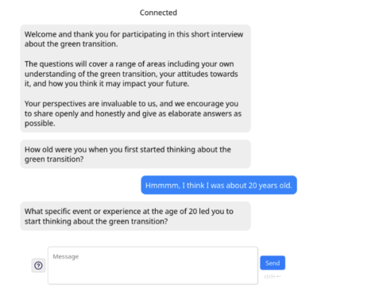
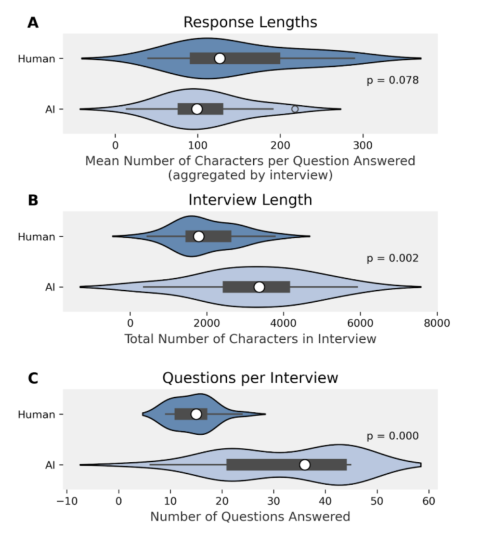
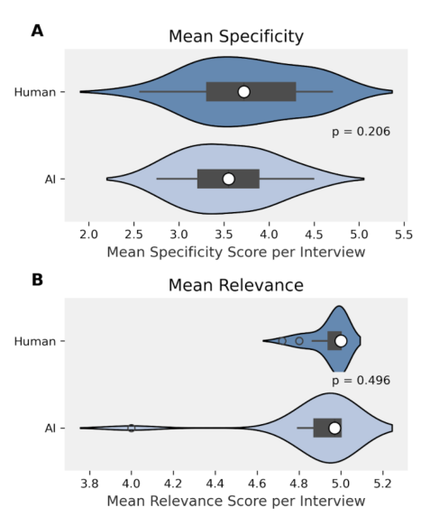

## Comparing AI-led to human-led chat-based interviews: motivations, initial results and challenges 

Semra Yuksel Guven[*] University of Copenhagen Andreas Bjerre-Nielsen University of Copenhagen, SODAS 

Tobias G ardhus[] University of Copenhagen, SODAS Hjalmar Bang Carlsen[] University of Copenhagen, SODAS 

July 2025, Preprint. This manuscript has not been peer reviewed. 

## **Abstract** 

Chatbots powered by large language models (LLMs) have been proposed as AI-interviewers capable of collecting large-scale qualitative interview data. This paper addresses a fundamental question: does data collected through AI-led interviews systematically differ from human-led chat interviews? To answer this, we conducted an experiment (N = 40), randomly assigning participants to synchronous text-based interviews conducted either by human interviewers or by a locally hosted AI system. We found that human interviewers elicited longer responses per question, whereas AI interviewers conducted longer interviews overall due to faster question delivery. Importantly, we identified no significant differences in response quality---measured by specificity and relevance---between the two interviewing methods. Overall, our findings suggest that AI-interviews produce data quality comparable to that of human-led interviews. We conclude by 

> *Joint first author 

> Joint first author 

> Corresponding author. Email: `hc@sodas.ku.dk` 

discussing experimental challenges and advocating the adoption of locally hosted, open-source language models to advance AI-interview methods and enhance research reproducibility. 

## **1 Introduction** 

Chatbots powered by large language models (LLMs) have recently been proposed as AIinterviewers capable of collecting large-scale qualitative interview data (Chopra and Haaland 2023; Geiecke and Jaravel 2024; Wuttke et al. 2024). Such AI-interviewers typically ask open-ended questions and formulate follow-up inquiries, enabling respondents to provide detailed answers that are argued to yield higherquality data than traditional open-ended surveys (Geiecke and Jaravel 2024). Compared to human-led interviews, the primary advantage of AI-interviews is the radical reduction in data collection costs. This cost-efficiency facilitates the collection of large-N qualitative datasets, helping researchers address generalizability---an issue that has traditionally limited populationlevel inference from qualitative interview data 

1 

(Chopra and Haaland 2023; Geiecke and Jaravel 2024; Goldthorpe 2000; Small 2009; Wuttke et al. 2024). Thus, AI-interviews hold promise for overcoming the longstanding divide between the breadth offered by standardized surveys and the depth and flexibility of semi-structured qualitative interviews. 

In this paper, we contribute to the methodological development of AI-interviewing on a crucial front: evaluating data quality. To assess the value of AI-interviews, it is necessary to compare them directly to human-led interviews. If AI-interviews produce significantly lower-quality data, this would call into question their usefulness and their ability to meet the standards of qualitative evidence (for an overview, see Small and Calarco 2022). However, to date, no systematic empirical study has compared the data quality produced by AI- versus human-led interviews, leaving a critical gap in our understanding of where---and how---these approaches diverge. We address this gap using locally hosted, openweight LLMs, which enhance both data security and research reproducibility. Existing AIinterview studies have exclusively relied on proprietary models such as ChatGPT---a practice criticized by computational scientists for raising concerns around data security, ethics, and the integrity and independence of scientific research (Palmer, Smith, and Spirling 2024; Spirling 2023). 

To compare human-led and AI-led interviews, we conducted a small-scale experiment in which 40 respondents were randomly assigned to either a human interviewer or an AI-interviewer. Both interviews were conducted through the same chat interface to keep the interview mode constant (Dillman and Christian 2005). Our results indicate that human interviewers tended to conduct more satisfactory interviews and asked 

questions that elicited longer responses per question. However, AI-interviewers produced longer interviews overall within the same time frame, due to the reduced time required to formulate and deliver questions. Importantly, we found no statistically significant differences in response quality---measured in terms of specificity and relevance---between the two conditions. It is important to emphasize, however, that the LLM-powered chatbot is not being evaluated against the gold standard of qualitative interviewing. Short, chat-based interviews conducted by non-expert interviewers do not constitute the methodological benchmark typically associated with high-quality qualitative interviews. 

Overall, our findings support the viability of AI-interviewing as a method for collecting largeN qualitative data and demonstrate that locally hosted, open-weight LLMs can deliver acceptable performance while promoting more ethical and scientifically robust research practices. 

## **2 System design: Local, open and restricted system design** 

Most current AI-interview studies rely on variants of ChatGPT, which are characterized as API-based, large-scale, and proprietary language models. In contrast, our approach is motivated by the use of a smaller, locally hosted, and opensource language model. In this section, we first outline the rationale behind this model choice, focusing on considerations such as data security and reproducibility, before briefly describing the design of our interview system. 

API-based models require researchers to transmit highly personal interview data to an external third party. Under the General Data Protection Regulation (GDPR), this necessitates 

2 

a formal data processing agreement and assurances that the service provider is GDPRcompliant. However, from the perspective of qualitative interviewing, the more fundamental concern lies in the potential compromise of respondent confidentiality. Qualitative interviews are typically conducted in an openended, confidential format, where participants share personal narratives. This places stringent demands on data security and confidentiality (Kaiser 2009). Locally hosted models---run on servers controlled by the researcher---offer a clear advantage: the researcher retains full control over the data, its use, and access. This enhances the likelihood that the research will be conducted in both an ethically responsible and legally compliant manner. Local models are typically openweight models, meaning their trained parameters are publicly available and can be downloaded and run locally. In contrast, API-based models are generally easier to implement and more user-friendly, as the service provider handles deployment and provides built-in functionalities. However, this convenience comes at the cost of transparency and control. Researchers have limited insight into how the model operates internally and cannot be certain whether features or hidden prompts have changed across sessions. As a result, API-based models tend to undermine the reproducibility and reliability of research findings (Palmer et al. 2024; Spirling 2023). 

Model size is another important consideration. GPT-3, for example, has 175 billion parameters, while estimates suggest GPT-4 may use around 1.7 trillion parameters---likely based on a more inference-efficient mixture-of-experts (MoE) architecture. By contrast, the Mistral model we used has just 7 billion parameters. Larger models require significantly more com- 

putational resources, increasing both economic costs and environmental impact. The infrastructure needed to host very large language models is out of reach for many researchers, making paid subscription services the only feasible alternative---further raising costs. In addition, the energy consumption per inference is non-trivial. These concerns have led to growing calls for the development and adoption of smaller, more efficient models. In this study, we test the performance of a fine-tuned version of Mistral 7B optimized for instruction tasks, known as OpenHermes 2.5[1] . 

While smaller open-weight models address many of the ethical, privacy, and reproducibility concerns associated with closed, API-based systems, they are not fully transparent. A key limitation of the Mistral models is the lack of information about their training data. This poses a challenge, as large language models derive their interactional, cultural, and knowledge competencies largely from the data on which they are trained. Extensive research has documented the biases that can arise from particular training datasets (Navigli et al. 2023). While complete neutrality may be unattainable---whether for human or AI interviewers---being aware of a model's potential biases is essential for establishing sound research practices in the social sciences. The ability to examine and, ideally, modify the training data is critical for understanding how and why certain question-asking patterns or interpretive biases emerge. This, in turn, enables researchers to investigate AI-specific analogs of "interviewer effects" (Groves and Fultz 1985; West and Li 2019). For this reason, the ideal 

> 1https://mistral.ai/news/announcing-mistral-7b/, https://huggingface.co/teknium/OpenHermes-2.5Mistral-7B 

3 

AI-interviewer would be based on a fully opensource model---one for which the training data, model architecture, instruction sets, and source code are all publicly available. We experimented with such open-source models, including OLMO 7B, but were unable to achieve satisfactory performance. Consequently, for this study we selected a fine-tuned version of Mistral 7B---a relatively small, open-weight model---hosted on our own GDPR-compliant servers. 

Our AI-interview system follows a multi-agent design inspired by Chopra and Haaland (2023). By agents, we refer to distinct LLM components, each assigned a specific task. In this experiment, we employed three agents: a classification agent responsible for categorizing parts of the interview, a question reformulation agent that rephrases questions when needed, and a probing agent tasked with generating follow-up questions. Of these, the probing agent is the most central to our framework, as its capacity to generate contextually relevant follow-up questions represents the key advantage of AI-interviewing over open-ended surveys. Compared to previous approaches, our system deliberately limits the degrees of freedom granted to the AI-interviewer. Rather than generating entirely new questions under broad thematic headings---as is common in recent studies (Chopra and Haaland 2023; Geiecke and Jaravel 2024)---our AI-interviewer is restricted to generating follow-up questions in response to a predefined set of open-ended questions (see interview guide). This design choice ensures that the AI-interview remains focused on questions the researcher can justify theoretically, epistemologically, and ethically. 

## **3 Experimental design** 

## **3.1 Outcome: Quantitative and Qualitative measures of Data quality** 

The central outcome of interest in our study is data quality, which we assess through several measures. The first is exposure. As Small and Calarco (2022) argue, exposure is a necessary---though not sufficient---condition for generating high-quality qualitative evidence. In their framework, exposure is typically approximated by the time a researcher spends in the field or with participants. Since our experiment standardized interview duration at approximately 30 minutes, we instead use the length of participants' responses as a proxy for exposure. Given that the interview transcript is the primary source of data, textual length is a reasonable measure of the amount of material available for analysis. 

We operationalize exposure at two levels. First, at the question-response level, we measure the number of characters in each response and then calculate the mean response length for each interview by averaging across all responses. This metric captures how much content the respondent provides per question---an important indicator of the amount of data available for interpretation. Second, we assess interview length by summing the total number of characters across all responses in a given interview. This measure reflects the overall volume of material available to the researcher for making sense of the respondent's experiences and perspectives. In qualitative research, interpretation often depends not only on individual responses but also on their relationship to other parts of the interview. Researchers commonly read across the entire transcript to contextualize responses and arrive at 

4 

more adequate interpretations (Sheppard 2024). 

Our second measure of data quality is specificity. In qualitative interviewing, the specificity of a response---rather than its generality---is widely regarded as a key indicator of quality (Gerson and Damaske 2020; Lareau 2021; Small and Calarco 2022; Weiss 1995). This is because qualitative research is primarily concerned with individuals' lived experiences and perspectives, not with abstract generalizations. Specific responses allow researchers to grasp the particular situations, contexts, and conditions in which respondents are embedded. Such detail is essential for developing an empathetic understanding of participants' viewpoints---what Small and Calarco (2022:23) define as cognitive empathy, or "the degree to which the researcher understands how those interviewed or observed view the world and themselves." For the analysis of qualitative data, understanding the respondent's point of view is typically regarded as a necessary prerequisite for making any analytical judgment, and thus a fundamental component of the research process (Lichterman 2017). 

Our third measure of data quality is relevance. For an interview to yield useful data, responses must address the substantive concerns of the researcher. A common challenge to data quality arises when respondents provide irrelevant answers (Weiss 1995). Such irrelevance may stem from various factors---some respondents may be preoccupied, while others may misunderstand the question or misinterpret the broader interview context. In these cases, it is the interviewer's role to steer the conversation back on track, ensuring that responses remain pertinent to the research objectives. 

Both the specificity and relevance measures were coded by the first author and a research assistant. The relevance measure was coded on a 

scale from 1 (very irrelevant) to 5 (very relevant), and similarly, the specificity measure was coded from 1 (very vague, with no specific details) to 5 (very specific, with comprehensive and detailed information). Our approach follows Wuttke et al. (2024) (see Appendix). 

## **3.2 Treatment: AI or human-led chat interviews** 

Each respondent was randomly assigned to either a human-led or an AI-led interview, and they were explicitly informed of their assignment upon entering the interview. Both the AI-interview system and the human interviewers were given the same instructions, and all interviews were conducted through the same chat interface to ensure consistency in interview mode (see detailed description below). The primary source of variation between the two conditions lies in the interviewer's identity---whether human or AI---and in their relative ability to ask relevant and responsive follow-up questions that elicit detailed responses. Because respondents knew whether they were interacting with a human or a machine, the treatment was not blinded. This means that we cannot isolate the effect of the interviewer's actual performance from possible effects of participants' awareness that they were being interviewed by an AI or human interviewer. 

## **3.3 Interview guide and instructions** 

The topic of the interviews was university students' academic help-seeking practices and experiences. The interview guide was divided into two main sections. The first focused on a situation in which the student needed help and successfully received it, while the second ad- 

5 

dressed a situation in which the student needed help but did not obtain it. Following best practices in qualitative interviewing, the guide was structured to begin with concrete experiences, then move toward the interviewee's feelings, and finally conclude with more general reflections (Gerson and Damaske 2020; Weiss 1995). 

The guide was organized in a nested fashion. At the first level were open-ended questions, each accompanied by instructions to follow up with more detailed probes. Each section contained six open-ended questions. Both the AI-interviewer and the human interviewers were instructed to ask these questions in a consistent manner across all interviews. They were also directed to use the suggested probes when appropriate or to formulate their own, provided the probes were responsive to the participant's answer and aligned with the overarching research focus. While all interviews were to include the same number of open-ended questions, the number of follow-up probes could vary depending on the interviewee's responses. 

In addition to question-specific instructions, both AI and human interviewers were given general guidelines rooted in established qualitative interviewing practices. These included: 

- Probe for more detail and elaborate answers. 

- Ask only one question at a time. 

- Reformulate a question if it is misunderstood or unclear to the respondent. 

- Refrain from passing judgment. 

- Refrain from asking suggestive questions. 

- Respect when the respondents do not want to answer the question. 

## **3.4 The interviewers, the setting, interview mode and recruitment** 

The two human interviewers were students with training in qualitative interviewing, having either completed advanced coursework in qualitative methods or acquired prior research experience conducting interviews. While they were not expert interviewers, their level of experience aligns with what is typically expected in largescale qualitative data collection efforts. The interviews took place on campus in a designated room. Respondents were recruited in advance for fixed time slots through face-to-face outreach on campus, as well as via flyers and posters. During the interviews, both respondents and interviewers used their own devices to connect to the chat interface while seated in the same room. At the conclusion of the interview, participants completed an online survey evaluating their interview experience. As a token of appreciation, each respondent received a voucher for a free lunch at the university canteen. 

The recruitment method and on-site experimental setup were time-intensive, but they ensured that respondents were genuinely engaging with the interview questions. This stands in contrast to online recruitment platforms, where the use of chatbots and large language models by respondents has become a growing concern for data quality. 

The interviews were conducted through a custom-built chat interface designed for the AIinterviewer (see fig:length). The interface resembled popular messaging applications, providing participants with a familiar and intuitive communication environment. The upper portion of the screen displayed the chat history, while the bottom featured a resizable text box where interviewees could type their responses. To encourage 

6 

the expected participant schedule and was fixed throughout that day. Participants were informed of their assignment upon arrival at the interview location. 

## **4 Results** 

## **4.1 Exposure** 

Figure 1: A screenshot of the chat interface used as part of the qualitative interviews. 

complete and uninterrupted answers, the "send" button remained disabled until the next question was presented. As a result, participants were instructed to submit their responses in a single message, rather than in multiple entries. 

Following the recommendations of Chopra and Haaland (2023), the interface included a dynamic typing animation between responses, simulating real-time typing behavior. This feature was intended to increase participant engagement and reduce interview attrition by reinforcing the sense of an interactive conversation. 

## **3.5 Randomization procedure** 

Human-led and AI-led interviews were conducted simultaneously, allowing respondents to be randomly assigned to either condition. Once students agreed to participate at a designated time slot, they were randomly allocated to either a human or AI interviewer. Randomization was performed separately for each day based on 

The data quality measure of interest is exposure. As detailed above we have two measures of exposure. The first focuses on the average length of response to a question per interview, which we call response length and the second on the length of all responses accumulated across the interview, which we call interview length. 

An overall observation is that response lengths were relatively short, which is typical for written responses as compared to verbal ones(H ohne and Gavras 2022). Human-led interviews yielded longer responses on average than AIled interviews, though the difference---while substantial---was statistically uncertain ( _p_ = 0 _._ 078). On average, responses in human interviews were 38% longer, with a mean of 149 characters (SD = 73), compared to 108 characters (SD = 51) in AI interviews. The median response length in human interviews was 127 characters, 28% longer than the 99-character median in AI interviews. Additionally, human interviews showed greater variability in response lengths, suggesting a broader diversity in how much respondents wrote per question. 

However, when considering the total interview length, the trend reverses. AI-led interviews were significantly longer overall, with a substantial and statistically significant difference (Mann--Whitney _U_ = 329 _._ 0, two-sided _p_ = 0 _._ 002, rank-biserial correlation _r_ = 0 _._ 567, common-language effect size CLES = 0 _._ 783). 

7 

On average, AI interviews yielded 3,262 characters per interview---64% more than the 1,992character average in human interviews. The median length of AI interviews was 3,367 characters, nearly double that of human interviews (1,786 characters). As shown in Figure 2, AI interviews exhibited not only greater length but also wider variation, ranging from 335 to 5,937 characters (SD = 1,492), whereas human interviews ranged from 426 to 3,796 characters (SD = 812). 

The explanation for this difference lies in the number of questions asked. The AI-interviewer was able to ask substantially more questions---on average 32---compared to just 14 in the humanled condition. In written interviews, time spent reading responses and composing follow-up questions reduces the number of questions that can be asked within a fixed interview period. While human interviewers took approximately 40 seconds per question to read and respond, the AIinterviewer reduced this to just 3 seconds, allowing for a much higher question throughput and, consequently, longer total interview transcripts. 

Figure 2: Comparison of human and AIinterviews across three metrics. (A) Mean number of characters per question answered aggregated by interview, (B) total number of characters per interview, (C) number of questions answered per interview. Each violin plot shows the kernel density estimate of the metric's distribution, with the thick bar inside representing interquartile range and the lines indicating the top and bottom deciles. Statistical significance (p-values), computed using the Mann-Whitney U test, is reported for each comparison. 

## **4.2 Specificity and Relevance** 

While our exposure measure captures differences in the amount of material available to the researcher, it says little about the quality of that material. When we compare the specificity and relevance of the responses, we do not find any significant differences between the AI-led and human-led interviews. There was very little variation in the relevance ratings overall, suggesting that written responses tend to be less spontaneous and more deliberate than verbal responses. Both AI and human interviews yielded the same mean relevance score per interview ( _M_ = 4 _._ 9), with a median of 5. The standard deviation was 

8 

Figure 3: Comparison of human and AIinterviews in terms of (A) mean specificity score per interview and (B) mean relevance score per interview. Each violin plot shows the kernel density estimate of the metric's distribution, with the thick bar inside representing interquartile range and the lines indicating the top and bottom deciles. Statistical significance (p-values), computed using the Mann-Whitney U test, is reported for each comparison. 

slightly higher for AI interviews ( _SD_ = 0 _._ 2) than for human interviews ( _SD_ = 0 _._ 1), and the range of mean relevance scores was also wider in AI interviews (4--5) compared to human interviews (4.7--5). In terms of specificity, human interviews produced slightly more specific responses on average, with a mean score of 3.8 ( _SD_ = 0 _._ 6), compared to 3.5 ( _SD_ = 0 _._ 5) in AI interviews. The median specificity was also slightly higher in human interviews (3.7) than in AI interviews (3.6). The range of specificity scores was wider in human interviews (2.6--4.7) than in AI interviews (2.8--4.5), and the standard deviation was likewise slightly higher, indicating greater variation in how specific the responses were. Two important qualifications should be noted. First, for both AI- and human-led interviews, it was often difficult to elicit responses that included developed accounts of specific experiences, which may have limited the sensitivity of the specificity measure. Second, relevance ratings were assigned based on the relationship between respondents' answers and the questions asked, supplemented by a short written description of the research project. A stricter definition of relevance might produce more variation. 

## **5 Discussion: challenges in the quantitative and experimental evaluation of the AIinterviewer** 

In this section, we outline how we understand the design of our experiment and then turn to the challenges involved in quantitatively evaluating the AI-interviewer---both in relation to humanled interviews and in more general terms. 

It is important to emphasize that we are not 

9 

comparing the LLM-powered chatbot to the gold standard of qualitative interviewing. That standard is typically defined by an experienced qualitative interviewer who has deeply internalized best practices (Gudkova, 2018; Nathan et al., 2019), and who is also well-versed in the relevant literature. This expertise enables them to adjust the interview dynamically, for example by identifying and pursuing emerging themes in real time (Weiss, 1995). Moreover, a skilled interviewer brings active listening and carefully tailored probing techniques that are essential for eliciting high-quality qualitative data. Comparing a first-generation automated method like the AI-interviewer to this ideal would be neither realistic nor fair. 

We instead situate our experiment within the context of large-scale qualitative interview projects, where non-expert research assistants---typically with basic methodological training---are rapidly trained in best practices for interviewing and instructed in a specific interview theme and guide. Our human interviewers fall somewhere between untrained novices and expert qualitative interviewers. As such, our results should not be interpreted as evidence that LLM-powered chatbots could replace expert human interviewers, who remain the norm in highquality qualitative research. 

There are also important constraints on the potential performance of our human interviewers. Most notably, the interviews were conducted via a written chat interface rather than face-toface---a setting that deviates from the gold standard of qualitative interviewing, which typically occurs in person and in familiar surroundings. Additionally, our interview guide omitted an introductory section commonly used to establish rapport and ease the respondent into the conversation, a practice known to facilitate longer 

and more detailed responses. While this limitation applies to both interview conditions, it likely had a greater effect on the human-led interviews. 

At the same time, our results should not be interpreted as demonstrating the upper-bound performance of the AI-interviewer. As discussed earlier, we used a relatively small, locally hosted open-weight model, chosen for reasons of data security and computational feasibility. The AIinterviewer was not fine-tuned for conducting interviews; it relied solely on general instruction prompts and simple classification filters. 

A second set of challenges concerns the quantification and standardization of data quality measures in qualitative interview data. Unlike in quantitative research, standards for data quality in qualitative work are neither fully conventionalized nor standardized in terms of measurement. The recent---though not uncontroversial---attempt by Small and Calarco (2023) to articulate criteria for good qualitative evidence for a broader audience highlights this lack of consensus (for a critical appraisal, see Tavory 2023). For both practical and epistemological reasons, experimental comparisons of qualitative interviews remain far less developed than similar efforts in survey research. 

The statistical comparison of AI- and humanled interviews requires the quantification of qualitative standards, introducing additional layers of difficulty well known from the literature on quantitative content analysis. A first issue, stemming from the lack of standardized criteria, is the problem of semantic validity (Krippendorff 2012)---whether we are actually measuring what we intend to measure, and whether our abstract operationalizations truly capture the concept of data quality. A second issue is that of unitization (Krippendorff 2012): identifying a unit of analysis that is valid in both qualitative and 

10 

quantitative terms. 

In our measure of exposure---response length and total interview length---we rely on character count as an indicator of the amount of qualitative material available to the researcher. This assumes that longer responses provide richer material from which the researcher can learn about the respondent and the topic at hand. However, this assumption can be challenged: short responses, or even brief phrases, may carry significant meaning within the context of a particular interview. 

In our coding of specificity and relevance, we used question--answer pairs as the unit of analysis. While this approach is both practical and analytically tractable, it overlooks how the meaning of a response is shaped by its placement within the broader conversational context. A response does not exist in isolation from the surrounding dialogue. In qualitative research, determining the appropriate context for interpretation is typically done on a case-by-case basis. This fluidity in defining analytical units is, at least in part, incompatible with the demands of standardized, quantitative comparison. 

We have addressed some---but by no means all---of the challenges and uncertainties involved in experimentally comparing different modes of interviewing in terms of data quality. While these are difficult and complex issues, we do not suggest that the broader methodological agenda is futile. Rather, we see this as a promising area of inquiry, rich with important and unresolved challenges. The emergence of AI-interviewing not only enables but also necessitates a more experimental approach to interviewing, opening up new directions for methodological innovation and empirical evaluation in this nascent field. 

## **References** 

Simone Balloccu, Patr cia Schmidtov a, Mateusz Lango, and Ondrej Dusek. Leak, cheat, repeat: Data contamination and evaluation malpractices in closed-source llms, 2024. Preprint. 

- Felix Chopra and Ingar Haaland. Conducting qualitative interviews with ai, 2023. Unpublished manuscript. 

- Thomas Davidson. Start generating: Harnessing generative artificial intelligence for sociological research. _Socius_ , 10:23780231241259651, 2024. doi: 10.1177/23780231241259651. 

- Don A. Dillman and Leah Melani Christian. Survey mode as a source of instability in responses across surveys. _Field Methods_ , 17(1):30--52, 2005. doi: 10.1177/1525822X04269550. 

Friedrich Geiecke and Xavier Jaravel. Conversations at scale: Robust ai-led interviews with a simple open-source platform, 2024. Preprint. 

Kathleen Gerson and Sarah Damaske. _The Science and Art of Interviewing_ . Oxford University Press, 2020. 

John H. Goldthorpe. _On Sociology: Numbers, Narratives, and the Integration of Research and Theory_ . Oxford University Press, New York, 2000. 

- Robert M. Groves and Nancy H. Fultz. Gender effects among telephone interviewers in a survey of economic attitudes. _Sociological Methods & Research_ , 14(1):31--52, 1985. doi: 10.1177/0049124185014001002. 

Jan Karem H ohne and Konstantin Gavras. Typing or speaking? comparing text and voice answers to open questions on sensitive topics 

11 

in smartphone surveys. _Comparing Text and Voice Answers to Open Questions on Sensitive Topics in Smartphone Surveys_ , 2022. 

- Karen Kaiser. Protecting respondent confidentiality in qualitative research. _Qualitative Health Research_ , 19(11):1632--1641, 2009. doi: 10.1177/1049732309350879. 

- Klaus Krippendorff. _Content Analysis: An Introduction to Its Methodology_ . SAGE, Los Angeles; London, 3rd edition, 2012. 

- Annette Lareau. _Listening to People: A Practical Guide to Interviewing, Participant Observation, Data Analysis, and Writing It All Up_ . University of Chicago Press, 2021. 

- Paul Lichterman. Interpretive reflexivity in ethnography. _Ethnography_ , 18(1):35--45, 2017. doi: 10.1177/1466138115592418. 

- Roberto Navigli, Simone Conia, and Bj orn Ross. Biases in large language models: Origins, inventory, and discussion. _Journal of Data and Information Quality_ , 15(2):Article 10, 21 pp., June 2023. doi: 10.1145/3597307. URL `https://doi.org/10.1145/3597307` . 

- Alexis Palmer, Noah A. Smith, and Arthur Spirling. Using proprietary language models in academic research requires explicit justification. _Nature Computational Science_ , 4(1):2--3, 2024. doi: 10.1038/s43588-023-00585-1. 

_Ethnographic and Interview Research_ . University of California Press, 2022. 

- Arthur Spirling. Why open-source generative ai models are an ethical way forward for science. _Nature_ , 616(7957):413, 2023. doi: 10.1038/d41586-023-01295-4. 

- Iddo Tavory. Deceptively approachable: Translating standards in qualitative research. _Sociological Methods & Research_ , 52(2):1043--1047, 2023. doi: 10.1177/00491241221140431. 

Robert S. Weiss. _Learning from Strangers: The Art and Method of Qualitative Interview Studies_ . Simon & Schuster, 1995. 

- Brady T. West and Dan Li. Sources of variance in the accuracy of interviewer observations. _Sociological Methods & Research_ , 48(3):485-- 533, 2019. doi: 10.1177/0049124117729698. 

Alexander Wuttke, Matthias Aenmacher, Christopher Klamm, Max M. Lang, Quirin W urschinger, and Frauke Kreuter. Ai conversational interviewing: Transforming surveys with llms as adaptive interviewers. arXiv preprint arXiv:2410.01824, 2024. URL `https://arxiv.org/abs/2410.01824` . 

- Mario Luis Small. 'How Many Cases Do I Need?': On Science and the Logic of Case Selection in Field-Based Research. _Ethnography_ , 10(1):5--38, 2009. doi: 10.1177/1466138108099586. 

- Mario Luis Small and Jessica McCrory Calarco. _Qualitative Literacy: A Guide to Evaluating_ 

12 

## **Appendix** 

## **Coding Guideline** 

To analyze the quality of responses, two researchers manually evaluated a random sample of 400 question-answer pairs: 200 involving AI-generated questions with human respondents and 200 involving human-generated questions with human respondents. The average of specificity and relevance scores obtained from the manual coding were calculated for each question-answer pair. Subsequently, we averaged these scores for each interview to compare the response quality of AI and human interviews. 

**Specificity:** Evaluate the level of specificity and detail in the response in addressing the question or the topic. Specific responses are those which provide sufficient details, helping not only understand and utilize the responses but also allowing to gain more valuable, in-depth insights. 

- **1:** Very vague, with no specific details. 

- **2:** Mostly vague, with few specific details. 

- **3:** Somewhat specific, with some detailed information. 

- **4:** Mostly specific, with substantial detailed information. 

- **5:** Very specific, with comprehensive and detailed information. 

**Relevance:** Evaluate how well the response aligns with the topic or question asked. Effective communication should be pertinent to the communication context, as relevant responses provide valuable insights and indicate respondents' engagement with the subject. 

- 1: Response is completely off-topic. 

- 2: Response is mostly off-topic. 

- 3: Response is somewhat relevant but includes off-topic information. 

- 4: Response is mostly relevant to the topic. 

- 5: Response is completely relevant to the topic. 

**Table 1. Analysis of response metrics** 

||**Total** **interview** **length**|**Mean** **response** **length**|**Question** **count**|**Specificity**|**Relevance**|
|---|---|---|---|---|---|
|AI interviewer|851.460**|--61.984**|15.946***|--0.3317|--0.0031|
||(364.533)|(26.991)|(3.854)|(0.232)|(0.032)|
|N|40|40|40|40|40|

0.899 

R2 

0.767 

0.883 0.774 0.780 

This table presents regression results where the unit of observation is as the question-response level. All regressions include respondent and date fixed effects. Standard errors are non-robust and presented in parentheses. The dependent variables include total interview length, mean response length, question count, mean specificity and mean relevance. Robust standard errors are shown in parentheses. _* p < 0.10, ** p < 0.05, *** p < 0.01._ 

## **Interview Guide** 

**Framing:** Present the framing of your interview. This is only used by the model to pose more relevant questions. 

In this interview, university students' academic help seeking behavior will be investigated. In the interview, we will be questioning students' academic help seeking through two cases. First, we will ask students to explain a case where they needed and received help with their studies. In the second case, students will explain a situation where they needed but did not ask for help. 

With these two cases, we aim to investigate social processes and mechanisms surrounding university students' help seeking and receiving help in the academic context. More specifically, these cases will question why students needed help, who they sought help or support from, the social situation surrounding their need, their relation to the helper(s) and students' feelings, attitudes and behaviors. 

By asking to these two cases, we also want to investigate how university students navigate their social network to access resources and cope with academic challenges. We want to shed light on social context, university students' experiences and how their social ties and relations impact their academic help seeking and getting help, as well as their attitudes and resilience in the face of academic challenges. 

In the general context, the following questions will be examined: how do university students decide to ask for help, from which resources do they seek help from, what kind of help is needed the most, and students' attitudes and attributions regarding different sources of help will be examined. It is important to note that the focus is not the outcome of help seeking but rather on students' experiences, attitudes, and thoughts around seeking support/help. It is important to investigate the outcomes if or when they have an impact on individuals' perceptions or behavior. 

**Introduction:** Write an introduction to your interview. This is the first message interviewees will see in the chat. 

Thank you very much for taking part in our research. In this interview, we will ask you open-ended questions to investigate university students' academic help seeking behavior. It is very common for students to face various academic challenges in their studies such as understanding a concept, solving an exercise, doing a group project and so on. 

There are no right or wrong answers. We are very interested in hearing your experience and perspective. The only constraint is that you must write your answers in one go, not using multiple 

lines. Also, your responses will remain confidential and all personally identifiable information will be removed from publications. 

**Question Batteries:** Questions to be asked during the interview. The model will only ask sub-questions if they have not been answered under the question, while questions will be always asked. The interviewee will be asked to answer them in the chat. The description is only used by the model. 

## ACADEMIC HELP SEEKING 

## **Description:** 

In this group of questions, the aim is to understand the social situation in which university students needed help and were able to get help regarding their studies. 

More specifically, the following will be investigated: for what reasons students need academic help, how students cognitively identify when help is needed, what social competencies they use to decide who can help best and how to approach. We will investigate what social processes and mechanisms play a role when students ask for help and receive help in an academic context. 

Question: Can you think of a situation where you needed academic help and got help with your studies? 

Please provide a yes or no answer 

Question: What did you specifically need help with? Sub-questions: 

Question: How did you get help? Sub-questions: Did you personally ask for help? If so, how? From whom did you get help? Can you describe the social situation? How would you describe your relation to them? How do you decide who can help best and how to approach them? Max probes: 5 

Question: Who else did you consider asking for help? Sub-questions: What factors influenced your decision? Max probes: 2 

Question: How did you feel after getting the help? Sub-questions: What are your expectations from the helper? Max probes: 2 

Question: In general, what are the reasons you seek academic help? Max probes: 1 

Question: Who do you ask to get help to resolve your academic challenges? How would you describe your relation to them? Max probes: 1 

**Description:** The goal is to understand the social situations where university students needed help but did not ask for help regarding their studies. More specifically, the aim is to understand why students refrain from asking for academic help, their relation to the helper, what factors affect their decision, and how this impacts their help seeking behavior will be investigated. We will investigate what social processes and mechanisms play a role when students refrain from asking for academic help even though they need it. 

Question: Can you think of a situation where you needed help with your studies but did not ask for it? 

Please provide a yes or no answer 

Question: What did you specifically need help with? Sub-questions: 

Question: Although you did not ask for help, did you consider asking anyone for help? And if so, who? 

Sub-questions: How would you describe your relation to them? What were your considerations around asking for help? Max probes: 3 

Question: Why did you not prefer asking for help? Sub-questions: When do you feel the most comfortable to ask for academic help? When do you feel the least comfortable to ask for academic help? Max probes: 4 

Question: How did you resolve the issue? Sub-questions: Did you end up getting any help? Can you describe the social situation? How do you decide who can help best and how to approach them? Max probes: 5 

Question: How did you feel about this situation? Sub-questions: Under what conditions would you seek help? Can you explain why? What changes would you suggest at the university to better meet your academic needs? Max probes: 4 

Question: In general, in which cases or from whom do you refrain from asking academic help? Why so? 

Max probes: 1 

## **End of the interview:** 

Question: Before we conclude our interview, is there anything you'd like to add or any perspectives you think we might have missed? Max probes: 1 

Thank you very much for sharing your insights and experiences. Your input is a great contribution for our research. Please fill out the {survey_link} 

---

## Extracted Figures

