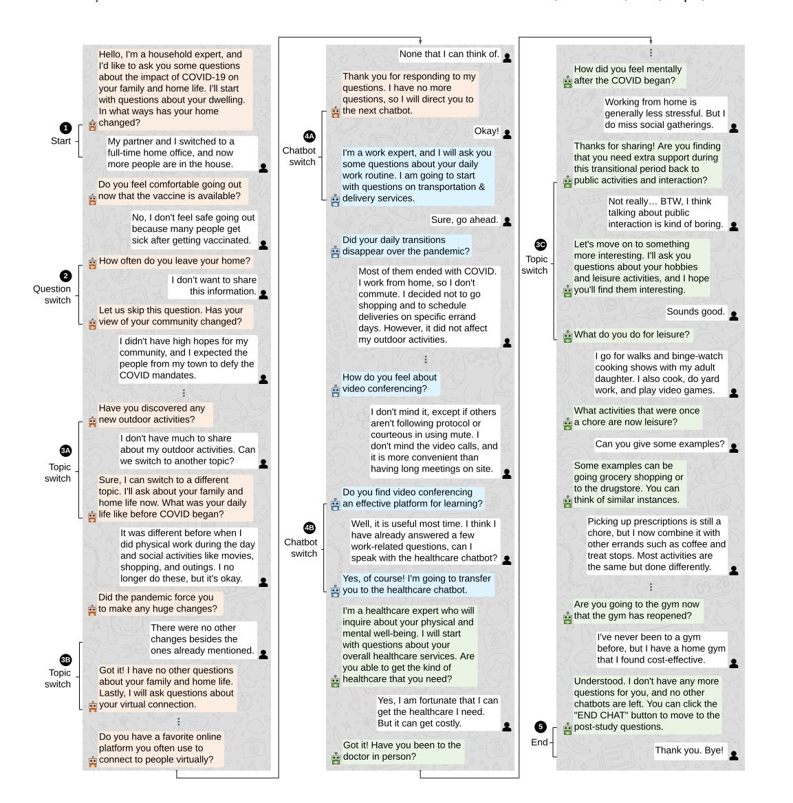
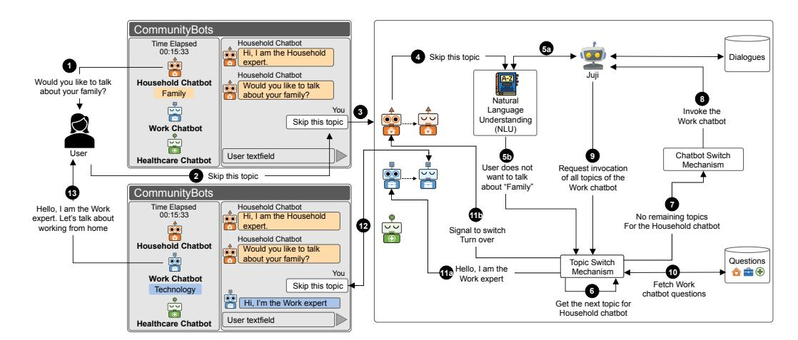
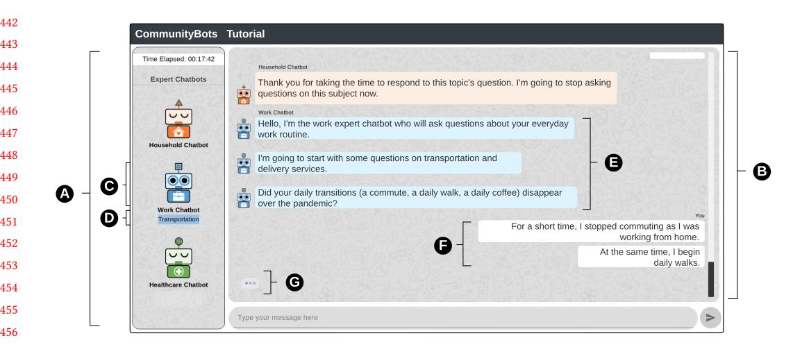
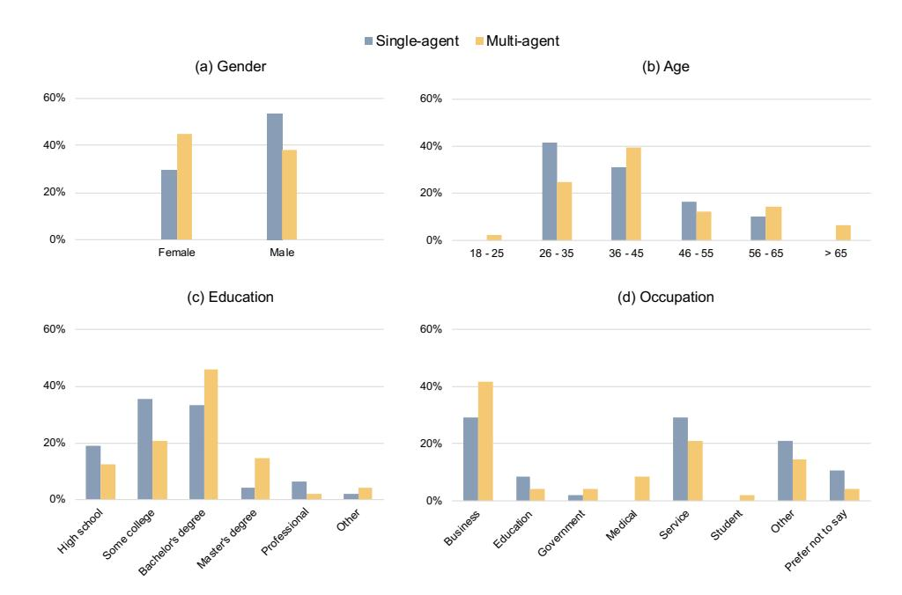
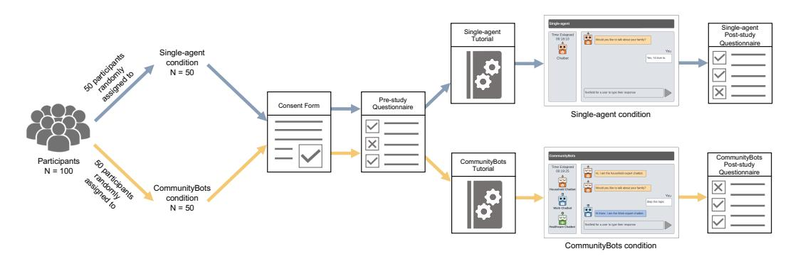
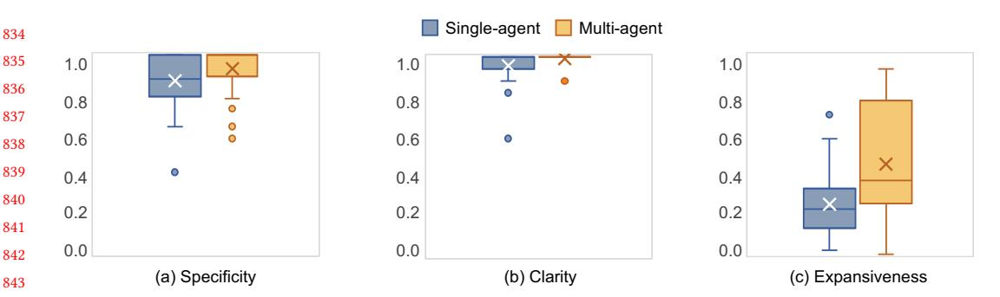
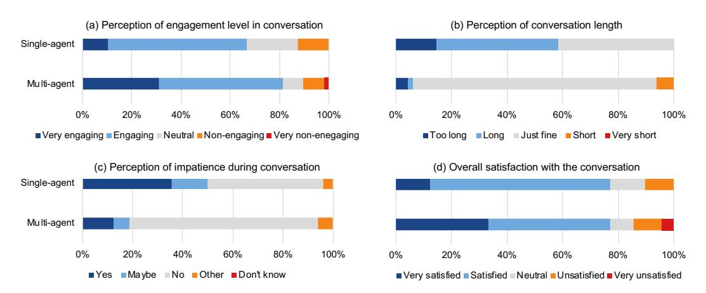
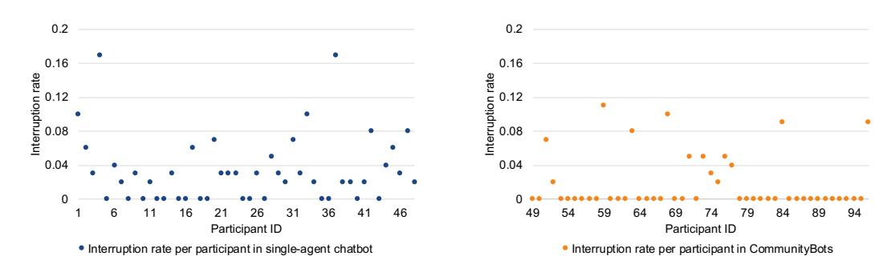
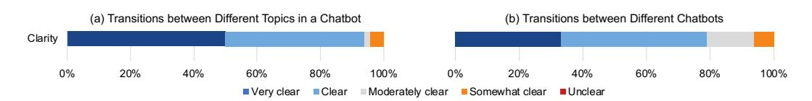
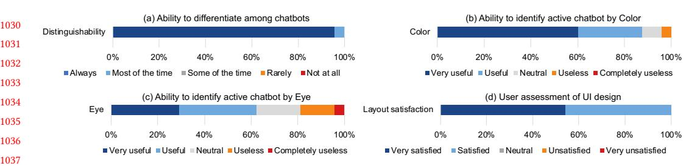

6

23 24

# CommunityBots: Creating and Evaluating A Multi-Agent Chatbot Platform for Public Input Elicitation

ZHIQIU JIANG* and MASHRUR RASHIK* , University of Massachusetts Amherst, USA

KUNJAL PANCHAL, University of Massachusetts Amherst, USA

MAHMOOD JASIM, University of Massachusetts Amherst, USA

ALI SARVGHAD, University of Massachusetts Amherst, USA

PARI RIAHI, University of Massachusetts Amherst, USA

ERICA DEWITT, University of Massachusetts Amherst, USA

FEY THURBER, University of Massachusetts Amherst, USA

NARGES MAHYAR, University of Massachusetts Amherst, USA

In recent years, the popularity of AI-enabled conversational agents or chatbots has risen as an alternative to traditional online surveys to elicit information from people. However, there is a gap in using single-agent chatbots to converse and gather multi-faceted information across a wide variety of topics. Prior works suggest that single-agent chatbots struggle to understand user intentions and interpret human language during a multifaceted conversation. In this work, we investigated how multi-agent chatbot systems can be utilized to conduct a multi-faceted conversation across multiple domains. To that end, we conducted a Wizard of Oz study to investigate the design of a multi-agent chatbot for gathering public input across multiple high-level domains and their associated topics. Next, we designed, developed, and evaluated CommunityBots --- a multi-agent chatbot platform where each chatbot handles a different domain individually. To manage conversation across multiple topics and chatbots, we proposed a novel Conversation and Topic Management (CTM) mechanism that handles topic-switching and chatbot-switching based on user responses and intentions. We conducted a betweensubject study comparing CommunityBots to a single-agent chatbot baseline with 96 crowd workers. The results from our evaluation demonstrate that CommunityBots participants were significantly more engaged, provided higher quality responses, and experienced fewer conversation interruptions while conversing with multiple different chatbots in the same session. We also found that the visual cues integrated with the interface helped the participants better understand the functionalities of the CTM mechanism, which enabled them to perceive changes in textual conversation, leading to better user satisfaction. Based on the empirical insights from our study, we discuss future research avenues for multi-agent chatbot design and its application for rich information elicitation.

CCS Concepts: - Human-centered computing -> Human computer interaction (HCI).

Additional Key Words and Phrases: multi-agent chatbots, turn-taking, public input elicitation

#### ACM Reference Format:

Zhiqiu Jiang, Mashrur Rashik, Kunjal Panchal, Mahmood Jasim, Ali Sarvghad, Pari Riahi, Erica Dewitt, Fey Thurber, and Narges Mahyar. 2018. CommunityBots: Creating and Evaluating A Multi-Agent Chatbot Platform for Public Input Elicitation. In . ACM, New York, NY, USA, [32](#page-31-0) pages. <https://doi.org/XXXXXXX.XXXXXXX>

*Equal contribution

Permission to make digital or hard copies of all or part of this work for personal or classroom use is granted without fee provided that copies are not made or distributed for profit or commercial advantage and that copies bear this notice and the full citation on the first page. Copyrights for components of this work owned by others than ACM must be honored. Abstracting with credit is permitted. To copy otherwise, or republish, to post on servers or to redistribute to lists, requires prior specific permission and/or a fee. Request permissions from permissions@acm.org.

CSCW '22, Nov 12--16, 2022, Taipei, Taiwan

 2018 Association for Computing Machinery. ACM ISBN 978-x-xxxx-xxxx-x/YY/MM. . . \$15.00 <https://doi.org/XXXXXXX.XXXXXXX>

#### 1 INTRODUCTION

AI-enabled conversational agents or chatbots have seen a meteoric rise in healthcare [\[15\]](#page-26-0), ecommerce [\[45\]](#page-27-0), and banking [\[32\]](#page-27-1) due to their ability to simulate natural conversations [\[59,](#page-28-0) [102\]](#page-30-0). Recently researchers started to explore conversational agents as an alternative method to online surveys to elicit information and deeper insights, especially when it comes to open-ended questions [\[121\]](#page-30-1). Chatbots have shown promise in overcoming the limitations of online surveys [\[121\]](#page-30-1) by negating survey fatigue [\[86\]](#page-29-0), increasing engagement [\[64\]](#page-28-1), and improving response quality [\[46\]](#page-27-2).

One of the emergent areas where chatbots can be beneficial is the timely collection of public input during major societal crises, such as COVID-19 [\[16\]](#page-26-1). The nature of such domain is multifaceted and multi-scalar, where data exists at various levels, including individual, family, city, and urban environment. In such circumstances, collecting rich and in-depth public input, including information regarding people's household, work, healthcare, transportation, and other facets of their lives, becomes critical to crafting appropriate plans and policies. However, prior research suggests that using a single-agent chatbot to converse and gather multi-faceted information across a wide variety of topics and domains might not be effective [\[39,](#page-27-3) [99\]](#page-29-1) due to inaccurate understanding of human intentions [\[126\]](#page-30-2) and misinterpretation of human language [\[70\]](#page-28-2) during a conversation. For example, in the customer service domain --- where chatbots are becoming commonplace single-agent chatbots often fall short in understanding user intents and emotions as they are designed to support conversations across various products and services [\[65\]](#page-28-3).

Multi-agent chatbots could maintain a better conversational flow across multiple domains and reduce the computational cost by dividing the conversation into separate domains and allocating each chatbot to focus on a particular domain [\[36,](#page-27-4) [128\]](#page-31-1). However, the design and development of multi-agent chatbots are challenging due to the complications associated with implementing effective turn-taking mechanisms among multiple chatbots, maintaining conversational flow across different domains, and ensuring engagement and quality of response elicited from users [\[105\]](#page-30-3). Prior work on multi-agent chatbots divided the conversation into multiple sessions, where users conversed with a single chatbot in each session. The sessions were changed based on users' manual intervention or requests, so there lacked a natural turn-taking mechanism to manage a conversation with multiple chatbots in the same session [\[22,](#page-26-2) [24,](#page-26-3) [49,](#page-27-5) [108,](#page-30-4) [124\]](#page-30-5). Moreover, they did not explicitly show multiple chatbots in the user interface design of the chatbot system [\[22,](#page-26-2) [24,](#page-26-3) [26,](#page-27-6) [124\]](#page-30-5), which might bring confusion and ambiguity for the user to understand the current chatbot and the switches between chatbots [\[33,](#page-27-7) [41\]](#page-27-8). In addition, these existing applications don't focus on eliciting rich user input through conversation; thus, there still exists a lack of exploration and evaluation of using such multi-agent chatbots for large-scale information elicitation. To address this gap, we ask the following research questions in this work:

- RQ1. How to design multi-agent chatbots for engaging people and gathering richer and more in-depth information across multiple domains?
- RQ2. How to design turn-taking mechanisms within and between multiple chatbots to reduce conversational interruptions?

We introduce a novel multi-agent chatbot platform, CommunityBots, to evaluate the use of multiple chatbots for collecting rich data across various domains. We used the COVID-19 pandemic as a test-bed for evaluation of CommunityBots to gather data on multiple facets, such as dwelling, transportation, delivery, education, the new paradigm of online work, health, and leisure. The first step of designing this multi-agent chatbot was to determine the appropriate number of chatbots required to gather such multi-faceted data. To answer this question, we conducted a Wizard of Oz (WoZ) pilot study [\[47\]](#page-27-9), and found that three chatbots work best. Based on the result of our WoZ study, we categorized the facets into three domains --- household, work, and healthcare --- and integrated

three chatbots in CommunityBots, each designed to handle conversation in a specific domain. Our WoZ study also showed the importance of maintaining a natural conversational flow across different chatbots and users by identifying their intention to continue or change the conversation topic. To maintain a natural conversational flow, we developed a Conversation and Topic Management (CTM) mechanism (see Fig. [2\)](#page-7-0). The primary goal of CTM is to detect and handle topic-switching switching between different topics based on users' responses to chatbots' questions and chatbot switching --- switching between two chatbots during the conversation. To achieve topic-switching and chatbot switching, CTM tracks user intents and identifies their unwillingness to respond to a question or continue conversations on a topic by measuring the response length. To signify the functionalities of the CTM mechanism, we integrated visual cues with CommunityBots' interface to help users understand when topic- and chatbot-switching occur.

To evaluate the effectiveness of CommunityBots to elicit rich data and manage a smooth conversational flow, we designed and conducted a crowd-sourced between-subject study in which 96 participants from the United States (US) were randomly assigned to converse with Community-Bots or a single-agent baseline system. We studied how people engaged with these two chatbot systems, their engagement, response quality, perception of the turn-taking mechanism, and overall satisfaction. Our qualitative and quantitative analysis of participants' responses to pre- and poststudy questionnaires, as well as the conversational responses with the chatbots demonstrated that CommunityBots participants were significantly more engaged and provided higher quality data compared to the single-agent chatbot. We also found that CommunityBots participants experienced significantly fewer conversational interruptions, which resulted in a smoother conversational flow. In addition, the design of CommunityBots interface enabled participants to differentiate among multiple chatbots, distinguish when topic-switching and chatbot-switching occurred, and identify the active chatbot, which improved user satisfaction.

To the best of our knowledge, our work is the first in designing and evaluating a multi-agent chatbot for information elicitation. Our contributions in this paper include: (1) Introducing a novel multi-agent chatbot platform for information elicitation comprising of a conversation and Topic Management (CTM) mechanism to handle turn-taking within and between multiple chatbots to maintain natural conversational flow. (2) Providing empirical evidence demonstrating the effectiveness of multi-agent chatbots compared to a single-agent chatbot for eliciting rich information across multiple domains, and (3) Discussing how the multi-agent chatbot approach can facilitate more human-like conversation and potential expansion to domains beyond information elicitation. We also shed light on open challenges, highlight avenues for future work, and call researchers in CSCW, AI, and HCI to explore interdisciplinary challenges of multi-agent chatbot designs.

#### 2 RELATED WORK

In this section, we review prior works on existing methods and challenges in gathering public input and how chatbots have been used for information elicitation. We also identify the limitations of existing chatbots and highlight the lack of design guidelines for multi-agent chatbots.

### 2.1 Existing Methods and Challenges of Gathering Public Input

Major societal crises, such as the COVID-19 pandemic, transform communities' lives in perceptible and imperceptible manners on multiple facets such as dwelling, working, and mobility [\[98\]](#page-29-2). While a timely collection of such multi-faceted public input is critical to handling such crises, during the COVID-19 pandemic, the quarantine and social distancing policies posed challenges in using traditional in-person methods, such as face-to-face interviews, focus groups, and observations for data collection and analysis [\[18\]](#page-26-4). Prior works suggest that online technologies can complement traditional in-person methods by providing an alternative to collect public input [\[113\]](#page-30-6). One such

method is to conduct online surveys that have been widely used for data collection using standardized questionnaires in a variety of research areas. Compared to in-person methods, online surveys can enable the collection and analysis of a large amount of data quickly and economically, allowing the audience to access and complete at their own pace [\[37\]](#page-27-10). However, responses collected through online surveys are often unreliable compared to face-to-face methods due to participants' insincerity [\[119\]](#page-30-7) and lack of administration [\[40,](#page-27-11) [48\]](#page-27-12). Moreover, survey fatigue [\[87\]](#page-29-3) poses a major challenge for participants, rendering surveys ineffective in gathering quality data. As the survey progresses, participants often show a decline in the time spent on each survey question and become disengaged, which negatively affects the quality of responses [\[66,](#page-28-4) [88\]](#page-29-4), especially for open-ended questions requiring additional time and effort from participants [\[95\]](#page-29-5).

Other alternatives including online engagement platforms might support public input gathering and community engagement. For instance, Open Town Hall [\[7\]](#page-26-5) gathers public input to help government agencies to make better decisions. CommunityCrit offers micro-activities to engage communities and solicits public input, enabling people to provide data at their discretion and from the safety of their homes [\[76\]](#page-28-5). While these platforms broaden access and help collect online input from communities, they do not always support and sustain dialogue --- a conversational exchange that can encourage people to provide deeper insight into their struggles, needs, and issues [\[111,](#page-30-8) [121\]](#page-30-1). Methods to sustain engagement for public input gathering yet remain underexplored.

#### 2.2 Chatbots for Information Elicitation and Their Limitations

Recently, there has been a rise in using chatbots as an alternative to online surveys for eliciting information [\[46,](#page-27-2) [121\]](#page-30-1). Chatbots are designed to simulate an intelligent conversation with one or multiple humans via textual or auditory methods [\[75\]](#page-28-6). Chatbots have several potential advantages over both online survey methods and civic engagement platforms for collecting public data [\[72,](#page-28-7) [116\]](#page-30-9). First, chatbots can play a virtual interviewer role in data collection, which might prevent participants' feigned answers [\[121\]](#page-30-1). Also, they can further simulate dialogue in online civic engagement platforms. For example, CivicBot [\[114\]](#page-30-10) is a chatbot created to converse with participants to discuss their ideas on various societal issues, such as increasing social awareness in youths and enabling them to participate in civic activities [\[84\]](#page-29-6). Furthermore, in contrast with an online survey, chatbots' appeal might play a role [\[123\]](#page-30-11) in increasing participation and response rates [\[84,](#page-29-6) [114\]](#page-30-10). However, using chatbots for public input gathering is often challenging due to the inaccuracies in interpreting natural human language, especially to open-ended free-text input [\[21,](#page-26-6) [52,](#page-28-8) [70\]](#page-28-2). Such inaccuracies and improper responses might result in participants disengaging from the conversation and providing lower-quality responses [\[126\]](#page-30-2). Moreover, inaccuracies in identifying user intentions might also disrupt the conversational flow. For example, if the chatbot fails to detect user intention to change topic and continues asking questions on the same topic, it would cause annoyance and disengagement that interrupts the conversational flow [\[46,](#page-27-2) [100,](#page-29-7) [120\]](#page-30-12). Determining user intention and interpreting human language is computationally expensive, and trade-offs are often made between accuracy and computation cost [\[38,](#page-27-13) [92\]](#page-29-8).

Inaccuracies in interpreting human language and identifying intent also limit the effectiveness of chatbots for information collection [\[100,](#page-29-7) [120\]](#page-30-12), especially when the conversation involves multiple domains [\[20,](#page-26-7) [67\]](#page-28-9). Prior works have explored multi-agent chatbots for multi-domain conversation with humans [\[26,](#page-27-6) [36\]](#page-27-4). These works suggest that dividing conversations into separate domains and assigning a chatbot for each domain could potentially improve the conversational flow and reduce computational complexities required for a chatbot to function [\[36,](#page-27-4) [128\]](#page-31-1). However, questions around how to maintain turn-taking and conversational flow across multiple chatbots and the quality of elicited information from humans by multiple chatbots remain underexplored. Furthermore,

factors such as user engagement and willingness to provide information through conversation with multiple chatbots are yet unclear.

#### 2.3 Lack of Design Guidelines for Multi-Agent Chatbot Interface Design

Prior works suggest that conversing with chatbots can deliver a human-like social interaction experience and persuade humans to reveal personal insights [\[107\]](#page-30-13). Designing chatbot interfaces that include human-like behaviors such as nodding or moving appendages can play a vital role in crafting such human-like interaction experiences [\[35\]](#page-27-14). Furthermore, crafting more personalized conversational responses for the chatbots to human queries has shown to improve user engagement and human response quality in return [\[106\]](#page-30-14). Researchers have also explored various interface design elements such as colors, shapes, avatars, and sounds to invoke positive or negative feelings in humans to evoke thoughts and feelings when responding to chatbots [\[13,](#page-26-8) [78,](#page-29-9) [121,](#page-30-1) [127\]](#page-31-2).

However, these interface design strategies and approaches are investigated for single-agent chatbots and may not translate to multi-agent chatbots where multiple chatbots are leveraged to converse across multiple domains. Conversations across these domains might range from amicable to contentious, and one size fits all chatbot design might not be effective in maintaining the same conversational flow across multiple chatbots. There is a lack of empirical investigation, evidence, and guidelines to design interfaces for multi-agent chatbots. Furthermore, the ramifications of applying prior design strategies to multi-agent chatbots remain underexplored. While the existing literature suggests that using a chatbot system for data collection is promising [\[46,](#page-27-2) [59,](#page-28-0) [121\]](#page-30-1), there is room for improvement in multiple domain conversations. In this work, we investigate the performance of using a multi-agent chatbot for multiple domain data collection. Furthermore, we investigate the impacts of multi-agent interface design and the development of a conversation management mechanism on the fluidity of the conversation.

#### 3 COMMUNITYBOTS

In this section, we introduce and describe the main features and functionalities of CommunityBots. We first explain how we determined the number of chatbots. Then we explain our novel turn-taking mechanism that controls when the conversation should switch from one topic to another or one chatbot to another. We also describe the user interface and implementation of CommunityBots.

#### 3.1 Determining the Number of Chatbots

One of the open challenges in designing multi-agent chatbots is determining the number of chatbots. Prior research on multi-agent chatbots (e.g., [\[26,](#page-27-6) [42,](#page-27-15) [94,](#page-29-10) [125\]](#page-30-15)) do not provide any empirical or heuristic guidelines or insights related to these important design considerations. We performed a Wizard of Oz pilot study of three design variants with three, four, and five chatbots to determine the appropriate number of chatbots for CommunityBots. Eighteen university students participated in the pilot study. We used a pool of questions related to the impact of the COVID-19 pandemic on the daily lives of the public. The questions were created by our collaborators and co-authors from the College of Social and Behavioral Sciences at --- omitted for blind review --- who investigate the impact of COVID-19 on the US communities. The same set of questions was later used for the evaluation of CommunityBots (see Section [5\)](#page-12-0). We initially grouped these questions into ten topics, such as dwelling, virtual connection, family and home life, etc. The topics were assigned to the chatbots based on their coherence and likeness. (see supplementary material). Each participant interacted with all three designs, and the order of interaction was randomly determined using the Latin Square arrangement [\[61\]](#page-28-10). For each design, participants answered the same number of questions (60 per design, 180 in total). After the study, we asked participants to give their subjective assessment of what design they preferred and why in post-study questionnaires.

The results showed that 44.4% of the participants preferred the three chatbot design while 5.6% preferred the four and five chatbot designs, respectively. 33.3% of participants expressed that they did not have a specific preference, and 11.1% did not like any of the designs. Moreover, we discovered from the post-study questionnaire that the participants felt overwhelmed when conversing with a large number of chatbots. For example, P4 said "Having five [chatbots] felt the most overwhelming, and having three [chatbots] felt like it was effectively helping by offering specialized chatbots, while not feeling overwhelming with the amount of people to talk to." P9 also mentioned "I liked the three agent system because it was [a] shorter and simpler way of communicating; I found the four and five agent system to tend to drag on the conversation." P16 also said that "I feel like a three chatbot system is a good size. Five [chatbots] feels too long in my opinion." Based on the results of this pilot, we chose a three-chatbot design for CommunityBots.

### 3.2 Conversation and Topic Management (CTM) Mechanism

The conversation management in CommunityBots' is designed to maintain a natural conversational flow. This enables the system to switch between conversation topics whenever it determines that the user no longer wishes to converse on the current topic. We refer to this kind of conversation management as topic-switching. It also alternates among three chatbots, each responsible for maintaining conversations on either household, work, or healthcare domains. We refer to this as chatbot-switching. The conversation management in CommunityBots focused on three particular scenarios: (i) The CTM uses the user responses to measure the engagement. If the system detects disengagement, it switches to another topic of the same chatbot. (ii) If the user does not wish to continue a conversation topic, they can activate topic-switching by typing "Skip this topic". (iii) When a chatbot has finished asking all questions related to its domain, it switches to the next chatbot using chatbot-switching. If this is the final chatbot, it terminates the conversations. A conversation template for our CTM mechanism is shown in Fig. [1.](#page-6-0)

3.2.1 Identifying unwillingness to respond. Some users might consider some questions to be sensitive or lack interest and may not be willing to respond to such questions. It is imperative to detect and handle users' unwillingness to respond to maintain a natural and smooth conversational flow and avoid inundating users with repeated questions, as suggested by prior works [\[46\]](#page-27-2). To handle this we used Natural Language Understanding (NLU) [\[74\]](#page-28-11) to detect user disengagement. NLU converts each user response text to a vector representation of numbers and performs a similarity check with the responses stored in a response-template, which contains a collection of disengaged user responses from our pilot study data. For each user response, CommunityBots performs cosine similarity match with the response-template. If the similarity is above 80%, the system identifies that the user is unwilling to respond. This similarity check is performed up to three times to ensure that the user is truly unwilling to respond to this question. If the user repeats unwillingness to respond three times consecutively, CommunityBots then moves to the new question. We determined the threshold for vector similarity match from our pilot.

3.2.2 Topic-switching within the chatbot. Topic switching can be activated under two conditions: (i) when CommunityBots identifies user disengagement with the current conversation topic, and (ii) manual prompts from the user to switch the current topic. As explained in algorithm [1,](#page-8-0) the topicswitching algorithm begins by setting the counter for the number of low-quality user response to zero (Line 1). The user's response to a chatbot question is converted to lowercase for string matching (Line 2). The topic-switching mechanism first checks if the user entered "skip this response", which automatically activates the topic-switching procedure (Line 3-4). The NLU converts the user response to its vector representation and computes similarity to detect unwillingness. If unwillingness is detected, the topic-switch is activated (Line 6-7). It then measures the response

Fig. 1. This figure shows CommunityBots' conversation template. (1) The Household chatbot begins the conversation by greeting the user and introducing the conversation domain. (2) The CTM mechanism measures the user's willingness to respond to the current question and switches to another question on the same topic if unwillingness is detected. (3) Topic-switching: The CTM mechanism switches to another topic of the same chatbot after detecting the user's unwillingness to continue conversation (3A and 3C), or when the chatbot runs out of questions for a given topic (3B). (4) Chatbot-switching: When a chatbot completes asking questions across all topics, the CTM mechanism activates the chatbot-switching mechanism (4A). The CTM mechanism also triggers chatbot-switching based on user unwillingness to continue (4B). (5) The Healthcare chatbot ends the conversation after exhausting all questions and no more chatbots are left.

length (Line 9). As suggested in prior works, a longer response length is an indicator of a greater user engagement [\[46,](#page-27-2) [121\]](#page-30-1). CommunityBots uses the response length of the first questions as the threshold for measuring user engagement (Line 10) [\[121\]](#page-30-1). If the response length is less than the

Fig. 2. This figure presents CommunityBots' system overview. We use an example to guide through the process of user interactions with multiple chatbots: 1) The Household chatbot asks the user questions about their family life; 2) The user responds that they want to skip the current topic; 3) The Household chatbot receives user's response "Skip this topic"; 4) The Household chatbot forwards the user's response to Juji's NLU module; 5a) Juji uses NLU to identify the user's engagement level; 5b) NLU determines that the user doesn't want to talk about the current topic and passes this conclusion to CommunityBot's Topic-Switch Mechanism; 6) Topic-Switch Mechanism determines which topic to change the conversation to; 7) Since there are no remaining topics for the Household chatbot to converse, the Topic-Switch Mechanism asks the Chatbot-switch mechanism to switch from the Household chatbot to the next chatbot in queue; 8) Chatbot-switch mechanism determines that the next chatbot to converse with the user is the Work chatbot; 9) Juji notifies the Chatbot-switch mechanism about the Work chatbot invocations; 10) The Chatbot-switch mechanism fetches the questions related to the Work chatbot; 11a) The Chatbot-switch mechanism "wakes up" the Work chatbot on user's screen and passes the next question to be asked; 11b) At the same time, the Chatbot-switch Mechanism puts the Household chatbot in a inactive state; 12) The question asked by the Work chatbot is displayed on user's screen; 13) The user proceeds to talk to the new chatbot.

threshold of three different questions from the same topic, we infer that the user is becoming disengaged, and the turn-taking mechanism is activated. We selected the threshold of three questions as an activation factor for topic-switching based on our pilot studies. These questions may or may not be consecutive. After receiving a response, the topic-switching mechanism determines whether this response would result in topic-switching (Line 11). To do so, it keeps track of the number of times the response length is less than the threshold (Line 12). If the response length is lower than the threshold thrice, the topic-switching is activated (Line 13-14).

3.2.3 Turn-taking across different chatbots. The turn-taking mechanism switches between chatbots, and so we refer to it as chatbot-switching. The chatbot-switching is activated when the current chatbot either has no new topics to switch to or it is only left with topics that the user does not want to have a conversation on. As shown in algorithm [2,](#page-8-1) the detection for chatbot-switching starts with selecting a topic (Line 2). The current chatbot asks questions from the selected topic (Line 3). For each question, the mechanism checks whether topic-switching (algorithm [1\)](#page-8-0) is required. If there are remaining topics in the current chatbot (Line 4-7), CommunityBots switches to a new topic after depleting all questions from the current topic. If the current chatbot completes asking questions on its associated topics, the chatbot switch is activated (Line 8-9).

### Algorithm 1: Topic-switching

| <b>Input:</b> <i>currentTopic</i> - current chat topic                         |                           |
|--------------------------------------------------------------------------------|---------------------------|
| <i>currentChatbot</i> - current expert chatbot                                 |                           |
| <i>userResponse</i> - user-response for the previous chatbot question          |                           |
| 1 set the initial value of <i>consecutiveBadResponses</i> equal to 0           |                           |
| 2 <i>userResponse</i> <- convert <i>userResponse</i> to lowercase               |                           |
| 3 <b>if</b> <i>userResponse</i> contains "skip this topic" <b>then</b>         |                           |
| 4 <b>return</b> <i>True</i>                                                    | // activates topic switch |
| 5                                                                              |                           |
| 6 <b>if</b> <i>userResponse</i> shows unwillingness <b>then</b>                |                           |
| 7 <b>return</b> <i>True</i>                                                    | // activates topic switch |
| 8                                                                              |                           |
| 9 <i>responseLength</i> <- calculate the response-length of <i>userResponse</i> |                           |
| 10 <i>threshold</i> <- response-length for the first question of a topic        |                           |
| 11 <b>if</b> <i>responseLength</i> < <i>threshold</i> <b>then</b>              |                           |
| 12 <i>consecutiveBadResponses</i> <- <i>consecutiveBadResponses</i> + 1         |                           |
| 13 <b>if</b> <i>consecutiveBadResponses</i> > 3 <b>then</b>                    |                           |
| 14 <b>return</b> <i>True</i>                                                   | // activates topic switch |
| 15                                                                             |                           |
| 16 <b>return</b> <i>False</i>                                                  |                           |

| <b>Input:</b> | <i>currentChatbot</i> - current expert chatbot                                                   |
|---------------|--------------------------------------------------------------------------------------------------|
|               | <i>availableTopics</i> - a list of all the available topics for the <i>currentChatbot</i>        |
| 1             |                                                                                                  |
| 2             | <i>currentTopic</i> <- pick next available topic from <i>availableTopics</i>                      |
| 3             | <b>while</b> <i>currentTopic</i> has next question <b>do</b>                                     |
| 4             | <b>if</b> <i>Topic-switching(currentTopic, currentChatbot, userResponse)</i> is true <b>then</b> |
| 5             | <b>if</b> <i>availableTopics</i> has next topic <b>then</b>                                      |
| 6             | switch <i>currentTopic</i> to next topic in <i>availableTopics</i>                               |
| 7             | <b>return</b> ( <i>currentChatbot, currentTopic</i> )                                            |
| 8             | switch <i>currentChatbot</i> to the next chatbot                                                 |
| 9             | <b>return</b> ( <i>currentChatbot, currentTopic</i> )                                            |
| 10            | <i>userResponse</i> <- get-user-response for next-question from <i>currentTopic</i>               |
| 11            | switch <i>currentTopic</i> to next topic in <i>availableTopics</i>                               |
| 12            | <b>return</b> ( <i>currentChatbot, currentTopic</i> )                                            |

### Algorithm 2: Chatbot-switching

CommunityBot's interface consists of two main components -- the chatbot panel (Fig. 3A), and the chat container (Fig. 3B). This panel contains information on the individual chatbots along with the topic of the conversation (Fig. 3C). Each chatbot has its individual avatar -- orange for household chatbot, blue for work chatbot, and green for healthcare chatbot. We selected the colors for these chatbots by consulting Tableau [10], and Colorbrewer's [4] categorical color schemes. Besides colors, each chatbot can also be identified with the icon on their torso/body. The household chatbot has a house icon, the work chatbot has a briefcase icon, and the healthcare chatbot has a plus icon. The current active chatbot is indicated by the chatbot's eyes. Opened eyes denote that the

### 3.3 User Interface

Fig. 3. A snapshot of CommunityBots' interface. A) The chatbot panel shows the chatbots and their conversation topic. B) The chat container renders the chat conversation between the chatbot and user. C) Each chatbot has a unique avatar that is distinguished by color and shape. The open eyes represent the current chatbot. D) The current conversation topic is highlighted based on the active chatbot. E) The chatbot message, which is left aligned with the chatbot avatar. F) The user message, which is right aligned to the right of the chat container. G) An indicator to show when the chatbot is typing a message in the background.

chatbot is active. The inactive chatbots have their eyes closed. The current topic of conversation is shown below the active chatbot (Fig. [3D](#page-9-0)). The chatbot panel is responsive to topic-switching and chatbot-switching. It provides real-time visual feedback using the changes in the avatar's eyes and differences in the highlight color for the topic whenever these turn-taking mechanisms are activated. We also provide a timer depicting the duration of the conversation.

The chat container shows the conversation history between the chatbot and the user (Fig. [3E](#page-9-0), [3F](#page-9-0)). This history allows the users to keep track of their conversations with multiple chatbots. In the chat container, the conversation texts are presented in chat bubbles. The color of the bubbles from the chatbots corresponds to the chatbot colors as presented in the chatbot panel. This is another way to highlight the active chatbot the user is having the conversation with. We provide visual feedback to the users that CommunityBots is working in the background by rendering an ellipsis whenever the backend functionalities of the chatbot mechanisms are active (Fig. [3G](#page-9-0)). When the user inputs a text response to CommunityBots, the CTM mechanism sends this to a chatbot platform. We experimented with several chatbot systems including Juji [\[6\]](#page-26-11), Rasa [\[19\]](#page-26-12), and Dialogflow [\[5\]](#page-26-13). And from our experiments, Juji outperforms others in terms of latency, performance, and feature support. Furthermore, several recent studies have also shown the success of using Juji to conduct HCI research [\[46,](#page-27-2) [53,](#page-28-12) [121\]](#page-30-1). Therefore, we decided to use Juji because it can effectively process conversational data. Finally, the User Interface provides users with an option to end the conversation with an "END CHAT" button that appears after the conversation ends.

## 3.4 Implementation Details

The client-side of CommunityBots is built with React [\[8\]](#page-26-14). This client-side is connected with the Juji chatbot API. The NLU components are developed using Juji. The user response is first sent to the Juji chatbot platform through a websocket [\[9\]](#page-26-15). The system creates a websocket connection for

523 524

526

Fig. 4. This figure shows participants' demographic distribution by (a) gender, (b) age, (c) educational levels, and (d) occupation for each condition, which suggests a diverse demographic distribution.

each chatbot. As shown in Fig. [2,](#page-7-0) Juji contains the NLU data such as the response-template that determines the next chatbot message. This NLU data also includes data for determining the user's unwillingness to a chatbot question and disinterest in a particular chatbot topic. Juji also holds the chatbot's question and selects the next appropriate question based on the user's previous chat text. After each user response is received, the system also checks for topic-switch and chatbot-switch criteria as explained in algorithm [1](#page-8-0) and [2.](#page-8-1) All text responses, along with the metadata, including the timestamp of the response, the sender, the topic, and the receiver chatbot information, are stored in the Firestore database [\[3\]](#page-26-16) under a 20 character secure hash as a conversation ID. To test the capability of our system to handle a large number of users, we performed load testing with 20 concurrent users and found an average latency [\[73\]](#page-28-13) of 5 milliseconds. Each user was assigned to send chat text to the chatbot system, and we observed whether each of them received a response.

### 4 USER STUDY

To assess the efficacy of multi-agent chatbots for information elicitation, we performed a crowdsourced study, comparing and contrasting the quality of responses, level of engagement, and conversational flow between CommunityBots and a single-agent baseline. Participants provided responses regarding the impact of the COVID-19 on different aspects of their daily lives. We organized the questions in three high-level domains --- household, work, and healthcare, further divided into several topics. Household contained topics such as dwelling, virtual connection, and family and home life. Work included topics regarding commuting, communication, and video conferencing. Finally, healthcare contained topics including medical services and personal wellbeing.

Fig. 5. This figure shows the workflow of the study procedure. After being randomly assigned to a condition, each participant followed the steps as indicated: signed the informed consent form, answered the pre-study questionnaire, read the web tutorial, chatted with the system, and answered the post-study questionnaire.

#### 4.1 Conditions

We conducted a between-subject study with two conditions --- the baseline with a single chatbot and CommunityBots with three chatbots. Each condition had the same set of questions that were designed to ask participants about the COVID-19 pandemic. While the baseline system used Juji's built-in features only, CommunityBots also used the embedded CTM mechanism that managed turn-taking and switched questions and topics during the conversation.

#### 4.2 Participants

We recruited crowd workers from Amazon Mechanical Turk [\[28\]](#page-27-16) as our study participants. All of our participants were from the US and Amazon Master Workers who received the qualification for consistent demonstration of a high degree of success in performing a wide range of tasks across many requests [\[1\]](#page-26-17). We had 100 participants in total, 50 participants assigned randomly to each condition. Upon completion of the study session, they were compensated with USD \$15.

We discarded four participants' data due to incomplete responses, resulting in 48 participants for each condition. Fig. [4,](#page-10-0) shows the distribution of demographic information across participants for each condition. Overall, participants in our study represented a diverse sample which was suitable for our task of evaluating CommunityBots to gather public input. The participants' ages ranged from 18 to 65+, where the majority of participants were between 26-35 (33%, (32/96)) and 36-45 (35%, (34/96)). The majority of the participants (81%, (78/96)) had at least a college or a bachelor's degree. The participants came from diverse occupational backgrounds, 35% from business, 29% from service, 7% from education, 4% from medical, 3% from government, and 2% are students. In addition to participants' demographic information, we collected their residential zip codes during the pre-study questionnaires, and we found that they were from 84 cities across 31 states in the US.

#### 4.3 Procedure

As shown in Fig. [5,](#page-11-0) the participants were randomly assigned to either the baseline or CommunityBots condition and were asked to provide free-text response to the chatbot question. The study was conducted in 5 batches, each with 20 participants. After each batch, we counterbalanced to ensure an equal number of participants in each condition. At the beginning of the study, each participant signed the informed consent form. After that, they proceeded to answer a pre-study questionnaire where we asked questions about basic demographics, including gender, age, occupation, level of education, ethnicity, and residential zip codes (see supplementary materials). We also included

questions about prior chatbot interaction experiences, such as whether they had previously used a chatbot and the number of chatbots that were involved in a single conversation if they indeed interacted with a chatbot before.

Next, we directed the participants to a web tutorial section with annotated figures explaining the procedures and functionalities of the chatbot systems assigned to them. The web tutorial was designed to take about 3 minutes to read for each condition. Participants could access it anytime during the study from the navigation bar on the interface. After the web tutorial, the participants proceeded to the study task to converse with the chatbot systems. When they completed the study task, we asked them to proceed to the post-study questionnaire, which consists of various questions about their subjective feedback, such as engagement level during the conversation and their experience (see supplementary materials). In multi-agent condition, we also asked questions about participant perception of the multi-agent chatbot interface design, such as whether they could distinguish which chatbot they were talking with and the usefulness of design elements. Participants responded to these questions on a five-point Likert-scale. We also asked the participants open-ended questions about their experience of conversing with their assigned systems, what they liked and disliked, whether they faced any issues or challenges, and suggestions to improve their experiences and our approach in the future.

#### 5 DATA ANALYSIS

To assess our research questions in Section [1,](#page-1-0) first, we formulated the following hypotheses:

- H1 Response Quality and User Engagement: Participants who converse with CommunityBots will provide better quality responses and be more engaged with the conversation.
- H2 Conversational Flow: Conversation and topic management in CommunityBots will result in a smooth conversation with reduced conversational interruptions.

To evaluate our hypotheses, we conducted quantitative and qualitative analyses of the collected data, which includes the participants' usage logs for both conditions and their response to the pre- and post-study questionnaires. We performed a quantitative analysis on the participants' chat responses to measure response quality, user engagement, and conversational interruptions. We also analyzed post-study Likert-scale responses about the CTM mechanism and the UI design. Moreover, we performed open-coding [\[23\]](#page-26-18) analysis on the open-ended questions from the pre- and post-study questionnaires. Details of our metrics and measures can be found in Table [1,](#page-13-0) which we expand upon in the following subsection [5.1.](#page-12-1) Two coders (first and second authors) coded a random sample of 40 participants' data independently (20 from single-agent chatbot and 20 from multi-agent chatbot). Then the coders consolidated their codes through multiple iterative sessions and arrived at a representative set of codes. The inter-coder reliability using Krippendorff's alpha [\[63\]](#page-28-14) was 0.886 for the multi-agent system and 0.898 for the baseline single-agent chatbot system. The coders then coded the remaining data and consolidated the results over several discussion sessions.

#### 5.1 Metrics and Measurements

5.1.1 Metrics for evaluating H1. To evaluate H1, we defined our metrics following the Gricean Maxims [\[44\]](#page-27-17), which is a set of communication principles that helps to guide a conversation between a speaker and a listener (see Table [1\)](#page-13-0). Based on prior work [\[121\]](#page-30-1), we computed specificity, relevance, response clarity, and informativeness to assess the chatbot systems' quality of participants' response and the response length and expansiveness to calculate user engagement.

Table 1. This table shows the metrics and measures we used for the evaluation of CommunityBots.

| Hx Measure | Metric / Open coding Definition / Explanation                                                   |
|------------|-------------------------------------------------------------------------------------------------|
| Response   | Quality                                                                                         |
|            | Specificity Extent to which a response is specific                                              |
|            | Relevance Quality or state of being closely relevant                                            |
|            | Response Clarity Quality of being clear and coherent                                            |
|            | Informativeness Information a response conveys                                                  |
| User       | Engagement                                                                                      |
|            | Response Length Word count in a response                                                        |
|            | Expansiveness Responding with free-text to closed-ended                                         |
|            | Likert scale responses                                                                          |
|            | & open-coding                                                                                   |
|            | Perception of engagement level in conversation                                                  |
|            | Perception of conversation length                                                               |
|            | Perception of impatience during conversation                                                    |
|            | Overall satisfaction with the conversation                                                      |
| H2         | Conversational Interruption Interruption Rate Ratio of interruption signals in the conversation |

Response Quality. Prior work suggests that free-text user responses contribute most to determine the quality of information collected by a chatbot [\[121\]](#page-30-1). As such, to test H1 (Table [1\)](#page-13-0), we used freetext responses to open-ended questions asked by the chatbots for evaluating the response quality. To that end, we used four different metrics: specificity, relevance, clarity, and informativeness.

Specificity. We define specificity as the extent to which a response provides sufficient details in a given context. We manually coded the user's response on two different levels: 0 - non-specific or ambiguous response and 1 - specific response. For example, when asked "How do you feel about video conferencing?", a typical level-0 specific response was, "I've always used it". In contrast, a level-1 specific response was "I don't really like it. It's not natural, and you always feel so awkward trying to look at the small boxes." [1](#page-13-1)

Relevance. Relevance is defined as the quality or state of being closely relevant. We manually coded the participants' responses on two different levels of relevance: 0 - non-relevant and 1 relevant. For example, when asked "How did you feel after you received the vaccine?", a level-0 relevance response would be "No.". On the other hand, a level-1 relevant response would be "I felt like a had a bad cold for about a day, but no long lasting effects."

Response Clarity. Another measure for response quality is clarity, which signifies that the response is clear and coherent. We manually coded participants' responses on their clarity based on the chatbot's question on two levels: 0 - unclear response and 1 - clear response. For example, when asked "How do you feel about video conferencing?", a level-0 clear response would be "I think it's a good tool for communicating". Here, the user response contains no information on the tool. On the other hand, a level-1 clear response would be "I don't really like, and never really have. This goes back several years, despite the technology being better. I do it if I have to, but prefer not to."

Informativeness. Informativeness is used to calculate the amount of information conveyed in a participants' response (Table [1\)](#page-13-0). We calculated the total informativeness for all user responses to open-ended asked by the chatbots for each user. To calculate informativeness, we measured the number of rare words used in a response. Previous works in information theory suggest that a rare

1These examples were from the data collected from our participants, the same as other examples in this section.

word tends to contain more information [\[55\]](#page-28-15). As such, the more rare words a response has, the more informative the response is. We measured the informativeness of a participant's response using the following equations:

$$p_{word} = \frac{F(word)}{\sum_{word} F(word)} \quad (1)$$

$$I(\text{response}) = \sum_{\text{word}} -\log_2(p_{\text{word}}) \quad (2)$$

Here,  () is the frequency of a word in modern English. Equation [1](#page-14-0) calculates the surprisal of a word, which is the probability of a word's occurrence in modern English. Equation [2](#page-14-1) calculates the informativeness of a response by adding the negative logarithm of the surprisal of all words in the response. To accurately estimate the word's frequency, we took the average of a word's frequency in three text corpus, COCA [\[30\]](#page-27-18), Wikipedia [\[12\]](#page-26-19), and Webtext [\[11\]](#page-26-20).

User Engagement. Previous work has shown that participants are more likely to provide incomplete information as the conversation starts to get non-engaging [\[121\]](#page-30-1). Thus, we measured user engagement using the participants' response length and expansiveness or the willingness to expand their responses on closed-ended questions by using free-text.

Response Length. Response length is the total number of words in the participants' responses. Prior works suggest that a greater response length indicates higher engagement. For each participant, we computed the average response length for free-text responses to open-ended questions [\[121\]](#page-30-1).

Expansiveness. Expansiveness refers to the voluntary willingness of a participant to respond with free-text on closed-ended chatbot questions. Since a participant is not expected to answer with free-text on a closed-ended question, therefore doing so would indicate higher engagement [\[44\]](#page-27-17). We manually coded the participants' responses on two levels of expansiveness, 0 - the participant did not respond with free-text to a closed-ended question, and 1 - the participant responded with free-text to a closed-ended question. For example, when asked "Do you find that your rooms provide uses they never did previously?", a typical level-0 specific response was "Yes". In contrast, a level-1 specific response was "Not specifically. I'm stuck working from home so my main area has basically become an office. But everything is still pretty much set up the same way it was pre-pandemic".

User Feedback on Post-study Questionnaire. We asked the participants of both the multi-agent system and the single-agent system to provide their opinions on engagement on five-point Likert scale questions. We asked participants four questions, "How did you feel conversing with CommunityBot in general?", "How did you feel about the length of your conversation with the chatbot?", "Did you become impatient midway during the conversation?", and "Please rank your satisfaction with talking to the chatbot".

#### 5.1.2 Metrics for evaluating H2. To evaluate H2 , we measured the conversational interruption from the participants' responses (See Table [1\)](#page-13-0).

Conversational Interruption. Interruptions during the conversation are one of the most frequent reasons that promote miscommunications and dialogue failures [\[25,](#page-27-19) [115\]](#page-30-16). A reduced number of conversation interruptions helps to sustain a smooth dialogue flow and carry on a natural conversation [\[69\]](#page-28-16). Interruption is defined as a signal in the participants' responses during the the conversation that indicates their angry, uncomfortable, impatient, or confused intentions [\[82\]](#page-29-11). We use the interruption rate rather than counts to measure the conversational interruption of each

participant, which allows us to compare the data between participants since each of them might have a different number of messages exchanged with the chatbot. First, we manually coded the participants' responses on two levels of interruption, 0 - the participant message did not contain an interruption signal, and 1 - the participant message contains an interruption signal. For example, when asked "Do you find yourself participating in leisure activities via zoom or online that you never normally would have?", a typical level-0 specific response was "No, I don't like using Zoom." In contrast, a level-1 specific response was "How long is this chat" or "End the conversation." Then, we measured the interruption rate of a participant's response using the following equation:

Interruption rate = 
$$\frac{N(\text{interruptions})}{N(\text{response})}$$
 (3)

Here,  () is the total number of interruption signals identified in the participant's responses, and  () is the total number of the participant's responses. As shown in Equation [3,](#page-15-0) Interruption Rate calculates the ratio of interruption signals in the conversation.

#### 6 FINDINGS

In this section, we provide detailed information on the findings of our quantitative and qualitative analysis of the collected data across two conditions. Our findings show that CommunityBots participants were significantly more engaged, provided better quality data, and had reduced interruptions in their conversations compared to the single-agent chatbot. In addition, CommunityBots participants were able to clarify when topic switching and chatbot switching occurred, differentiate among the three chatbots, identify the active chatbot, and had improved user satisfaction.

#### 6.1 H1 Results: Participants who conversed with CommunityBots were more engaged and provided more specific, clear, and expansive responses

To assess our H1 (Response Quality and User Engagement), we first examined the correlations among the six metrics --- specificity, relevance, response clarity, informativeness, response length, expansiveness (see Table [1\)](#page-13-0) --- to see how they may be related to each other using Pearson's correlation analysis. Next, we performed a series of non-parametric Kruskal-Wallis rank-sum tests on these metrics. We chose the Kruskal-Wallis because the collected data did not meet the assumption of normality. At a significance level () of 0.05, we examined whether there is a statistically significant difference of the metrics between the CommunityBots condition and the baseline.

Our results supported H1. They demonstrated that CommunityBots participants provided better quality data and were significantly more engaged than single-agent chatbot. Table [2](#page-16-0) shows the results of Pearson's correlation analysis. Most of the metrics were correlated except relevance which did not significantly correlate with other metrics (no interaction effects were found). This finding is in contrast with previous single-agent chatbots studies [\[46,](#page-27-2) [121\]](#page-30-1) using similar metrics to measure response quality. This implies that the relevance alone was insufficient to signal the quality of participants' responses in our study.

The results from the Kruskal-Wallis (KW) tests for each metric in both conditions are presented in Table [3.](#page-16-1) The results suggest that at a significance level () of 0.05, there is a statistically significant difference of metrics such as specificity, clarity, and expansiveness between conditions. On average, CommunityBots enabled participants to provide more specific and more clear information than those in the single chatbot. Moreover, participants who used CommunityBots showed significantly higher expansiveness in their responses to close-ended questions. Since there are many factors such as varied gender, age, and education level among our participants that could affect our results, we performed Analysis of Covariance (ANCOVA) tests with chatbot condition as the independent

Table 2. This table presents the results of Pearson's correlation between dependent metrics of participant responses. The analysis compares the result of 96 participants' input (48 using CommunityBots, vs 48 singleagent participants). The results show that the majority of the metrics were significantly correlated with each other. Cells with gray highlights show a significant difference. We show the significance level of p-value with stars as: \*p &lt; 0.05, \*\*p &lt; 0.01, \*\*\*p &lt; 0.001.

| Measure          | Metric           | Specificity | Relevance | Response Clarity | Informativeness | Response Length | Expansiveness |
|------------------|------------------|-------------|-----------|------------------|-----------------|-----------------|---------------|
| Response Quality |                  |             |           |                  |                 |                 |               |
|                  | Relevance        | -0.03       |           |                  |                 |                 |               |
|                  | Response Clarity | 0.42**      | 0.1       |                  |                 |                 |               |
|                  | Informativeness  | 0.3**       | 0.19      | 0.16             |                 |                 |               |
| User Engagement  |                  |             |           |                  |                 |                 |               |
|                  | Response Length  | 0.3**       | 0.2       | 0.16             | 0.99**          |                 |               |
|                  | Expansiveness    | 0.24**      | 0.11      | 0.11             | 0.51**          | 0.5*            |               |

Table 3. This table shows the results of our Kruskal-Wallis test to compare participant responses between 2 conditions. The results show that specificity, response clarity, and expansiveness were significantly different between CommunityBots and single-agent condition. Gray cells highlight significant differences. We show the significance level of p-value with stars as: \*p &lt; 0.05, \*\*p &lt; 0.01, \*\*\*p &lt; 0.001.

| Measure          | Metric           | Single-agent Mean | SD     | Multi-agent Mean | SD     | Kruskal-Wallis | p-value  |
|------------------|------------------|-------------------|--------|------------------|--------|----------------|----------|
| Response Quality |                  |                   |        |                  |        |                |          |
|                  | Specificity      | 0.872             | 0.128  | 0.931            | 0.099  | 7.352          | 0.007**  |
|                  | Relevance        | 0.978             | 0.038  | 0.985            | 0.040  | 2.174          | 0.140    |
|                  | Response Clarity | 0.957             | 0.076  | 0.992            | 0.028  | 11.156         | 0.001*** |
|                  | Informativeness  | 100.840           | 58.780 | 114.290          | 87.510 | 0.361          | 0.548    |
| User engagement  |                  |                   |        |                  |        |                |          |
|                  | Response Length  | 10.217            | 5.929  | 11.721           | 9.148  | 0.290          | 0.590    |
|                  | Expansiveness    | 0.249             | 0.159  | 0.452            | 0.273  | 15.382         | 8 8    |
|                  |                  |                   |        |                  |        |                | - 5 ***  |

variable and other factors as control variables [2](#page-16-2) . The results showed that specificity, response clarity, and expansiveness are significantly different between the single-agent condition and the CommunityBots condition, which is congruent with what we gathered from our Kruskal-Wallis analysis. This result suggests that the differences between the two conditions are indeed due to the chatbot settings. In addition, we found no statistically significant differences (p > 0.05) among relevance, informativeness, and response length between the two conditions (Table [3\)](#page-16-1). Since all these three metrics were measured per question for each participant's free-text responses to open-ended questions, the results suggest that the relevant level of information provided by users (relevance), the amount of information conveyed by user responses (informativeness), and the number of words (response length) corresponding to each open-ended question were similar in each condition. Nevertheless, we found that, on average, CommunityBots collected a 13% higher informativeness score and a 15% longer response length than the single-agent chatbot. In previous studies, informativeness was a significant metric between the single-agent chatbot and the web survey, and on average the chatbot collected more information than the web survey [\[120,](#page-30-12) [121\]](#page-30-1). However, our study did not find any statistically significant difference in informativeness, suggesting that both single-agent and CommunityBots could elicit informative communications with users.

We also provide the results from our qualitative coding to analyze specificity, clarity, and expansiveness of user responses. As shown in Fig. [6](#page-17-0) (a), we found that on average, the specificity of

2The details of our ANCOVA test are presented in the supplementary materials.

Fig. 6. This figure shows the distribution of (a) specificity, (b) clarity, and (c) expansiveness based on participants' responses in CommunityBots and single-agent chatbot. The figure suggests that for all these three metrics, participants who used CommunityBots had higher levels of specificity and clarity in their responses to open-ended questions, and higher level of expansiveness in their responses to close-ended questions.

information collected from CommunityBots was 10% higher than the single-agent chatbot. Table [3](#page-16-1) shows that CommunityBots collected significantly more specific and more in-depth responses than the single-agent chatbot. While both the CommunityBots and single-agent chatbot enabled participants to provide high clarity responses (See Fig. [6](#page-17-0) (b)), the KW analysis (shown in Table [3\)](#page-16-1) shows that the participants who used CommunityBots provided more clear responses compared to those who conversed with the single-agent chatbot. Furthermore, Fig. [6](#page-17-0) (c) indicates that participants who used CommunityBots provided 20% more expansive responses compared to the single-agent chatbot, which suggests that they engaged more willingly with the conversation. Furthermore, we performed Mann-Whitney U tests on the ordinal Likert scale responses to questions around user engagement, including (a) the perception of engagement level in the conversation; (b) the perception of conversation length; (c) the overall satisfaction with the conversation. Table [4](#page-18-0) shows the results between CommunityBots and single-agent chatbot. The critical Mann-Whitney z-score was 857.5, and the p-value was < 0.05. Which indicates a statistically significant difference in engagement level among the participants in two conditions. In terms of the perception of the conversation length, we found that most CommunityBots participants (88%) found the length to be "Just fine" versus the single-agent participants (58%), who perceived the conversation length to be "too long" or "long" (p = 1.2 -7 ). However, there is no significant difference in the satisfaction of talking with a chatbot between the two conditions (p = 0.175). We also performed a Chi-Square test for the categorical data, perception of impatience during the conversation. Our results show that the level of impatience during conversation perceived by the majority of single-agent participants was significantly higher than the CommunityBots participants (p = 0.015).

The results of our post-study questionnaire are visualized in Fig. [7.](#page-18-1) The results show that, 81% CommunityBots participants mentioned the conversation was either "very engaging" or "engaging", while only 66% of single-agent participants mentioned the conversation was "very engaging" or "engaging" (Fig. [7](#page-18-1) (a)). A majority of single-agent chatbots participants (55%) reported a feeling of "too long" or "long" towards the conversation length while only 6% had the same feeling in CommunityBots condition (Fig. [7](#page-18-1) (b)). In contrast, most CommunityBots participants (88%) stated that the length of conversation was "just fine", suggesting that participants who interacted with multi-agent chatbots showed much fewer complaints regarding the conversation length (p = 0.019). Moreover, we observed a phenomenon that 6% CommunityBots participants reported the conversation was "short". For example, P72 said "...[I expect the chatbots to] ask more questions [so that] it could have been longer." There are also instances when the CommunityBots ran out of

Table 4. This table shows the Mann-Whitney U test results to compare participants' perceptions of (a) engagement level; (b) conversation length; and (c) overall conversation satisfaction between 2 conditions. The results show that participant perceptions of engagement level, and conversation length were significantly different between CommunityBots and single-agent chatbot. Gray cells highlight significant differences. We show the significance level of p-value with stars as: \*p &lt; 0.05, \*\*p &lt; 0.01, \*\*\*p &lt; 0.001.

| Metric                                         | z-score | p-value |
|------------------------------------------------|---------|---------|
| Perception of engagement level in conversation | 857.5   | 0.019*  |
| Perception of conversation length              | 1764.5  | 1 2   |
|                                                |         | - 7     |
| Overall satisfaction with the conversation     | 983     | 0.175   |

Fig. 7. This figure shows participants' (a) engagement level in conversation; (b) conversation length; (c) impatience during conversation; and (d) overall satisfaction with the conversation in 2 conditions. The results suggest that for all these four metrics, participants who used CommunityBots had more positive feedback.

questions on a topic, but the participants would willingly want to talk more. For example, P66 said, "I didn't like, the one time when the bot moved on [switched topics] and didn't give me more time to talk." Additionally, 35% of single-agent participants indicated that they felt impatient during the conversation. However, only 13% of participants in CommunityBots experienced impatience (Fig. [7](#page-18-1) (c)). Fig. [7](#page-18-1) (d) shows participants had an overall satisfaction in both conditions.

The qualitative data collected from the post-study questionnaire reflect participants' higher engagement perceptions when conversing with CommunityBots, which also corroborates with the above-mentioned results. P66 mentioned, "It was very engaging and easy to use. Very useful for survey information! I answer online surveys all the time. Some are repetitive and not fun. This was very engaging." P88 said, "Having more than one chatbot made it seem more fresh." P90 also mentioned, "I really enjoyed the interaction with all chatbots, I think it was fun and they were all really nice and patient." Participants also highlighted how the conversational messages from the multi-agent chatbots helped to increase engagement. P87 said, "... [The chatbots] seemed engaging and let me know it was satisfied with [my] answer." Another participant (P94) mentioned, "The bot seemed to understand me and responded appropriately, there were no issues where it didn't know what I was saying, even when I made typos."

#### 0.04 0 6.2 H2 Results: Conversation and Topic Management in CommunityBots resulted in a smoother conversation with reduced conversational interruptions

0.12 0.16 Interruption rate0.12 0.16 Interruption rateFig. 8. This figure shows the interruption rate per participant in single-agent chatbot and CommunityBots. The figure suggests that the participants who conversed with CommunityBots experienced much fewer conversational interruptions compared to the single-agent participants.

To evaluate our H2 (Conversational Flow), we calculated the interruption rate on the participants' responses to the two conditions. We used the Kruskal-Wallis rank-sum test to analyze whether there is a statistically significant difference between them ( = 0.05). We chose this test since the data failed an initial normality check. Furthermore, we used open-coding to analyze free-text responses to open-ended post-study questions about participants' perceptions of the conversational flow.

Our results supported H2. The interruption rate per participant in single-agent and CommunityBots is shown in Fig. [8.](#page-19-0) The results show that, the majority of CommunityBots participants (73%, (35/48)) did not have any interruptions (Interruption rate = 0), while only 33% of single-agent participants (16/48) had no interruptions. As shown in Fig. [8,](#page-19-0) most interruption rates were found between 0.02 to 0.08 in both conditions. In this range, we found only 18% CommunityBots participants (9/48), while in the single-agent condition, we found up to 58% participants (28/48). Furthermore, the largest interruption rate found in CommunityBots was 0.11, nevertheless, for the single-agent condition, is 0.17. The results from the Kruskal-Wallis (KW) test suggest that there is a statistically significant difference (p = 1.6 -3 ) between the two conditions. The average interruption rate for CommunityBots is 0.0167 at a 0.04 standard-deviation, whereas, for the single-agent condition, it is 0.0335 at a 0.03 standard-deviation. The results show that the CommunityBots participants had fewer interruptions than the single-agent condition.

The qualitative responses from participants suggest that the CommunityBots was helpful to establish a smooth conversational flow and to create a human-like interactive environment. For instance, one participant (P75) commented, "I thought it [CommunityBots ] flowed really well and was easy to use." Another participant (P73) mentioned, "I liked how it [CommunityBots ] flowed from one bot to the next and just looked pretty." P53 also said, "I liked that [with CommunityBots ] it was like having a conversation with a human. They were even polite." Participants mostly liked the "smooth" feeling towards the conversation in CommunityBots. One participant (P57) mentioned, "I thought the interface [of multiple chatbots] was clean and worked smoothly" P58 said, "Very smooth, easy, quick and simple [...] Fun/interesting and smooth." P89 also mentioned, "The conversation [with CommunityBots ] was very smooth, I did not wait long for the questions/response." Furthermore, participants reported the conversation to be more natural with CommunityBots. One participant (P79) said, "It [with CommunityBots ] felt more natural than just answering question after question in empty boxes." P50 mentioned, "It was easy to communicate with them [multiple chatbots] and more interactive than just filling out regular surveys button selection types [survey with buttons]." Another

0% 20% 40% 60% 80% 100% Clarity Fig. 9. This figure shows how CommunityBots participants perceived (a) transitions between different topics in a chatbot and (b) transitions between different chatbots. Our results suggest that most of the participants were able to clearly distinguish topic-switching and chatbot-switching in the conversation.

participant (P65) also said, "They were fun to chat with and used natural language. They always stayed on topic and continued the conversation in a natural way." However, some participants felt that the chatbots could better understand their input and maintain the conversational flow with more in-depth responses and appropriate follow ups. For instance, one participant (P58) mentioned, "A bit limited in reach/subjects/response variations or depth.". Another participant P54 also mentioned, "It's need to know more words and it needs to recognize when to move on from something."

#### 6.3 CommunityBots UI design helped users navigate between chatbots and topics

The analyses of the logs from participants' conversations and their responses to the post-study questions show that CommunityBots interface design helped participants to navigate the conversation. CommunityBots users were able to recognize both the topic-switching and chatbot-switching during the conversation. We evaluated the participant Likert scale responses about how clear they perceived when a chatbot switched from one topic to another (topic-switching) and how clear they perceived the transition between different chatbots (chatbot switching).

For topic-switching, Fig. [9](#page-20-0) (a) shows that among the participants who used CommunityBots, 94% of them (45/48) felt that the transitions between different topics in a chatbot were "very clear" or "clear". Furthermore, a majority of CommunityBots participants (83%, (40/48)) felt that the transition speed between different topics in a chatbot was "just fine". In terms of chatbot switching, 79% of CommunityBots participants showed high levels of perceived clarity on chatbot switching, saying the transition between different chatbots was "very clear" or "clear", as shown in Fig. [9](#page-20-0) (b). No participants who used CommunityBots marked the transition to be "unclear" regarding the topic-switching or chatbot-switching. These results suggest that the CommunityBots interface enabled participants to clearly recognize the chatbot and topic transition. We also evaluated the participants' Likert scale responses about how they felt about the differentiation among chatbots, how useful of the UI design components (color, open/closed eyes) in identifying active chatbot, and the overall satisfaction of the UI layout design. The results show that the CommunityBots participants found the design of CommunityBots interface helpful to identify the topics, the active and inactive chatbots, along with their conversations.

Regarding the metric ability to differentiate among chatbots (Fig. [10](#page-21-0) (a)), the post-study questionnaire showed that 96% multi-agent participants (46/48) were "always" able to differentiate among chatbots. For the metric ability to identify active chatbot by the color of chat bubbles and eye design, 87% of participants (42/48) mentioned that the color differentiation helped them to distinguish among chatbots, as shown in Fig. [10](#page-21-0) (b). Also, 62% of participants (30/48) mentioned that the "open eyes" and "closed eyes" (Fig. [10](#page-21-0) (c)) helped to identify the active chatbot (the chatbot which they were currently conversing with) and the inactive chatbots (the other two chatbots that they were not conversing with). In terms of user assessment of UI design, Fig. [10](#page-21-0) (d) shows that 100% of participants (48/48) were "very satisfied" or "satisfied" with the CommunityBots chatbot interface layout. These results show that participants were able to differentiate among chatbots for conversation navigation and had an overall satisfaction with CommunityBots' interface design.

0% 20% 40% 60% 80% 100% Clarity 0% 20% 40% 60% 80% 100% Clarity Very clear Clear Moderately clear Somewhat clear Unclear 0% 20% 40% 60% 80% 100% The analysis of participants' qualitative responses further corroborates these results. One participant (P73) mentioned, "I think it was a simple design that used very good ideas, like color coding." P49 said, "I thought it was cute and moved at a good pace. I liked it. Simple layout too." P52 also said, "I liked the interface and thought it was well-designed." Furthermore, we asked participants to provide an explanation on how they were able to distinguish which chatbot they were talking with. We found that four design elements --- color (28/48), icon/symbol (20/48), eye (17/48), and chatbot message (14/48) --- were the top four most frequently mentioned elements that helped them to identify the active chatbot they were interacting with. However, some participants were not fully satisfied with the current UI and provided suggestions for further improvements. For example, one participant (P62) said, "There were times where I didn't know how to respond in order to advance the conversation, and having a button to do so would have been helpful." Another participant (P61) suggested adding features such as enlarging the font size and highlighting the text to differentiate the topic switching and make the system more accessible. They mentioned, "... [The] only change I would make, is to bold the transition topic in the bubbles when transitioning topics."

Fig. 10. This figure shows how CommunityBots participants perceived the (a) ability to differentiate among chatbots, (b) ability to identify active chatbot by color, (c) ability to identify active chatbot by eye, and (d) user assessment of UI design between CommunityBots and single-agent chatbot. The results suggest that the design of CommunityBots helped participants to identify the topics and the active and inactive chatbots.

#### 7 DISCUSSION

In this study, we designed and developed a multi-agent chatbot platform to engage and elicit rich user response spread across multiple domains. To maintain conversational flow and elicit higher-quality responses from people, we built a Conversation and Topic Management (CTM) mechanism. Our evaluation of CommunityBots with 96 Mechanical Turk workers suggests that people enjoyed more engaging conversations with CommunityBots, which allowed them to provide more specific, clear, and expansive responses compared to our single-agent chatbot baseline. We also found that the CTM mechanism led to a smoother conversational flow that resulted in significantly fewer interruptions during conversations between participants and CommunityBots. Furthermore, the visual cues such as use of colors and open and closed eyes for active and inactive chatbots helped participants navigate through the conversation with ease. In this section, we discuss the implications of our findings and suggest design considerations for building multi-agent chatbots.

### 7.1 Designing Effective Turn-taking Mechanisms for Multi-Agent Chatbots

An effective turn-taking mechanism is critical for maintaining conversational flow [\[105\]](#page-30-3). The turn-taking is often rooted in the accurate identification of user intentions during a conversation that leads to a more natural and smoother dialogue between a chatbot and a user [\[126\]](#page-30-2). During a conversation, identification of users' intentions not only include a user's intent to respond but also refusal to respond by demonstrating unwillingness or desire to move to a different topic [\[14,](#page-26-21) [120\]](#page-30-12).

Failure to identify such intents may result in the chatbot incessantly asking questions regarding the topic --- leading to abrupt interruption in the conversational flow, disengagement, and unsatisfactory conversation experience [\[46,](#page-27-2) [100,](#page-29-7) [120\]](#page-30-12).

In designing CommunityBots' Conversational and Turn-Taking Mechanism (CTM), we took inspiration from conversational methods used by human beings when communicating in natural languages. During a conversation, people tend to rely on explicit (e.g., verbal request) and implicit (e.g., non-verbal body and facial expressions) cues to take turns between speakers and transition between topics as the conversation continues [\[118\]](#page-30-17). In CTM, we considered explicit signals from users such as "Skip the topic", or "Go to next topic", or similar sentences as an intent to switch to a different topic. Furthermore, we leveraged the NLU integrated with CTM to monitor user responses that hint at implicit cues pertaining to their reluctance towards continuing the conversation on a topic such as, "I don't want to discuss this", "could we talk about something else?" From our user study, we found that participants who used CommunityBots had significantly fewer conversational interruptions, which suggests that the participants experienced a smoother conversational flow. Such findings corroborates with prior works that highlight the impact of reduced conversational interruptions on ensuring a smoother conversational flow [\[100,](#page-29-7) [120\]](#page-30-12).

Although results from our study suggested how CTM can help establish a smoother conversational flow, simulating natural conversation between a chatbot and a human invites new challenges. For instance, while Natural Language Understanding (NLU) can identify explicit and implicit signals from users, identifying the presence of metaphors, idioms, sarcasm, or rhetorical questions in the responses remains an open challenge [\[54\]](#page-28-17). These natural conversational elements can swiftly derail the conversation by inducing confusion in chatbots and may lead to interruption and eventual deterioration of conversational flow [\[80\]](#page-29-12). Researchers in Machine Learning and Natural Language Processing (NLP) have been exploring Automated Machine Learning (AutoML) methods that can adapt to a user's typing patterns and conversation style, such as the usage of internet shorthands and jargon to develop user specific response-templates [\[68\]](#page-28-18). However, such approaches often required confirmation from the users to validate automatically generated responses to close the human-in-the-loop process. Such validation might be misconstrued as interruption, hamper conversational flow and incur cognitive load for the user. Furthermore, designing and developing chatbots capable of adapting to user patterns is still computationally expensive [\[29\]](#page-27-20). We extend the call to researchers from ML, Linguistics, NLP, and HCI to collaboratively approach these issues to identify alternative solutions to achieve more natural conversational flow between chatbots and users.

### 7.2 Creating Human-like Conversations using A Community of Chatbots

In this paper, we demonstrated how the CTM mechanism can improve conversational flow during a conversation with multi-agent chatbot systems such as CommunityBots. During our comparative study of CommunityBots versus the single-agent chatbot baseline, we observed that participants conversing with the single-agent chatbot often found their conversations to be "boring, uneventful" (P38) and "disengaging" (P47). In contrast, CommunityBots participants were "more engaged" (P71) and found "the conversation more friendly" (P87). Some participants emphasized that their conversations with CommunityBots was "like a conversation with a real human" (P53, P49), and that they could engage with CommunityBots to "provide in-depth personal answers" (P63), with one participant (P56) going as far as to comment, "I felt that the topics were relevant to my life and the bots seemed to answer questions that were not too intrusive. It made me curious if there is an actual person "controlling" the bots and typing in the background."

With the popularity of chatbots in customer services [\[122\]](#page-30-18), education [\[57\]](#page-28-19), healthcare [\[81\]](#page-29-13), and recently in information elicitation to replace surveys [\[59,](#page-28-0) [121\]](#page-30-1), more emphasis is being put on achieving conversations with chatbots that can simulate natural human conversation [\[71\]](#page-28-20). As

prior works suggest, impersonal conversations is one of the main challenges towards engaging with chatbots [\[79\]](#page-29-14). In other domains, where human-like behaviors are commonly desired --- such as Robotics --- multimodal interactions has proven to be useful is simulating such human-like behaviors. For instance, a robot's gesticulations are often identified and matched with a robots' speech to simulate non-verbal expressions [\[51,](#page-27-21) [96\]](#page-29-15).

Using multimodal conversation that includes verbal and non-verbal cues could potentially enhance perceived human-like behaviors and social presence of the chatbot [\[71\]](#page-28-20). CommunityBots could be integrated with features and functionalities to process multimodal conversations to better understand user intentions and simulate natural conversations among humans [\[31\]](#page-27-22) through identification of non-verbal cues [\[62\]](#page-28-21), which constitute 93% of communication conveyed by humans [\[77\]](#page-29-16). However, previous studies found that there is a growing concern among a group of chatbot users due to the push towards automating conversation that focuses on being mechanically efficient with less emphasis on human touch --- such as empathy and affability [\[27,](#page-27-23) [93\]](#page-29-17). Such concerns are especially true for people who are not accustomed to conversing with chatbots and prefer human communication for receiving services and information [\[50\]](#page-27-24). While solutions to such issues is non-trivial, researchers in HCI and CSCW might further explore the design, development, and evaluation of chatbots capable of handling multimodal conversations for information elicitation.

#### 7.3 Exploring Interface Design for Multi-Agent Chatbots

During our evaluation of CommunityBots, participants expressed that visual cues for active and inactive chatbots helped them to understand topic and chatbot transition (see Section [6.3\)](#page-20-1). These visual cues were often more effective compared to the text messages sent by chatbots. Our findings also suggest that visual cues integrated with the chatbot icons such as open and closed eyes, easily distinguishable colors, and the associated chat bubbles' colors assisted participants to differentiate among the chatbots and quickly identify the transitions. These findings are inclined with prior works that suggest anthropomorphic elements [\[101\]](#page-29-18) such as eye movement and colors [\[78\]](#page-29-9) play an important role in helping humans to perform cognitive tasks. Other visual cues we used with CommunityBots included ellipsis as a visual indicator [\[17,](#page-26-22) [34\]](#page-27-25) for showing when the chatbot was "typing" and "thinking" behind the screen and a "ding sound" as an auditory indicator for alerting the user that they received a message from the chatbot [\[97\]](#page-29-19) that acted as buffers between conversations and notifications to avoid disengagements.

While chatbots are designed to converse through text messages or speech, researchers have emphasized that adding design elements that involve visual cues can help mitigate the ambiguity when the system contains multiple chatbots [\[41,](#page-27-8) [43\]](#page-27-26). However, the focus in recent chatbot research has been predominantly on advancing NLP architectures [\[22,](#page-26-2) [24,](#page-26-3) [26\]](#page-27-6) that resulted in fewer explorations in the domain of cognitive benefits associated with a well-designed chatbot interface with visual cues [\[103\]](#page-30-19). Beyond indicators to support conversational flow or reduce cognitive load, enabling personas in chatbot designs can also impact user's engagement [\[60\]](#page-28-22). Such personas can take many shapes and forms in chatbot design, including how the chatbot should respond or communicate with users [\[89\]](#page-29-20), how their avatar should look like [\[117\]](#page-30-20), what visual cues they provide that could simulate non-verbal communication [\[85\]](#page-29-21), etc. Especially, in the design of multi-agent chatbots, it becomes even more critical to signify the presence of various chatbots via either personas or appearance. However, there exists a lack of guideline on designing chatbot personas that elicit rich user information. Coupled with the focus on improving NLP elements [\[41,](#page-27-8) [43\]](#page-27-26) designing chatbot interfaces remains yet underexplored with many prominent chatbots lacking a visual representation that demonstrates personality. We invite designers in HCI to explore this design space and study the effect of including chatbot personas.

#### 7.4 Utilizing Multi-Agent Chatbots for Rich Data Elicitation in other Contexts

CommunityBots was designed to elicit rich information from people regarding the impact of COVID-19 across multiple facets of people's lives such as, household, work, and healthcare. Based on the observed benefits of multi-agent design in our study, we posit that our approach could be utilized in other real-world contexts. For example, organizations such as the Center for Disease Control and Prevention (CDC) [\[2\]](#page-26-23) can use a multi-agent chatbot approach to elicit, accrue, and disseminate knowledge and information at the time of societal crises. Each chatbot could be assigned to handle different aspects of physical, economic, and emotional states to identify the needs of people, better understand the impact of such crises, where gaps exist, or where misinformation can occur. In doing so, such organizations could provide an avenue for people to share their ideas, report issues, and search for solutions [\[58\]](#page-28-23).

While we focused on eliciting information regarding societal crises (e.g., COVID-19), we posit that CommunityBots can be extended beyond social crises where it could be integrated as an auxiliary method to elicit high-quality information. For example, single-agent chatbots have been deployed to support personalized behavior change for disease prevention and health promotion [\[15,](#page-26-0) [83\]](#page-29-22). Such single-agent chatbots often struggle to adapt to a multifaceted conversation across various domains that might include discussions across healthy food habits, lifestyle, and the benefits of exercising [\[15\]](#page-26-0). During conversations where topics can shift rapidly from calorie intake to exercise routine, a single chatbot agent may not be able to adjust to this topic switch, misconstrue the intent, and respond in ineffective ways. In these scenarios, CommunityBots can be utilized by assigning different agents to collect high-quality information across different topics. CommunityBots could further track people's personal behaviors across multiple conversation sessions by keeping a history of individuals' physical, psychological, and sociological status and issues. The NLU components in CommunityBots could be tuned to provide continuously personalized interventions across multiple aspects and incrementally adapt to intervention strategies based on contextual conditions and personal cognitive and emotional states over time. However, one might argue that using CommunityBots to provide personalized interventions may present new challenges around privacy and transparency. Acceptance, adoption, and trust of provenance-tracking mechanisms to store conversation history might vary from user to user. We call to action for future research to investigate acceptance, adoption, trust, and privacy in intelligent multi-agent conversational systems.

### 8 LIMITATIONS AND FUTURE WORK

Limitations. While our results suggest that CommunityBots could be effective for gathering public input, there are limitations presented in the scope of results and our study operations. First, our design of CommunityBots includes a pre-defined set of questions, which does not support sharing of user's responses between the multiple chatbots. However, in other application domains, such as providing services and suggestions in e-commerce and banking, sharing user information between chatbots may be beneficial to avoid asking repetitive questions that might decrease user engagement in the conversation [\[79\]](#page-29-14). Next, our current deployment of CommunityBots is compatible with laptop, desktop, and other large screen computer devices. However, our system does not support other platforms, such as mobile, wearable, and other small-screen smart devices. Given the growing popularity of chatbot applications on a variety of devices, further support for different platforms could increase the accessibility and inclusivity among a broad range of user. Furthermore, our evaluation was conducted with skilled crowd workers on Amazon Mechanical Turk, most of whom (86/96) had prior chatbot experience, based on their responses in the pre-study questionnaires. It is unclear what the conversation with CommunityBots would be like if users are unfamiliar with chatbots or similar technologies and how our results would hold or change when deploying

CommunityBots in the wild with less tech-savvy populations. Finally, even though we recruited participants with diverse demographic and socioeconomic characteristics, our sample size was still limited (N=100). As our next immediate step, we plan to deploy CommunityBots in the wild across a city-wide population to evaluate the generalizability and scalability of our approach.

Future Work. There are several avenues for future research to investigate and evaluate multi-agent chatbot approach in various domains. Although our findings demonstrated that CommunityBots participants felt the conversation was human-like (Section [6\)](#page-15-1), there are several features that researchers in the field of HCI, Visualization, NLP, and Linguistics can consider [\[93\]](#page-29-17) as we discussed in Section [7.](#page-21-1) Another feature could be the ability for users to "edit" their responses. This is similar to human-to-human conversation, as well as in a traditional form-like survey, where there are opportunities for backtracking allowing the user to edit/change their answers after giving some time and thought to a question [\[56\]](#page-28-24). The CTM mechanism can be upgraded in the future by including an "edit" option with each user response. This would involve the addition of an extra layer to accommodate "multi-branch conversations", in which chatbots would have to keep track of all edits to user answers and respond in such a way to maintain the smoothness of the conversation.

In addition, the design of CommunityBots primarily focused on creating a fluid conversational flow which was unable to properly handle out of the ordinary user behaviors during the conversation. For example, "double-texting" is one such user behavior that occurs in human-like chat, which is a scenario where a person sends messages multiple times before the receiver of those multiple messages can reply. In the future, the CTM mechanism can be upgraded to support the double-texting style of conversations by branching off the conversation in multiple threads where CommunityBots would have the capability to process and respond to each user message.

Furthermore, as previously discussed, the participants have varying preferences for the chatbot conversation style (Section [7\)](#page-21-1). Previous research has shown that an individual's conversational style preference from a chatbot is often related to their own conversational styles [\[112\]](#page-30-21). Another future research avenue for multi-agent chatbots is to learn and apply the user's conversational style when conversing with the user. Drawing from Tannen's theory of conversational style [\[109,](#page-30-22) [110\]](#page-30-23), recent work in the CSCW and HCI community has shown that supporting personal conversational styles could potentially lower the barriers of involving users and improve their needs, satisfaction, and experiences during a conversation with chatbots [\[90,](#page-29-23) [91,](#page-29-24) [104\]](#page-30-24).

### 9 CONCLUSION

Using a multi-agent chatbot system gives opportunities for eliciting multi-faceted and multiscalar public input, but there remain unsolved challenges regarding the design, effectiveness, and user experience. In this study, we investigated the design and development of multi-agent chatbots for eliciting multi-faceted and multi-scalar input and improving conversational engagement across multiple domains. We initially conducted a pilot study using a Wizard of Oz approach to determine the number of chatbots appropriate for gathering such data. We then designed and developed CommunityBots --- a multi-agent chatbot platform with three chatbots, where each chatbot handles a high-level domain, such as household, work, and healthcare and their associated topics. To manage the conversation across multiple domains and topics, we proposed a Conversation and Topic Management (CTM) mechanism that can switch within and between chatbots to simulate a smooth conversational flow. CTM activates topic- and chatbot-switching based on user responses and intentions during the conversation. We integrated CTM with visual indicators to help users to understand when topic- and chatbot-switching occurred. We conducted a comparative between-subject study comparing CommunityBots to a single-agent chatbot system with 96 crowd workers. Our evaluation demonstrated that CommunityBots and its embedded CTM

1275 1276 1278 1279 1280 1281 1282 1283 1284 1285 1286 mechanism was effective in engaging participants, eliciting high-quality multi-faceted input, and creating a smooth conversation with reduced interruptions. CTM also provided a better natural conversational flow by identifying disengagement and unwillingness to respond. The design elements on the CommunityBots interface, such as chatbot colors and visual cues of each chatbot icon, allowed the users to identify the active chatbot and their conversation topic. We discuss how multi-agent chatbots such as CommunityBots can be effective for maintaining smoother conversational flow, how a community of chatbots can create a more human-like conversation, and how CommunityBots can be utilized for information elicitation across multiple domains beyond societal crises. We also discuss open challenges based on our study and highlight avenues for future work on multi-agent chatbots. We conclude this paper by extending a call to action for researchers in CSCW, AI, and HCI to collaboratively explore challenges and devise interdisciplinary solutions to advance multi-agent chatbot design paradigms.

1287 1288

1289 1290 1291 1292 1293 1294 1295 1296 1297 1298 1299 1300 1301 1302 1303 1304 1305 1306 1307 1308 1309 1310 1311 1313 1314 1315 1316 1317 1318 1319 1320 1321 1322 [1] 2005-2018. Amazon Mechanical Turk. Retrieved Oct 1, 2021 from <https://www.mturk.com/worker/help> [2] 2022. Centers for Disease Control and Prevention. Retrieved Dec 1, 2021 from <https://www.cdc.gov/> [3] 2022. Cloud Firestore - Firebase. Retrieved Sep 1, 2021 from <https://firebase.google.com/products/firestore> [4] 2022. Codebrewer. Retrieved Dec 1, 2021 from <https://colorbrewer2.org> [5] 2022. Dialogflow. Retrieved Dec 1, 2021 from <https://cloud.google.com/dialogflow> [6] 2022. Juji document for chatbot designers. Retrieved Sep 1, 2021 from <https://juji.io/docs/> [7] 2022. Open Town Hall. Retrieved Dec 1, 2021 from <http://www.opentownhall.com/> [8] 2022. React. Retrieved Sep 1, 2021 from <https://reactjs.org/> [9] 2022. React useWebSocket v2. Retrieved Sep 1, 2021 from <https://www.npmjs.com/package/react-use-websocket> [10] 2022. Tableau. Retrieved Oct 1, 2021 from <https://www.tableau.com> [11] 2022. Web Text Corpus. Retrieved Oct 1, 2021 from [https://github.com/teropa/nlp/tree/master/resources/corpora/](https://github.com/teropa/nlp/tree/master/resources/corpora/webtext) [webtext](https://github.com/teropa/nlp/tree/master/resources/corpora/webtext) [12] 2022. The Wikipedia Corpus. Retrieved Jan 1, 2022 from <https://www.english-corpora.org/wiki/> [13] Tamirat Abegaz, Edward Dillon, and Juan E Gilbert. 2015. Exploring affective reaction during user interaction with colors and shapes. Procedia Manufacturing 3 (2015), 5253--5260. [14] Eleni Adamopoulou and Lefteris Moussiades. 2020. An overview of chatbot technology. In IFIP International Conference on Artificial Intelligence Applications and Innovations. Springer, 373--383. [15] Flora Amato, Stefano Marrone, Vincenzo Moscato, Gabriele Piantadosi, Antonio Picariello, and Carlo Sansone. 2017. Chatbots Meet eHealth: Automatizing Healthcare.. In WAIAH@ AI\* IA. 40--49. [16] Parham Amiri and Elena Karahanna. 2022. Chatbot use cases in the Covid-19 public health response. Journal of the American Medical Informatics Association 29, 5 (2022), 1000--1010. [17] Petre Anghelescu and Stefan Vladimir Nicolaescu. 2018. Chatbot application using search engines and teaching methods. In 2018 10th International Conference on Electronics, Computers and Artificial Intelligence (ECAI). IEEE, 1--6. [18] Stephen J Balevic, Lindsay Singler, Rachel Randell, Richard J Chung, Monica E Lemmon, and Christoph P Hornik. 2021. Bringing research directly to families in the era of COVID-19. Pediatric Research 89, 3 (2021), 404--406. [19] Tom Bocklisch, Joey Faulkner, Nick Pawlowski, and Alan Nichol. 2017. Rasa: Open Source Language Understanding and Dialogue Management. arXiv[:1712.05181](https://arxiv.org/abs/1712.05181) [cs.CL] [20] Alexandra Maria Bodirlau, Stefania Budulan, and Traian Rebedea. 2019. Cross-Domain Training for Goal-Oriented Conversational Agents. In Proceedings of the International Conference on Recent Advances in Natural Language Processing (RANLP 2019). 142--150. [21] Daniel Braun, Adrian Hernandez Mendez, Florian Matthes, and Manfred Langen. 2017. Evaluating natural language understanding services for conversational question answering systems. In Proceedings of the 18th Annual SIGdial Meeting on Discourse and Dialogue. 174--185. [22] Aaron Briel. 2022. Toward an eclectic and malleable multiagent educational assistant. Computer Applications in Engineering Education 30, 1 (2022), 163--173. [23] Philip Burnard. 1991. A method of analysing interview transcripts in qualitative research. Nurse education today 11, 6 (1991), 461--466. [24] Davide Calvaresi, Jean-Paul Calbimonte, Fabien Dubosson, Amro Najjar, and Michael Schumacher. 2019. Social network chatbots for smoking cessation: agent and multi-agent frameworks. In 2019 IEEE/WIC/ACM International Conference on Web Intelligence (WI). IEEE, 286--292.

#### REFERENCES

1324 1325 1326 1327 1328 1329 1330 1331 1332 1333 1334 1335 1336 1337 1338 1339 1340 1341 1342 1343 1344 1345 1346 1347 1348 1349 1350 1351 1352 1353 1354 1355 1356 1357 1358 1359 1360 1361 1362 1363 1364 1365 1366 1367 1368 1369 1370 1371 [25] Heloisa Candello and Claudio Pinhanez. 2018. Recovering from dialogue failures using multiple agents in wealth management advice. In Studies in conversational UX design. Springer, 139--157. [26] Ana Paula Chaves and Marco Aurelio Gerosa. 2018. Single or multiple conversational agents? An interactional coherence comparison. In Proceedings of the 2018 CHI Conference on Human Factors in Computing Systems. 1--13. [27] Cammy Crolic, Felipe Thomaz, Rhonda Hadi, and Andrew T Stephen. 2022. Blame the bot: anthropomorphism and anger in customer--chatbot interactions. Journal of Marketing 86, 1 (2022), 132--148. [28] Matthew JC Crump, John V McDonnell, and Todd M Gureckis. 2013. Evaluating Amazon's Mechanical Turk as a tool for experimental behavioral research. PloS one 8, 3 (2013), e57410. [29] Heriberto Cuayahuitl, Donghyeon Lee, Seonghan Ryu, Yongjin Cho, Sungja Choi, Satish Indurthi, Seunghak Yu, Hyungtak Choi, Inchul Hwang, and Jihie Kim. 2019. Ensemble-based deep reinforcement learning for chatbots. Neurocomputing 366 (2019), 118--130. [30] Mark Davies. 2010. The Corpus of Contemporary American English as the first reliable monitor corpus of English. Literary and linguistic computing 25, 4 (2010), 447--464. [31] Arnulf Deppermann. 2013. Multimodal interaction from a conversation analytic perspective. Journal of pragmatics: an interdisciplinary journal of language studies 46, 1 (2013), 1--7. [32] Dana Doherty and Kevin Curran. 2019. Chatbots for online banking services. In Web Intelligence, Vol. 17. IOS Press, 327--342. [33] Alexis Drogoul, Diane Vanbergue, and Thomas Meurisse. 2002. Multi-agent based simulation: Where are the agents?. In International Workshop on Multi-Agent Systems and Agent-Based Simulation. Springer, 1--15. [34] Michelle Drouin, Susan Sprecher, Robert Nicola, and Taylor Perkins. 2021. Is chatting with a sophisticated chatbot as good as chatting online or FTF with a stranger? Computers in Human Behavior (2021), 107100. [35] BVSA Elprama, Ilias El Makrini, and A Jacobs. 2016. Acceptance of collaborative robots by factory workers: a pilot study on the importance of social cues of anthropomorphic robots. In International Symposium on Robot and Human Interactive Communication. [36] Debora Engelmann, Juliana Damasio, Tabajara Krausburg, Olimar Borges, Mateus Colissi, Alison R Panisson, and Rafael H Bordini. 2021. Dial4JaCa--a communication interface between multi-agent systems and chatbots. In International Conference on Practical Applications of Agents and Multi-Agent Systems. Springer, 77--88. [37] Joel R Evans and Anil Mathur. 2005. The value of online surveys. Internet research (2005). [38] David Ferrucci, Eric Brown, Jennifer Chu-Carroll, James Fan, David Gondek, Aditya A Kalyanpur, Adam Lally, J William Murdock, Eric Nyberg, John Prager, et al. 2010. Building Watson: An overview of the DeepQA project. AI magazine 31, 3 (2010), 59--79. [39] Asbjrn Flstad and Petter Bae Brandtzg. 2017. Chatbots and the new world of HCI. interactions 24, 4 (2017), 38--42. [40] Scott Fricker, Mirta Galesic, Roger Tourangeau, and Ting Yan. 2005. An experimental comparison of web and telephone surveys. Public Opinion Quarterly 69, 3 (2005), 370--392. [41] Tong Gao, Mira Dontcheva, Eytan Adar, Zhicheng Liu, and Karrie G Karahalios. 2015. Datatone: Managing ambiguity in natural language interfaces for data visualization. In Proceedings of the 28th annual acm symposium on user interface software & technology. 489--500. [42] Maira Gatti de Bayser, Paulo Cavalin, Renan Souza, Alan Braz, Heloisa Candello, Claudio Pinhanez, and Jean-Pierre Briot. 2017. A Hybrid Architecture for Multi-Party Conversational Systems. (05 2017). [43] Eun Go and S Shyam Sundar. 2019. Humanizing chatbots: The effects of visual, identity and conversational cues on humanness perceptions. Computers in Human Behavior 97 (2019), 304--316. [44] Herbert P Grice. 1975. Logic and conversation. In Speech acts. Brill, 41--58. [45] Siddharth Gupta, Deep Borkar, Chevelyn De Mello, and Saurabh Patil. 2015. An e-commerce website based chatbot. International Journal of Computer Science and Information Technologies 6, 2 (2015), 1483--1485. [46] Xu Han, Michelle Zhou, Matthew J Turner, and Tom Yeh. 2021. Designing Effective Interview Chatbots: Automatic Chatbot Profiling and Design Suggestion Generation for Chatbot Debugging. In Proceedings of the 2021 CHI Conference on Human Factors in Computing Systems. 1--15. [47] Bruce Hanington and Bella Martin. 2019. Universal methods of design expanded and revised: 125 Ways to research complex problems, develop innovative ideas, and design effective solutions. Rockport publishers. [48] Dirk Heerwegh and Geert Loosveldt. 2008. Face-to-face versus web surveying in a high-internet-coverage population: Differences in response quality. Public opinion quarterly 72, 5 (2008), 836--846. [49] B Hettige and AS Karunananda. 2015. Octopus: a multi agent chatbot. (2015). [50] Jennifer Hill, W Randolph Ford, and Ingrid G Farreras. 2015. Real conversations with artificial intelligence: A comparison between human--human online conversations and human--chatbot conversations. Computers in human behavior 49 (2015), 245--250. [51] Alexander Hong, Nolan Lunscher, Tianhao Hu, Yuma Tsuboi, Xinyi Zhang, Silas Franco dos Reis Alves, Goldie Nejat, and Beno Benhabib. 2020. A multimodal emotional human-robot interaction architecture for social robots engaged

1373 1374 1375 1376 1377 1378 1379 1380 1381 1382 1383 1384 1385 1386 1387 1388 1389 1390 1391 1392 1393 1394 1395 1396 1397 1398 1399 1400 1401 1402 1403 1404 1405 1406 1407 1408 1409 1410 1411 1412 1413 1414 1415 1416 1417 1418 1419 in bidirectional communication\vspace\* 7pt. IEEE transactions on cybernetics (2020). [52] Vagelis Hristidis. 2018. Chatbot technologies and challenges. In 2018 First International Conference on Artificial Intelligence for Industries (AI4I). IEEE, 126--126. [53] Angel Hsing-Chi Hwang and Andrea Stevenson Won. 2021. IdeaBot: investigating social facilitation in humanmachine team creativity. In Proceedings of the 2021 CHI Conference on Human Factors in Computing Systems. 1--16. [54] Harsh Jhamtani, Varun Gangal, Eduard Hovy, and Taylor Berg-Kirkpatrick. 2021. Investigating robustness of dialog models to popular figurative language constructs. arXiv preprint arXiv:2110.00687 (2021). [55] Douglas Samuel Jones. 1979. Elementary information theory. (1979). [56] A Jumaa, T Mohammed, M Elfakki, and H Hilal. 2019. A glance at face to face conversation system: With special reference to turn-taking strategies. International Journal of ELT, Linguistics and Comparative Literature 7, 5 (2019), 1--10. [57] Alice Kerlyl, Phil Hall, and Susan Bull. 2006. Bringing chatbots into education: Towards natural language negotiation of open learner models. In International conference on innovative techniques and applications of artificial intelligence. Springer, 179--192. [58] Soomin Kim, Jinsu Eun, Changhoon Oh, Bongwon Suh, and Joonhwan Lee. 2020. Bot in the bunch: Facilitating group chat discussion by improving efficiency and participation with a chatbot. In Proceedings of the 2020 CHI Conference on Human Factors in Computing Systems. 1--13. [59] Soomin Kim, Joonhwan Lee, and Gahgene Gweon. 2019. Comparing data from chatbot and web surveys: Effects of platform and conversational style on survey response quality. In Proceedings of the 2019 CHI conference on human factors in computing systems. 1--12. [60] WooJin Kim, Yuhosua Ryoo, SoYoung Lee, and Jung Ah Lee. 2022. Chatbot Advertising As a Double-Edged Sword: The Roles of Regulatory Focus and Privacy Concerns. Journal of Advertising (2022), 1--19. [61] Roger E Kirk. 2010. Latin square design. The Corsini Encyclopedia of Psychology (2010), 1--2. [62] Mark L Knapp, Judith A Hall, and Terrence G Horgan. 2013. Nonverbal communication in human interaction. Cengage Learning. [63] Klaus Krippendorff. 2011. Computing Krippendorff's alpha-reliability. (2011). [64] Jon A. Krosnick. 1999. SURVEY RESEARCH. Annual Review of Psychology 50, 1 (1999), 537--567. [https://doi.org/10.](https://doi.org/10.1146/annurev.psych.50.1.537) [1146/annurev.psych.50.1.537](https://doi.org/10.1146/annurev.psych.50.1.537) arXiv[:https://doi.org/10.1146/annurev.psych.50.1.537](https://arxiv.org/abs/https://doi.org/10.1146/annurev.psych.50.1.537) PMID: 15012463. [65] Knut Kvale, Olav Alexander Sell, Stig Hodnebrog, and Asbjrn Flstad. 2019. Improving conversations: lessons learnt from manual analysis of chatbot dialogues. In International workshop on chatbot research and design. Springer, 187--200. [66] Paul J Lavrakas. 2008. Encyclopedia of survey research methods. Sage publications. [67] Cheongjae Lee, Sangkeun Jung, Seokhwan Kim, and Gary Geunbae Lee. 2009. Example-based dialog modeling for practical multi-domain dialog system. Speech Communication 51, 5 (2009), 466--484. [68] Doris Jung-Lin Lee and Stephen Macke. 2020. A Human-in-the-loop Perspective on AutoML: Milestones and the Road Ahead. IEEE Data Engineering Bulletin (2020). [69] Agustina Lestary, Ninuk Krismanti, and Yulieda Hermaniar. 2018. Interruptions and silences in conversations: a Turn-Taking analysis. PAROLE: Journal of Linguistics and Education 7, 2 (2018), 53--64. [70] Qingzi Vera Liao, Muhammed Mas ud Hussain, Praveen Chandar, Matthew Davis, Yasaman Khazaeni, Marco Patricio Crasso, Dakuo Wang, Michael J. Muller, N. Sadat Shami, and Werner Geyer. 2018. All Work and No Play? Conversations with a Question-and-Answer Chatbot in the Wild. In CHI 2018. [71] Christine Liebrecht and Charlotte van Hooijdonk. 2019. Creating humanlike chatbots: what chatbot developers could learn from webcare employees in adopting a conversational human voice. In International Workshop on Chatbot Research and Design. Springer, 51--64. [72] Lue Lin, Luis Fernando D'Haro, and Rafael Banchs. 2016. A web-based platform for collection of human-chatbot interactions. In Proceedings of the Fourth International Conference on Human Agent Interaction. 363--366. [73] Marin Litoiu. 2002. Migrating to Web services-latency and scalability. In Proceedings. Fourth International Workshop on Web Site Evolution. IEEE, 13--20. [74] Samuel Louvan and Bernardo Magnini. 2020. Recent neural methods on slot filling and intent classification for task-oriented dialogue systems: A survey. arXiv preprint arXiv:2011.00564 (2020). [75] Ewa Luger and Abigail Sellen. 2016. " Like Having a Really Bad PA" The Gulf between User Expectation and Experience of Conversational Agents. In Proceedings of the 2016 CHI conference on human factors in computing systems. 5286--5297. [76] Narges Mahyar, Michael R James, Michelle M Ng, Reginald A Wu, and Steven P Dow. 2018. CommunityCrit: inviting the public to improve and evaluate urban design ideas through micro-activities. In Proceedings of the 2018 CHI Conference on Human Factors in Computing Systems. 1--14.

1422 1423 1424 1425 1426 1427 1428 1429 1430 1431 1432 1433 1434 1435 1436 1437 1438 1439 1440 1441 1442 1443 1444 1445 1446 1447 1448 1449 1450 1451 1452 1453 1454 1455 1456 1457 1458 1459 1460 1461 1462 1463 1464 1465 1466 1467 1468 1469 [77] Albert Mehrabian and Susan R Ferris. 1967. Inference of attitudes from nonverbal communication in two channels. Journal of consulting psychology 31, 3 (1967), 248. [78] Ravi Mehta and Rui Juliet Zhu. 2009. Blue or red? Exploring the effect of color on cognitive task performances. Science 323, 5918 (2009), 1226--1229. [79] Andreea Muresan and Henning Pohl. 2019. Chats with bots: Balancing imitation and engagement. In Extended Abstracts of the 2019 CHI Conference on Human Factors in Computing Systems. 1--6. [80] Oda Elise Nordberg, Jo Dugstad Wake, Emilie Sektnan Nordby, Eivind Flobak, Tine Nordgreen, Suresh Kumar Mukhiya, and Frode Guribye. 2019. Designing chatbots for guiding online peer support conversations for adults with ADHD. In International Workshop on Chatbot Research and Design. Springer, 113--126. [81] Kyo-Joong Oh, Dongkun Lee, Byungsoo Ko, and Ho-Jin Choi. 2017. A chatbot for psychiatric counseling in mental healthcare service based on emotional dialogue analysis and sentence generation. In 2017 18th IEEE international conference on mobile data management (MDM). IEEE, 371--375. [82] Dina G Okamoto, Lisa Slattery Rashotte, and Lynn Smith-Lovin. 2002. Measuring interruption: Syntactic and contextual methods of coding conversation. Social psychology quarterly (2002), 38--55. [83] Juanan Pereira and Oscar Diaz. 2019. Using health chatbots for behavior change: a mapping study. Journal of medical systems 43, 5 (2019), 1--13. [84] Iikka Pietila. 2020. CivicBots--Chatbots for Supporting Youth in Societal Participation. Chatbot Research and Design (2020), 143. [85] Roberto Pirrone, Giuseppe Russo, Vincenzo Cannella, and Daniele Peri. 2008. GAIML: A new language for verbal and graphical interaction in chatbots. Mobile Information Systems 4, 3 (2008), 195--209. [86] Stephen R Porter. 2004. Overcoming survey research problems. (2004). [87] Stephen R Porter. 2004. Pros and cons of paper and electronic surveys. New Directions for Institutional Research 2004, 121 (2004), 91--97. [88] Stephen R Porter, Michael E Whitcomb, and William H Weitzer. 2004. Multiple surveys of students and survey fatigue. New directions for institutional research 2004, 121 (2004), 63--73. [89] Farica Perdana Putri, Hira Meidia, and Dennis Gunawan. 2019. Designing intelligent personalized chatbot for hotel services. In Proceedings of the 2019 2nd International Conference on Algorithms, Computing and Artificial Intelligence. 468--472. [90] Sihang Qiu, Ujwal Gadiraju, and Alessandro Bozzon. 2020. Estimating conversational styles in conversational microtask crowdsourcing. Proceedings of the ACM on Human-Computer Interaction 4, CSCW1 (2020), 1--23. [91] Sihang Qiu, Ujwal Gadiraju, and Alessandro Bozzon. 2020. Improving worker engagement through conversational microtask crowdsourcing. In Proceedings of the 2020 CHI Conference on Human Factors in Computing Systems. 1--12. [92] AM Rahman, Abdullah Al Mamun, and Alma Islam. 2017. Programming challenges of chatbot: Current and future prospective. In 2017 IEEE Region 10 Humanitarian Technology Conference (R10-HTC). IEEE, 75--78. [93] Amon Rapp, Lorenzo Curti, and Arianna Boldi. 2021. The human side of human-chatbot interaction: A systematic literature review of ten years of research on text-based chatbots. International Journal of Human-Computer Studies 151 (2021), 102630. [94] Samantha Reig, Michal Luria, Janet Z. Wang, Danielle Oltman, Elizabeth Jeanne Carter, Aaron Steinfeld, Jodi Forlizzi, and John Zimmerman. 2020. Not Some Random Agent: Multi-Person Interaction with a Personalizing Service Robot. Association for Computing Machinery, New York, NY, USA, 289--297. <https://doi.org/10.1145/3319502.3374795> [95] Ursa Reja, Katja Lozar Manfreda, Valentina Hlebec, and Vasja Vehovar. 2003. Open-ended vs. close-ended questions in web questionnaires. Developments in applied statistics 19, 1 (2003), 159--177. [96] Gerhard Rigoll. 2015. Multimodal human-robot interaction from the perspective of a speech scientist. In International Conference on Speech and Computer. Springer, 3--10. [97] Alireza Sahami Shirazi, Niels Henze, Tilman Dingler, Martin Pielot, Dominik Weber, and Albrecht Schmidt. 2014. Large-scale assessment of mobile notifications. In Proceedings of the SIGCHI conference on Human factors in computing systems. 3055--3064. [98] Ashraf M Salama. 2020. Coronavirus questions that will not go away: interrogating urban and socio-spatial implications of COVID-19 measures. Emerald Open Research 2 (2020). [99] Shruti Sannon, Brett Stoll, Dominic DiFranzo, Malte Jung, and Natalya N Bazarova. 2018. How personification and interactivity influence stress-related disclosures to conversational agents. In companion of the 2018 ACM conference on computer supported cooperative work and social computing. 285--288. [100] Abigail See, Stephen Roller, Douwe Kiela, and Jason Weston. 2019. What makes a good conversation? how controllable attributes affect human judgments. arXiv preprint arXiv:1902.08654 (2019). [101] Anna-Maria Seeger, Jella Pfeiffer, and Armin Heinzl. 2017. When do we need a human? Anthropomorphic design and trustworthiness of conversational agents. In Proceedings of the Sixteenth Annual Pre-ICIS Workshop on HCI Research in MIS, AISeL, Seoul, Korea, Vol. 10.

1471 1472 1473 1474 1475 1476 1477 1478 1479 1480 1481 1482 1483 1484 1485 1486 1487 1488 1489 1490 1491 1492 1493 1494 1495 1496 1497 1498 1499 1500 1501 1502 1503 1504 1505 1506 1507 1508 1509 1510 1511 1512 1513 1514 1515 1516 1517 [102] Joseph Seering, Michal Luria, Connie Ye, Geoff Kaufman, and Jessica Hammer. 2020. It Takes a Village: Integrating an Adaptive Chatbot into an Online Gaming Community. In Proceedings of the 2020 CHI Conference on Human Factors in Computing Systems. 1--13. [103] Vidya Setlur and Melanie Tory. 2022. How do you Converse with an Analytical Chatbot? Revisiting Gricean Maxims for Designing Analytical Conversational Behavior. In CHI Conference on Human Factors in Computing Systems. 1--17. [104] Ameneh Shamekhi, Mary Czerwinski, Gloria Mark, Margeigh Novotny, and Gregory A Bennett. 2016. An exploratory study toward the preferred conversational style for compatible virtual agents. In International Conference on Intelligent Virtual Agents. Springer, 40--50. [105] Gabriel Skantze. 2021. Turn-taking in conversational systems and human-robot interaction: a review. Computer Speech & Language 67 (2021), 101178. [106] S Shyam Sundar and Jinyoung Kim. 2019. Machine heuristic: When we trust computers more than humans with our personal information. In Proceedings of the 2019 CHI Conference on human factors in computing systems. 1--9. [107] Ella Tallyn, Hector Fried, Rory Gianni, Amy Isard, and Chris Speed. 2018. The ethnobot: Gathering ethnographies in the age of IoT. In Proceedings of the 2018 CHI conference on human factors in computing systems. 1--13. [108] Su-Mae Tan and Tze Wei Liew. 2022. Multi-Chatbot or Single-Chatbot? The Effects of M-Commerce Chatbot Interface on Source Credibility, Social Presence, Trust, and Purchase Intention. Human Behavior and Emerging Technologies 2022 (2022). [109] Deborah Tannen. 1987. Conversational style. Psycholinguistic models of production (1987), 251--267. [110] Deborah Tannen et al. 2005. Conversational style: Analyzing talk among friends. Oxford University Press. [111] Stergios Tegos, Stavros Demetriadis, and Thrasyvoulos Tsiatsos. 2014. A configurable conversational agent to trigger students' productive dialogue: a pilot study in the CALL domain. International Journal of Artificial Intelligence in Education 24, 1 (2014), 62--91. [112] Paul Thomas, Daniel McDuff, Mary Czerwinski, and Nick Craswell. 2020. Expressions of style in information seeking conversation with an agent. In Proceedings of the 43rd International ACM SIGIR Conference on Research and Development in Information Retrieval. 1171--1180. [113] Jordanka Tomkova. 2009. E-consultations: New tools for civic engagement or facades for political correctness. European Journal of ePractice 7 (2009), 45--55. [114] Kaisa Vaananen, Aleksi Hiltunen, Jari Varsaluoma, and Iikka Pietila. 2019. CivicBots--chatbots for supporting youth in societal participation. In International Workshop on Chatbot Research and Design. Springer, 143--157. [115] Evangeline Marlos Varonis and Susan M Gass. 1985. Miscommunication in native/nonnative conversation. Language in society 14, 3 (1985), 327--343. [116] Andreas Veglis and Efthimis Kotenidis. 2021. Employing chatbots for data collection in participatory journalism and crisis situations. Journal of Applied Journalism & Media Studies (2021). [117] Rebecca Wald, Evelien Heijselaar, and Tibor Bosse. 2021. Make your own: The potential of chatbot customization for the development of user trust. In Adjunct Proceedings of the 29th ACM Conference on User Modeling, Adaptation and Personalization. 382--387. [118] John M Wiemann and Mark L Knapp. 2017. Turn-taking in conversations. Communication theory (2017), 226--245. [119] Kevin B Wright. 2005. Researching Internet-based populations: Advantages and disadvantages of online survey research, online questionnaire authoring software packages, and web survey services. Journal of computer-mediated communication 10, 3 (2005), JCMC1034. [120] Ziang Xiao, Michelle X Zhou, Wenxi Chen, Huahai Yang, and Changyan Chi. 2020. If I Hear You Correctly: Building and Evaluating Interview Chatbots with Active Listening Skills. In Proceedings of the 2020 CHI Conference on Human Factors in Computing Systems. 1--14. [121] Ziang Xiao, Michelle X. Zhou, Qingzi Vera Liao, Gloria Mark, Chang Yan Chi, Wenxi Chen, and Huahai Yang. 2020. Tell Me About Yourself. ACM Transactions on Computer-Human Interaction (TOCHI) 27 (2020), 1 -- 37. [122] Anbang Xu, Zhe Liu, Yufan Guo, Vibha Sinha, and Rama Akkiraju. 2017. A new chatbot for customer service on social media. In Proceedings of the 2017 CHI conference on human factors in computing systems. 3506--3510. [123] Xi Yang, Marco Aurisicchio, and Weston Baxter. 2019. Understanding affective experiences with conversational agents. In proceedings of the 2019 CHI conference on human factors in computing systems. 1--12. [124] Nima Zargham, Michael Bonfert, Robert Porzel, Tanja Doring, and Rainer Malaka. 2021. Multi-Agent Voice Assistants: An Investigation of User Experience. In 20th International Conference on Mobile and Ubiquitous Multimedia. 98--107. [125] Nima Zargham, Michael Bonfert, Georg Volkmar, Robert Porzel, and Rainer Malaka. 2020. Smells Like Team Spirit: Investigating the Player Experience with Multiple Interlocutors in a VR Game. [https://doi.org/10.1145/3383668.](https://doi.org/10.1145/3383668.3419884) [3419884](https://doi.org/10.1145/3383668.3419884) [126] Amy X Zhang and Justin Cranshaw. 2018. Making sense of group chat through collaborative tagging and summarization. Proceedings of the ACM on Human-Computer Interaction 2, CSCW (2018), 1--27.

[127] Li Zhou, Jianfeng Gao, Di Li, and Heung-Yeung Shum. 2020. The design and implementation of xiaoice, an empathetic social chatbot. Computational Linguistics 46, 1 (2020), 53--93. [128] Jan Felix Zolitschka. 2020. A Novel Multi-agent-based Chatbot Approach to Orchestrate Conversational Assistants. In International Conference on Business Information Systems. Springer, 103--117.