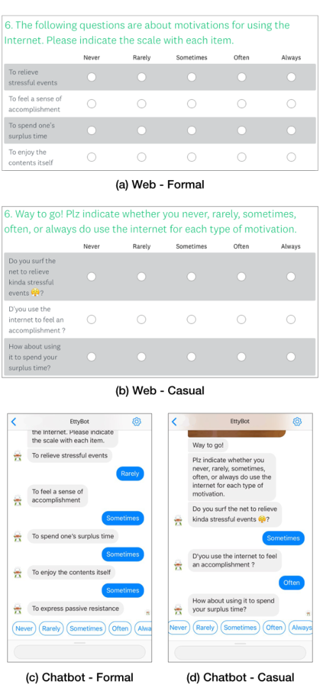
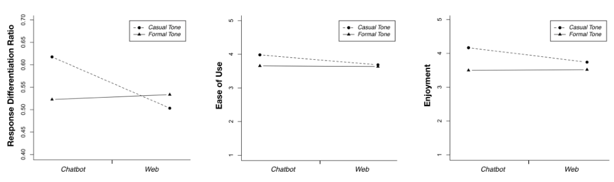

CHI 2019, May 4--9, 2019, Glasgow, Scotland, UK 

CHI 2019 Paper 

# **Comparing Data from Chatbot and Web Surveys** 

Effects of Platform and Conversational Style on Survey Response Quality 

|**Soomin Kim**|**Joonhwan Lee**|**Gahgene Gweon**|
|---|---|---|
|Seoul National University|Seoul National University|Seoul National University|
|Seoul, Korea|Seoul, Korea|Seoul, Korea|
|soominkim@snu.ac.kr|joonhwan@snu.ac.kr|ggweon@snu.ac.kr|

## **ABSTRACT** 

This study aims to explore the feasibility of a text-based virtual agent as a new survey method to overcome the web survey's common response quality problems, which are caused by respondents' inattention. To this end, we conducted a 2 (platform: web vs. chatbot) x 2 (conversational style: formal vs. casual) experiment. We used satisficing theory to compare the responses' data quality. We found that the participants in the chatbot survey, as compared to those in the web survey, were more likely to produce differentiated responses and were less likely to satisfice; the chatbot survey thus resulted in higher-quality data. Moreover, when a casual conversational style is used, the participants were less likely to satisfice--although such effects were only found in the chatbot condition. These results imply that conversational interactivity occurs when a chat interface is accompanied by messages with effective tone. Based on an analysis of the qualitative responses, we also showed that a chatbot could perform part of a human interviewer's role by applying effective communication strategies. 

## **CCS CONCEPTS** 

- **Human-centered computing** -> **User interface design** ; _User studies_ . 

## **KEYWORDS** 

Conversational agent; chatbot; human AI interaction; conversational interface; survey interface; user experience design 

Permission to make digital or hard copies of all or part of this work for personal or classroom use is granted without fee provided that copies are not made or distributed for profit or commercial advantage and that copies bear this notice and the full citation on the first page. Copyrights for components of this work owned by others than ACM must be honored. Abstracting with credit is permitted. To copy otherwise, or republish, to post on servers or to redistribute to lists, requires prior specific permission and/or a fee. Request permissions from permissions@acm.org. _CHI 2019, May 4--9, 2019, Glasgow, Scotland UK_ 

 2019 Association for Computing Machinery. ACM ISBN 978-1-4503-5970-2/19/05...$15.00 https://doi.org/10.1145/3290605.3300316 

### **ACM Reference Format:** 

Soomin Kim, Joonhwan Lee, and Gahgene Gweon. 2019. Comparing Data from Chatbot and Web Surveys: Effects of Platform and Conversational Style on Survey Response Quality. In _CHI Conference on Human Factors in Computing Systems Proceedings (CHI 2019), May 4--9, 2019, Glasgow, Scotland UK._ ACM, New York, NY, USA, 12 pages. https://doi.org/10.1145/3290605.3300316 

## **1 INTRODUCTION** 

Surveys are used to gather information from a large number of users through standardized questionnaires; diverse disciplines have adopted them as a representative research method. In HCI research, surveys are also used to gather users' attitudes or perceptions and to assess artifacts' usability [31, 32]. Modes of data collection for surveys have been adapted to technology and media environments. Surveys, which have been traditionally represented by face-to-face or telephone interviews, are evolving as a way to utilize the Internet in response to its explosive growth among the general population. Compared with traditional surveys, web-based surveys can collect and analyze large amounts of data quickly and economically. Web surveys are also less restrictive because respondents can access them at their convenience. Additionally, there are fewer measurement errors caused by the variability between interviewers, which can commonly occur in face-to-face and telephone surveys [20, 42]. Given such advantages, web surveys are presented as an alternative for overcoming the limitations of traditional survey methods. 

Despite these advantages, web surveys in particular do have some inevitable limitations, one of which is that they produce responses that are less reliable than those from faceto-face or telephone surveys due to respondents' insincere answers [50]. In face-to-face or telephone surveys, interviewers can encourage respondents to participate in the surveys [19], ask them to clarify their responses [19], clarify the questionnaires [9, 40], and monitor their answers to confirm their sincerity. However, a web survey is a self-administered method, so it is difficult for researchers to control respondents, thereby leading to unreliable or even inaccurate responses [12, 13, 39]. 

As described above, web surveys' response quality problem derives from respondents' feigned answers, which in turn occur because of the lack of an interviewer. If the lack 

Paper 86 

Page 1 

CHI 2019, May 4--9, 2019, Glasgow, Scotland, UK 

CHI 2019 Paper 

of an interviewer causes response quality problems in web surveys, we might ask whether a conversational agent can prevent such problems by partly performing the role of a human interviewer. In today's environment, in which conversational agents are used in everyday life [28], it is worth considering their possible use as virtual interviewers. In light of the growing trend toward conversational agents, we emphasize the conversational aspect that they provide, thus imbuing interactivity in a traditional survey system [36]. 

This study examines two aspects of interactivity in a survey system: reciprocal message exchange and conversational style. In particular, this study focuses on (a) how a survey's platform influences its response data quality and (b) how a survey's conversational style moderates the way in which the participants respond to different platforms. First, we compare response quality and usability for a chatbot survey and a web survey. The text-based chatbot used in this study is able to convey interactivity in the form of back-and-forth message exchanges with the user [36, 53]. Because conversational interaction facilitates cognitive functioning [52], this study's first hypothesis is that the chatbot survey participants, as compared to the web survey participants, exert a greater engagement and thus generate higher-quality responses. Second, as the survey platform only represents a surface-level variation, the second hypothesis is that conversational style moderates the relative effect of the survey platform. Specifically, this work examines whether conversational style (formal vs. casual) influences participants' responses and their survey experiences. 

We conduct a user study that employs quantitative and qualitative methods. The standard for evaluating data quality is based on satisficing theory, which assesses data quality in relation to the respondents' satisficing behavior [13, 22]. Giving optimal answers demands a high cognitive load, so some respondents use satisficing heuristics to reduce their cognitive burdens [22, 23]. This satisficing behavior creates a measurement error due to the resulting inaccuracies in the respondents' answers, thus leading to poor data quality. One representative satisficing behavior is non-differentiation in a rating task (i.e., a "straight-line" response). In this study, we use the differentiation response index as an objective metric to assess response quality [30]. We also measure the levels of usability (enjoyment and ease of use) as subjective ratings; we used it to estimate users' perceptions of their experiences with the survey system. Furthermore, we conduct qualitative thematic analysis for a deeper understanding of the chatbot respondents' behavior. 

This research makes several important contributions. First, our findings support the feasibility of conducting a survey with a text-based chatbot that provides some of a human interviewer's social function. Second, our findings extend the previous work, which is focused on responses to virtual 

interviewers' open-ended questions [2, 24, 27, 47] and on ethnographic data [47], by including Likert-scale responses. Third, our findings extend the work on data-quality evaluations which has focused on the degree of respondents' self-disclosure [2, 24, 27], comprehension [10], and qualitative feedback [47] by including non-differentiation ratio. 

## **2 RELATED WORK** 

## **Satisficing Behavior in Web Survey** 

In a web survey, respondents evaluate and respond to questionnaires by themselves. The advantage of this self-administered method is the ease of measurement. However, a self-administered survey is controversial for its validity due to several wellknown problems, one of which is respondents' satisficing behavior [22]. Inspired by Simon's [43] notion of satisficing, Krosnick [22] proposed that some respondents tend to generate satisfying responses instead of accurate responses to reduce their cognitive burden. This is because responding accurately and sincerely to the survey questions requires a high level of cognitive demands [23]. The representative satisficing behavior is non-differentiation or straight-lining, a non-discriminatory and equally responsive behavior in a battery of scaled questions. A response error occurs because of this distorted or inaccurate information provided by the respondent. Even if the sampling error is reduced by applying a sophisticated sampling method, the increasing response error leads to the low quality of the whole survey. 

Researchers have shown that web surveys tend to have higher response errors than offline surveys because web surveys are self-administered [50]. This means that online surveys are more likely to produce satisficing responses than offline surveys are. In an offline survey, human interviewers promote conscientious responses by discouraging careless behavior and encouraging participation [19]. These interviewers' verbal and nonverbal interactions draw the respondents' attention and allow them to appropriately answer each question [16]. However, these interactions are omitted in a web survey, which leads to satisficing responses. In fact, studies have found that online surveys are more likely than telephone survey and face-to-face surveys to be susceptible to satisficing behavior and to thus produce poor-quality data [12, 13, 39]. 

To summarize, scholars have theoretically and empirically proven that web survey respondents engage in more satisficing than do their counterparts in face-to-face or telephone surveys, as no _interactive process_ occurs in a web environment. To mitigate this problem, we focus in this study on conversational interactivity, which focused on reciprocal exchange of messages in a social interaction [36, 53]. When appropriate interaction is added to a noninteractive survey system, participants will be expected to exert more cognitive 

Paper 86 

Page 2 

CHI 2019, May 4--9, 2019, Glasgow, Scotland, UK 

CHI 2019 Paper 

engagement when answering the questions. In this paper, we examine whether this conversational interactivity operates when respondents are conducting a survey through a text-based chatbot which provides interviewer presence. Therefore, we test the following research question: 

- RQ. Can a chatbot platform with a relevant conversational style produce conversational interactivity, thus reducing the satisficing behavior that often occurs in noninteractive web surveys? 

## **Conversational Interaction with Text-based Chatbots** 

Conversational interfaces have become integral to modern communication [28]. The concept of conversational interactivity has numerous meanings in the various domains of HCI and CMC. In this study, we use the construct of _conversational interactivity_ to highlight a relational exchange between a respondent and a virtual interviewer [36]. Users can perceive interactivity from a sequence of back-and-forth exchanges when chatbots synchronously and socially react to those users' input. 

Chatbots that interact via auditory or textual methods are representative conversational agents and are being accepted in various fields. Although studies about conversational agents have tended to separate social and task-oriented interactions [7, 18], recent works have been undertaken to achieve both functional and interactive aspects [25]. Moreover, the popularity of chatbots in recent years has heightened the needs for facilitating interaction between human and chatbots, not only achieving functionality. This research trend of integrating instrumental and social goals is being applied in diverse domains including customer support [6, 17, 51], healthcare [21], and counseling [5, 11]. Recently, the approach of combining functionality and interactivity using text-based chatbots has been applied in the field of user research. For instance, Tallyn et al. [47] attempted to gather users' ethnographic data via a text-based chatbot to determine whether a chatbot can be used as an ethnographic tool by making up for the lack of a human ethnographer with interactivity. 

In line with previous studies, in this study, we proceed from an integrative perspective that combines instrumental usage and conversational interactivity rather than separating them. The goal of this study is to improve a survey's user experience through the use of an interactive conversational interface and by gathering high-quality user input. Taken together, we expect that: 

- H1. A chatbot survey, as compared to a web survey, will produce higher-quality response data (H1a), greater ease-of-use (H1b), and higher enjoyment (H1c). 

Although survey platforms can provide different levels of interactivity, the platform itself only represents a surfacelevel variation for manipulating conversational interactivity. To fill this void, we also examine the effect of message-level variation. Previous researchers have used text-based chatbots to manipulate message-related variables and thus improve conversational interactivity. These researchers have also shown an increased interest in improving chatbots' interactivity with empathic responses [17, 51] or typefaces [6] for use in customer-support situations. In these customercare situations, using an agent that can adjust itself to the customers' emotional needs is crucial. 

In healthcare and counseling, researchers have focused on chatbots' interpersonal strategies, as social dynamics are important in those situations. For example, a chatbot that was built for a childhood obesity intervention applied several social strategies [21]. It was able to efficiently perform its function of recommending ad-hoc tasks for obese patients by socially interacting with users. Similarly, researchers have used chatbots as mental health counselors that provide information and counseling and diagnose conditions through relational conversation [5]. Woebot, a text-based therapy chatbot, offers cognitive behavior therapy, which applies several social discourse strategies [11]. Participants in a chatbot condition experienced a significant reduction in depression, whereas participants who received information only in an ebook did not. 

As previous researchers have shown, the chosen method of improving conversational interactivity must be applicable to the characteristics of the task. In this study, we focus on providing the chatbot with a conversational style. Users consider not only with what a message is but also how it is delivered [4]. Moreover, it is known that the human interviewer's style influences the survey response quality and respondents' attitude in the context of human-human interaction. People prefer a friendly speaking interviewer, and when an interviewer is active, the participants are more actively participating in the survey [14]. Respondents also have a more favorable attitude toward an interpersonal and casual interviewer than a professional and formal interviewer [15]. In addition, considering that the survey used in this study is aimed at adolescent participants, it is likely more appropriate for the agent to be casual and friendly than formal. Thus, we test the following hypotheses: 

- H2. A casual conversational style, as compared to a formal conversational style, will produce higher-quality response data (H2a), greater ease-of-use (H2b), and higher enjoyment (H2c). 

However, conversational style may moderate the effect that a survey platform has on user experience and data quality. Because a traditional web survey usually adopts a formal 

Paper 86 

Page 3 

CHI 2019, May 4--9, 2019, Glasgow, Scotland, UK 

CHI 2019 Paper 

language style, the use of casual language in a web survey may engender embarrassment. On the other hand, a casual tone could be appropriate for a chatbot survey because users expect social interactions when using conversational agents [5, 17, 28, 51]. Thus, we propose the following hypothesis: 

- H3. The chatbot's data-quality and usability effects will be more pronounced when the survey uses a casual rather than formal conversational style. 

## **Virtual Agents as Interviewers** 

HCI researchers have developed survey methodologies that use new technologies. In this study, we implement a textbased chatbot as a new survey method. Researchers have improved the quality of user input through diverse methods and have applied several standards to evaluate the effects of virtual interviewers. These criteria vary depending on the characteristics and contexts of the interview. 

The most commonly used standard for evaluating data quality is the respondents' self-disclosure in open-ended interview situations. To date, the literature on this topic has included contradictory findings about respondents' selfdisclosure. Participants who believe that they are communicating with a computer were more willing to disclose their information than participants who believe that they are having an interview with a human interviewer in mental health contexts [27]. This is because people feel less fear about getting a negative evaluation. Similarly, people have shown to more willingly expose their sensitive information and to evaluate the interview process as being more pleasant when communicating with a wordiness agent as compared to a taciturn agent [2]. On the other hand, this self-disclosure effect does not exist when embodied agents ask respondents sensitive questions. Participants have been shown to expose more information to a computer-assisted, voice-only interface than to an embodied virtual interviewer or a human interviewer, as they perceive greater anonymity in the absence of facial representation [26]. Tourangeau et al. [49] also found that, in a web survey, people disclose less information regarding sensitive topics, such as cocaine and marijuana use, when the interface is more humanized. Researchers have also studied the degree of respondents' disclosure to virtual interviewers with different personalities. The participants were more likely to divulge information to a virtual agent that had a reserved and assertive personality than to one with a warm and cheerful personality [24]. Indeed, many scholars have focused on respondents' information disclosure in response to sensitive questions, as anonymity is important in such interviews. This implies that it is essential to configure a proper evaluation index for each interview situation. 

Meanwhile, Conrad et al. [10] applied a new standard to evaluate data quality for questions regarding less sensitive 

and more mundane topics. Instead of measuring the respondents' disclosure, the researchers used objective measures such as the number of requests for clarification, response accuracy and gaze behavior to detect the respondents' comprehension and engagement. Conrad et al. found that agents with high dialogue capability produced more accurate answers and more conscientious task performance, irrespective of the agents' facial expressions. 

The researchers in the above studies have provided a theoretical and empirical basis for virtual agents to perform as interviewers. However, the literature on virtual interviewers has largely focused on open-ended interview situations. They have not dealt with the effects of virtual interviewers in a structured survey with scaled items. The present study was conducted to fill this gap in the lack of research by examining the utility of a virtual interviewer for a structured survey. In addition, we apply a different measure to evaluate user input quality---one that is more suitable for use with Liker-scaled questionnaires. Our work has implications for determining how best to introduce the appropriate criteria for scale survey items so as to verify the effectiveness of the virtual interviewer. 

## **3 METHOD** 

## **Design and Procedure** 

This study uses a 2 (platform: web vs. chatbot) x 2 (conversational style: formal vs. casual) between-subjects design. We randomly assigned the participants to one of the four conditions. Participants in both conditions responded to the same questionnaire. The questionnaire was composed of demographic information and questions on Internet usage behavior which was developed by the National Information Society Agency of Korea [1]. The questionnaires were composed of the following items: internet usage (10-item), usage motivation (18-item), individual context (18-item), family context (24-item), and society context (16-item). The questions on internet usage were asked on a 4-point scale, whereas the other questions were in the 5-point scale. After completing the main questionnaire, follow-up questions about the usability and perception of the survey system were requested. 

## **Participants** 

The experiment was conducted for adolescents in Korea since the applied survey questionnaires are developed for teenagers. A total of 117 adolescents participated in our study ( _Mae_ = 17.81, _SDae_ = 1.47; 51% female), all of whom are using Facebook messenger and have experienced a web survey. The qualification for the use of messenger and web questionnaire was made to partially control for the prior experience of the survey system used in our experiment. 

Paper 86 

Page 4 

CHI 2019, May 4--9, 2019, Glasgow, Scotland, UK 

CHI 2019 Paper 

<!-- Start of picture text -->
6. The following questions are about motivations for using the Internet. Please indicate the scale with each item. hiner Rady Sometimes ten liye Toeela sense of cowie     contentsToenjytheitself      {a) Web - Formal (6. Way to go! Plz indicate whether you never, rarely, sometimes, loften, or always do use the internet for each type of motivation. ver Ray Sometines ten atays Dyouusethe imerettofedan     sccomplishment? (b) Web - Casual < fp e| {k ce) tre tere esse nocate {he sea with ach Kor pore FE Toroteve sss eens me sea a 'ToScconpeneet feel a sense of oe 'evrthenroto rh,oc r ealanys,  sometines,do se he (orci: 1sany thtow FE Tospendone's supts tine cD [ soncines ) $e 'Dyouusethmaccametshn e nintretof FE Toenoyhe contents st Fr ToemreespassneresstinceeS || Ge Howyourauphs about usingtine? it to spend . (Gees) (exes) GennG e n)s) Gnd eve) ary)(Gemmtes)(Ota) (ars () Chatbot - Formal (d) Chatbot - Casual <!-- End of picture text -->

**Figure 1: Examples of 4 experimental conditions of 2 (platform: web vs. chatbot)** x **2 (conversational style: formal vs. casual) between-subjects design. All questionnaires are translated from Korean.** 

## **Manipulation of Survey Platform** 

We encouraged the web survey participants to answer the survey questions via a web survey instrument, SurveyMonkey. This web survey could be completed using either a desktop computer or a mobile device. Examples of the web survey 

are presented in Figure 1 (a) and (b). As shown, we used a grid format to ensure the same scaled options were used for multiple items; this helps to avoid repeating information. 

For the chatbot survey, we designed a chatbot agent that would run on Facebook Messenger. Participants interacted with the chatbot according to the survey flow, as shown in Figure1 (c) and (d). The chatbot survey could be completed on either a desktop computer or a mobile device. 

## **Manipulation of Conversational Style** 

The conversational style intervention consisted of two conditions: formal and casual. We changed the conversational style by manipulating the text of the survey [8, 44]. 

_Formal Conversational Style._ A formal tone involves literary language with a standardized form and proper grammar and punctuation. This differs from the casual style, which includes everyday, informal language [8, 44]. For the formal condition, we used the original survey items, as they were written in formal language. 

_Casual Conversational Style._ In the casual conversational style, we applied colloquial rather than formal language so as to present a casual and friendly tone. Moreover, a casual style includes shortcuts (such as those commonly found in text messaging) and incorrect grammar and punctuation [8, 44]. For example, we used common expression used in everyday life (e.g., formal, _"Please go on to the next section,"_ vs. casual, _"Way to go! Let's go to the next step!"_ ) and abbreviation (e.g., _"D'you," "RU"_ ). In addition, we changed the survey items that were written (in the formal style) as a noun phrase or declarative sentence to interrogative sentences for the casual style (e.g., formal, _"To relieve stressful events,"_ vs. casual, _"Do you surf the net to relieve kinda stressful events?"_ ). 

Although we focus primarily on operationalizing conversational style through language use, we also include occasional emojis to convey a casual tone [48]. In CMC settings, users often supplement text messages with visual cues such as emojis and emoticons, thus improving communication and expressing intimacy and social information [38]. Similarly, in this study, we use emojis because a language style by itself is not sufficient to convey casualness in a CMC setting (Figure 1 (d)). 

## **Pretest for Survey Reliability** 

Although we applied different conversational style, the contents of the survey items were hardly changed for the chatbot survey to maintain the internal meaning of the original questionnaire (e.g., formal item, _"To spend Time,"_ vs. casual item: _"D'you use the Internet to spend time?"_ ). A pretest was performed with test-retest reliability for 10 pretest participants to verify whether the two versions of the survey are identical, resulting in a significant reliability coefficient ( _r_ = 0.91). 

Paper 86 

Page 5 

CHI 2019, May 4--9, 2019, Glasgow, Scotland, UK 

CHI 2019 Paper 

## **Measures** 

_Dropout Rate._ We computed the dropout rate by calculating the percentage of respondents who quit before the study was completed. Because both the surveys could be easily accessed, we could maintain relationships with the respondents during the experiment. We sent messages to any participants who did not submit the survey within three days after they had agreed to start the survey, asking them to call-back. Thus, the dropout rate was defined as the percentage of all participants who did not complete the survey after one call-back request. 

_Non-differentiation._ Several measures can be used to estimate response quality, including the DK response rate, the item nonresponse rate, and the non-differentiation index [13]. We excluded DK response rate because our survey questions had no DK options. We also excluded the item nonresponse rate from this study because we also applied this condition of nonresponse disallowance. 

Instead, we adopted the level of non-differentiation, based on a battery of scaled items, as a measure of data quality. We calculated the index of response differentiation _rho_ to infer the degree of non-differentiation for each of the 13 item batteries using rating scales [30]. We used the average of these 13 rates as the dependent variable. According to this scale, the index is 0 if a respondent answers with the same scale for all items and approaches to 1 if a respondent answers with a different scale for each item. Thus, a higher _rho_ value indicates that a respondent more strongly differentiates the response options; this could be regarded as a lower degree of satisficing [22]. 

_Usability._ For the usability constructs on post-test measure, ease of use and enjoyment levels were measured. We adopted these subjective usability ratings to complement the objective differentiation index. In several studies examining virtual agent's usability and effects, researchers have used single or double items to measure their variables [25, 35, 41]; thus, we also used two items each to measure ease of use and enjoyment. The two questions asking ease of use were used: "The survey system is easy to use," and "Using the survey system is effortless" [29]. Moreover, enjoyment level was measured with two questions which are "I am satisfied with the survey system." and "It is fun to use the survey system" [29]. These items were scored using a 1 to 5 Likert scale. 

_Qualitative Responses._ We gathered qualitative responses using open-ended questions to gain more insight into the users' perceptions regarding the survey system. We focused our qualitative analysis on a chatbot survey system which we introduced as a new survey method. The chatbot survey participants were asked about their experience using the chatbot (e.g., the best and worst aspects of using it, the difference in experience compared to web surveys, perceived impressions, perceived personality, and whether they prefer 

the web survey or the chatbot survey). Since we recruited the participants who have experience in web surveys, the difference in experience between the two systems were also asked to compare the web survey and the chatbot survey. 

## **Data Analysis** 

A total of 106 participant data were statistically analyzed, except for 11 participants who did not complete the experiment (three for the formal web survey, two for the casual web survey, four for the formal chatbot survey and two for the casual chatbot survey). We used factorial ANOVA to test whether the main effects and interaction effect exist. Before conducting statistical analysis, we examined if ANOVA assumptions were qualified in our data. A homoscedasticity test was conducted to evaluate the homogeneity assumption using the Brown-Forsythe test which revealed that all variables did not show significant differences in variance. 

For the qualitative responses, we conducted a thematic analysis in which we structured the collected text responses through coding, with units for the main subjects [3]. Two researchers conducted this thematic analysis. The results of this process provided a deeper understanding of the participants' chatbot usage behavior. 

## **4 RESULTS** 

## **Manipulation Check for Conversational Style** 

To establish if the survey applying a casual tone is perceived as more casual and friendly, as compared to that using a formal tone, participants were asked to rate the survey system on 10-point differential scales: formal / casual [44] and serious / friendly [24]. An independent samples _t_ -test for the averaged ratings significantly supports the manipulation of conversational style. Perceived casualness was greater in the casual tone-of-voice condition ( _Mcasual_ = 7.83, _SDcasual_ = 2.10) compared to the formal tone-of-voice condition ( _Mf ormal_ = 3.96, _SDf ormal_ = 1.87), _t_ (104) = 3.56, _p_ < 0.001. 

## **Descriptive analysis** 

_Response Time._ Both web survey and chatbot survey automatically recorded a timestamp. The web survey participants achieved a significantly faster time to complete the survey ( _Mweb_ = 17' 30'' , _SDweb_ = 2' 52'' ) than the chatbot survey participants ( _Mchatbot_ = 26' 44'' , _SDchatbot_ = 5' 05'' ). Five respondents in chatbot condition were excluded from this analysis since their completion time took more than 23 hours. These participants completed the survey over 24 hours. This response pattern reflects the advantage of the chatbot that respondents can easily reconnect to messenger and reply from the part where they stopped. 

Paper 86 

Page 6 

CHI 2019, May 4--9, 2019, Glasgow, Scotland, UK 

CHI 2019 Paper 

**Table 1: Descriptive Analysis** 

||**Casual**|**Chatbot**|**Formal**|**Chatbot**|**Casua**|**l Web**|**Form**|**al Web**|
|---|---|---|---|---|---|---|---|---|
|Variable|_M_|_SD_|_M_|_SD_|_M_|_SD_|_M_|_SD_|
|Response Differentiation|0.62|0.08|0.52|0.07|0.50|0.09|0.53|0.09|
|Ease of Use|3.98|0.79|3.65|0.76|3.69|0.62|3.64|0.66|
|Enjoyment|4.17|0.73|3.50|0.87|3.74|0.61|3.52|0.82|

_Note:_ The value of response differentiation index distributes between 0 and 1, a higher value indicates more differentiation. 

<!-- Start of picture text -->
2 . -@ Casual Tone  -@ Casual Tone  -@ Casual Tone 2. = Roms Ramat Ramat &: . &  oe . forte - Tey as a 8 z . es, :Be8 an 5 * a5. 38 . 3 5 " s Be gs &  3 ___,---____hater web ~ Chater web ~ Chator eo <!-- End of picture text -->

**Figure 2: Results of Factorial ANOVA. The platform has a significant main effect on the differentiation ratio. The chatbot survey is thus more likely than the web survey to produce differentiated responses and less likely to induce satisficing behavior, thus resulting in higher-quality data. A significant interaction effect exists between platform and conversational style. Speech tone has different effects in the web and chatbot surveys.** 

_Dropout Rate._ It was found that 5 of 58 web survey participants dropped the survey (8.6% dropout rate); 6 of 59 chatbot survey participant dropped the survey (10.2% dropout rate). Two conditions have shown no significant difference in dropout rate. The reason for the low dropout rate in both conditions is maybe because the participants were in an experimental situation rather than the general environment in which the survey is conducted. They showed a high completion rate in both conditions since they voluntarily participated in the experiment. This result may differ in real survey settings and should be verified with a larger population. 

## **Non-differentiation** 

How did the respondents' response quality differ across the survey conditions? The 2 (web vs. chatbot) x 2 (formal vs. casual) ANOVA for the general response differentiation index _rho_ yields main effect for the survey platform ( _F_ (1, 102) = 9.83, _p_ < 0.01) but not for the conversational style ( _F_ (1, 102) = 3.84, _p_ = 0.053). Thus, H1a is supported, but H2a is not. The respondents in the web survey condition provided less differentiation than did the respondents in the chatbot survey condition (Table 1). As mentioned, a higher _rho_ value 

indicates that a respondent more strongly differentiates their response options which could be regarded as a lower degree of satisficing. Therefore, the chatbot survey participants were more likely to answer in a less satisficing way than were the web survey participants; the chatbot survey participants thus provided divergent responses. 

This difference in satisficing response between the two conditions can be explained by a difference in interactivity. The chatbot survey features a conversational interface, whereas the web survey employs a table matrix. In the latter interface, similar questions are grouped in a grid form; respondents may thus lose their attention and answer inadvertently when similar types of questions are repeatedly presented. On the other hand, when these questions are displayed in a conversational interface, respondents perceive the questions as interpersonal interactions rather than as tasks to complete, so they focus more on the survey questions and are more engaged. 

We also conducted independent samples _t_ -test to compare the chatbot and web conditions with identical tone-of-voice. Regarding casual conversational style, an analysis of the 

Paper 86 

Page 7 

CHI 2019, May 4--9, 2019, Glasgow, Scotland, UK 

CHI 2019 Paper 

general response differentiation index _rho_ reveals that the respondents in the web survey condition provide less differentiation than do those in the chatbot survey condition ( _t_ (52) = 4.71, _p_ < 0.001). However, this effect disappears in the formal conversational style ( _t_ (50) = 0.48, _p_ = 0.63). It is noteworthy to mention that there is no significant difference between the two platforms when the formal conversational style is applied. This result suggests that the significant effect of the platform is caused by the combination of the platform and the conversational style. 

The 2 x 2 ANOVA reveals a significant interaction between the survey platform and the conversational style ( _F_ (1, 102) = 14.33, _p_ < 0.001), supporting H3 (see Figure 2). When participants take a survey with a chatbot, a casual style drives more differentiated answer than do formal style (Table 1). In contrast, in a web survey condition, participants do not differ in their response quality whether conversational style is casual or formal (Table 1). 

To summarize, the conversational style influences the respondents' satisficing behavior in the chatbot condition but not in the web condition. In the chatbot survey, a casual conversational style increases the differentiation in the participants' responses. However, in the web survey, a casual conversational style does not change the level of differentiation. This means that the effect of the conversational style depends on the survey platform. The humanlike conversational style only has effects on the chatbot survey. Regarding the main effect of the survey platform, the chatbot survey's effect on data quality is not merely caused by the external interface feature. The main effect is derived since the chatbot interface is accompanied by the casual conversational style. 

## **Usability** 

Analysis of ease of use reveals that there are no significant main effects for platform ( _F_ (1, 102) = 1.306, _p_ = 0.256) and conversational style ( _F_ (1, 102) = 1.877, _p_ = 0.174). There is no difference of ease of use between the chatbot condition and the web condition; the casual style and the formal style. Also, there is no significant interaction effect of survey platform and conversational style on ease of use ( _F_ (1, 102) = 1.007, _p_ = 0.32). Thus, H1b and H2b are all rejected. The survey systems are quite similar in terms of interface usability regardless of platform and conversational style. 

The factorial ANOVA reveals that conversational style has a main effect on enjoyment ( _F_ (1, 102) = 8.967, _p_ < 0.01) but that survey platform does not ( _F_ (1, 102) = 1.880, _p_ = 0.17). Thus, H1c is not supported, but H2c is supported. There is no observed significant interaction between platform and conversational style in terms of enjoyment ( _F_ (1, 102) = 2.253, _p_ = 0.136), thus partially rejecting H3. 

## **Qualitative Results** 

The thematic map was constructed based on the participants' responses for the questions. The result of the intercoder reliability test showed a strong agreement (Cronbach's _alpha_ = 0.81). Four major themes are as follows: 

_Not Task but an Interaction._ The first theme that emerged was the conversational interactivity of a chatbot. The users perceived the act of conducting a survey with a chatbot as a social interaction rather than as a task. One in the casual chatbot condition reported, _"I did not feel like the chatbot as a robot, but I felt like talking to a real person,"_ and another in the same condition said, _"It was like having a conversation with a friend because I received a reply in real time."_ However, this effect was not only observed in casual formal chabot survey participants: _"I was disappointed because it seemed that they just moved existing survey to the messenger."_ 

A possible interpretation is that converting survey questionnaires to social interactions by using adequate interface and conversation strategy helps users to focus on the questions. This corresponds with the notion that users expect conversational interaction even when they are doing a functional task [25]. Conversational interactivity interactions can convert mechanical work into social interaction, increasing user engagement and enjoyment. We conveyed conversational interactivity by harmonizing the survey interface and message characteristics in the casual chatbot condition. 

_A Casual Tone-of-Voice Heightens Intimacy for Chatbot Users._ This study's results revealed that users perceived this interaction effect to mainly be the result of the chatbot's personality. The participants in the casual chatbot condition felt intimacy with the chatbot because of its friendly manner and described it as _"friendly," "kind," "warm," "empathetic,"_ and _"understanding."_ The chatbot's casual conversational style made the users feel comfortable and engaged in their conversations. One participant reported, _"The chatbot was kind enough to answer the question easily."_ On the other hand, participants in the formal chatbot condition demonstrated the chatbot's impression as _"stiff," "unfriendly," "boring,"_ and _"rigorous."_ One participant mentioned that _"I did not feel like chatting because the conversation tone was rigid."_ However, these results can not be generalized to other ages or other environments, although our results correspond with previous studies [5, 14, 15]. For example, the current casual conversational style can have a negative effect on the senior or professional group. Therefore, it is necessary to conduct further research on users with different backgrounds. 

_Playful Interaction Creates Engagement._ A number of users in the casual chatbot condition mentioned that they enjoyed having conversations with the chatbot. This enjoyment was 

Paper 86 

Page 8 

CHI 2019, May 4--9, 2019, Glasgow, Scotland, UK 

CHI 2019 Paper 

derived from new experiences, as well as from the conversational interactivity. One participant who used a conversational agent for the first time mentioned, _"It was a fun and cool experience to talk to a robot with the messenger."_ Another user stated that having a conversation with a friendly agent was a pleasant experience: _"It has been a long time that I have a conversation with someone for a long time. I really enjoyed it."_ Additionally, the emojis engaged the users' attention. One participant said, _"The emojis showing off in the middle of the conversation did not make me bored,"_ while another added that the _"I think the chatbot is witty because he uses proper emojis"_ These results support that an agent's playful interaction enables users' continuous use intention although the chatbot is created for instrumental use [25, 28]. 

_Easy Access Through Mobile Devices._ Ease of accessibility is another advantage of the chatbot survey. We did not consider accessed devices in this study, but many users noted that the chatbot was comfortable to use because it was easy to access via mobile devices. Users could adjust the reconnection time for convenience and could easily continue interrupted conversations: _"It was nice to do a survey with a smartphone,"_ and _"I felt convenience because I can do it in my spare time over several times."_ Although the web survey could also be completed on mobile devices, it is inconvenient for users, after an interruption, to reopen the browser window, reconnect to the system, and log in again. However, because the chatbot conducts conversations within the messaging window, it has the advantage that its interactions can be resumed at any time that a user wants. 

## **5 DISCUSSION** 

The current study operationalizes conversational interactivity not just at the level of the survey interface but also at the level of the message. We propose that conversational interactivity decreases respondents' satisficing behavior, thus producing high-quality data. Still, it is worth noting that the chat interface leads to this interactivity only when accompanied by an appropriate conversational style. The casual conversational style, as compared to the formal style, elicits less satisficing behavior from the chatbot survey users but not from the web survey users. This implies that a casual tone is appropriate for a chatbot system, as it helps users recall human-to-human interaction. 

_Reciprocal Message Exchange and Conversational Style._ Researchers have not yet considered the differences in users' responses to noninteractive and interactive questions in much detail. We emphasize the conversational aspect as a way to impart interactivity to static items which are common in web surveys. A discrepancy in interactivity may affect the respondents' engagement [52], thus leading to differences in data quality and user enjoyment. This study shows that chatbot 

respondents make a greater engagement than other respondents when answering questions, as the chatbot platform includes a reciprocal message exchange [45]. This is because the chat interface may heighten the sense of back-and-forth messages in the mind, thus driving user engagement [46]. 

However, a web survey's interface has a lower level of interactivity compared to a chatbot survey's interface because of its absence of reciprocal message exchange. Although the same information and content are presented in those survey systems, a web survey displays information in the form of predefined questions and answer choices, while a chatbot survey constructs the same questions and answers in the form of threaded messages. Thus, the chatbot survey may help overcome the socio-emotional deficiencies of static, online surveys by conveying interactivity to users 

It is worthwhile to note that conversational interactivity generated not only by adopting an external chatting interface but also by crafting an internal message feature (conversational style). Regarding the conversational interface, a reciprocal message exchange between the chatbot and the user can engender conversational interactivity. However, this interactivity occurs only when the messages are delivered in a friendly, humanlike manner. In this study, although reciprocal message exchanges boost the perceived interactivity of the chatbot survey, a well-manipulated conversation could enhance it even more. Therefore, each message should be properly tailored to the chatbot platform so as to imbue the exchange with conversational interactivity. The results of our study correspond to those of earlier studies, which proved the effects of virtual agents' conversational capability [2, 10]. This study makes a significant contribution due to its novel manipulation of conversational interactivity in the form of both message platform and conversational style. 

_Chatbot as a Social Actor._ Why is proper conversational style required in a non-administered chatbot survey? For a conversational agent to partially supplant a human interviewer, it is essential that the users recognize a virtual agent as a social actor. According to the computers are social actors (CASA) paradigm, people use similar social rules when dealing with computers and people; in other words, the ways in which humans react to computers are much like the ways in which they react to people [37]. Researchers in the CASA paradigm have assumed that, because a computer agent and a human have similar features, the users' social responses are amplified, thus enabling effective interaction with computers [33]. Embedding appropriate conversational style into a chatbot allows participants to perceive a high level of social presence. This heightened social presence can influence the interactivity of the conversation. This study's qualitative responses indicate that participants anthropomorphize chatbot agents as social actors when those chatbots use casual 

Paper 86 

Page 9 

CHI 2019, May 4--9, 2019, Glasgow, Scotland, UK 

CHI 2019 Paper 

language and properly adopt interpersonal communication strategies [11, 24]. Asking questions in a smooth tone also appears to lead to sincere answers. One reported, _"It was nice that questions were designed to answer honestly."_ 

Additionally, the interview context and the users' characteristics should also be considered when building a survey system so as to provide them with satisfaction. Because participants of this study were adolescents who were familiar with mobile IM service, most of the participants positively evaluated both the chatbot and their experience talking with it. They also prefer the chatbot with casual and friendly characteristics. However, the chatbot's character in this study would not be proper for users of all backgrounds. Our findings are in contrast to the results of Li et al. [24] which found that people were more willing to confide in and listen to an assertive agent rather than a friendly agent. This personality preference may due to the interview situation of job recruitment. Therefore, each chatbot's character should be based on its target audience and on the attributes of the survey. 

_Relational and Instrumental Goals._ The effects of conversational interactivity also can be interpreted from the perspective of a chatbot's relational and instrumental goals. With survey questions embedded into dialogue, participants might perceive the survey as a conversational exchange of questions and answers rather than as a task to be completed. This corresponds with previous research in which users enjoyed having playful interactions with a chatbot even though its main purpose was to execute a propositional task [25]. By grafting relational interaction onto a survey task, we intend to increase user involvement, thus improving data quality. To summarize, our work supports the notion that functionality and social interactivity are complementary rather than separate [7, 25]. 

_Comparison with Previous Work and Contribution._ Our main contribution in this work is the exploration of a possible text-based chatbot method for gathering user data. The results of this study support previous findings that a virtual agent can be used as an interview method. Our findings advance this line of research by addressing the following issues. First, extending previous work in which researchers focused on gathering ethnography [47] and responses to open-ended questions [24], the current study examined the feasibility of using a chatbot interviewer in a structured survey with Likert scale items. Second, It is also worth considering that our experiment was conducted in the real world. We applied a virtual agent system in a real-world setting and, unlike the researchers in previous studies, did not impose any space-time constraints. We were able to better understand authentic user interactions with a virtual agent by using this method. Third, we examined the effects of conversational interactivity by controlling the virtual agent's exterior features. 

Most researchers in the field of virtual interviewers have focused on embodied agents with exterior features [2, 10, 27]. Providing a physical appearance heightens a virtual agent's perceived level of social presence, making people more likely to consider the agent a social actor [34]. However, we discovered that users could perceive the virtual agent to be a relational partner with a social presence through the use of well-tailored textual messages as well. 

_Limitations and Future Study._ Some work remains to be done before applying text-based virtual agents to actual research. One of the limitations is that users may feel discouraged if their relational expectations toward the chatbot are not satisfied. This suggests that a key challenge in using chatbots could be the "gulf of execution [28]." Indeed, one user reported, _"Chatbot asked me the similar question over and over again, even though I gave a proper answer."_ Because users perceived having a conversation with the chatbot as social interaction, they expected that the chatbot would understand their words. In a survey, multiple items are used to measure each construct to ensure the internal validity. However, such repeated questions can disappoint users of a chatbot survey system. Therefore, a new standard for obtaining measurement validity should be determined to satisfy users' relational expectations. In addition, several unexpected inconveniences in the chatbot survey interface were revealed in this study, including was the impossibility of modifying an answer. This could be improved by asking the user to affirm that their answers are correct. For example, a chatbot could summarize the respondent's answers at the end of the survey and ask if the user would like to change the original answers. Our work provides future avenues for improving the chatbot survey system. 

## **6 CONCLUSIONS** 

Overall, a text-based chatbot can be a new and promising method of gathering quantitative survey data. Our study showed that the chatbot survey participants' responses were less satisficing, producing high-quality data. Moreover, transforming a survey into an interaction encourages user engagement, which leads to high-quality data. Taken together, these findings provide support for the feasibility of using a textbased chatbot as a virtual interviewer. 

## **ACKNOWLEDGMENTS** 

This work was supported by the National Research Foundation of Korea (NRF) grant funded by the Korea government (MSIT) (no.2015M3C7A1065859) and by Institute for Information & communications Technology Promotion(IITP) grant funded by the Korea government(MSIT) (No.2018-0-00693, Broadcasting News Contents Generation based on Robot Journalism Technology). 

Paper 86 

Page 10 

CHI 2019, May 4--9, 2019, Glasgow, Scotland, UK 

CHI 2019 Paper 

## **REFERENCES** 

- [1] National Information Society Agency. 2011. _Third Standardization of Korean Internet Addiction Proneness Scale_ . Seoul, Korea: National Information Society Agency. 

- [2] M Astrid, Laura Hoffmann, Jennifer Klatt, and Nicole C Kramer. 2011. Quid pro quo? Reciprocal self-disclosure and communicative accomodation towards a virtual interviewer. In _International Workshop on Intelligent Virtual Agents_ . Springer, 183--194. 

- [3] Virginia Braun and Victoria Clarke. 2006. Using thematic analysis in psychology. _Qualitative research in psychology_ 3, 2 (2006), 77--101. 

- [4] Susan E Brennan. 1998. The grounding problem in conversations with and through computers. _Social and cognitive approaches to interpersonal communication_ (1998), 201--225. 

- [5] Gillian Cameron, David Cameron, Gavin Megaw, Raymond Bond, Maurice Mulvenna, Siobhan O'Neill, Cherie Armour, and Michael McTear. 2017. Towards a chatbot for digital counselling. In _Proceedings of the 31st British Computer Society Human Computer Interaction Conference_ . BCS Learning & Development Ltd., 24. 

- [6] Heloisa Candello, Claudio Pinhanez, and Flavio Figueiredo. 2017. Typefaces and the Perception of Humanness in Natural Language Chatbots. In _Proceedings of the 2017 CHI Conference on Human Factors in Computing Systems_ . ACM, 3476--3487. 

- [7] Justine Cassell and Timothy Bickmore. 2003. Negotiated collusion: Modeling social language and its relationship effects in intelligent agents. _User modeling and user-adapted interaction_ 13, 1-2 (2003), 89-- 132. 

- [8] Ann Colley, Zazie Todd, Matthew Bland, Michael Holmes, Nuzibun Khanom, and Hannah Pike. 2004. Style and content in e-mails and letters to male and female friends. _Journal of Language and Social Psychology_ 23, 3 (2004), 369--378. 

- [9] Frederick G Conrad and Michael F Schober. 2000. Clarifying question meaning in a household telephone survey. _Public Opinion Quarterly_ 64, 1 (2000), 1--28. 

- [10] Frederick G Conrad, Michael F Schober, Matt Jans, Rachel A Orlowski, Daniel Nielsen, and Rachel Levenstein. 2015. Comprehension and engagement in survey interviews with virtual agents. _Frontiers in psychology_ 6 (2015), 1578. 

- [11] Kathleen Kara Fitzpatrick, Alison Darcy, and Molly Vierhile. 2017. Delivering cognitive behavior therapy to young adults with symptoms of depression and anxiety using a fully automated conversational agent (Woebot): a randomized controlled trial. _JMIR mental health_ 4, 2 (2017). 

- [12] Scott Fricker, Mirta Galesic, Roger Tourangeau, and Ting Yan. 2005. An experimental comparison of web and telephone surveys. _Public Opinion Quarterly_ 69, 3 (2005), 370--392. 

- [13] Dirk Heerwegh and Geert Loosveldt. 2008. Face-to-face versus web surveying in a high-internet-coverage population: Differences in response quality. _Public Opinion Quarterly_ 72, 5 (2008), 836--846. 

- [14] Kenneth Heller, John D Davis, and Roger A Myers. 1966. The effects of interviewer style in a standardized interview. _Journal of Consulting Psychology_ 30, 6 (1966), 501. 

- [15] Ramon Henson, Charles F Cannell, and Sally Lawson. 1976. Effects of interviewer style on quality of reporting in a survey interview. _The Journal of Psychology_ 93, 2 (1976), 221--227. 

- [16] Allyson L Holbrook, Melanie C Green, and Jon A Krosnick. 2003. Telephone versus face-to-face interviewing of national probability samples with long questionnaires: Comparisons of respondent satisficing and social desirability response bias. _Public opinion quarterly_ 67, 1 (2003), 79--125. 

- [17] Tianran Hu, Anbang Xu, Zhe Liu, Quanzeng You, Yufan Guo, Vibha Sinha, Jiebo Luo, and Rama Akkiraju. 2018. Touch Your Heart: A Toneaware Chatbot for Customer Care on Social Media. In _Proceedings of_ 

_the 2018 CHI Conference on Human Factors in Computing Systems_ . ACM, 415. 

- [18] Mohit Jain, Ramachandra Kota, Pratyush Kumar, and Shwetak N Patel. 2018. Convey: Exploring the Use of a Context View for Chatbots. In _Proceedings of the 2018 CHI Conference on Human Factors in Computing Systems_ . ACM, 468. 

- [19] Timothy P Johnson, Michael Fendrich, Chitra Shaligram, Anthony Garcy, and Samuel Gillespie. 2000. An evaluation of the effects of interviewer characteristics in an RDD telephone survey of drug use. _Journal of Drug Issues_ 30, 1 (2000), 77--101. 

- [20] Sara Kiesler, Jane Siegel, and Timothy W McGuire. 1984. Social psychological aspects of computer-mediated communication. _American psychologist_ 39, 10 (1984), 1123. 

- [21] Tobias Kowatsch, Marcia Nien, Chen-Hsuan I Shih, Dominik Ruegger, Dirk Volland, Andreas Filler, Florian Kunzler, Filipe Barata, Severin Hung, Dirk Buchter, et al. 2017. Text-based Healthcare Chatbots Supporting Patient and Health Professional Teams: Preliminary Results of a Randomized Controlled Trial on Childhood Obesity. In _Persuasive Embodied Agents for Behavior Change (PEACH2017)_ . ETH Zurich. 

- [22] Jon A Krosnick. 1991. Response strategies for coping with the cognitive demands of attitude measures in surveys. _Applied cognitive psychology_ 5, 3 (1991), 213--236. 

- [23] Jon A Krosnick. 1999. Survey research. _Annual review of psychology_ 50, 1 (1999), 537--567. 

- [24] Jingyi Li, Michelle X Zhou, Huahai Yang, and Gloria Mark. 2017. Confiding in and Listening to Virtual Agents: The Effect of Personality. In _Proceedings of the 22nd International Conference on Intelligent User Interfaces_ . ACM, 275--286. 

- [25] Vera Q Liao, Muhammed Masud Hussain, Praveen Chandar, Matthew Davis, Marco Crasso, Dakuo Wang, Michael Muller, Sadat N Shami, and Werner Geyer. 2018. All Work and no Play? Conversations with a Question-and-Answer Chatbot in the Wild. In _Proceedings of the 2018 CHI Conference on Human Factors in Computing Systems (CHI'18). ACM, New York, NY, USA_ , Vol. 13. 

- [26] Laura H Lind, Michael F Schober, Frederick G Conrad, and Heidi Reichert. 2013. Why do survey respondents disclose more when computers ask the questions? _Public opinion quarterly_ 77, 4 (2013), 888--935. 

- [27] Gale M Lucas, Jonathan Gratch, Aisha King, and Louis-Philippe Morency. 2014. It's only a computer: Virtual humans increase willingness to disclose. _Computers in Human Behavior_ 37 (2014), 94--100. 

- [28] Ewa Luger and Abigail Sellen. 2016. Like having a really bad PA: the gulf between user expectation and experience of conversational agents. In _Proceedings of the 2016 CHI Conference on Human Factors in Computing Systems_ . ACM, 5286--5297. 

- [29] Arnold M Lund. 2001. Measuring usability with the use questionnaire12. _Usability interface_ 8, 2 (2001), 3--6. 

- [30] John A McCarty and Larry J Shrum. 2000. The measurement of personal values in survey research: A test of alternative rating procedures. _Public Opinion Quarterly_ 64, 3 (2000), 271--298. 

- [31] Hendrik Muller and Aaron Sedley. 2015. Designing Surveys for HCI Research. In _Proceedings of the 33rd Annual ACM Conference Extended Abstracts on Human Factors in Computing Systems_ . ACM, 2485--2486. 

- [32] Hendrik Muller, Aaron Sedley, and Elizabeth Ferrall-Nunge. 2014. Survey research in HCI. In _Ways of Knowing in HCI_ . Springer, 229--266. 

- [33] Clifford Nass and Youngme Moon. 2000. Machines and mindlessness: Social responses to computers. _Journal of social issues_ 56, 1 (2000), 81--103. 

- [34] Kristine L Nowak and Frank Biocca. 2003. The effect of the agency and anthropomorphism on users' sense of telepresence, copresence, and social presence in virtual environments. _Presence: Teleoperators & Virtual Environments_ 12, 5 (2003), 481--494. 

Paper 86 

Page 11 

CHI 2019, May 4--9, 2019, Glasgow, Scotland, UK 

CHI 2019 Paper 

- [35] Changhoon Oh, Jungwoo Song, Jinhan Choi, Seonghyeon Kim, Sungwoo Lee, and Bongwon Suh. 2018. I Lead, You Help but Only with Enough Details: Understanding User Experience of Co-Creation with Artificial Intelligence. In _Proceedings of the 2018 CHI Conference on Human Factors in Computing Systems_ . ACM, 649. 

- [36] Sheizf Rafaeli. 1988. From new media to communication. _Sage annual review of communication research: Advancing communication science_ 16 (1988), 110--134. 

- [37] Byron Reeves and Clifford Ivar Nass. 1996. _The media equation: How people treat computers, television, and new media like real people and places._ Cambridge university press. 

- [38] Landra Rezabek and John Cochenour. 1998. Visual cues in computermediated communication: Supplementing text with emoticons. _Journal of Visual Literacy_ 18, 2 (1998), 201--215. 

- [39] Catherine A Roster, Robert D Rogers, Gerald Albaum, and Darin Klein. 2004. A comparison of response characteristics from web and telephone surveys. _INTERNATIONAL JOURNAL OF MARKET RESEARCH._ 46 (2004), 359--374. 

- [40] Michael F Schober and Frederick G Conrad. 1997. Does conversational interviewing reduce survey measurement error? _Public opinion quarterly_ (1997), 576--602. 

- [41] Ameneh Shamekhi, Q Vera Liao, Dakuo Wang, Rachel KE Bellamy, and Thomas Erickson. 2018. Face Value?. In _Proceedings of the 2018 CHI Conference on Human Factors in Computing Systems_ . ACM, 391. 

- [42] Kim Bartel Sheehan. 2002. Online research methodology: Reflections and speculations. _Journal of Interactive Advertising_ 3, 1 (2002), 56--61. 

- [43] Herbert A Simon. 1957. Models of man; social and rational. (1957). 

- [44] Keri K Stephens, Marian L Houser, and Renee L Cowan. 2009. RU able to meat me: The impact of students' overly casual email messages to instructors. _Communication Education_ 58, 3 (2009), 303--326. 

   - [46] S Shyam Sundar, Saraswathi Bellur, Jeeyun Oh, Haiyan Jia, and HyangSook Kim. 2016. Theoretical importance of contingency in humancomputer interaction: effects of message interactivity on user engagement. _Communication Research_ 43, 5 (2016), 595--625. 

   - [47] Ella Tallyn, Hector Fried, Rory Gianni, Amy Isard, and Chris Speed. 2018. The Ethnobot: Gathering Ethnographies in the Age of IoT. In _Proceedings of the 2018 CHI Conference on Human Factors in Computing Systems_ . ACM, 604. 

   - [48] Philip A Thompsen and Davis A Foulger. 1996. Effects of pictographs and quoting on flaming in electronic mail. _Computers in Human Behavior_ 12, 2 (1996), 225--243. 

   - [49] Roger Tourangeau, Mick P Couper, and Darby M Steiger. 2003. Humanizing self-administered surveys: experiments on social presence in web and IVR surveys. _Computers in Human Behavior_ 19, 1 (2003), 1--24. 

   - [50] Kevin B Wright. 2005. Researching Internet-based populations: Advantages and disadvantages of online survey research, online questionnaire authoring software packages, and web survey services. _Journal of computer-mediated communication_ 10, 3 (2005), JCMC1034. 

   - [51] Anbang Xu, Zhe Liu, Yufan Guo, Vibha Sinha, and Rama Akkiraju. 2017. A new chatbot for customer service on social media. In _Proceedings of the 2017 CHI Conference on Human Factors in Computing Systems_ . ACM, 3506--3510. 

   - [52] Oscar Ybarra, Eugene Burnstein, Piotr Winkielman, Matthew C Keller, Melvin Manis, Emily Chan, and Joel Rodriguez. 2008. Mental exercising through simple socializing: Social interaction promotes general cognitive functioning. _Personality and Social Psychology Bulletin_ 34, 2 (2008), 248--259. 

   - [53] Victor W Zue and James R Glass. 2000. Conversational interfaces: Advances and challenges. _Proc. IEEE_ 88, 8 (2000), 1166--1180. 

- [45] Jennifer Stromer-Galley. 2000. On-line interaction and why candidates avoid it. _Journal of communication_ 50, 4 (2000), 111--132. 

Paper 86 

Page 12 

---

## Extracted Figures

